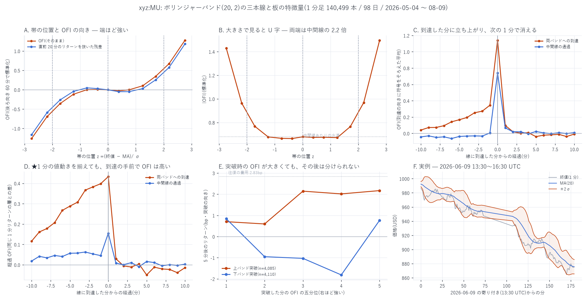

# ボリンジャーバンドの三本線で、板の特徴量は変わるか

[← `xyz:MU` の索引](README.md) / [Hyperliquid の分析](../README.md) / [ホーム](../../../README.md)

**検証した仮説**(提示されたもの)

1. ボリンジャーバンドの**両端と中間線に接近**した際に、OBI や OFI の特徴量に変化がある
2. 超短期モメンタム指標の**減衰または反転**が起きる
3. **三本線を突破するとき**の特徴量の値が一定以上であること

**設定**(指示された画面のとおり)— 期間 20 / ベース MA = SMA / ソース = 終値 /
標準偏差 2 / オフセット 0 / 時間足 = チャート(= 1 分)/ 時間足の確定を待つ ✓

```math
\mathrm{MA}_t=\frac{1}{20}\sum_{i=0}^{19}C_{t-i},\quad
\sigma_t=\mathrm{sd}(C_{t-19..t}),\quad
z_t=\frac{C_t-\mathrm{MA}_t}{\sigma_t},\quad
\mathrm{upper}=\mathrm{MA}+2\sigma,\ \ \mathrm{lower}=\mathrm{MA}-2\sigma
```

「確定を待つ」は**評価をすべて足の終値の時点で行う**ことで満たしている。
バンドに当該足の終値を含める形(TradingView の既定)と、**前の足までで閉じる形**の
両方を計算し、結論が変わらないことを確かめた(第 6 節)。

---

## ★どの 1 分足を使ったか

**OBI / OFI は板の量なので、Yahoo から落とした原資産 MU の 1 分足では計算できない。**
しかも原資産の 1 分足が取れるのは直近 30 日(2026-08-13 以降)で、
板がある期間(2026-05-04 〜 08-09)と**一切重ならない**。

したがって本検証は **perp(`xyz:MU`)の 1 分足**で行う。終値は 1 秒 mid の
その分の最後の値。板の更新が 1 件も無い足は落とした(終値が持ち越しになり、
$`\sigma`$ が潰れて偽の突破が出るため)。

| | |
|---|---|
| 標本 | 2026-05-04 〜 08-09 の **98 日**、1 分足 141,120 本のうち**使える足 140,499 本**(99.6%) |
| 帯の幅($`4\sigma`$) | 中央 **57bp**(立会時間 79bp / 時間外 51bp) |
| $`\|z\|>2`$ の足 | **11.90%**(正規分布なら 4.55%。裾が厚い。立会 11.86% / 時間外 11.92% とほぼ同じ) |
| OBI | $`(q_b-q_a)/(q_b+q_a)`$。足の終値時点の値。標準偏差 0.687 |
| OFI | Cont–Kukanov–Stoikov。足の 1 分間の合計を**後ろ向き 60 分**で標準化。標準偏差 1.048 |

**整合性の検算** — OFI とその分の 1 分リターンの同時点相関は **+0.52**。
OFI が正しく並んでいることの確認であり、同時に**第 4 節の同語反復の正体**でもある。

**時間契約** — バンドも OBI / OFI も足 $`t`$ の終値時点で確定する。
目的変数は $`(t,\,t+k]`$ の前向きリターンのみ。OFI の標準化は後ろ向き 60 分窓だけで行い、
全標本の平均・分散は使っていない。

---

## 先に結論

| 仮説 | 判定 | 根拠 |
|---|---|---|
| **1. 三本線に接近すると OBI / OFI が変わる** | **支持される** | OFI は $`z`$ に沿って単調(端で ±1.27、中間線で −0.00)。$`\|`$OFI$`\|`$ は **U 字**で、両端は中間線の **2.2 倍**。★1 分の値動きを揃えた対照を引いても、**到達の 10 分前から超過 OFI が +0.12 → +0.39 と積み上がる** |
| **2. 超短期モメンタムの減衰または反転** | **減衰は明確に支持。反転はほぼ無い** | 到達した分の OFI は **1.14 → 次の 1 分で 0.12**。OFI 自身の持続(ラグ 1 自己相関 +0.181)だけなら 0.21 のはずで、実測は**その 0.36〜0.59 倍**。到達後の超過 OFI は −0.05〜+0.05 で、反転と呼べる大きさではない |
| **3. 突破時の特徴量が一定以上** | **記述としては支持、判別としては不支持** | 突破した足の $`\|`$OFI$`\|`$ は全体の **1.72〜1.74 倍**(バンド)/ 1.20〜1.21 倍(中間線)。しかし「その突破が続くか」を当てる **AUC は 0.496〜0.513** で、95% 区間が 0.5 を跨ぐ。**閾値にはならない** |

**費用を引くと何も残らない。** 本レポートに出てくる前向きリターンの差は最大で 2.2bp、
往復の費用(半スプレッド 0.62bp + テイカー手数料 0.79bp)× 2 = **2.83bp** に届かない。



---

## 1. 仮説 1 — 三本線に接近すると特徴量は変わるか

帯の位置 $`z`$ で切った OBI / OFI(平均)。$`n`$ = 140,499。

| $`z`$ | n | OBI | OFI | OFI(残差) | $`\|`$OFI$`\|`$ | 1 分リターン | 5 分先 |
|---:|---:|---:|---:|---:|---:|---:|---:|
| −2.74 | 2,407 | −0.084 | **−1.260** | −1.160 | **1.430** | −21.7bp | +1.57bp |
| −2.19 | 5,728 | −0.063 | −0.695 | −0.589 | 0.964 | −11.7bp | +1.15bp |
| −1.72 | 12,232 | −0.041 | −0.357 | −0.262 | 0.767 | −6.1bp | −0.09bp |
| −1.24 | 16,557 | −0.020 | −0.117 | −0.042 | 0.678 | −1.8bp | −0.79bp |
| **−0.00** | 14,979 | −0.002 | **−0.003** | −0.003 | **0.679** | −0.0bp | −0.48bp |
| +1.25 | 17,560 | +0.010 | +0.101 | +0.029 | 0.672 | +2.0bp | +1.02bp |
| +1.71 | 12,955 | +0.031 | +0.347 | +0.255 | 0.765 | +5.7bp | +0.47bp |
| +2.19 | 6,053 | +0.050 | +0.673 | +0.575 | 0.969 | +10.7bp | +1.37bp |
| +2.76 | 2,535 | +0.085 | **+1.277** | +1.184 | **1.496** | +20.2bp | +2.82bp |

- **OFI は $`z`$ に沿って単調**に −1.260 → +1.277。標準偏差 1.048 の変数なので、
  端から端で **2.4 σ** 動く。
- **OBI も同じ向きだが桁が違う。** −0.084 → +0.085 は標準偏差 0.687 に対して 0.25 σ で、
  OFI の振れ(2.4 σ)の **10 分の 1** しかない。
  板の**状態**より板への**流れ**のほうが帯の位置と結びつく。
- $`\|`$OFI$`\|`$ は **U 字**で、両端 1.43〜1.50 対 中間線 0.68 = **2.2 倍**。

### ★ただし、この大半は同語反復である

「上のバンドに近い」は「直前に上がった」とほぼ同義で、OFI とその分のリターンは
相関 +0.52 である。つまり上表の大部分は**定義から出てくる**。
直前 20 分のリターンを回帰で抜いた残差でも形は残るが(上表の「OFI(残差)」)、
**その分の 1 分リターン**は抜けていないので、まだ同語反復を含む。

決着させるために、**同じ 1 分リターンの十分位 × 立会/時間外の層**で
「帯の内側($`\|z\|<1`$)に居た足」を対照として引いた(図 D)。

| 到達からの分 | −10 | −5 | −2 | **0** | +1 | +2 | +5 | +10 |
|---|---:|---:|---:|---:|---:|---:|---:|---:|
| 両バンドへの到達(超過 OFI) | +0.12 | +0.29 | +0.38 | **+0.43** | +0.03 | −0.01 | −0.05 | −0.01 |
| 中間線の通過(超過 OFI) | +0.02 | +0.06 | +0.05 | **+0.16** | +0.01 | +0.00 | +0.02 | +0.00 |

**到達の 10 分前から、同じ値動きの足より OFI が高い。** これは同語反復では説明できない。
到達の瞬間の超過 +0.43 のうち、層内に残った 1 分リターンの差(+2.78bp)で説明できるのは
$`0.52\times 2.78/14.1\times 1.05 \approx 0.11`$ 程度で、**残りの約 0.33 は帯に固有**である。

中間線の通過では超過が +0.16 しかなく、**バンド端のほうが 2.7 倍強い**。

---

## 2. 仮説 2 — 減衰するか、反転するか

到達の向きに符号をそろえた OFI の平均(生の値)。

| 到達からの分 | −10 | −5 | −2 | −1 | **0** | **+1** | +2 | +5 | +10 |
|---|---:|---:|---:|---:|---:|---:|---:|---:|---:|
| 上バンド到達(n=4,083) | 0.03 | 0.16 | 0.27 | 0.33 | **1.14** | **0.12** | 0.03 | −0.04 | −0.01 |
| 下バンド到達(n=4,103) | 0.05 | 0.18 | 0.27 | 0.36 | **1.14** | **0.07** | 0.01 | −0.04 | −0.00 |
| 中間線 通過(n=8,242/8,237) | −0.04 | −0.04 | −0.03 | +0.01 | **0.74** | **0.07** | 0.02 | 0.02 | 0.01 |

### 減衰 — 支持される。しかも「ただの持続の消え方」より速い

1 分 OFI 自身のラグ 1 自己相関は **+0.1809**。到達時の値がそのまま持続するだけなら、
次の分は $`0.181\times 1.14 = 0.21`$ になるはずである。実測は:

| | 到達時 | 次の分 | 持続だけなら | 実測 / 予想 |
|---|---:|---:|---:|---:|
| 上バンド到達 | 1.142 | 0.121 | 0.207 | **0.59 倍** |
| 下バンド到達 | 1.140 | 0.074 | 0.206 | **0.36 倍** |
| 中間線 上抜け | 0.738 | 0.071 | 0.133 | **0.53 倍** |
| 中間線 下抜け | 0.743 | 0.063 | 0.134 | **0.47 倍** |

**三本線に到達した直後、OFI はふだんの消え方の 2 倍前後の速さで落ちる。**
これは「超短期モメンタムの減衰」という仮説にそのまま合う。

### 反転 — ほぼ無い

到達後の超過 OFI は **−0.05 〜 +0.05**。上バンド到達では rel +2 以降が
(−0.00, −0.02, −0.02, −0.05, −0.00, −0.04, −0.03, −0.03, −0.02)と
一貫して弱い負だが、いずれも 0 から離れていない。価格側(超過リターン)も
rel +1 に +0.92bp が出るだけで、それ以降はノイズである。
**「向きが反転する」と呼べる証拠は無い。**

---

## 3. 仮説 3 — 突破するときの値は閾値になるか

### 記述としては支持される

| 突破 | n | 突破した足の $`\|`$OFI$`\|`$ | 全体(0.742)比 |
|---|---:|---:|---:|
| 上バンド突破 | 4,085 | 1.290 | **1.74 倍** |
| 下バンド突破 | 4,110 | 1.278 | **1.72 倍** |
| 中間線 上抜け | 8,249 | 0.898 | 1.21 倍 |
| 中間線 下抜け | 8,245 | 0.892 | 1.20 倍 |

「三本線を突破するときの特徴量は大きい」は**事実として正しい**。
ただしこれも第 1 節と同じ理由で、**突破には値動きが要る**ので半ば定義である。

### 判別としては支持されない

「その突破が続くか(5 分後が突破の向きか)」を、突破した足の OFI で当てられるか。

| 突破 | AUC | 95% 区間(日ブロック bootstrap) | プラセボ(OFI を 1 日ずらす) | 5 分後が順方向 |
|---|---:|---|---:|---:|
| 上バンド突破 | 0.513 | [0.495, 0.530] | 0.499 | 51.2% |
| 下バンド突破 | 0.496 | [0.481, 0.512] | 0.503 | 46.8% |
| 中間線 上抜け | 0.505 | [0.493, 0.518] | 0.500 | 50.3% |
| 中間線 下抜け | 0.506 | [0.494, 0.518] | 0.510 | 50.5% |

**4 つとも区間が 0.5 を跨ぐ。** 五分位で見ても順序は揃わない。

| OFI 五分位 | 1 | 2 | 3 | 4 | 5 |
|---|---:|---:|---:|---:|---:|
| 上バンド突破の 5 分後(bp) | +0.70 | +0.59 | +2.14 | +2.01 | +2.17 |
| 下バンド突破の 5 分後(bp) | +0.84 | −0.95 | −1.03 | −1.82 | **+0.77** |

上バンドは単調に見えるが、**下バンドは順序が崩れ、しかも符号が逆**
(突破の向きに対して戻る)。無条件の 5 分先リターンが +0.19bp であることを踏まえると、
下バンド突破後の −1.0bp 前後は「下に抜けても戻る」という弱い平均回帰だが、
OFI の大きさでは分けられていない。

**したがって「一定以上であること」を条件に使える閾値は見つからなかった。**
なお上バンドの五分位差(Q5 − Q1 = +1.47bp)も往復費用 2.83bp に届かない。

---

## 4. 頑健性 — 「確定待ち」を厳密にしても変わらない

バンドから当該足の終値を外し、**前の足までの 20 本**で $`\mathrm{MA}`$ と $`\sigma`$ を作った版
(`--confirm-lag 1`)。$`\|z\|>2`$ の足は 11.90% → 18.34% に増える(当該足が
$`\sigma`$ を膨らませなくなるため)が、結論は変わらない。

| | 標準 | 確定待ちの厳密版 |
|---|---|---|
| 到達時 → 次の分(上バンド) | 1.142 → 0.121(持続予想の 0.59 倍) | 1.042 → 0.133(0.71 倍) |
| 到達時 → 次の分(下バンド) | 1.140 → 0.074(0.36 倍) | 1.050 → 0.090(0.48 倍) |
| 突破時の $`\|`$OFI$`\|`$(バンド) | 1.72〜1.74 倍 | 1.59〜1.60 倍 |
| AUC(4 事象) | 0.496〜0.513 | 0.494〜0.511 |

---

## 5. 限界 — 何を言っていないか

1. **原資産ではなく perp で検証している。** OBI / OFI が板の量である以上これは不可避だが、
   提示された画面の想定が原資産のチャートだったなら、対象が違う。
2. **OBI はほとんど動かない。** 帯の位置に対する振れは OFI の 10 分の 1。
   「OBI に変化がある」は、あるにはあるが**実務的には小さい**。
3. **同語反復を完全には除けていない。** 層別の対照で 1 分リターンの十分位は揃えたが、
   層の中には差が残る(到達時 +2.78bp)。第 1 節ではその寄与を見積もって差し引いたが、
   これは概算である。
4. **「反転」を否定しきってはいない。** 1 分足で測れるのは 1 分より粗い反転だけで、
   秒単位の反転は見ていない(200ms の材料はあるので、やろうと思えばできる)。
5. **バンド幅の体制を分けていない。** スクイーズ時とエキスパンション時では
   同じ $`z`$ でも意味が違うはずだが、本レポートは一括で扱っている。
6. **執行を扱っていない。** 前向きリターンはすべて mid どうしで、
   スプレッド・手数料・遅延・約定可能性を一切引いていない
   (ただし差の大きさが往復費用に届かないことは本文に記した)。
7. **多重比較**: 帯位置 13 区分 × 4 指標、事象 4 種 × 21 ラグ × 3 指標、
   突破 4 種 × (AUC + 5 分位 × 2) で、およそ **300 通り**を見ている。
   結論を担うのは (a) 超過 OFI の到達前 10 分の単調な立ち上がり、
   (b) 減衰が持続予想の 0.36〜0.59 倍、(c) AUC の区間が 0.5 を跨ぐ、の 3 点で、
   いずれも 1 つの数字ではなく形で判断している。

---

## 6. 再現手順

```bash
uv run python scripts/build_bb.py --coin xyz:MU                          # 標準
uv run python scripts/build_bb.py --coin xyz:MU --confirm-lag 1 --suffix _lag1
uv run python scripts/plot_bb.py  --coin xyz:MU
```

`build_bb.py` は 1 秒 mid(`data/_liqmid_xyz_MU.npz`、無ければ `bbo_xyz_MU.parquet`
から自動生成)と 200ms の OBI / OFI(`data/feat200_xyz_MU/`、`build_acf_200ms.py` が作る)を使う。

---

リポジトリ全体の目次は [../../../README.md](../../../README.md) にあります。
