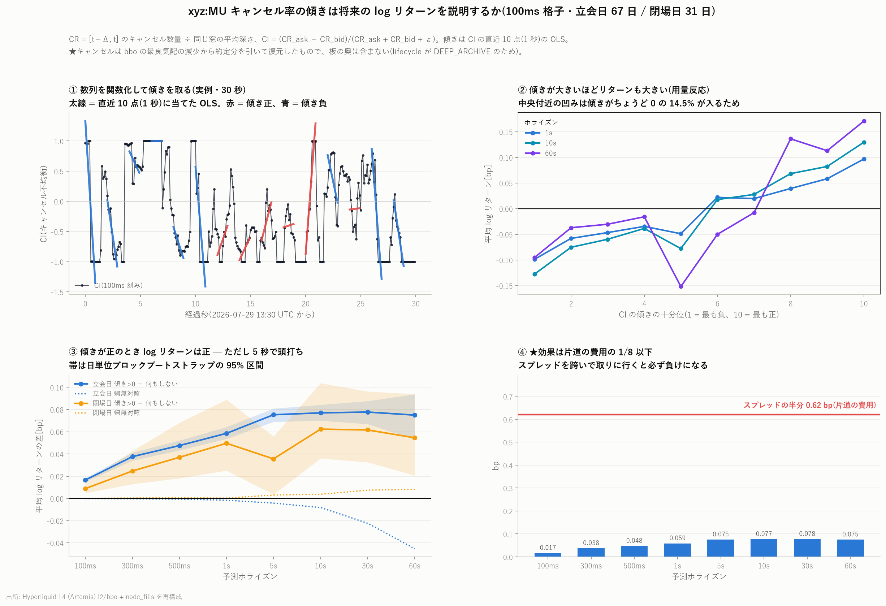

# xyz:MU キャンセル率の傾きと将来の log リターン

[← xyz:MU 分析索引](README.md)

キャンセル率 CR とキャンセル不均衡 CI を **100ms 刻み**で作り、その数列に当てた
直線の**傾きが正のとき log リターンが正になるか**を検証する。
標本は 2026 年 5 月 4 日から 8 月 9 日の 98 日間(立会日 67 日・閉場日 31 日)、
100ms 格子 **5,789 万点**(立会日・ホライズン 1 秒の有効点)。

再現: `scripts/fetch_bbo.py` → `scripts/build_cancel_rate.py` → `scripts/plot_cancel_rate.py`



---

## 1. 定義

```math
CR^{ask}_t = \frac{[t-\Delta,\; t]\ のキャンセルされた\ ask\ 数量}{同じ窓の平均\ ask\ 深さ}
```
```math
CR^{bid}_t = \frac{[t-\Delta,\; t]\ のキャンセルされた\ bid\ 数量}{同じ窓の平均\ bid\ 深さ}
```
```math
CI_t = \frac{CR^{ask}_t - CR^{bid}_t}{CR^{ask}_t + CR^{bid}_t + \epsilon}
```

$`\epsilon = 10^{-9}`$。格子は 100ms、平均窓は $`\Delta = 1`$ 秒(= 10 格子点)とした。
1 つの 100ms バケットには板イベントが中央値 1 件しか入らず、$`\Delta`$ を 100ms に
すると分子がほぼ常に 0 になるためである。

**傾き**は CI の直近 10 点(= 1 秒)に当てた OLS の係数とした(図①)。

---

## 2. ★キャンセル数量をどう得たか — 本レポート最大の制約

本来は `l2/lifecycle`(注文 1 本 1 行、終端が `cancelled` のもの)を使うべきである。

そこで手元にある 2 つから、**最良気配で起きたキャンセルだけ**を復元した。

| 使ったもの | 内容 |
|---|---|
| `l2/bbo` | 最良気配の価格と数量(イベントごと) |
| `fills` | 約定。`crossed` の行でテイカーの向きが決まる |

連続する 2 つの bbo 行の間で、ask 側について次のように判定する(bid 側は対称)。

| 気配の動き | キャンセル数量 |
|---|---|
| 価格が同じ | $`\max(0,\ Q^{ask}_i - Q^{ask}_{i+1} - F_i)`$ |
| 価格が上(不利)へ | $`\max(0,\ Q^{ask}_i - F_i)`$ … その水準が丸ごと消えた |
| 価格が下(有利)へ | 0 … 内側に新しい注文が入っただけ |

$`F_i`$ はその区間にテイカー買いで約定した数量である。

### この復元の限界

1. **板の奥のキャンセルは含まない。** したがって本レポートの CR は
   「最良気配のキャンセル率」であって、式の一般形とは範囲が違う。
   ただし分子(キャンセル)も分母(深さ)も同じ最良気配なので、比としては整合している。
2. 同じ価格での「取消して出し直し」が 1 区間内で相殺されると見えない(過小評価)。
3. 気配が有利に動いた区間では、消えた古い水準の内訳が分からない。

---

## 3. ★踏んだ先読みのバグ(記録)

最初の実装では、区間 $`i \to i+1`$ のキャンセル数量を **時刻 $`t_i`$ のバケット**に
入れていた。しかしこの量は $`Q_{i+1}`$ を使って初めて計算でき、
**$`t_{i+1}`$ にならないと観測できない**。板イベントの間隔は活況時で中央 140ms 程度
あるので、これは 100ms 格子に対して無視できない量の未来情報の混入である。

観測できる側の時刻($`t_{i+1}`$)のバケットへ移して再計算したところ、**効果はほぼ半減した**。

| ホライズン | 100ms | 1s | 5s | 60s |
|---|---:|---:|---:|---:|
| 修正前(誤り) | 0.035 | 0.115 | 0.139 | 0.137 |
| **修正後(正)** | **0.017** | **0.059** | **0.075** | **0.075** |

以下の数字はすべて修正後のものである。

---

## 4. 時間契約

| | 内容 | 確定する時刻 |
|---|---|---|
| 説明変数 $`x`$ | CI の直近 10 点に当てた OLS の傾き | $`CI_t`$ は $`[t-\Delta, t]`$ の情報だけで決まり、傾きは $`CI_{t-0.9s} \dots CI_t`$ から決まる。すべて $`t`$ までに確定 |
| 目的変数 $`y`$ | $`\log(mid_{t+h} / mid_t)`$ | 期間は $`(t, t+h]`$ |

深さと mid は後ろ向き asof(その格子時刻以前で最後に観測した値)で取っている。
`shift(-k)` は目的変数側にしか使っていない。判定の作法は
[予測の定義](../../predicting_definition.md) に従う。

---

## 5. 結果

**判定は 0 ではなく「何もしない場合」と比べる。** 標本期間中 mid は上昇しているので、
無条件の平均 log リターンは正であり、「傾きが正のとき $`y \gt  0`$」は
それだけでは何もしなくても成り立ちうるためである。

### 立会日(67 日)— 平均 log リターン[bp]

| ホライズン | (a) 何もしない | (b) 傾き>0 | (c) 傾き<0 | **(b)−(a)** | 95% 区間 | 帰無対照 |
|---|---:|---:|---:|---:|---|---:|
| 100ms | 0.000 | 0.017 | −0.017 | **+0.017** | [+0.015, +0.018] | −0.000 |
| 300ms | 0.000 | 0.038 | −0.038 | **+0.038** | [+0.034, +0.041] | −0.000 |
| 500ms | 0.000 | 0.048 | −0.048 | **+0.048** | [+0.043, +0.052] | −0.001 |
| 1s | 0.000 | 0.059 | −0.059 | **+0.059** | [+0.054, +0.064] | −0.002 |
| 5s | 0.001 | 0.077 | −0.077 | **+0.075** | [+0.069, +0.081] | −0.004 |
| 10s | 0.003 | 0.080 | −0.077 | **+0.077** | [+0.070, +0.084] | −0.008 |
| 30s | 0.009 | 0.087 | −0.068 | **+0.078** | [+0.067, +0.088] | −0.022 |
| 60s | 0.015 | 0.090 | −0.056 | **+0.075** | [+0.053, +0.094] | −0.045 |

### 閉場日(31 日)— 平均 log リターン[bp]

| ホライズン | (a) 何もしない | (b) 傾き>0 | (c) 傾き<0 | **(b)−(a)** | 95% 区間 | 帰無対照 |
|---|---:|---:|---:|---:|---|---:|
| 100ms | 0.000 | 0.009 | −0.009 | **+0.009** | [+0.005, +0.015] | 0.000 |
| 300ms | 0.000 | 0.025 | −0.024 | **+0.025** | [+0.013, +0.043] | 0.000 |
| 500ms | 0.001 | 0.038 | −0.036 | **+0.037** | [+0.018, +0.068] | 0.001 |
| 1s | 0.001 | 0.051 | −0.037 | **+0.050** | [+0.025, +0.089] | 0.000 |
| 5s | 0.006 | 0.041 | −0.028 | **+0.036** | [+0.004, +0.056] | 0.003 |
| 10s | 0.011 | 0.074 | −0.031 | **+0.062** | [+0.036, +0.104] | 0.004 |
| 30s | 0.033 | 0.095 | −0.009 | **+0.062** | [+0.033, +0.096] | 0.007 |
| 60s | 0.066 | 0.120 | 0.018 | **+0.055** | [+0.021, +0.094] | 0.008 |

区間は**日を単位にしたブロックブートストラップ**(400 反復)。窓が重なるうえ
CI にも強い自己相関があるので、通常の標準誤差は使えない。

### 仮説は支持された

**16 セルすべてで (b) − (a) の 95% 区間が 0 を挟まない。** 向きも一貫して正である。
傾きが負のときは対称に負のリターンになっており(立会日 5 秒で ±0.077 bp)、
片側だけの現象ではない。

**用量反応**(図②): CI の傾きを十分位に分けると、1 位 −0.099 bp から
10 位 +0.097 bp まで概ね単調に並ぶ(立会日・1 秒)。
中央付近が凹むのは、**傾きがちょうど 0 の点が 14.5%** あり、それが中央の
十分位に集まるためである。

**帰無対照**(傾きだけを日内で巡回シフト): 短いホライズンでは 0.000 に潰れる。
ただし立会日 60 秒では **−0.045 bp** と、実測 +0.075 bp の 6 割の大きさになる。
巡回シフトは時刻の対応を壊すが日内の時間帯構造は残るため、長いホライズンでは
帰無側にも構造が出る。**60 秒の結果は短いホライズンほど強くは主張できない。**

---

## 6. ★効果の大きさ — 費用を引くと残らない

| | bp |
|---|---:|
| スプレッドの中央値 | 1.24 |
| **片道の費用(スプレッドの半分)** | **0.62** |
| 効果の最大(立会日 30 秒) | 0.078 |
| 効果の最大(十分位の端、10 秒) | 0.130 |

**効果は片道の費用の 1/8 以下である。** スプレッドを跨いで取りに行く執行では、
この信号は費用に全く届かない。十分位の最も強い帯(0.130 bp)を使っても
片道費用の 1/5 にとどまる。

「統計的に有意」と「取引として成立する」は別である。本レポートが示したのは
**前者だけ**であり、後者は成り立たない。メイカーとして並ぶ執行(スプレッドを
払わない)なら話が変わりうるが、**そこでの約定確率と逆選択は一切検証していない。**

---

## 7. 限界

1. **キャンセルは最良気配のものだけ**(第 2 節)。板の奥のキャンセルを含めた
   本来の CR とは値も意味も違う可能性がある。`lifecycle` が復元できたら
   同じ手順を回して比べること。
2. **費用を引くと残らない**(第 6 節)。方向が当たることと儲かることは別である。
3. $`\Delta = 1`$ 秒、傾きの窓 10 点は先に決め打ちした値で、格子探索はしていない。
   したがって多重比較の問題は小さいが、**最適化もしていない**。
4. 立会日 60 秒は帰無対照が実測の 6 割に達する(第 5 節)。長いホライズンの
   結果は割り引いて読むこと。
5. 傾きがちょうど 0 の点が 14.5% ある。これらは (b) にも (c) にも入っておらず、
   「何もしない場合」にだけ含まれる。
6. 100ms 格子で 60 秒先を見るため窓は 600 倍重なる。格子点の数
   (5,789 万)を独立な標本数と読まないこと。区間はブロックブートストラップで
   出しているが、日をまたぐ依存は扱っていない。
7. 1 銘柄の記述統計である。銘柄横断の比較は他の 5 銘柄に同じ手順を適用してから行う。
