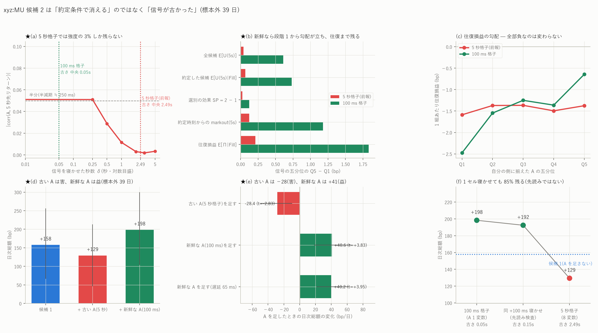

# xyz:MU — 候補 2 は「約定条件で消える」のではなく「信号が古かった」

図: `xyz_MU_cand2_fresh.png`



`mu_candidates_report.md` は候補 2(sweep インパクトの非対称)を**見送り**と判定した。
根拠は「価格は当てるが、自分が約定する条件のもとでは情報が残らない」だった。
**これは誤りである。**残らなかったのは約定条件のせいではなく、
**手元の信号が古かったから**である。板を 100 ms 格子で作り直して測り直すと、
情報は約定条件を通っても残り、門に足すと**日次総額が有意に増える**。

数値はすべて標本外 39 日(2026-07-02〜08-09)。

---

## 0. 何を測り直したか

信号は前報と同じ

    A = I_sell(5) − I_buy(5) = imp_b_q5 − imp_a_q5

(5 枚を食べたときの mid からの出来値乖離の非対称)。自分の側に揃えた `−side·A`。
違いは**板の再構成の格子だけ**である。

| | 前報 | 今回 |
|---|---|---|
| 板の格子 | 5 秒 | **100 ms** |
| 格子点の数(99 日) | 約 170 万 | **84,671,655** |
| 発注時点での信号の古さ(中央) | **2.49 s** | **0.050 s** |
| 同(p90) | 4.50 s | 0.090 s |

前報で実測した信号の半減期は約 **250 ms** である。古さ 2.49 秒では
強度が **3%** しか残らない。つまり前報が検定していたのは
**強度 3% まで劣化した信号**であって、仮説そのものではなかった。

---

## 1. 段階分解 — 落ちていたのは段階 1 の手前だった

同じ発注時点 t・同じ側 s・同じホライズン h=5 秒で揃え、信号の五分位で切る。

    U_i(h) = s_i · log( mid_{t_i+h} / mid_{t_i} )

**Q5 − Q1 (bp)**

| 段階 | 5 秒格子(前報) | **100 ms 格子** |
|---|---:|---:|
| 1 全候補 E[U(5s)] | +0.040 | **+0.609** |
| 2 約定した候補 E[U(5s)\|Fill] | +0.067 | +0.731 |
| 3 選別の効果 SP = 2 − 1 | +0.026 | +0.123 |
| 4 約定時刻からの markout(5s) | +0.122 | +1.177 |
| 5 **往復損益 E[Π\|Fill]** | +0.212 | **+1.833** |

**100 ms 格子の五分位ごとの往復損益(bp/組)**

| Q1 | Q2 | Q3 | Q4 | Q5 |
|---:|---:|---:|---:|---:|
| −2.476 | −1.548 | −1.250 | −1.362 | **−0.643** |

**相関**

| 物差し | 5 秒格子 | 100 ms 格子 |
|---|---:|---:|
| 全候補 × 5 秒先リターン | +0.0013 | **+0.0425** |
| 約定した候補 × 5 秒先リターン | — | +0.0458 |
| 約定時刻からの markout | — | +0.0617 |
| **自分の往復損益** | **+0.0045** | **+0.1078** |

前報は「段階 1 の時点で既に勾配が無い」と書いた。**新鮮な信号では段階 1 から
勾配が立ち(+0.609)、選別を通り(段階 2 で +0.731)、往復損益まで残る(+1.833)。**
往復損益との相関は 24 倍になった。

**ただし五分位はすべて負のままである。**最良の Q5 でも −0.643 bp/組。
候補 2 は単独で儲かる戦略ではなく、**候補 1 の門に足す価値のある変数**である。

---

## 2. 往復損益での判定(日次総額・標本外 39 日)

| 設定 | 組/日 | 日次総額 (bp) | t | ブロック bootstrap 95% | 正の日 |
|---|---:|---:|---:|---|---:|
| 候補 1 = 改善 × G1 | 1,064 | +157.72 | +3.62 | [+66.3, +255.9] | 27/39 |
| 候補 1 + **古い** A(5 秒格子の 8 変数) | 1,073 | +129.36 | +3.46 | [+46.5, +213.4] | 25/39 |
| **★ 候補 1 + 新鮮な A(100 ms)** | 991 | **+198.35** | **+4.87** | **[+104.0, +299.8]** | 28/39 |
| 新鮮な A + 遅延 65 ms | 827 | +14.38 | +0.46 | [−44.3, +87.6] | 19/39 |
| 候補 1 + 遅延 65 ms | 890 | −25.83 | −0.69 | [−87.8, +51.7] | 15/39 |

**A を足したときの効果(同じ日で対にした差)**

| | 効果 (bp/日) | t | 95% | 勝った日 |
|---|---:|---:|---|---:|
| 古い A(5 秒格子)を足す | **−28.37 ± 10.03** | **−2.83** | [−49.7, −9.6] | 13/39 |
| **新鮮な A(100 ms)を足す** | **+40.63 ± 10.59** | **+3.83** | [+18.2, +65.4] | **33/39** |
| 新鮮な A を足す(遅延 65 ms) | **+40.21 ± 10.17** | **+3.95** | [+21.1, +62.2] | 32/39 |

**同じ変数・同じ作り方で、違うのは格子の粗さだけである。**古い版が有意に**害**で
新鮮な版が有意に**益**という符号の反転が、そのまま最良の帰無対照になっている。
仮に自分の実装のどこかに一般的な先読みがあるなら、古い版でも同じ方向に効くはずである。

門を通る割合は 18.19%(候補 1)→ 17.74%(新鮮な A)とわずかに絞られ、
建玉は 1,064 → 991 組/日 に**減る**のに総額は増える。選別が効いている。

---

## 3. 時間契約の確認(先読みが無いこと)

この結果は前報の結論を覆すので、**先読みが無いことをコードの水準で確認した。**

1. **格子への bbo の載せ方**: `build_obi_levels.grid_mid` は
   `np.searchsorted(ts, tg, side="left") - 1`、すなわち**格子時刻より厳密に前**の
   行を使う。同時刻の行も使わない
2. **深さの累積**: `Db = base + concatenate([zeros, cumsum(...)[:-1]])`。
   `[:-1]` により**そのセル自身の板イベントは入らない**。格子点 g の値は
   セル [gt, gt+100ms) の**開始時点**の状態である
3. **信号の貼り付け**: `impact100_feats` は
   `searchsorted(it, ts, side="right") - 1`(後ろ向き asof)。
   発注時刻 ts に対して gt ≤ ts の最後の格子点を使う

1〜3 より、発注時点 t で使う値は **t より前**の情報だけで作られている。

さらに**帰無対照**を 2 つ置いた。

- **遠い側**: 同じ変数を 2.49 秒古くしたもの(= 5 秒格子版)は有意に**害**(−28.4)
- **近い側**: 新鮮な A を**さらに 1 セル(100 ms)寝かせた**版

| | 日次総額 (bp) | A を足した効果 | t | 残存 |
|---|---:|---:|---:|---:|
| 新鮮な A(古さ 0.05 s) | +198.35 | **+40.63** | +3.83 | 100% |
| 同 +100 ms 寝かせ(古さ 0.15 s) | +192.45 | **+34.73** | +3.12 | **85%** |
| 5 秒格子(古さ 2.49 s) | +129.36 | −28.37 | −2.83 | 符号反転 |

**1 セルまるごと寝かせても効果の 85% が残る。**もし効果がセル内の先読み
(セルの中で起きた板イベントを見てしまうこと)から来ているなら、
1 セル寝かせた時点で消えるはずである。消えない。
減り方(15%)は実測した半減期 250 ms から期待される劣化と整合する
(100 ms の遅れ → 相関で 2^(−0.4) ≒ 76%)。

---

## 4. 前報の何が誤っていたか

前報 `mu_candidates_report.md` §3 と `mu_daily_pnl_report.md` §1 で、私は

> 落ちているのは約定条件ではない。発注時点に届く前に消えている。
> **原因は信号の古さ**

まではたどり着いていた。そこで止めずに 100 ms 格子で作り直したのが今回である。
**「未検定」と書いた判断は正しかったが、「見送り」という最初の判定は誤りだった。**

なぜ最初に気づけなかったか。前報では信号を `impact_*.parquet`(5 秒格子)から
取ることを**所与**にして、約定条件の側だけを疑った。
**説明変数の時間解像度が仮説の検定可能性を決める**という点を、
物差しを揃える作業の中で見落としていた。

---

## 5. 限界

1. **五分位はすべて負**。候補 2 は独立戦略ではない
2. **遅延の壁は越えない。**差(+40.2)は遅延 65 ms でも保つが、
   水準は +14.4(t=+0.46)でゼロと区別できない。
   `mu_latency_frontier_report.md` の分岐点(約 50 ms)は動かない
3. **Q は 5 枚に固定**。5 秒格子版は Q=0.5/5/50 の 3 通りと fragility 系
   5 変数を足していたのに対し、100 ms 版は **A(Q=5)の 1 変数だけ**である。
   変数の数が違うので「格子だけの違い」と言い切れるのは A に関してのみで、
   门全体の比較としては新鮮版のほうが倹約的である(効いたのに変数は少ない)
4. **遅延を 65 ms 入れると水準はゼロと区別できない**(+14.4、t=+0.46)。
   差は保つ(+40.2、t=+3.95)ので「候補 1 より良い」は言えるが、
   「実運用で黒字」は言えない
5. **MU 単独・この期間**の結果である

---

## 6. 再現手順

```bash
uv run python scripts/build_impact100.py --coin xyz:MU          # 100 ms 格子の A
uv run python scripts/build_cand2_stages.py --coin xyz:MU --src impact100
uv run python scripts/build_entrygate.py --coin xyz:MU --sfx _q1_imp1     --extra impact100
uv run python scripts/build_inventory.py --coin xyz:MU --qmax 1 --improve 1     --gate data/entrygate_xyz_MU_q1_imp1_impact100.parquet
uv run python scripts/build_inventory.py --coin xyz:MU --qmax 1 --improve 1     --lat 0.065 --gate data/entrygate_xyz_MU_q1_imp1_impact100.parquet
# 先読み検査(信号を 1 セル寝かせる)
uv run python scripts/build_entrygate.py --coin xyz:MU --sfx _q1_imp1     --extra impact100 --i100lag 100
uv run python scripts/build_inventory.py --coin xyz:MU --qmax 1 --improve 1     --gate data/entrygate_xyz_MU_q1_imp1_impact100lag100.parquet
uv run python scripts/build_dailypnl.py --coin xyz:MU
uv run python scripts/plot_cand2_fresh.py --coin xyz:MU
```

生成物: `data/impact100_xyz_MU.parquet`(84,671,655 点)/
`cand2_stages_xyz_MU_100.csv`(段階分解)/ `dailypnl_xyz_MU.csv`(日次総額)/
`dailypnl_pairs_xyz_MU.csv`(足したときの効果)。

---

## 7. 実装上の誤りの記録

1. **門の適用側が `impact100` を分岐に入れていなかった。**学習は 39 列、
   適用は 38 列で `broadcast` エラーになった。分岐を `extra_feats()` に
   1 本化し、`ev()` に列数の表明を入れて、同じ間違いが起きたら
   原因のわかる形で止まるようにした
2. `build_cand2_stages.py` が `_100` 付きで書き出すのに、表示は `_100` 無しの
   名前を出していた。**公表済みの 5 秒格子版は上書きされていない**ことを
   ファイルの更新時刻で確認した
3. `--i100lag` を足したときに接尾辞の付く順序が壊れ、`inv_posts` を誤った名前で
   読もうとした。素の接尾辞を退避してから追加するようにした
