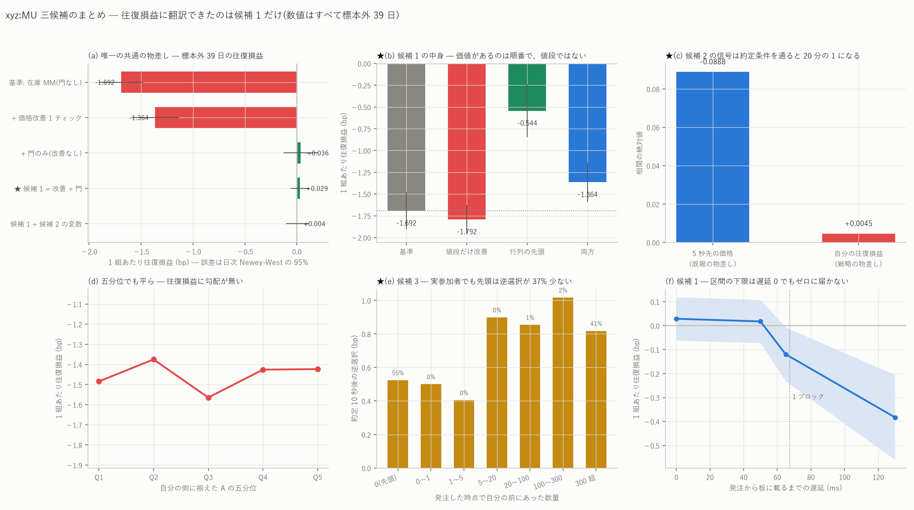

# xyz:MU — 三候補のまとめ(往復損益という同じ物差しに載せる)

図: `xyz_MU_candidates.png`



三候補は**測っている単位が違う**。候補 1 は往復損益、候補 2 は 5 秒先の価格との相関、
候補 3 は口座別の 10 秒逆選択で示されていた。ここでは**可能な限り往復損益へ寄せ**、
寄せられないものは何の単位かを明記して並べる。数値はすべて**標本外 39 日**。

---

## 0. 一覧

| | 元の証拠(単位) | 往復損益へ翻訳した結果 | 判定 |
|---|---|---|---|
| **候補 1**<br>選択的・在庫型 MM | — | **+0.0285 ± 0.0460 bp/組、1,064 組/日、+158 bp/日** | **最優先のまま。ただし区間下限は負** |
| **候補 2**<br>sweep 非対称 + 補充 | 5 秒先リターンとの相関 **−0.070** | **相関 +0.0045**(20 分の 1)。門に足すと **+0.0285 → +0.0043** と悪化 | **見送り**。約定条件を通ると情報が残らない |
| **候補 3**<br>実参加者の約定品質 | 口座別の 10 秒逆選択の差 **0.882 bp** | 独立戦略としては未検証。ただし**候補 1 の中心的な主張を裏づける材料**になった | **独立候補ではなく、候補 1 の傍証** |

**三つを同じ物差しに載せると、結局どれも同じ 1 つのことを指していた — 待ち行列の順番である。**

---

## 1. 共通の物差し(図 a)

| 設定 | 建玉/日 | 1 組あたり往復損益 | 1 日 |
|---|---:|---:|---:|
| 基準: 在庫 MM(門なし) | 6,248 | −1.6922 ± 0.1087 | −11,541 bp |
| + 価格改善 1 ティック | 7,541 | −1.3643 ± 0.1152 | −11,023 bp |
| + 門のみ(改善なし) | 130 | +0.0360 ± 0.0835 | +12 bp |
| **★ 候補 1 = 改善 + 門** | **1,064** | **+0.0285 ± 0.0460** | **+158 bp** |
| 候補 1 + 候補 2 の 8 変数 | 1,073 | +0.0043 ± 0.0562 | +129 bp |

誤差は日次 Newey-West(ラグ 14)の 95% 区間。

---

## 2. 候補 1 — 価値があるのは順番であって値段ではない(図 b)

| 方策 | 建玉/日 | 1 組あたり | 基準との差 |
|---|---:|---:|---:|
| 基準(最良気配・実際の行列) | 6,248 | −1.692 ± 0.109 | — |
| 値段だけ 1 ティック改善(行列は元のまま) | 6,276 | **−1.792 ± 0.085** | **−0.10** |
| **最良気配のまま行列の先頭** | 14,013 | **−0.544 ± 0.154** | **+1.15** |
| 両方(= 価格改善) | 7,541 | −1.364 ± 0.115 | +0.33 |

詳細は `mu_price_improvement_report.md`。要点は **1 ティック(0.113 bp)払って
順番を買うと、+1.15 の利得のうち手元に残るのは +0.33 だけ**という点である。

遅延を入れると(図 f)分岐は 50 ms 台のままで、**95% 区間の下限は遅延 0 でも
ゼロに届かない**([−0.062, +0.119])。

---

## 3. 候補 2 — 価格は当てるが、約定条件を通ると残らない(図 c・d)

A = I_sell(5) − I_buy(5) = `imp_b_q5 − imp_a_q5` を、5 秒格子の板データから
発注時点へ**後ろ向き asof** で貼り、2 つの物差しで測った。

| 物差し | 相関 | 標本 |
|---|---:|---:|
| **5 秒先の mid リターン**(既報の物差し) | **−0.0888** | 224,627 点 |
| **自分の往復損益**(戦略の物差し) | **+0.0045** | 294,089 建玉 |

**既報の −0.0699 は再現した**(こちらは評価期間のみ・3 日おきなので値は少し違う)。
ところが同じ信号を**自分が実際に約定した条件のもとで往復損益に対して測ると、
相関は 20 分の 1 になり、符号すら入れ替わる**。五分位でも勾配が無い
(−1.484 / −1.375 / −1.565 / −1.426 / −1.423)。

門に足しても同じである。候補 1 の 36 変数に候補 2 の 8 変数
(A を Q=0.5/5/50 の 3 通り、自分側・反対側の fragility、同じく gap-fill 比、
fragility の非対称)を加えて学習し直すと、

| 門 | 建玉/日 | 1 組あたり |
|---|---:|---:|
| 36 変数 | 1,064 | **+0.0285 ± 0.0460** |
| + 候補 2 の 8 変数(44) | 1,073 | **+0.0043 ± 0.0562** |

**わずかに悪化する。**通す発注は 18.2% → 18.3% とほとんど変わらない。

> ご指摘の「必要なのは『その後価格が少し当たる』ことではなく、実際に自分が約定する
> 条件の下でも、その情報が残ること」——**残りませんでした。**

単変量で唯一かすかに効いたのは `fragility`(相関 −0.052、五分位 −1.204 → −1.917)
だが、**自分側(−0.0522)と反対側(−0.0515)がほぼ同じ**なので非対称ではなく
市場全体の脆さの水準であり、しかも既存 36 変数に `fragility` は既に入っている。

---

## 4. 候補 3 — 独立戦略ではなく、候補 1 の傍証になった(図 e)

候補 3 を「他人を真似る戦略」として検証するには、発注時点で使える行動の差を
モデル化する必要がある。だが**行動(距離・数量・補充・取消)は自分が決める変数**
であって観測する変数ではないので、それは結局「方策探索」そのものになる。

そこで**別の使い方**をした。実参加者の約定 414 万件について、
**発注した時点で自分の前にあった数量(`qa_place`)と、約定 10 秒後の逆選択(`adv10`)**
を突き合わせた。これはシミュレーションを一切使わない実測である。

| 発注時の前方数量 | 件数 | 割合 | 10 秒逆選択 | 約定までの中央値 |
|---|---:|---:|---:|---:|
| **0(先頭)** | 2,290,524 | **55.2%** | **+0.524 bp** | 0.41 s |
| 0〜1 | 2,307 | 0.1% | +0.500 | 0.41 s |
| 1〜5 | 3,969 | 0.1% | +0.405 | 0.47 s |
| 5〜20 | 14,005 | 0.3% | +0.899 | 0.41 s |
| 20〜100 | 58,402 | 1.4% | +0.854 | 0.54 s |
| 100〜300 | 66,367 | 1.6% | +1.018 | 0.60 s |
| 300 超 | 1,711,399 | 41.3% | +0.818 | 0.80 s |

**先頭で約定した分は逆選択が +0.524 bp、それ以外は +0.826 bp。差は +0.302 bp
(37% 少ない)。**約定までの時間も 0.41 秒 対 0.80 秒 と倍違う。

つまり**実参加者のデータでも「順番に価値がある」が確認できる**。
シミュレータで出した +1.15 bp とは物差しが違う(片脚の逆選択 対 両脚の往復損益)ので
数字は一致しないが、向きと桁は整合する。

もう一つ重要な事実がある。**実際の約定の 55.2% は「前に誰もいない」状態で起きている。**
先頭に立つことは特殊な芸当ではなく、この市場では日常的に達成されている。
どうやって達成しているかは分からないが、価格改善はその一つの手段である。

---

## 5. 三候補は同じ 1 点に収束する

- 候補 1 の分解 → 利得の出所は**順番**(+1.15 bp)
- 候補 3 の実参加者 → 先頭は逆選択が **37% 少ない**
- 候補 2 → **順番と無関係な価格予測の信号は、約定条件を通ると消える**

`mu_heatmap_report.md`(約定できるかは待ち行列の軸だけ)、
`mu_market_conditions_report.md`(板が厚いほど EV は低い = 行列が長い)とも一致する。
**この案件で繰り返し出ている構造は 1 つで、それは待ち行列である。**

---

## 6. 判定

| 候補 | 判定 |
|---|---|
| **候補 1** | **最優先のまま。**ただし現状のまま本番投入できる水準ではない。残っている最有望な打ち手は**条件つきの出し直し**(順番を無駄に捨てない規則)である |
| **候補 2** | **見送り。**信号は価格に対しては本物だが、約定条件を通ると往復損益に残らない。門に足しても改善しない |
| **候補 3** | **独立候補としては見送り、傍証として採用。**「順番に価値がある」を実測で裏づけた。追随収益の証拠は無い |

---

## 7. 限界と訂正の記録

### 限界

1. **候補 2 の検定は「既存の門への追加」と「単変量」の 2 通りだけ**である。
   A を主役にした別方策(例: A が極端なときだけ片側に出す)は試していない。
   ただし往復損益との相関が +0.0045 では、どう組んでも効きは小さいと見ている。
2. **候補 3 の照合は相関であって因果ではない。**先頭で約定する口座は速い・情報がある
   といった別の性質を持つかもしれない。`mu_hazard_report.md` の留保と同じである。
3. **候補 2 の A は 5 秒格子**である。発注は 0.4 秒間隔なので、最大 5 秒古い値を見ている。
   より細かい格子なら結果が変わる可能性は残る。
4. **すべて MU 単独・この期間**の結果である。

### 訂正の記録

**(1) A の符号を取り違えた。**最初 `A = imp_a − imp_b` としたが、売りは bid を削るので
`I_sell = imp_b`、買いは ask を削るので `I_buy = imp_a`、正しくは **`A = imp_b − imp_a`**
だった。5 秒先リターンとの相関が既報の −0.070 に対し **+0.089** と符号が逆に出たことで
気づいた。線形モデルは符号を学習するので**門の検定結果は影響を受けない**が、
単変量の向きの記述は誤っていた。

**(2) 出力ファイル名に門の種類が入っていなかった。**`--gate` を変えても接尾辞は常に
`_gated` だったので、**候補 2 の門で回した結果が候補 1 の結果を黙って上書き**していた。
再集計したら候補 1 の値が +0.0285 から +0.0043 に変わっていたことで気づいた。
門ごとに名前を分けて両方を取り直した。**上書き前の +0.0285 は正しい値である**
(`mu_price_improvement_report.md` の値と一致する)。

---

## 8. 再現手順

```bash
uv run python scripts/build_entrygate.py --coin xyz:MU --sfx _q1_imp1 --extra impact
uv run python scripts/build_inventory.py --coin xyz:MU --qmax 1 --improve 1 \
    --gate data/entrygate_xyz_MU_q1_imp1_impact.parquet
uv run python scripts/build_candidates.py --coin xyz:MU
uv run python scripts/plot_candidates.py --coin xyz:MU
```

生成物: `data/candidates_summary.csv`(共通の物差し)/ `cand2_signal.csv`(候補 2 の
2 つの相関)/ `cand2_quintile.csv` / `cand3_queue.csv`(実参加者の順番と逆選択)。
