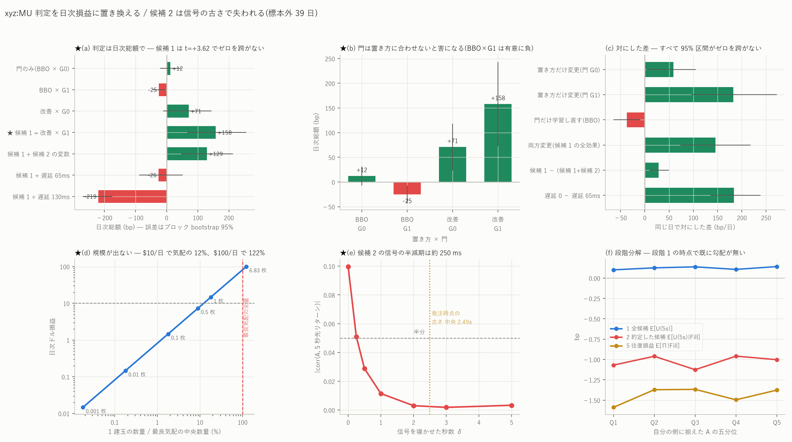

# xyz:MU — 判定を日次損益に置き換える(および候補 2 の検定のやり直し)

図: `xyz_MU_daily_pnl.png`



前報 `mu_candidates_report.md` に**2 つの誤り**があった。指摘を受けて検定をやり直す。

1. **「単価が非有意だから総額も非有意」は誤りだった。**日次総額を直接検定すると
   **有意に正**である。
2. **「候補 2 の信号は約定条件を通ると 20 分の 1 になる」は、比較として厳密でなく、
   しかも原因の帰属が間違っていた。**落ちているのは約定条件ではなく**信号の古さ**である。

数値はすべて標本外 39 日(2026-07-02〜08-09)。

---

## 0. 訂正 1 — 日次総額は有意に正である

前報では「単価 +0.0285 ± 0.0460 bp が非有意だから、総額 +157.7 bp/日 も有意ではない」
と書いた。**これは誤りである。**2 つは重みが違う(単価は日次等重みの平均、
総額は取引ごとの bp の合計)ので、片方から他方の有意性は導けない。
+0.0285 × 1,064 = +30.3 であって +157.7 にはならない。

**日次総額の系列を直接検定した結果:**

| 設定 | 組/日 | 日次総額 (bp) | NW se | t | ブロック bootstrap 95% |
|---|---:|---:|---:|---:|---|
| 基準(門なし) | 6,248 | −11,540.6 | 2,204.4 | −5.24 | [−15,848, −8,046] |
| + 価格改善 | 7,541 | −11,022.9 | 2,221.4 | −4.96 | [−15,302, −7,593] |
| 門のみ | 130 | +12.0 | 9.9 | +1.21 | [−20.6, +45.5] |
| **★ 候補 1 = 改善 + 門** | **1,064** | **+157.7** | **43.5** | **+3.62** | **[+66.3, +255.9]** |
| 候補 1 + 候補 2 の変数 | 1,073 | +129.4 | 37.4 | +3.46 | [+46.5, +213.4] |
| 候補 1 + 遅延 65 ms | 890 | −25.8 | 37.4 | −0.69 | [−87.8, +51.7] |
| 候補 1 + 遅延 130 ms | 673 | −218.7 | 24.0 | −9.13 | [−268.8, −174.2] |

ブロック bootstrap は巡回移動ブロック(長さ 7 日・10,000 回)。

**候補 1 の日次総額は t=+3.62、95% 区間 [+66.3, +255.9] で、ゼロを跨がない。**
遅延 65 ms(1 ブロック)ではゼロを含み、130 ms では有意に負になる。

### 集中していないか

39 日中 **27 日が正**。絶対値上位 3 日(07-07 +1,140 / 07-02 +894 / 07-31 +706)で
合計の 44.6% を占めるが、**その 3 日を除いても日次平均は +94.7 bp** で正のままである。

### ドルにするといくらか

評価期間の中央 mid は **$927.89**、最良気配の中央数量は **5.586 枚**。
日次 +157.7 bp は「1 建玉あたり 1 単位」の値なので、数量を決めないとドルにならない。

| 1 建玉の数量 | 名目 | 日次ドル | 最良気配に対する比 |
|---:|---:|---:|---:|
| 0.001 枚(最小) | $0.93 | $0.015 | 0.0% |
| 0.1 枚 | $92.79 | $1.46 | 1.8% |
| **0.68 枚** | **$631** | **$10** | **12%** |
| 1.0 枚 | $927.89 | $14.63 | 17.9% |
| **6.83 枚** | **$6,338** | **$100** | **122%** |

**1 日 $10 を得るには最良気配の 12% の数量が要り、$100 には気配全量の 1.2 倍が要る。**
後者はシミュレータの前提(自分の注文は板を変えない・行列の最後尾に 1 単位)が
完全に壊れる領域である。**この戦略は $10/日 の規模までしか意味を持たない。**

---

## 1. 訂正 2 — 候補 2 で落ちているのは約定条件ではなく信号の古さ

### 前報の比較は厳密でなかった

「価格との相関 −0.0888 が往復損益で +0.0045 だから 20 分の 1」と書いたが、
**標本(5 秒格子の全点 対 約定した建玉)も、目的変数も、ホライズンも違い、
片方だけ −side を掛けていた。**符号の反転も直接比較できない。ご指摘のとおりである。

### 同じ t・同じ側・同じホライズンで段階分解した

    U_i(h) = s_i · log( mid_{t_i+h} / mid_{t_i} )      h = 5 秒

信号は全段階で同じ向き(自分の側に揃えた `−s·A`)。発注 8,512,212 件、
うち建玉になったもの 294,089 件。

| 段階 | Q1 | Q2 | Q3 | Q4 | Q5 | Q5−Q1 |
|---|---:|---:|---:|---:|---:|---:|
| 1 全候補 E[U(5s)] | +0.1009 | +0.1257 | +0.1377 | +0.1067 | +0.1410 | +0.040 |
| 2 約定した候補 E[U(5s)\|Fill] | −1.0691 | −0.9606 | −1.1255 | −0.9587 | −1.0025 | +0.067 |
| 3 選別の効果 SP = 2 − 1 | −1.1700 | −1.0863 | −1.2632 | −1.0653 | −1.1435 | +0.026 |
| 4 約定時刻からの markout | −0.6137 | −0.5158 | −0.6210 | −0.6022 | −0.4917 | +0.122 |
| 5 往復損益 E[Π\|Fill] | −1.5881 | −1.3712 | −1.3669 | −1.4951 | −1.3757 | +0.212 |

**段階 1 の時点で既に勾配が無い**(相関 +0.0013、Q5−Q1 = +0.040 bp)。
つまり**約定条件が壊しているのではない。発注時点に届く前に消えている。**

### 原因は信号の古さ

| 測り方 | corr(A, 5 秒先リターン) |
|---|---:|
| 5 秒格子の格子点そのもの | **−0.0997** |
| 発注時点(後ろ向き asof) | **+0.0020** |

発注は板の気配変化ごと(約 0.4 秒間隔)に起きるのに、A は 5 秒格子しかない。
**発注時点での信号の古さは中央 2.49 秒、p90 で 4.50 秒**である。

信号を δ 秒寝かせてから 5 秒のリターンを測ると(格子上・事象選択なし):

| δ | corr | 残存 |
|---:|---:|---:|
| 0.00 s | −0.0997 | 100% |
| 0.25 s | −0.0510 | **51%** |
| 0.50 s | −0.0288 | 29% |
| 1.00 s | −0.0115 | 12% |
| 2.00 s | −0.0030 | 3% |
| 5.00 s | −0.0033 | 3% |

**半減期はおよそ 250 ms。**発注時点の古さ(中央 2.49 秒)では強度が 3% しか残らない。

### したがって候補 2 は「まだ検定していない」

前報で回した検定は、**強度 3% まで劣化した信号**を門に足したものであり、
**「新鮮な信号」という仮説を検定していない。**ご指摘のとおりである。

いま板の再構成(100 ms 格子・10 水準)から A を作り直している
(`scripts/build_impact100.py`)。これで信号の古さは中央 50 ms になり、
上表から見て 8 割以上が残るはずである。結果は次に報告する。

**ただし、古い信号を足すことについては判定できる。**同じ日で対にすると

    候補 1 − (候補 1 + 候補 2 の変数) = +28.37 ± 10.03 bp/日 (t=+2.83)
    95% 区間 [+9.58, +49.69]、39 日中 26 日で候補 1 が上

**古い信号を足すのは有意に害である。**現行の追加方法を採用する根拠は無い。

---

## 2. 候補 1 — 門と置き方を分離する

前報では価格改善版で門も学習し直していたため、2 つの効果が混ざっていた。
同じ評価期間で 4 通りを再生した(G0 = 改善なしで学習した門、G1 = 改善ありで学習)。

| 置き方 | 門 | 組/日 | 日次総額 (bp) | t | 95% |
|---|---|---:|---:|---:|---|
| BBO | G0 | 130 | +11.96 | +1.21 | [−20.6, +45.7] |
| BBO | G1 | 231 | **−24.86** | −2.81 | [−44.5, −3.8] |
| 改善 | G0 | 309 | +70.87 | +2.93 | [−12.6, +145.4] |
| **改善** | **G1** | **1,064** | **+157.72** | **+3.62** | **[+65.7, +257.4]** |

同じ日で対にした差:

| 比較 | 差 (bp/日) | t | 95% | 正の日 |
|---|---:|---:|---|---:|
| 置き方だけ変更(門は G0 で固定) | **+58.91 ± 17.57** | +3.35 | [+3.9, +104.8] | 27/39 |
| 置き方だけ変更(門は G1 で固定) | **+182.58 ± 41.87** | +4.36 | [+95.8, +272.3] | 26/39 |
| **門だけ学習し直す(BBO で固定)** | **−36.82 ± 9.39** | **−3.92** | [−64.5, −10.1] | 18/39 |
| 両方変更(= 候補 1 の全効果) | +145.76 ± 38.14 | +3.82 | [+72.7, +218.6] | 29/39 |

**効果は置き方から来ている。**そして**門は置き方に合わせて学習しないと有害**である —
改善版で学習した門を BBO の置き方に当てると、**基準より有意に悪くなる**(−36.8、t=−3.92)。
門と執行は別々に最適化できない。

---

## 3. 訂正 3 — 候補 3 の図の読み方

前報の「発注時に先頭だった約定は逆選択 +0.524 bp、それ以外は +0.826 bp」は
**約定した注文だけの条件付き比較**である。ご指摘のとおり、これは

    P(発注時に先頭 | 約定)

についての情報であって、`P(約定 | 発注時に先頭)` でも、
**自分が先頭を取得して稼げる額でもない**。前報では「候補 1 の傍証」と位置づけたが、
図の注記(「先頭は逆選択が 37% 少ない」)は自分の戦略 EV と読めてしまう。
**傍証として読む範囲を明示する** — 順番と約定品質に関係があることは示すが、
その差を自分が取れる保証は無い。

候補 3 を戦略として評価するには、未約定・取消も含む全注文を対象に、
市場状態と行動を揃えたうえで参加者ごとの残差を推定する必要がある。未実施である。

---

## 4. まだやっていないこと

- **新鮮な信号(100 ms 格子)での候補 2 の検定**(計算中)
- **条件つきの出し直し**(維持 / 取消して再発注 / 取消して待機)。候補 1 の残りで最有望
- **到着時の順番の再現**。いまは「判断時点で内側が空なら先頭」としており、
  遅延後に到着した時点の先客を取り直していない。実装すれば改善幅は縮むはず
- **状態依存の出口**
- 候補 3 の全注文ベースの残差推定

---

## 5. 再現手順

```bash
uv run python scripts/build_inventory.py --coin xyz:MU --qmax 1 --improve 1 \
    --gate data/entrygate_xyz_MU_q1_imp1.parquet
uv run python scripts/build_inventory.py --coin xyz:MU --qmax 1 --improve 1 \
    --gate data/entrygate_xyz_MU_q1.parquet
uv run python scripts/build_inventory.py --coin xyz:MU --qmax 1 \
    --gate data/entrygate_xyz_MU_q1_imp1.parquet
uv run python scripts/build_cand2_stages.py --coin xyz:MU
uv run python scripts/build_dailypnl.py --coin xyz:MU
uv run python scripts/plot_dailypnl.py --coin xyz:MU
uv run python scripts/build_impact100.py --coin xyz:MU     # 新鮮な信号(計算中)
```

生成物: `data/dailypnl_xyz_MU.csv`(設定ごとの日次総額と区間)/
`dailypnl_pairs_xyz_MU.csv`(対にした差)/ `dailypnl_size_xyz_MU.csv`(ドル換算)/
`cand2_stages_xyz_MU.csv`(段階分解)/ `cand2_decay_xyz_MU.csv`(信号の劣化)。
