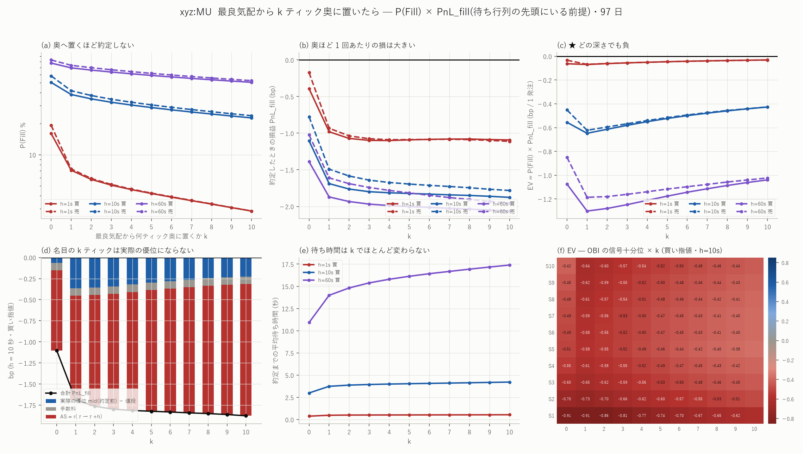

# xyz:MU — BBO から 10 ティック奥までの P(Fill) × PnL_fill

図: `xyz_MU_depth.png`



時刻 T に、買い指値を**最良買い気配 − k ティック**(k = 0..10)、売り指値を
**最良売り気配 + k ティック**に置いたときの約定確率と損益。
ティックは価格で変わる(< 1000 なら 0.01、>= 1000 なら 0.1)。標本 97 日。

損益は [EV の報告](mu_ev_report.md) と同じ定義:

    edge     = mid(τ − 2ms) − 約定値段          (約定直前の板で測る)
    AS       = r_{τ → τ+h}
    PnL_fill = edge − Fee + (買いなら +AS / 売りなら −AS)
    EV       = P(Fill) × PnL_fill

---

## 0. 結論を先に

1. **奥へ置いても「安く買える」わけではない。** 名目では k ティックぶん
   有利な値段に置いているのに、**実際の優位(mid(τ−2ms) − 約定値段)は
   k とともに増えない**。k=0 で −0.064、k=1 で −0.363、k=10 で −0.227 bp。
   奥まで価格が来たということは fair value 自体がそこまで落ちたということで、
   名目の割引は丸ごと消える
2. **奥ほど逆選択は重い。** AS は k=0 の −0.953 から k=10 の −1.562 bp へ悪化
3. **h ≥ 1 秒ではどの深さも負。** EV は k=1 の −0.648 bp が最悪で、
   k=10 でも −0.427 bp(h=10 秒・買い指値)
4. **★ 唯一の例外は「最良気配・待ち行列の先頭・保有 100 ミリ秒」。**
   88 通り(k × 側 × ホライズン)のうち、日次 Newey-West で正と言えるのは
   **1 通りだけ**(k=0 売り指値 h=100ms、EV = +0.036 bp、t = 4.15)。
   買い指値も +0.013 bp(t = 2.36)で符号は同じ。
   **前半・後半に割っても、平日・土日に割っても正のまま**である

---

## 1. 約定判定 — 待ち行列の先頭にいる前提

最良気配より奥の水準については板の厚みを持っていないので、
**自分がその水準の待ち行列の先頭にいる**とみなした。すなわち
「自分の値段以下(売りなら以上)で約定したテイカーが 1 件でも来たら約定」。

- **k ≥ 1 ではそれほど乱暴ではない。** まだ価格が来ていない水準に先回りして
  置くのだから、後から来る人より前に並ぶのが自然である
- **k = 0 では明らかに甘い。** 較正すると、h=10 秒の買い指値で
  先頭前提 **50.3%** に対し、実際の待ち行列(Q_ahead = bid_sz)を使った
  [EV の報告](mu_ev_report.md)では **25.0%** で、**2.0 倍の甘さ**である

したがって k=0 の結果は「待ち行列の先頭を取れたら」という条件つきで読むこと。
逆にいえば、下の 4 節の唯一の正の結果は**待ち行列の優先権の価値そのもの**である。

---

## 2. 水準ごとの約定率と損益(買い指値)

| k | P(Fill) 1s | P(Fill) 10s | P(Fill) 60s | PnL_fill 10s | **EV 10s** |
|---:|---:|---:|---:|---:|---:|
| 0 | 16.06% | 50.29% | 77.41% | −1.105 | **−0.5555** |
| 1 | 7.08% | 38.37% | 69.58% | −1.689 | **−0.6479** |
| 2 | 5.77% | 34.83% | 66.20% | −1.763 | −0.6140 |
| 3 | 5.07% | 32.29% | 63.38% | −1.799 | −0.5809 |
| 5 | 4.21% | 28.70% | 58.77% | −1.823 | −0.5231 |
| 7 | 3.59% | 25.97% | 54.98% | −1.842 | −0.4784 |
| 10 | 2.84% | 22.76% | 50.38% | −1.877 | **−0.4272** |

売り指値もほぼ同じ形(k=0 で 58.2% / −0.777 / −0.452、k=10 で 23.9% /
−1.783 / −0.426)。

### なぜ奥へ置いても得しないのか(h = 10 秒・買い指値)

| k | 実際の優位 edge | 手数料 | AS | PnL_fill | 待ち時間 |
|---:|---:|---:|---:|---:|---:|
| 0 | −0.064 | −0.088 | −0.953 | −1.105 | 2.99 s |
| 1 | **−0.363** | −0.088 | −1.238 | −1.689 | 3.74 s |
| 3 | −0.343 | −0.088 | −1.368 | −1.799 | 3.94 s |
| 5 | −0.298 | −0.088 | −1.437 | −1.823 | 4.03 s |
| 10 | **−0.227** | −0.088 | −1.562 | −1.877 | 4.22 s |

名目では k ティック(0.11〜1.1 bp)ぶん有利な値段に置いているのに、
**edge はむしろ k=1 で悪化して、その後もほぼ横ばい**である。
価格がそこまで来て初めて約定するのだから、来たときには
mid もそこまで落ちている。**奥へ置くのは「安く買う」ことではなく、
「もっと下がってから買う」ことでしかない。**

待ち時間が k でほとんど変わらない(2.99 → 4.22 秒)のも同じ理由で、
深い水準で約定するのは「大きく動いた」ときだけである。

---

## 3. 信号との組み合わせ

図 (f) は OBI の信号十分位 × k の EV(買い指値・h=10 秒)。
**全 110 セルが負**で、S10(買いたい状態)× 浅い k が最悪になる。
2 次元に切っても深さで逃げる余地は無い。

---

## 4. ★ 唯一の正の結果 — 最良気配・先頭・100 ミリ秒

88 通り(11 水準 × 2 側 × 8 ホライズン)に日次 Newey-West(14 日)で誤差を
付けた結果:

| | EV (bp/発注) | NW SE | t | 判定 |
|---|---:|---:|---:|---|
| **k=0 売り指値 h=100ms** | **+0.03629** | 0.00875 | **+4.15** | **正で有意** |
| k=0 買い指値 h=100ms | +0.01278 | 0.00542 | +2.36 | 正だが Bonferroni 未満 |
| k=0 売り指値 h=500ms | +0.01282 | 0.01753 | +0.73 | 正だが非有意 |
| k=1 売り指値 h=10s | −0.62267 | 0.06000 | −10.38 | 負で有意 |

**88 通り中、正で有意 1 / 負で有意 42。**

### 内訳(k=0・h=100ms)

| | P(Fill) | edge | 手数料 | AS | PnL_fill | EV |
|---|---:|---:|---:|---:|---:|---:|
| 売り指値 | 7.56% | +0.740 | −0.088 | +0.172 | **+0.480** | **+0.0363** |
| 買い指値 | 4.09% | +0.712 | −0.088 | −0.312 | **+0.313** | +0.0128 |

**待ち行列の先頭にいれば、100 ミリ秒で手放す前提なら、半スプレッドは
逆選択より大きい。** これがこの分析全体で唯一の正の結果である。

### 頑健性

| | 全期間 | 前半 49 日 | 後半 49 日 | 平日 | 土日 | 正の日 |
|---|---:|---:|---:|---:|---:|---:|
| 売り指値 | +0.0363 (t=4.15) | +0.0493 (t=4.95) | +0.0233 (t=2.09) | +0.0421 | +0.0217 | 88/98 |
| 買い指値 | +0.0128 (t=2.36) | +0.0213 (t=2.86) | +0.0042 (t=0.83) | +0.0153 | +0.0065 | 77/98 |

両側とも、前半・後半とも、平日・土日とも正。**後半で弱まる**のは
注意すべき点で、買い指値は後半では t=0.83 まで落ちる。

### 売りのほうが 2 倍強いことについて

k=0・100ms の約定率は売り 7.56% に対し買い 4.09% と大きく非対称である。
**標本期間に価格が +51.9% 上昇している**(初日 578.4 → 最終日 878.5、
1 日あたり +43 bp)ことと、テイカーの内訳が買い 576 万・売り 541 万で
買いが 6.5% 多いことが効いている。上げ相場では置いた売り指値は
追い越され(約定しやすく)、置いた買い指値は置き去りになる。
**この非対称は期間固有かもしれない**ので、他銘柄・他期間で確かめるまで
売り側の優位を一般化しないこと。

---

## 5. 言えないこと

- **待ち行列の優先権を取るコストを一切入れていない。** 先頭に立つには
  水準ができた瞬間に置くか、値段を改善して新しい最良を作るしかない。
  後者はスプレッドを自分で縮めるので edge が減る。ここでは
  「たまたま先頭にいた場合」の値しか出していない
- **k ≥ 1 の板の厚みを持っていない。** 先頭前提は k=0 で 2.0 倍甘いと
  較正できたが、k ≥ 1 での甘さは測れていない
- **100 ミリ秒で手放す方法を示していない。** 反対側で受動的に閉じるなら
  また約定を待つことになり、板を叩いて閉じるならスプレッドを払う。
  ここでの EV は **mid 評価の含み益**である
- **1 発注あたり +0.036 bp は小さい。** 8,467,190 発注で合計 +307,301 bp。
  実際には同時に何本も置けないので、この総額は上限ですらない
- **銘柄は xyz:MU のみ**、標本 97 日、上げ相場

---

## 再現手順

```bash
uv run python scripts/build_depth.py --coin xyz:MU     # 約 8 分
uv run python scripts/plot_depth.py --coin xyz:MU
```

出力: `data/depth_pooled_xyz_MU.csv`(176 行 = 11 水準 × 2 側 × 8 ホライズン)/
`data/depth_signal_xyz_MU.csv`(信号十分位つき 5,280 行)/
`data/depth_daily_xyz_MU.parquet`(8,624 行・誤差評価用)/
`data/depth_summary_xyz_MU.csv` / 図 1 枚。
