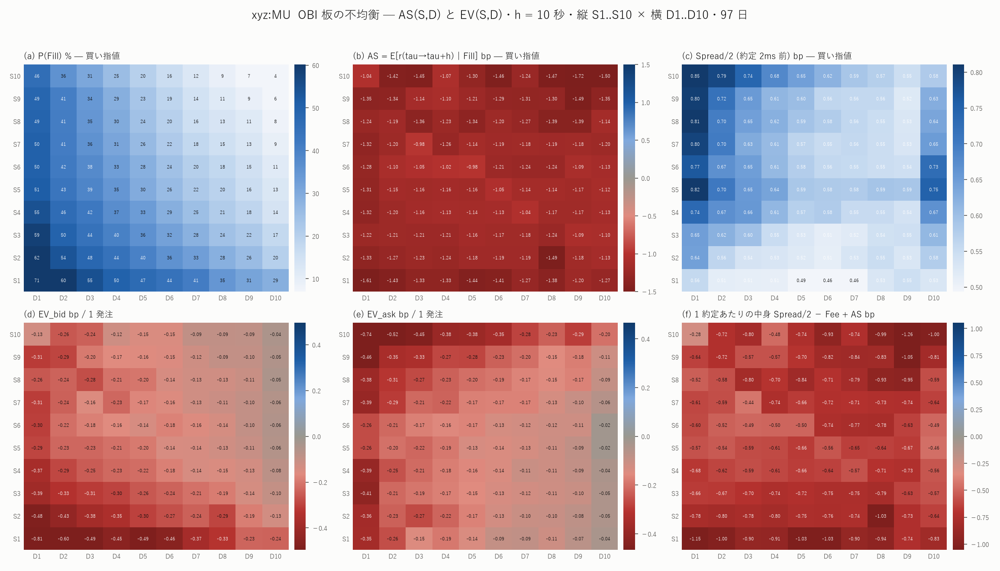
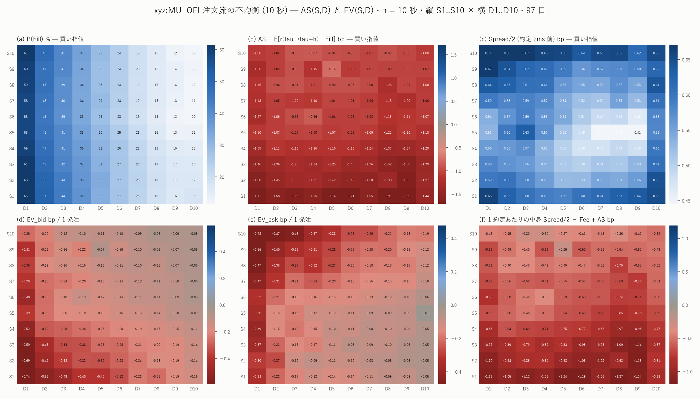
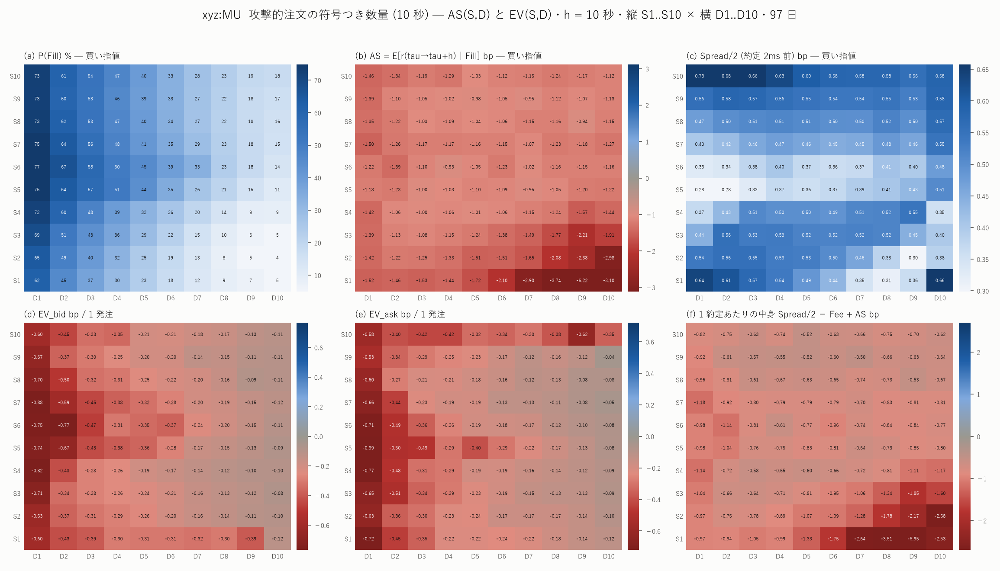

# xyz:MU — 約定時刻から測った逆選択 AS(S,D) と、クオートの期待値 EV(S,D)

図: `xyz_MU_ev_obi.png` / `xyz_MU_ev_ofi_10s.png` / `xyz_MU_ev_ai_net_10s.png`





これまでの損益は**発注時刻 T から T+h** で測っていた。だが T から約定時刻 τ
までの区間はまだ何も持っていないので損益に入らない。正しい逆選択は

    AS(S,D) = E[ r_{τ→τ+h} | Fill, S, D ]

であり、これを使って

    EV_bid(S,D) = P(Fill_bid | S,D) × [ Spread/2 − Fee + AS_bid(S,D) ]
    EV_ask(S,D) = P(Fill_ask | S,D) × [ Spread/2 − Fee − AS_ask(S,D) ]

を各セルで作った。標本 97 日、約定 906.5 万件。

---

## 0. 結論を先に

**クオートすべきセルは 1 つも無い。**

日次 Newey-West(14 日)で誤差を付けて検査した **1,717 セル**のうち、
EV > 0 と言えるセルは **0 件**。1 約定あたりの中身
(Spread/2 − Fee ± AS)が正のセルは 44 件あるが、
**t > 1.96 は 1 件、Bonferroni(1,717 検定)の 3.29 を超えるものは 0 件**。

理由は 1 行で書ける。

| 項目 | h = 10 秒・買い指値 |
|---|---:|
| 受け取る半スプレッド | **+0.580 bp** |
| メイカー手数料 | −0.088 bp |
| **自分を食った約定そのものが動かす分** | **−0.536 bp** |
| その後 10 秒の動き | −0.717 bp |
| **合計** | **−0.761 bp** |

**自分を食った約定の即時の影響(−0.54 bp)だけで、受け取る半スプレッド
(+0.58 bp)がほぼ消える。** 約定した瞬間にもう五分五分で、
そこから先はすべて損である。

---

## 1. ★ 測定で 2 つの重大な誤りを直した

### (1) 約定時刻ちょうどの板は「もう約定した後」

`node_fills` の時刻はミリ秒精度で、同じブロックの板更新が τ 以前に入る。
そのため τ で板を引くと**自分の指値が消えた後**を見てしまう。実測
(2026-06-24・1 秒以内に約定した買い指値 7,760 件の中央値):

| 基準時刻 | mid − 指値 | スプレッド | 自分が最良買い気配か |
|---|---:|---:|---:|
| τ − 500ms | +0.486 bp | 1.675 bp | 63.2% |
| τ − 50ms | +0.466 | 0.970 | 76.6% |
| **τ − 1ms** | **+0.465** | **0.969** | **76.6%** |
| **τ**(ちょうど) | **−0.000** | **2.974** | **12.1%** |
| τ + 1ms | −0.459 | 2.932 | 9.6% |

τ − 1ms から τ − 50ms は完全な平坦域で、τ で 3 倍に開く。
**この汚染された 2.974 bp を Spread/2 に使うと EV の符号が正に反転する。**
最初の実装はこれをやっており、全ホライズンで EV が +0.014〜+0.109 と
出ていた。2 ミリ秒手前を基準に直したところ、すべて負になった。

### (2) 区分累積和の桁落ちで、最も速く約定する発注を取りこぼしていた

約定時刻を求める処理で「全体の cumsum から群の直前を引く」形の区分累積和を
使ったところ、1.193 が 1.1929999... になって閾値比較に落ちた。
落ちたのは **待ち行列が小さい発注に偏っており**(不一致 1,332 件の待ち行列の
中央値 0.57 に対し全体は 7.93)、それはすなわち**最も速く約定する
= 最も逆選択の軽い**発注である。放置すれば逆選択を過大に見積もる。
数量の最小単位が 0.001 なので 1e-9 の許容を入れて解消し、
h ≥ 1 秒で既存の約定判定と **100.000% 一致**することを確認した。

---

## 2. 分解 — 何にいくら払っているか

全セル込み(単位 bp、Fee = 0.088 bp)。

| 側 | h | 半スプレッド | 手数料 | **即時の動き** | その後の動き | AS 合計 | 中身 |
|---|---:|---:|---:|---:|---:|---:|---:|
| 買 | 100ms | +0.604 | −0.088 | **−0.667** | −0.197 | −0.864 | **−0.348** |
| 買 | 1s | +0.524 | −0.088 | **−0.665** | −0.552 | −1.217 | **−0.781** |
| 買 | 10s | +0.580 | −0.088 | **−0.536** | −0.717 | −1.253 | **−0.761** |
| 買 | 60s | +0.621 | −0.088 | **−0.491** | −0.907 | −1.398 | **−0.865** |
| 売 | 100ms | +0.617 | −0.088 | **−0.623** | −0.167 | −0.789 | **−0.261** |
| 売 | 1s | +0.522 | −0.088 | **−0.639** | −0.535 | −1.174 | **−0.740** |
| 売 | 10s | +0.584 | −0.088 | **−0.511** | −0.694 | −1.205 | **−0.710** |
| 売 | 60s | +0.629 | −0.088 | **−0.466** | −0.908 | −1.373 | **−0.833** |

「即時の動き」は約定 2ms 前 → 約定時刻ちょうど の mid の動き、すなわち
**自分を食った約定そのものの影響**である。これが常に半スプレッドと同程度
(0.47〜0.69 対 0.52〜0.63)ある。

**h = 100 ミリ秒でも中身は負である。** 保有時間を極限まで削っても、
即時の影響だけで半スプレッドが消えるので逃げ道が無い。

### 実際に取れた優位 vs 教科書の Spread/2

| h | Spread/2 (約定 2ms 前) | mid(τ−2ms) − 指値 |
|---|---:|---:|
| 100ms | 0.627 | **+0.621** |
| 1s | 0.544 | +0.314 |
| 10s | 0.602 | −0.951 |
| 60s | 0.646 | −2.145 |

100 ミリ秒では両者がほぼ一致する(自分がまだ最良気配にいる)。
長く置くほど指値が置き去りになり、実際の優位は負になる。
**上の EV は寛容なほう(Spread/2)を使っている。** 実際の優位で計算すると
h=10s で 1 発注あたり −0.573 bp と、さらに 3 倍悪くなる。

---

## 3. セルごとの EV — どこも負

図の (d) EV_bid と (e) EV_ask は全 100 セルが負である(3 特徴量とも)。

### 待ち行列の列で切っても逃げられない(OFI・買い指値・h=10s)

| | D1 | D3 | D5 | D7 | D9 | D10 |
|---|---:|---:|---:|---:|---:|---:|
| P(Fill) % | 61.8 | 41.6 | 30.3 | 20.6 | 13.9 | 12.6 |
| 半スプレッド | 0.635 | 0.603 | 0.557 | 0.542 | 0.536 | 0.611 |
| **AS** | **−1.434** | −1.200 | −1.193 | −1.198 | −1.259 | −1.177 |
| **中身** | **−0.887** | −0.686 | −0.724 | −0.744 | −0.811 | −0.654 |

**AS は D をまたいでほぼ一定(−1.18〜−1.43)で、半スプレッド(0.54〜0.64)
の約 2 倍である。** 約定しやすい列を避けても逆選択は減らない。

### 「中身が正」のセルはどこにあるか

44/1,717 セル。ほとんどが 2 か所に固まっている。

| 特徴量・側 | h | セル | 約定数 | P(Fill) | 半スプ | AS | 中身 | EV | **日次 NW の t** |
|---|---:|---|---:|---:|---:|---:|---:|---:|---:|
| OBI 売 | 100ms | S5×D1 | 1,188 | 3.37% | 1.034 | +0.730 | +0.216 | +0.0073 | **0.84** |
| OFI 売 | 100ms | S5×D10 | 3,566 | 0.74% | 1.385 | +0.527 | +0.771 | +0.0057 | **0.24** |
| OBI 買 | 100ms | S5×D1 | 1,368 | 3.63% | 1.051 | −0.833 | +0.130 | +0.0047 | **0.97** |
| OBI 売 | 100ms | S4×D1 | 890 | 3.14% | 0.968 | +0.735 | +0.145 | +0.0045 | **1.32** |

- **D10 の列(流れが来ない・スプレッドが広い)が 33/52。** 約定率が 1% 未満で、
  1 発注あたりの EV は +0.005 bp。総額にすると無視できる
- **D1 × 信号が中庸(S3〜S6)** が残り。ここは約定率 3% 台で意味がありそうだが、
  日次 Newey-West の t は 0.84〜1.32 で**まったく有意でない**

プールの標準誤差なら t = 2.7〜58 と出るが、
[burstiness の報告](mu_burstiness_report.md)のとおり、この標本では
プール誤差は最大 15.8 倍過小である。日次にまとめて Newey-West を当てると
上記のとおり消える。

### 総額

全セルにクオートした場合(OFI・h=10s):

| | 発注数 | 合計 | 1 発注あたり |
|---|---:|---:|---:|
| 買い指値 | 8,293,430 | −1,550,725 bp | **−0.187 bp** |
| 売り指値 | 8,293,430 | −1,474,632 bp | **−0.178 bp** |

---

## 4. これは何を意味しないか

- **「この市場でマーケットメイクは不可能」とは言っていない。** ここで測ったのは
  **最良気配に無限小の指値を 1 枚置いて h だけ持つ**という最も素朴な設定である。
  実際の商売は両側に出し、在庫を見て値をずらし、不利になれば引く。
  とくに**引く(取り消す)ことを一切していない**のが大きい
- **取り消しによる順番の繰り上がりを数えていない。** 約定率は過小で、
  そのぶん「速く約定して逆選択の軽い」ケースを取りこぼしている可能性がある
- **自分の注文の影響を入れていない**(数量無限小の仮定)
- **手数料は 0.088 bp/約定** をこの案件の先の値から使った。
  リベートのある区分ならこの結論は変わりうる
- **銘柄は xyz:MU のみ**、標本 97 日

## 5. 逆に、これは強く言える

**即時の影響(−0.47〜−0.69 bp)が半スプレッド(+0.52〜+0.63 bp)と
同程度ある**という事実は、保有時間の選び方や信号の選び方では動かない。
h を 100 ミリ秒まで縮めても、S と D をどう切っても残る。
**この市場で受動的に流動性を出すことの費用の下限がここにある。**

---

## 再現手順

```bash
uv run python scripts/build_ev.py --coin xyz:MU     # 約 2 分
uv run python scripts/plot_ev.py --coin xyz:MU
```

出力: `data/ev_pooled_xyz_MU.csv`(4,800 セル)/
`data/ev_daily_xyz_MU.parquet`(154,716 行・h=100ms/1s/10s)/
`data/ev_summary_xyz_MU.csv`(EV と日次 Newey-West 誤差)/
`data/ev_positive_xyz_MU.csv`(判定を通ったセル = 0 件)/ 図 3 枚。
