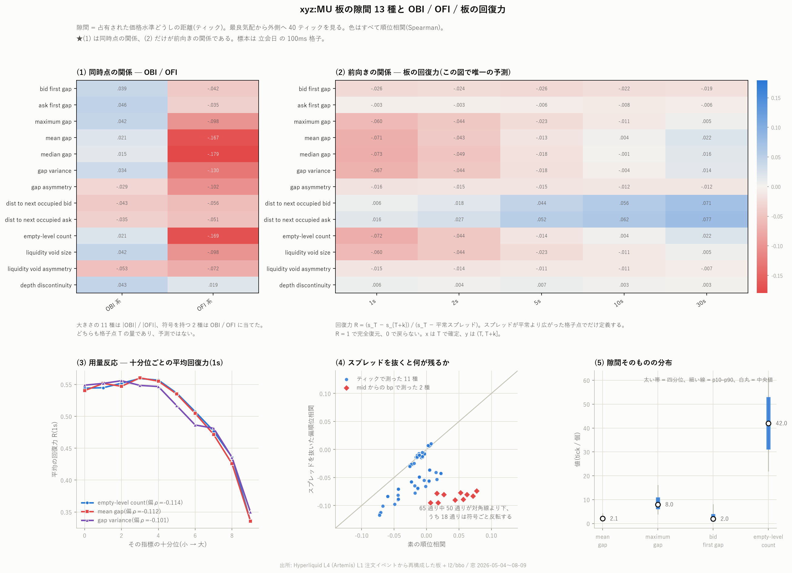

# `xyz:MU` 板の隙間 13 種と OBI / OFI / 板の回復力

板を「どこにいくら積まれているか」ではなく「**どこが空いているか**」で測る。
占有された価格水準の並びから隙間の統計量を 13 種類作り、
OBI・OFI(同時点)と板の回復力(前向き)との関係を調べた。

標本は 2026 年 5 月 4 日から 8 月 9 日までの 98 日、100ms 格子の
**5,555 万点**(板を再構成できた点)である。

再現: `uv run python scripts/build_gaps.py --coin xyz:MU` →
`uv run python scripts/analyze_gaps.py --coin xyz:MU`
図の再生成: `uv run python scripts/plot_gaps.py --coin xyz:MU`



---

## 0. 先に結論

1. **隙間の多い板は戻りが悪い。** スプレッドが広がった後の回復力は、
   空き水準の数・隙間の平均・隙間の分散が大きいほど低い
   (スプレッドを抜いた偏順位相関で $`\rho = -0.10`$ 前後)。
2. **★素の相関のままだと 18 通りで符号を取り違える。**
   mid からの bp で測った 2 指標はスプレッドと $`\rho = +0.79`$ で結びついており、
   回復力はスプレッドの平均回帰そのものなので、**素の相関はスプレッドの代理**に
   すぎない。スプレッドを抜くと $`+0.077 \to -0.074`$ のように符号ごと反転する。
3. **OBI とはほとんど関係が無い**($`|\rho| \le 0.053`$)が、
   **OFI とは強く関係する**(median gap で $`\rho = -0.179`$)。
   流量が大きいときほど板の隙間は小さい。ただしどちらも**同時点**の関係で、
   予測ではない。
4. 効果の大きさは小さい。最も強い empty-level count でも、十分位の
   最上位と最下位で平均回復力が 0.55 → 0.35 と動く程度である。

## 1. 定義

### 隙間とは

最良気配から外側へ **40 ティック**を見る。$`k = 0`$ が最良気配、$`k`$ が 1 増えると
その側のティック 1 つぶん外側。**占有** = その価格に数量が 1 ロット以上ある。
隙間 = 占有された水準どうしの距離(ティック)。

| # | 名前 | 中身 |
|---|---|---|
| 1 | bid first gap | 最良買いから次に占有された水準までのティック数 |
| 2 | ask first gap | 売り側の同じもの |
| 3 | maximum gap | 両側を通して最大の隙間 |
| 4 | mean gap | 隙間の平均 |
| 5 | median gap | 隙間の中央値 |
| 6 | gap variance | 隙間の分散 |
| 7 | gap asymmetry | $`(\bar g_{bid} - \bar g_{ask})/(\bar g_{bid} + \bar g_{ask})`$ |
| 8 | distance to next occupied bid | 1 を **mid からの bp** で測り直したもの |
| 9 | distance to next occupied ask | 2 の bp 版 |
| 10 | empty-level count | 窓の中で空だった水準の数(両側の合計、最大 78) |
| 11 | liquidity void size | 最も長く連続した空き = maximum gap − 1 |
| 12 | liquidity void asymmetry | 空きの偏り |
| 13 | depth discontinuity | 隣り合う占有水準の数量比の $`\|\log\|`$ の最大 |

**★1・2 と 8・9 は同じ現象を別の物差しで測っている。** 前者は**ティック**
(板の機構そのもの)、後者は **mid からの bp**(値段の水準に依らない)。
この違いが第 4 節で決定的になる。

**★11 は 3 から定数を引いただけ**なので、相関はすべて 3 と一致する。
別々に数えても情報は増えない(それが判るように両方載せてある)。

### 板の再構成

`build_obi_levels.py` の手順をそのまま使う(同じ関数を import している)。

- ティックは価格で変わる。1000 未満は 0.01 刻み、1000 以上は 0.1 刻み
- 数量は 0.001 が最小単位。**整数のロット数**で足し引きする
  (浮動小数だと空の水準に $`10^{-13}`$ が残り「深さあり」と読まれる)
- 部分約定は `remaining_sz` にそのまま出る
- 同一 ns の行順は論理順と逆。open(0) → filled(2) → 終端(3) で並べ直す
- 日を跨いで残る注文は carry として持ち越す(中央値 9,826 件/日)

### ★再構成の質 — 3 分の 1 は使えていない

格子点 8,467 万点のうち、**再構成した板でも最良気配の両側に数量があった点は
5,555 万点(65.6%)**しかない。残り 34.4% は落としている。
`l1` は注文イベントの記録であって板そのものではないため、
取りこぼしがこれだけ残る。

**この 34.4% が無作為に欠けている保証は無い。** 板が薄い局面ほど
再構成が外れやすいなら、本レポートの相関は薄い側を取りこぼした後の値である。
数字はこの制約つきで読むこと。

### 板の回復力(resilience)

スプレッドが平常より広がった後、どれだけ戻るかで測る。

```math
R_k \;=\; \frac{s_T - s_{T+k}}{s_T - \bar s_T},
\qquad \bar s_T = \text{$T$ より前 60 秒のスプレッド中央値}
```

$`R = 1`$ で完全復元、0 で戻らない。$`s_T \gt  \bar s_T`$(広がった)格子点でだけ定義する。
$`\bar s_T`$ は 1 秒系列の移動中央値を 1 つずらして作るので**先読みしない**。
$`R`$ は分母が小さいと発散するので $`[-1, +2]`$ に切る。この範囲は定義から
決めたもので標本から作っていない。順位相関も併記するので切り方の影響は確かめられる。

### ★時間契約 — 何が同時点で何が前向きか

| 関係 | $`x`$ | $`y`$ | 向き |
|---|---|---|---|
| 隙間 ↔ OBI | $`T`$ | $`T`$ | **同時点** |
| 隙間 ↔ OFI | $`T`$ | $`(T-100\mathrm{ms},\, T]`$ | **同時点** |
| 隙間 ↔ 回復力 | $`T`$ | $`(T,\, T+k]`$ | **前向き** |

図でも出力 CSV でも `direction` 列で区別してある。
OBI / OFI との関係を「予測」と読んではいけない。

### 符号のあるものと無いもの

13 種のうち符号を持つのは **gap asymmetry と void asymmetry の 2 つだけ**。
残り 11 は大きさである。大きさを符号つきの OBI / OFI に当てても構造的に 0 に
なるので、**大きさには $`|\mathrm{OBI}|`$ / $`|\mathrm{OFI}|`$ を、
符号つきには OBI / OFI を**当てた。

## 2. 隙間そのものの姿

| 指標 | 平均 | 標準偏差 | 最小 | 最大 |
|---|---:|---:|---:|---:|
| bid first gap | 3.30 | 3.88 | 1 | 39 |
| ask first gap | 3.48 | 4.09 | 1 | 39 |
| maximum gap | 9.21 | 5.04 | 1 | 39 |
| mean gap | 2.59 | 1.46 | 1 | 39 |
| median gap | 1.76 | 1.23 | 1 | 39 |
| gap variance | 6.37 | 12.04 | 0 | 361 |
| gap asymmetry | −0.005 | 0.231 | −0.95 | +0.95 |
| dist to next occupied bid (bp) | 1.43 | 1.17 | 0.15 | 53.16 |
| dist to next occupied ask (bp) | 1.45 | 1.17 | 0.15 | 54.25 |
| empty-level count | 42.38 | 14.86 | 0 | 78 |
| liquidity void size | 8.21 | 5.04 | 0 | 38 |
| liquidity void asymmetry | −0.008 | 0.347 | −1 | +1 |
| depth discontinuity | 6.03 | 1.62 | 0 | 16.43 |

- **板はほとんど空である。** 78 水準のうち平均 42.4、つまり **54%** が空。
  中央値でも 42 で、埋まっているのは半分に満たない。
- **最良気配のすぐ隣は意外と埋まっている。** first gap の中央値は 2 ティックで、
  平均 3.3。一方 maximum gap の平均は 9.2 ティックあり、
  **奥へ行くほど穴が大きくなる**。
- **買いと売りはほぼ対称。** gap asymmetry の平均 −0.005、
  void asymmetry の平均 −0.008 で、どちらもほぼ 0。
- depth discontinuity の平均 6.03 は数量比 $`e^{6.03} \approx 400`$ 倍にあたる。
  隣り合う水準の厚みが 2 桁以上違うのが普通、ということである。

## 3. OBI / OFI との関係(同時点)

立会日、順位相関。

| 指標 | OBI 系 | OFI 系 |
|---|---:|---:|
| bid first gap | +0.039 | −0.042 |
| ask first gap | +0.046 | −0.035 |
| maximum gap | +0.042 | −0.098 |
| mean gap | +0.021 | **−0.167** |
| median gap | +0.015 | **−0.179** |
| gap variance | +0.034 | −0.130 |
| gap asymmetry | −0.029 | −0.102 |
| dist to next occupied bid | −0.043 | −0.056 |
| dist to next occupied ask | −0.035 | −0.051 |
| empty-level count | +0.021 | **−0.169** |
| liquidity void size | +0.042 | −0.098 |
| liquidity void asymmetry | −0.053 | −0.072 |
| depth discontinuity | +0.043 | +0.019 |

- **OBI とはほとんど関係が無い。** 13 種すべてで $`|\rho| \le 0.053`$。
  最良気配の残高がどちらに偏っているかは、板の奥の穴の空き方をほとんど語らない。
- **OFI とははっきり関係する。** median gap $`-0.179`$、empty-level count
  $`-0.169`$、mean gap $`-0.167`$。**流量が大きい局面ほど板の隙間は小さい。**
  注文が飛び交っているときは穴が埋まっている、という素直な形である。
- **depth discontinuity だけ符号が逆**(OFI と $`+0.019`$)。厚みの段差は
  他の隙間指標と別のものを測っている。
- 繰り返すが**これは同時点の関係**である。OFI が隙間を埋めるのか、
  隙間が小さいから流量が出るのか、この表では区別できない。

## 4. ★板の回復力との関係 — 素の相関を信じてはいけない

立会日、順位相関。左が素の値、右が**スプレッドを抜いた偏順位相関**。

| 指標 | 1s | 2s | 5s | 10s | 30s |
|---|---|---|---|---|---|
| bid first gap | −.026→−.029 | −.024→−.026 | −.026→−.030 | −.022→−.027 | −.019→−.024 |
| ask first gap | −.003→−.007 | −.003→−.008 | −.006→−.012 | −.008→−.014 | −.006→−.013 |
| maximum gap | −.060→−.083 | −.044→−.070 | −.023→−.058 | −.011→−.049 | +.005→−.037 |
| mean gap | −.071→−.112 | −.043→−.088 | −.013→−.069 | +.004→−.056 | **+.022→−.043** |
| median gap | −.073→−.117 | −.049→−.098 | −.018→−.078 | −.001→−.066 | +.016→−.053 |
| gap variance | −.067→−.101 | −.044→−.081 | −.018→−.065 | −.004→−.055 | +.014→−.041 |
| gap asymmetry | −.016→−.014 | −.015→−.012 | −.015→−.011 | −.012→−.007 | −.012→−.007 |
| dist to next occupied bid | +.006→−.095 | +.018→−.095 | **+.044→−.090** | **+.056→−.089** | **+.071→−.083** |
| dist to next occupied ask | +.016→−.078 | **+.027→−.080** | **+.052→−.077** | **+.062→−.080** | **+.077→−.074** |
| empty-level count | −.072→−.114 | −.044→−.090 | −.014→−.070 | +.004→−.057 | **+.022→−.043** |
| liquidity void size | −.060→−.083 | −.044→−.070 | −.023→−.058 | −.011→−.049 | +.005→−.037 |
| liquidity void asymmetry | −.015→−.014 | −.014→−.013 | −.011→−.010 | −.011→−.010 | −.007→−.005 |
| depth discontinuity | +.006→+.008 | +.004→+.006 | +.007→+.011 | +.003→+.007 | +.003→+.007 |

太字は**符号が変わり、かつ素の値が 0.02 を超える** 9 組。
符号だけで数えると **65 通り中 50 通りが対角線より下、うち 18 通りが反転**する
(図の (4) はこちらの数え方。素の値が 0.02 以下の弱い反転も含む)。

### なぜスプレッドを抜く必要があるか

回復力は定義上「スプレッドが広がった後どれだけ戻るか」である。
一方 **distance to next occupied は mid から測っているので、半スプレッドを
構造的に含む**。実測でスプレッドとの順位相関は

| | スプレッドとの $`\rho`$ |
|---|---:|
| dist to next occupied bid | **+0.792** |
| dist to next occupied ask | **+0.744** |
| bid first gap(ティック) | −0.137 |
| ask first gap(ティック) | −0.174 |
| maximum gap | +0.079 |
| empty-level count | +0.088 |

であり、bp で測った 2 つだけが突出してスプレッドと一体である。
そしてスプレッド自身は回復力と $`\rho = +0.12 \sim +0.15`$ で結びつく
(広がったものは戻る、という平均回帰そのもの)。

したがって **bp 版の「隙間が大きいほど戻りやすい」($`+0.077`$)は
隙間の性質ではなくスプレッドの平均回帰**であり、スプレッドを抜くと
$`-0.074`$ と符号が反転して、ティック版と同じ「隙間が大きいほど戻らない」に揃う。

**1 と 8 を別々に測っていなければ、この取り違えに気づけなかった。**
同じ現象を 2 つの物差しで測ったことが効いた。

### 残るもの

スプレッドを抜いた後は、13 種すべてでホライズンによらず安定して負である
(depth discontinuity だけ +0.007 前後でほぼ 0)。
**隙間の多い板は戻りが悪い**、という結論はホライズン 1s〜30s で一貫している。

## 5. 効果の大きさ

最も強い 3 指標について、十分位ごとの平均回復力(1s)は
**最下位 0.55 → 最上位 0.35** 程度動く(図の (3))。
空き水準が最も少ない板は広がりの 55% を 1 秒で戻し、
最も多い板は 35% しか戻さない、という差である。

順位相関で $`\rho \approx -0.11`$、$`\rho^2 \approx 1.2\%`$ なので、
**回復力のばらつきのうち隙間で説明できるのは 1.3% 程度**にすぎない。
向きは一貫しているが、大きさは小さい。

本レポートは執行費用の計算をしていない。回復力は価格の予測ではないので、
そのまま損益に直せないためである。「隙間が多い板では指値が戻るのを待つ時間が
長い」という運用上の含意にとどめる。

## 6. 立会日と閉場日でほぼ同じ

[churn のレポート](mu_churn_report.md)では立会日と閉場日を混ぜると
相関が両方より大きくなる事故が起きた。今回は同じ検査をして**問題が無い**
ことを確かめた(回復力 1s の偏順位相関)。

| 指標 | 立会日 | 閉場日 |
|---|---:|---:|
| empty-level count | −0.114 | −0.108 |
| mean gap | −0.112 | −0.105 |
| maximum gap | −0.083 | −0.074 |
| dist to next occupied bid | −0.095 | −0.099 |

差は 0.01 以下で、regime を跨いでも同じ関係が出ている。
本レポートの主表は立会日だが、閉場日でも結論は変わらない。

## 7. 検算した項目

| 検算 | 結果 |
|---|---|
| 恒等式 maximum gap = void size + 1 | 全格子点で一致 |
| 値域 gap asymmetry / void asymmetry | $`[-0.95, +0.95]`$ / $`[-1, +1]`$ に収まる |
| 値域 empty-level count | $`[0, 78]`$(窓は片側 39 × 2 = 78) |
| first gap の右打ち切り | 窓 40 ティック内に次の占有が無い割合は 0.28% |
| 再構成の質 | 最良気配の両側に数量があった格子点 65.6%。残りは除外 |
| スプレッドとの交絡 | bp 版 2 種は $`\rho = +0.79 / +0.74`$。偏相関で対処 |
| 日区分 | 立会日と閉場日で偏相関の差は 0.01 以下 |
| 配色 | `palette_check.validate` で `ok=true`、CVD ΔE 最小 20.0 |

実装中に踏んで直した誤りも残す。

- **liquidity void size が −1 になった。** 窓の中に「次の占有水準」が
  1 つも無い側は隙間が右打ち切りになるのに、0 のまま 1 を引いていた。
  その結果 void asymmetry が $`\pm 3`$ まで飛び出した。打ち切りは NaN にした。
- **median gap の十分位が 3 点に潰れた。** 値が 1・2・3 しか取らないため。
  用量反応の図からは境目が 8 つ未満の指標を外した。

## 8. まとめ

1. 板の 78 水準のうち平均 **54% が空**。隙間は奥ほど大きい
2. OBI とはほぼ無関係($`|\rho| \le 0.053`$)、OFI とは明確に負($`-0.179`$)。
   ただし**どちらも同時点**
3. 隙間が多い板は回復力が低い。偏順位相関で $`\rho \approx -0.10`$、
   1s〜30s で一貫
4. **素の相関のままだと 65 通り中 18 通りで符号を取り違える。**
   mid からの bp で測った指標はスプレッドの代理になっている
5. 効果は小さい($`\rho^2 \approx 1.2\%`$)。向きは確かだが大きさは期待しない
6. 再構成できたのは格子点の 65.6%。**残り 34.4% が無作為に欠けている保証は無い**

## 出力ファイル

| ファイル | 内容 |
|---|---|
| `data/gaps_xyz_MU/dt=*.parquet` | 100ms 格子の 13 種 + OBI / OFI / スプレッド(98 日) |
| `data/gaps_rel_xyz_MU.csv` | 関係の一覧(182 行。Pearson / Spearman / 偏相関) |
| `data/gaps_desc_xyz_MU.csv` | 13 種の記述統計 |
| `data/gaps_meta_xyz_MU.csv` | 日ごとの再構成の質 |
| `charts/xyz_MU_gaps.png` | 図 5 枚 |
