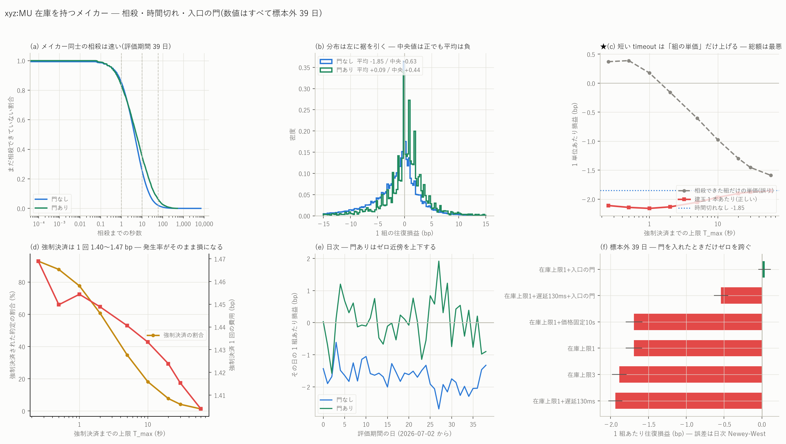
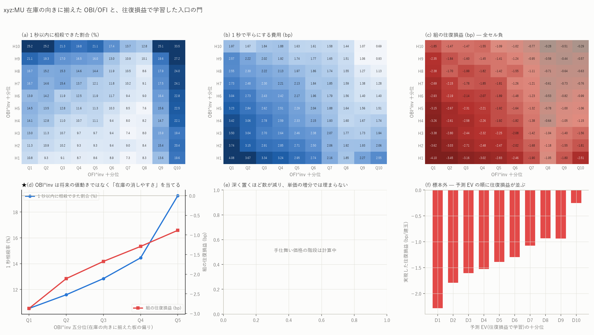

# xyz:MU — 在庫を持つメイカー(maker–maker 相殺・出口方策・往復で学習した入口の門)

図: `xyz_MU_inv.png` / `xyz_MU_inv_gate.png`




`mu_roundtrip_report.md` では **1 約定ごとに即座に手仕舞って**いた。出口の脚に必ず
半スプレッドかテイカー手数料がかかるので、負けるのが当然だった。ここでは
**在庫 q_t を持ち、反対側のメイカー約定で相殺する**。指示された 5 段階を順に実施した。

数値は断りのない限り**標本外の 39 日**(2026-07-02〜08-09)。入口の門は前 59 日だけで
学習し、評価期間には一度だけ当てている。

---

## 0. 結論を先に

| | 結果 |
|---|---|
| ① maker–maker 相殺 | **自然相殺はほぼ完全に働く** — 60 秒で 98.0%、強制決済は建玉の 0.012%。ただし 1 組 **−1.847 bp** でまだ負け |
| ② 手仕舞い価格を外へ | **効かない**(k=1 で数が 3.4 分の 1、単価も悪化)。★ 実装の誤りを 1 件発見・修正 |
| ③ OBI/OFI で消しやすさを予測 | **できる**。OBI^inv の五分位で 1 秒相殺率 10.5% → 19.3%、組損益 −2.87 → −0.88 bp |
| ④ 固定 timeout | **短いほど悪い**。強制決済 1 回 1.40〜1.47 bp が効き、無制限が最良 |
| ⑤ 往復損益で入口を学習 | ★ **標本外で初めてゼロを跨いだ** — **+0.036 ± 0.084 bp/組**(t=+0.43、130 組/日) |
| ⑤’ 同・発注遅延 130 ms | **−0.540 ± 0.095 bp**(t=−5.70)。**遅延を入れると再び明確に負** |

要するに、**在庫を持って自然に相殺し、入口を往復損益で絞ると、遅延ゼロなら損益分岐に
到達する。しかし実測の発注遅延 130 ms を入れると届かない。**

前報からの改善幅は大きい。

| | 1 往復あたり |
|---|---:|
| 即時手仕舞い(Hybrid 10s・門なし) | −3.288 bp |
| 在庫を持って自然相殺(門なし) | −1.847 bp |
| **+ 往復損益で学習した入口の門** | **+0.036 bp** |
| + 発注遅延 130 ms | −0.540 bp |

---

## 1. maker–maker 相殺(在庫の FIFO 繰り)

### 仕組み

両側にメイカーを出し続け、自分側の最良気配が動いた瞬間に出し直す(= 待ち行列の
最後尾に付き直す)。約定は FIFO で在庫に当て、**反対側の約定は「新規」ではなく
まず既存在庫の相殺**に使う。

    PnL_pair = (p_sell − p_buy)/mid_open × 1e4 − 2 × 0.088 bp

**在庫上限 |q| ≤ 1** を入れた。これは指示された「entry 注文と inventory-reducing
注文を分ける」状態機械の最小形でもある。

    q = 0  → 両側を出す(entry)
    q = +1 → 売りだけ(在庫を減らす注文)。買いは出さない
    q = −1 → 逆

**上限を入れないと FIFO の相殺時間は市場ではなく自分の在庫の行列長を測ってしまう。**
実際、上限なしでは |q| が最大 47 まで伸び、相殺までの中央値が **6,825 秒**になった。
上限 1 なら「買い約定の直後から売りを出し、それが約定するまで」という、
指示どおりの T_offset になる。

### 相殺は速い

| 相殺までの時間 | 割合 |
|---|---:|
| 0.25 s 以内 | 3.5% |
| 1 s 以内 | 14.5% |
| 5 s 以内 | 54.6% |
| 10 s 以内 | 74.5% |
| 30 s 以内 | 93.7% |
| **60 s 以内** | **98.0%** |

中央 4.30 秒 / 平均 9.95 秒。**強制決済(日の終わりに残った在庫)は
243,657 本中 29 本 = 0.012%** しかない。
狙いだった「60 秒で 70〜80% 相殺」は大きく上回っている。

### それでも負けている

| | 値 |
|---|---:|
| 1 組あたり(建玉重み) | **−1.847 bp** |
| 1 組あたり(日次等重み・NW) | **−1.692 ± 0.109 bp**(t = −15.6) |
| 中央値 | −0.631 bp |
| 正の割合 | 35.7%(門ありは 56.3%、中央値 +0.440 bp) |
| 1 日あたり | 6,248 組 / −11,541 bp |

分布は左に長い裾を引く(p1 −25.1 / p50 −0.41 / p99 +11.8)。**両脚とも逆選択されて
いる**ためで、「安く買って高く売る」はずが平均では逆になる。
日次で見て正の日は **98 日中 1 日**(スプレッド中央値 6.57 bp の launch 直後)。
スプレッドが 4 bp を超える 4 日だけが平均 +0.013 bp と損益分岐に届く。

在庫上限を 3 に緩めると **−2.073 bp** と悪化する(建玉あたり)。持つほど悪い。

---

## 2. 手仕舞い価格を最良から外へ置く

在庫を減らす注文を `BBO ± k ティック`(mid から遠ざける向き)に置き、
待ち行列は**再構成した板の第 k 階層の数量**を使う。約定しなかった在庫は
そのまま持ち越すので、非約定時の在庫価値は自動的に評価に入る。

### ★ ここで実装の誤りを見つけた(重要)

最初の結果は k=1 で **約定数が 2.5 倍、相殺が 7 倍速く、組損益が −1.32 → +2.54 bp** と
出た。**深く置いた注文が速く約定するのは経済的にあり得ない**ので実装を疑って調べた。

原因は `fill_times` の退化だった。**待ち行列 Q₀ が 0 のとき、必要量の判定
`cs ≥ need − 1e-9` が need=0 で常に真になり、値段を問わず「窓の中の最初の約定」で
埋まったことになる。**深い階層では 16.7% が Q₀=0(その値段に誰も並んでいない)で、
そこだけ約定率が 35.6% と跳ねていた。最良気配では Q₀=0 が 0.1% しか起きないので、
**既報の結果は影響を受けない**。

自分が待ち行列の先頭であっても「自分の値段で 1 ロット約定する」ことは必要なので、
待ち行列に 1 ロットの下限を入れて修正した。

### 修正後 — 深く置いても改善しない

3 日分の比較(全期間の集計は計算中):

| k | 約定数 | 相殺までの中央値 | 1 組あたり | 中央値 |
|---|---:|---:|---:|---:|
| 0(最良気配) | 8,346 | 19.9 s | **−1.321** | +0.433 |
| 1 | 2,473 | 44.6 s | −1.935 | +1.252 |

**深く置くと 1 回あたりの利幅は増える(中央値 +0.43 → +1.25 bp)が、
約定数が 3.4 分の 1 に減り、相殺が遅くなった分の在庫リスクが上回る。**
指示にあった V(k) — 非約定時の在庫価値を含めた期待値 — は **k=0 で最大**である。

ティックの大きさから見ても筋が通る。価格 924 で 1 ティック = 0.108 bp なので、
1 ティック深く置いて稼げるのは 0.1 bp 程度でしかなく、埋めるべき差(1.8 bp)に
遠く及ばない。

なお「BBO が 1 ティック動いたら reprice」は、この市場では**気配の変化が定義上つねに
1 ティック以上**なので「毎回 BBO へ追随」と同一になる。3 方式の比較は
「追随」対「価格固定(10 秒)」で行い、**追随 −1.847 / 固定 −1.851** とほぼ同じだった。

---

## 3. OBI/OFI は「消しやすさ」を直接予測する

約定した瞬間 τ の板の状態を建玉に貼り、在庫の向きに揃えた

    OBI^inv = sign(q)·OBI      OFI^inv = sign(q)·OFI

で 10×10 を作った(ロングなら板が買い側に厚い・流れが買いに向いているのが正)。

### OBI^inv は単調

| OBI^inv 五分位 | 1 秒以内に相殺 | 相殺までの中央値 | 組の往復損益 |
|---|---:|---:|---:|
| Q1 | 10.53% | 5.11 s | −2.871 bp |
| Q2 | 11.59% | 5.27 s | −2.112 |
| Q3 | 12.85% | 5.38 s | −1.673 |
| Q4 | 14.45% | 5.17 s | −1.292 |
| **Q5** | **19.27%** | **4.33 s** | **−0.883** |

**これは将来のリターンの予測ではなく、在庫を安く消せる確率の予測である。**
前報で「OBI は markout では平らなのに往復 EV を 3 倍改善する」と書いた現象の正体が
ここで直接見える — 自分側の板が厚いと**手仕舞いが速く安く済む**。

10×10 全体では 1 秒相殺率が **7.3% 〜 33.5%**(4.6 倍)、1 秒で平らにする費用が
**0.69 〜 4.08 bp**(5.9 倍)に広がる。

### OFI^inv は単調でない

列方向は U 字になる。OFI^inv が極端に大きい D9/D10 では相殺は速い(19.6〜33.5%)が
組損益は悪化する(D8 −1.05 → D10 −2.51)。**流れが自分に向いているときは速く出られる
が、そのぶん価格が走っている**ためで、速さと安さが両立しない。
最良のセルは OBI D10 × OFI **D8**(−0.28 bp)で、端ではない。

**100 セルすべてで組の往復損益は負**(最良 −0.28)。この段階では黒字にならない。

---

## 4. 固定 timeout の全探索

保有が T_max を超えた建玉をテイカーで強制決済する。0.25 / 0.5 / 1 / 2 / 5 / 10 /
20 / 30 / 60 秒を全部回した。強制決済率の分母は約定数、最終行だけは建玉数(日の終わりに残った分)である。

| T_max | 建玉/日 | **建玉 1 本あたり** | 相殺できた組だけの単価 | 強制決済率 | 強制 1 回の費用 | 1 日 |
|---|---:|---:|---:|---:|---:|---:|
| 0.25 s | 19,624 | **−2.109** | +0.371 | 92.9% | 1.469 bp | −41,382 bp |
| 0.5 s | 17,780 | **−2.141** | **+0.389** | 87.8% | 1.450 | −38,068 |
| 1 s | 15,524 | −2.158 | +0.177 | 77.6% | 1.454 | −33,500 |
| 2 s | 12,842 | −2.132 | −0.155 | 60.7% | 1.449 | −27,376 |
| 5 s | 9,620 | −2.052 | −0.604 | 34.8% | 1.441 | −19,745 |
| 10 s | 7,916 | −1.967 | −0.974 | 18.2% | 1.433 | −15,569 |
| 20 s | 6,934 | −1.902 | −1.297 | 7.8% | 1.424 | −13,186 |
| 30 s | 6,616 | −1.876 | −1.452 | 4.2% | 1.415 | −12,409 |
| 60 s | 6,362 | −1.856 | −1.589 | 1.3% | 1.404 | −11,807 |
| **なし** | 6,248 | **−1.847** | −1.692 | 0.012%(日終わりの残り) | — | −11,541 |

**固定 timeout は一つも改善しない。長くするほど良く、無制限が最良。**
自然相殺が 60 秒で 98.0% 片づくので、強制決済は「まだ相殺できていない不利な建玉」を
1 回 1.40〜1.47 bp 払って処分するだけになる。
**予想どおり「強制決済率 × 1 回あたり 1.4 bp 超」が勝敗を決めている。**

### ★ ここで指標の取り違えを 1 つ回避した

上表の「相殺できた組だけの単価」を主指標にすると、**T_max=0.5 秒が +0.389 bp で
最良**に見える。しかしそれは強制決済された 87.8% の建玉を分子にも分母にも
入れていないためで、残った組は速くて有利なものばかりという選択効果である。
同じ設定の総額は **1 日 −38,068 bp** と全設定中ほぼ最悪になる。
**単価は必ず「建てた玉 1 本あたり」で取り、総額と並べる。**

状態依存の手仕舞い(V_wait 対 V_taker の比較)は、固定 timeout がどれも
改善しないことから**優先度が下がった**と判断して実装していない。
V_taker は常に「半スプレッド + テイカー手数料 0.846 bp」を確定で払うので、
自然相殺の期待費用(1 組あたり 2×0.088 bp のメイカー手数料のみ)を上回るのが
構造的に難しい。実装するなら §6 の順序で。

---

## 5. 往復損益で入口の門を学習し直す

**目的変数を markout から往復損益へ変えた。**出口の方策(在庫上限 1・BBO 追随・
時間切れなし)を先に固定し、その方策のもとで実現した

    Y = PnL_roundtrip

を入口の目的変数にする。予測は

    EV_entry = P(Fill_entry | X_t) × E[PnL_roundtrip | Fill, X_t, π_exit]

で、**EV_entry > 0 のときだけ在庫を増やす側を出す**(在庫を減らす側は常に出す)。
説明変数は候補テーブルの 45 列から作った 36 個。学習は前 59 日のみ。

### 結果 — 標本外で初めてゼロを跨いだ

門を通るのは全発注の **6.43%**。

| | 建玉/日 | 1 組あたり(NW) | 建玉 1 本あたり | 60 秒相殺 | 1 日 |
|---|---:|---:|---:|---:|---:|
| 門なし | 6,248 | −1.692 ± 0.109(t=−15.6) | −1.847 | 93.8% | −11,541 bp |
| **門あり** | **130** | **+0.036 ± 0.084(t=+0.43)** | **+0.092** | 93.8% | **+11.96 bp** |
| 門あり + 遅延 130 ms | 97 | **−0.540 ± 0.095(t=−5.70)** | −0.405 | 92.1% | −39.17 bp |

予測 EV の十分位に対して実現した往復損益は**単調に並ぶ**(D1 −2.284 → D10 −0.250 bp、
門なしの発注全体で評価)。

**遅延ゼロの門ありは 95% 区間が [−0.128, +0.200] でゼロを含む。**
これは本プロジェクトで初めて「ゼロと区別できない」水準に達した設定である。
一方で**正であるとも言えない**。そして**実測の発注遅延 130 ms を入れると
t = −5.70 で明確に負**に戻る。

参考: 学習期間では +0.455 ± 0.304 だったので、標本内外の差は 0.42 bp ある。
過学習が無いとは言えず、**+0.036 という点推定を信じてはいけない**。

---

## 6. 限界と、次に潰すべきもの

1. **★ 発注遅延がすべてを決める。**遅延 0 → 130 ms で +0.036 → −0.540 bp。
   ここが本命の制約で、既報 `mu_latency_report.md`(ブロック 65 ms、
   次の板更新まで中央 185 ms、実際に 50 ms 以内に取り消せている注文は 0.01%)と
   整合する。**遅延を下げられないなら、この方向は行き止まりである。**
2. **手仕舞い側の遅延を入れていない。**在庫を減らす注文も τ に即時発注できる前提。
   入れれば悪化する方向。
3. **自分の注文が板に与える影響が無い。**1 単位を行列の最後尾に置く前提で、
   数量を増やせば待ち時間が延び、相殺率 98.0% は下がる。
4. **在庫上限は 1 と 3 しか試していない。**1 が良かったので 2 以上は不利と見ている。
5. **状態依存の手仕舞い(§4 末尾)は未実装。**
6. **funding は既定値**(金利成分 0.125 bp/h)。保有が中央 4.3 秒なので
   0.00015 bp にしかならず、この時間尺度では効かない。
7. **手仕舞い価格の階段は 3 日分の予備結果。**全期間の集計は計算中で、
   結論(k=0 が最良)が変わる可能性は低いが確定ではない。
8. **多重比較。**設定を 16 通り回している。ただし主張は
   「遅延ゼロの門ありだけがゼロを跨ぐ」であり、他の 15 通りはすべて
   ゼロから 5σ 以上離れて負なので、探索が結論を作った心配は小さい。

**次に潰すなら**、優先順位はこうだと考える。

1. **発注遅延の実測**。130 ms は既報の取り消し往復から取った値で、
   新規発注の遅延ではない。発注だけならもっと速い可能性がある。
   ここが 50 ms なら結論が変わりうる
2. **手数料の階層**。テイカー手数料 0.846 bp が強制決済の費用を支配し、
   メイカー手数料 0.088 bp × 2 が全組にかかる。規模で下がるなら直接効く
3. **銘柄横断**。MU 単体の結論であり、スプレッドが広い銘柄
   (§1 で 4 bp 超の日だけ損益分岐に届いた)なら成立しうる。
   このリポジトリのスコープはメモリ半導体 6 銘柄なので、そこへ広げるのが自然

---

## 7. 再現手順

```bash
uv run python scripts/build_inventory.py --coin xyz:MU --qmax 1 --posts
uv run python scripts/build_inventory.py --coin xyz:MU --qmax 1 --lat 0.130
uv run python scripts/build_inventory.py --coin xyz:MU --qmax 3
uv run python scripts/build_inventory.py --coin xyz:MU --qmax 1 --mode fixed --hold 10
for t in 0.25 0.5 1 2 5 10 20 30 60; do \
  uv run python scripts/build_inventory.py --coin xyz:MU --qmax 1 --tmax $t; done
uv run python scripts/build_unwind.py --coin xyz:MU
uv run python scripts/build_entrygate.py --coin xyz:MU
uv run python scripts/build_inventory.py --coin xyz:MU --qmax 1 \
  --gate data/entrygate_xyz_MU_q1.parquet
uv run python scripts/build_inventory.py --coin xyz:MU --qmax 1 --lat 0.130 \
  --gate data/entrygate_xyz_MU_q1.parquet
for k in 0 1 2 3; do \
  uv run python scripts/build_inventory.py --coin xyz:MU --skip 59 --exitk $k; done
uv run python scripts/build_inv_summary.py --coin xyz:MU
uv run python scripts/plot_inv.py --coin xyz:MU
```

生成物: `data/inv_days_xyz_MU_*.csv`(設定ごとの日次)/ `inv_lots_*`(建玉ごと)/
`inv_posts_*`(発注ごと)/ `unwind_*`(在庫の消しやすさ)/
`entrygate_*`(門)/ `inv_summary_xyz_MU.csv`(全設定の比較)。
