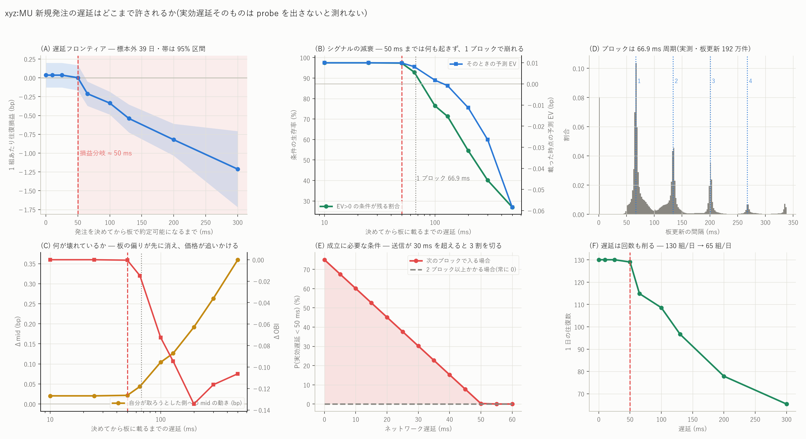

# xyz:MU — 新規発注の実効遅延はどこまで許されるか(probe 前に決められること)

図: `xyz_MU_lfrontier.png`



---

## 0. 先に、できたこととできないこと

**実効遅延 L_effective = t3 − t0 そのものは、自分の注文を出さないと測れない。**
これは過去データの解析ではなく、**資金のある口座で取引所へ注文を送る操作**である。
この環境には取引用の鍵が無く(`~/.hlpipe.env` は AWS と Fil One のみ)、取引所の
クライアント(`hyperliquid-python-sdk` / `websockets` / `eth-account`)も入っていない。
**注文を出す操作は費用が発生し市場に触れるので、私の判断では実行しない。**

そのかわり、**「いくつなら成立するのか」は過去データだけで確定できる**ので先に出した。
これで probe を出す前に、測るべき数が 1 つに絞れる。

| 問い | 答え | 出所 |
|---|---|---|
| 戦略が損益分岐になる遅延は | **≈ 50 ms** | 在庫シミュレータを遅延ごとに回した(標本外 39 日) |
| 50 ms より内側で何が起きるか | **何も起きない**(条件の生存率 97.3%) | signal decay |
| どこで崩れるか | **1 ブロック(66.9 ms)** で生存率 92.9% → 100 ms で 76.5% | signal decay |
| ブロック周期は | **66.9 ms**(板更新 192 万件の実測) | bbo の間隔 |
| 50 ms を切る条件は | **次のブロックで入り、かつ送信遅延が 30 ms 未満**。2 ブロックかかると**確率 0** | 算術 |

**したがって probe で測るべきは「平均何 ms か」ではなく、
`P(次のブロックに入る)` と `送信遅延 d の分布` の 2 つだけである。**

---

## 1. 遅延フロンティア(図 A)

在庫を持つメイカー(在庫上限 1・BBO 追随・時間切れなし・往復損益で学習した入口の門)を、
**発注が板に載るまでの遅延 L を変えて**回した。学習は前 59 日、評価は後 39 日。

| L (ms) | 往復/日 | 1 組あたり往復損益 | t |
|---:|---:|---:|---:|
| 0 | 130 | **+0.036 ± 0.083** | +0.43 |
| 10 | 130 | +0.036 ± 0.083 | +0.43 |
| 25 | 130 | +0.036 ± 0.083 | +0.43 |
| **50** | 129 | **+0.002 ± 0.086** | **+0.03** |
| 65 | 115 | **−0.211 ± 0.082** | −2.56 |
| 100 | 109 | −0.336 ± 0.077 | −4.33 |
| 130 | 97 | −0.540 ± 0.095 | −5.70 |
| 200 | 78 | −0.822 ± 0.108 | −7.60 |
| 300 | 65 | −1.213 ± 0.258 | −4.71 |

**損益分岐は 50 ms。**そこから 1 ブロック(66.9 ms)ぶん遅れるだけで
t = −2.56 の有意な赤字になる。

遅延は**単価だけでなく回数も削る**(図 F)。130 組/日 → 65 組/日 と半減する。
遅い注文は「板に載る前に気配が動いて出し直し」になり、そもそも並べない。

前報 `mu_inventory_mm_report.md` で「130 ms を入れると −0.540」と書いた点は
この表の 130 ms 行そのもので、整合している。

---

## 2. シグナルの減衰 — probe より先に効く測定(図 B・C)

**本当に知りたいのは ms ではなく、決めた時点の条件が載る時点まで残るかである。**
これは過去データだけで完全に測れる。門を通った時点 t0(評価期間で 562,624 件)に対し、
t0+L 時点の状態で同じ規則を評価し直した。

| L (ms) | **EV>0 の条件が残る割合** | 載った時点の予測 EV | 自分の側への mid の動き | ΔOBI |
|---:|---:|---:|---:|---:|
| 10 | **97.5%** | +0.0100 | +0.020 bp | −0.000 |
| 25 | 97.5% | +0.0100 | +0.020 | −0.000 |
| 50 | **97.3%** | +0.0099 | +0.022 | −0.000 |
| **65** | **92.9%** | +0.0082 | +0.044 | −0.015 |
| 100 | **76.5%** | +0.0018 | +0.104 | −0.072 |
| 130 | 71.3% | **−0.0008** | +0.127 | −0.095 |
| 200 | 54.6% | −0.0113 | +0.192 | −0.134 |
| 300 | 40.1% | −0.0264 | +0.263 | −0.117 |
| 500 | 27.0% | −0.0583 | +0.360 | −0.106 |

判断時の EV は平均 +0.0110 bp。**50 ms までは 97.3% がそのまま残り、EV もほぼ動かない。**
これは既報 `mu_latency_report.md` の「50 ms より内側では板が 99.6〜100% 同一」と
同じことを別の角度から見ている — **板が動いていないのだから条件も壊れない。**

**崩れ方の順序**(図 C)も見える。まず **OBI(板の偏り)が消え**、
そのあとから **mid が自分の取ろうとした側へ動く**。つまり
「厚かった板が引かれ、そのあと価格がついてくる」という順で、
自分の気配は取り残される。

**そして平均の予測 EV がゼロを切るのは 130 ms**。図 A の損益分岐 50 ms との差は、
生存率が下がると「条件が壊れた発注も出してしまう」ぶんの損が乗るためで、
2 つの測り方は別物である(片方は判断の質、もう片方は実現損益)。

---

## 3. ブロックの算術 — 50 ms を切るのに何が要るか(図 D・E)

板更新の間隔を 192 万件で実測すると、**66.9 ms とその整数倍**にきれいに山が立つ
(64〜68 ms が最頻、次いで 133〜134 ms、200 ms 付近)。

発注が**次のブロックに入る**なら、実効遅延は

    L_visible ≈ 66.9 − φ + d      (φ = 直前のブロックからの経過、d = 送信遅延)

φ が一様なら **P(L < 50 ms) = (50 − d) / 66.9**。

| 送信遅延 d | 次のブロックで入る場合の P(L < 50 ms) |
|---:|---:|
| 0 ms | 75% |
| 10 ms | 60% |
| 20 ms | 45% |
| **30 ms** | **30%** |
| 40 ms | 15% |
| 50 ms 以上 | 0% |

**2 ブロックかかる場合は L ≥ 66.9 ms なので、確率は 0 である。**

したがって成立の条件は 2 つに尽きる。

1. **ほぼ必ず次のブロックに入ること**(2 ブロック目に落ちた注文は全部無駄)
2. **送信遅延が 30 ms を切っていること**(それを超えると 3 割未満しか間に合わない)

---

## 4. probe の設計(器は用意した・実行はしていない)

`scripts/probe_latency.py` に器を置いた。**既定では 1 件も注文を出さない。**

### 測る 4 つ

    L_decision = t1 − t0   シグナル評価完了 → 送信開始(自分側。実測で中央 33 µs)
    L_ack      = t2 − t1   送信 → 取引所の受付確認(private stream)
    L_visible  = t3 − t1   送信 → 公開板に自分の注文が出現(public stream)
    L_effective ≈ t3 − t0  ★ 本命

t3 は「板に入っていることを自分が確認できた時刻」なので、matching engine 上で
約定可能になった時刻の**保守的な上限**として扱う。t2 と t3 を独立な 2 経路で取る。

### 安全装置(実装済み)

- **`--live` と `--i-understand-this-sends-real-orders` の両方が無ければ送信しない**
- post-only(ALO)のみ。テイクはしない
- 既定は最良から 2 ティック外・最小数量・1 件ごとに 2 秒あける・1 秒で必ず取り消す
- `--max-notional-usd` と `--max-orders` の上限
- `--depth 0`(BBO での測定)は明示したときだけ

### 記録する列(指示された 24 項目)

`probe_id, decision_ns, send_ns, ack_ns, first_private_seen_ns,
first_public_book_seen_ns, previous_block_ns, next_block_ns, side, price, size,
bbo_at_decision, bbo_at_visible, obi_at_decision, obi_at_visible,
ofi_at_decision, ofi_at_visible, pred_ev_at_decision, pred_ev_at_visible,
filled_before_cancel, cancel_send_ns, cancel_effective_ns` + regime, note

**block phase φ を必ず一緒に取る。**平均だけでは
「ネットワークが遅いのか、ブロック待ちなのか」を分けられない。

### 実行に足りないもの

1. `uv add hyperliquid-python-sdk websockets eth-account`
2. **取引権限のある API wallet と、資金のある口座**
3. `Exchange.book / place / cancel` を SDK 呼び出しで埋める(署名は SDK が扱う)
4. **人間の明示的な実行許可**

### ★ 実行前に、probe の設計を 1 点変えることを勧める

指示では「まず安全な深さ(最良から 1〜3 ティック外)でインフラ遅延を測り、
次に BBO で execution-specific を測る」となっている。ここは順序を保ちつつ、
**深い側の probe は `L_visible` の測定にしか使えない**ことを明記しておきたい。
§3 の算術が示すとおり決め手は「次のブロックに入るか」なので、
**深さを変えても block inclusion の測定には影響しないはず**であり、
だとすれば **BBO での probe は最小限で足りる**(市場への影響も小さくできる)。
逆に、深さで inclusion 率が変わるなら、それ自体が重要な発見になる。

---

## 5. probe が決着させること(そしてさせないこと)

**決着させる**

- 送信遅延 d の分布(p50 / p90 / p99)
- **次のブロックに入る割合**(1 ブロック / 2 ブロック / 3 ブロック以上)
- したがって **P(L_effective < 50 ms)**、すなわち §1 のフロンティアのどこに乗るか
- 時間帯・板の活況・スプレッド別の内訳(Rare Maker が出やすい状態と遅延が悪い状態が
  重なっていないか)

**決着させない**

- t3 は上限であって、matching engine 上で約定可能になった正確な時刻ではない
- 自分の注文が板に与える影響(probe は最小数量なので本番の数量では変わる)
- §1 のフロンティア自体の不確かさ。L=0 の点推定 +0.036 ± 0.083 は
  そもそもゼロと区別できておらず、**遅延が 0 でも勝てるとは言っていない**

---

## 6. 限界

1. **§1 は入口の門を L=0 で学習したモデルを、遅延ありの実行に当てている。**
   遅延を前提に学習し直せば少し改善しうるが、§2 のとおり 50 ms 以内では
   状態がほぼ動かないので、改善の余地は小さいと見ている。
2. **手仕舞い側の遅延を入れていない。**入れれば悪化方向。
3. **φ が一様という仮定**(§3)。ブロック生成が正確に周期的なら妥当だが、
   実際の間隔は 64〜68 ms に散っており、厳密には probe で確かめる話である。
4. **50 ms という損益分岐は MU・この期間・この方策に固有**。
   スプレッドの広い銘柄なら緩む(`mu_inventory_mm_report.md` §1)。
5. 遅延ごとの 9 通りを比較しているが、フロンティアは単調で、
   探索で作った結論ではない。

---

## 7. 再現手順

```bash
for L in 0.010 0.025 0.050 0.065 0.100 0.130 0.200 0.300; do \
  uv run python scripts/build_inventory.py --coin xyz:MU --qmax 1 --lat $L \
    --gate data/entrygate_xyz_MU_q1.parquet; done
uv run python scripts/build_decay.py --coin xyz:MU        # シグナルの減衰
uv run python scripts/build_lfrontier.py --coin xyz:MU    # フロンティアとブロック算術
uv run python scripts/plot_lfrontier.py --coin xyz:MU     # 図
uv run python scripts/probe_latency.py --coin xyz:MU --n 20   # ★ 送信しない
```

生成物: `data/lfrontier_xyz_MU.csv`(遅延ごとの EV)/ `decay_xyz_MU.csv`(減衰)/
`lfrontier_block_xyz_MU.csv`(ブロック算術)/ `entrygate_model_xyz_MU_q1.json`(係数)。
