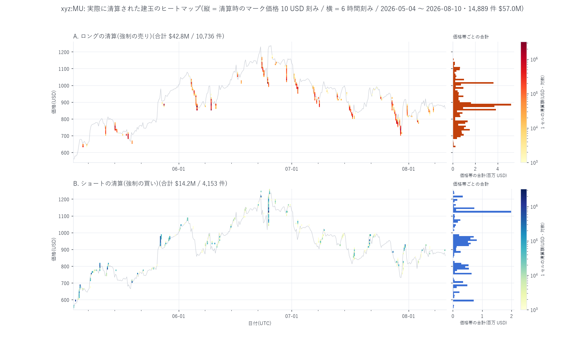
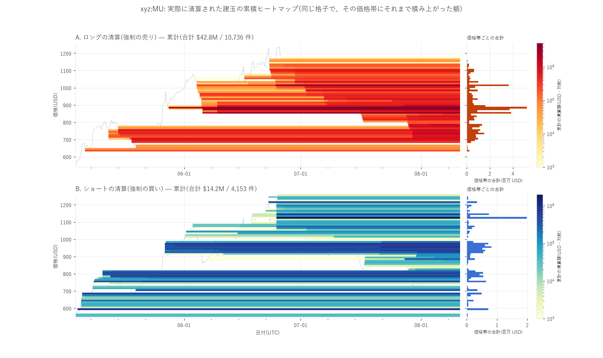
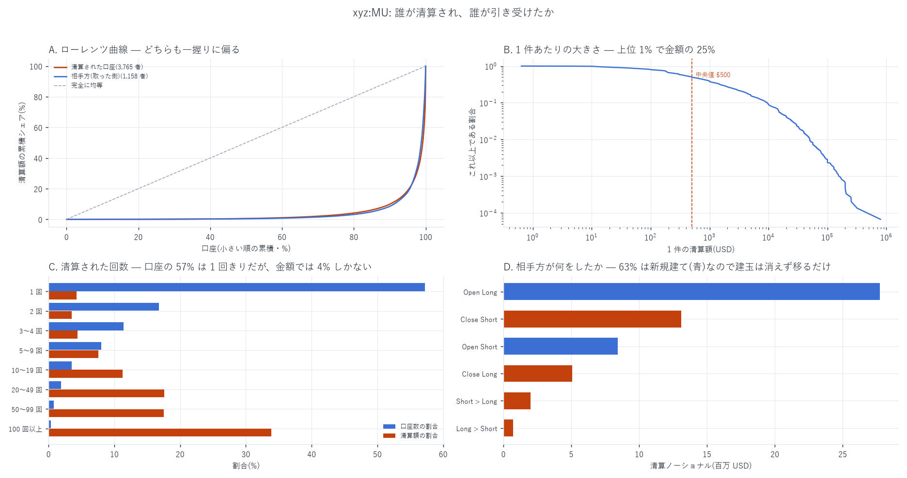
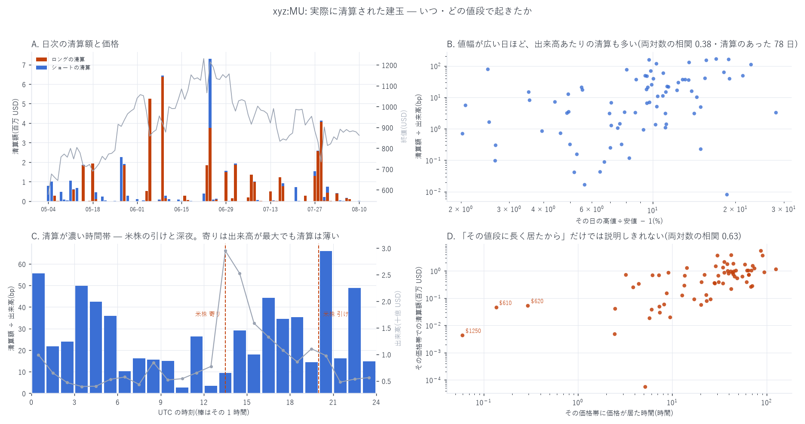
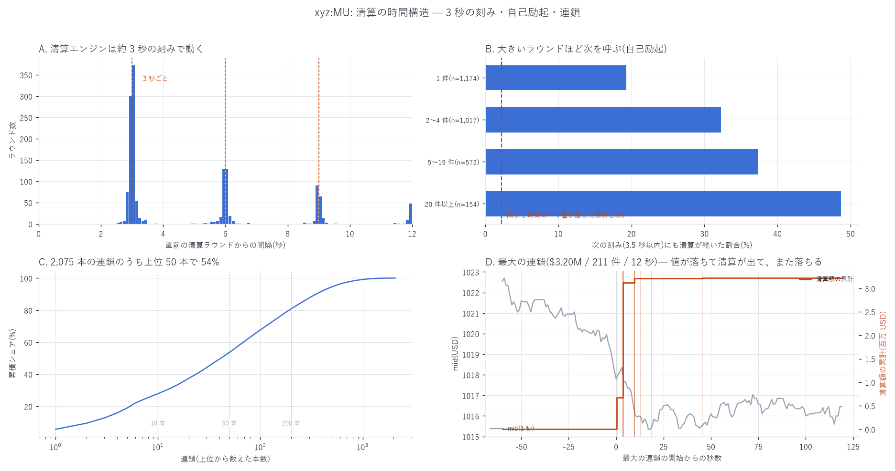
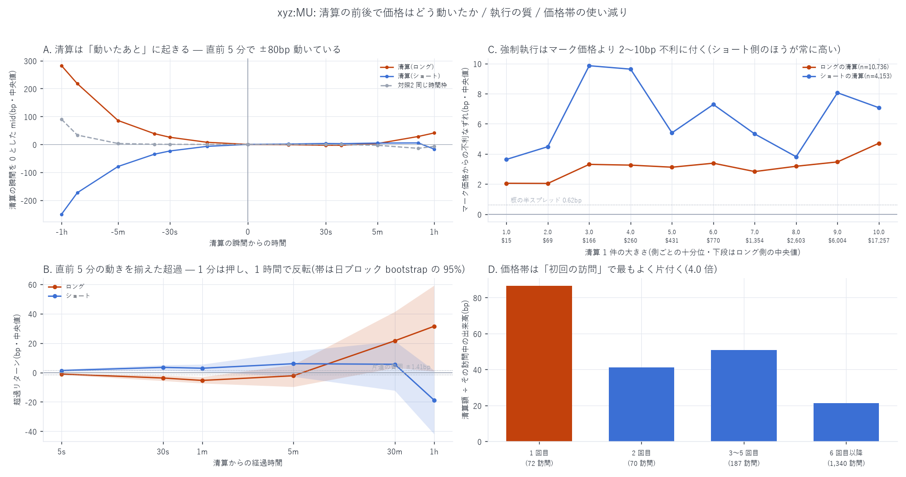

# 実際に清算された建玉のヒートマップ

[← `xyz:MU` の索引](README.md) / [Hyperliquid の分析](../README.md) / [ホーム](../../../README.md)

**何を測ったか** — `xyz:MU` の 99 日(2026-05-04 〜 08-10)で **実際に強制決済された建玉**を
1 件残らず取り出し、「いつ・どの値段で・誰の・いくらが」消えたかを格子に落とした。

**時間契約** — 本レポートは第 1〜8 節が記述統計で、説明変数と目的変数の区別は無い。
第 9 節だけが時間の向きを持つ量を扱う。そこでは説明する側を**清算が起きた時刻 τ まで**、
説明される側を**τ より後**に限り、`join_asof` はすべて backward、`shift(-k)` は目的変数にしか使っていない。

**推定したのではない** — 取引所が公開している約定テープの `liquidation` / `liquidatedUser` /
`liquidationMarkPx` を読んでいるので、レバレッジ分布の仮定も、建玉の推定も、減衰の仮定も無い。
CEX 向けに出回っている「清算ヒートマップ」は出来高とレバレッジ分布の**仮定**から
清算価格を推定したものだが、本レポートは**起きた事実**だけを置いている。

---

## 先に結論

| 指標 | 値 |
|---|---|
| 清算イベント | **14,889 件**(1 件 = 1 約定 = 板の 1 回のマッチ) |
| 清算されたノーショナル | **\$57.00M**(65,317 枚) |
| 出来高に対する比 | **0.262%**(片側出来高 \$21.76B) |
| 向きの内訳 | ロングの清算(強制の売り) \$42.82M / 75.1%、ショートの清算(強制の買い) \$14.18M / 24.9% |
| 清算された口座 | **3,765** / 引き受けた相手方 **1,158** |
| 1 件の大きさ | 中央値 \$500、99% 点 \$50.0k、最大 \$795,949 |
| 実際に建玉(OI)が減った分 | 清算枚数の **35.8%** だけ。残りは相手方が新規に建てたので**移っただけ** |
| 清算された側の実現損益 | **−\$4.876M**(1 件中央値 −\$33.5、ノーショナル比 −5.60%) |
| 強制執行の上乗せ費用 | スリッページ **\$58.5k** + 手数料 **\$4.50k** = 約 **\$63k**(実現損の 1.3%) |
| 清算方式 | **100% が `market`**。`backstop`(保険基金の引き取り)は 1 件も無い |

**6 つの発見**

1. **時間の集中が極端。** 清算があったのは 2,376 時間中 **300 時間**だけ。
   上位 1 時間で全体の **8.5%**、上位 24 時間で **63.6%**、上位 100 時間で **95.5%**。
2. **清算エンジンは約 3 秒の刻みで動く。** 清算の **80.4%** は同じミリ秒に起き(ラウンド)、
   ラウンドどうしの間隔は**最小 2.558 秒**、24.9% が 2.9〜3.2 秒に収まる。3 秒・6 秒・9 秒に鋭い峰が立つ。
3. **自己励起がある。** あるラウンドの次の刻み(3.5 秒以内)にも清算が続く確率は **28.9%**。
   同じ 1 時間の中で置き直した帰無では **2.25%** なので **13 倍**。20 件以上のラウンドなら **48.7%**。
   **2 ラウンド以上続いた連鎖 504 本は、100% が 9 割以上同じ向き**だった。
4. **清算は「動いたあと」に起きるが、動かしもする。** 直前 5 分で中央値 ±80bp 動いている。
   直前の動きを揃えたうえで比べると、清算の**後 1 分**にさらに **−5.40bp**(ロング清算)/
   **+2.90bp**(ショート清算)押し、**1 時間では反転**する(ロング +31.4bp)。
5. **清算が濃いのは米株の引け(20 時 UTC)と深夜。** 出来高が最大の寄り(13 時 UTC)は
   出来高比 9.5bp しかないのに、20 時 UTC は **66.0bp**、10 時 UTC は **2.6bp** — **26 倍**の開き。
6. **価格帯は「初回の訪問」で最もよく片付く。** 初めてその値段に来たときの清算は
   出来高比 **86.5bp** [47.2, 146.2]、6 回目以降は **21.4bp** [15.8, 27.8] で **4.0 倍**。

---

## 1. ヒートマップ

縦軸は **`liquidationMarkPx`** — 清算が起きた瞬間のマーク価格である。これはその口座の建玉が
実際に維持証拠金を割った価格そのもので、推定した清算ラダーではない。色は 1 セルに入った
清算ノーショナル(USD)を**対数**で塗る(上位 1 時間が全体の 8.5% を占めるので、線形だと他が全部つぶれる)。



読み取れること。

- **ロングの清算は価格の谷、ショートの清算は山に貼りつく。** 灰色の線(約定価格)の
  **下側**に橙のセルが、**上側**に青のセルが並ぶ。清算は値段が動いた先で起きる。
- **空白が圧倒的に多い。** 6 時間 × \$10 の格子 28,908 セルのうち、埋まっているのは
  ロング 248・ショート 244 セルだけ(0.86%)。「清算は薄く広く起きる」ものではない。
- **価格帯の山は 2 つ。** ロングは **\$850〜890** の 5 帯に \$15.28M(全体の 26.8%)、次いで **\$1,010** に \$3.62M。
  ショートは **\$1,120** に \$1.99M。\$850〜890 は標本の最後の 1 か月の値位置で、
  \$1,010 は 6 月の下げが止まった水準である。



累積で見ると、価格帯ごとの「これまでにいくら焼けたか」が水平の帯になる。
**帯は価格が通過した時点で一気に立ち上がり、その後は伸びない。**
これが第 8 節の「初回の訪問で片付く」に対応する。

### 「その値段に長く居たから」ではないか

価格帯ごとの清算額は、単にその価格帯に価格が長く居ただけかもしれない。滞在時間
(最終約定価格で補間し、1 時間で頭打ち)で割って確かめた。

| 価格帯 | 清算額 | 滞在時間 | 1 時間あたり | 出来高比 |
|---|---:|---:|---:|---:|
| \$1,010 | \$3.67M | 30.1 h | **\$122k/h** | 95.2 bp |
| \$850 | \$3.86M | 42.0 h | \$91.9k/h | 72.9 bp |
| \$880 | \$5.47M | 86.3 h | \$63.4k/h | 60.7 bp |
| \$1,120 | \$2.16M | 35.4 h | \$61.0k/h | 76.9 bp |
| \$890 | \$1.73M | 58.7 h | \$29.5k/h | 21.4 bp |

$`\log`$(清算額) と $`\log`$(滞在時間) の相関は **0.52**(清算のあった 69 帯に限れば 0.63)。
**滞在時間だけでは説明しきれない** — 同じくらい居た帯でも 1 時間あたりの清算額は 20 倍違う。

---

## 2. 数え方 — 二重計上をしないための定義

1 つの清算約定は**必ず 2 行**になる。清算された口座の行と、その相手方の行である。
両方に `liquidation = true` が立つので、**真偽だけで数えると 2 倍になる**。

清算された建玉は `user == liquidatedUser` の行の `sz` で一意に決まる。実測で:

| 清算された側 | 件数 | 相手方 | 件数 |
|---|---:|---|---:|
| `Close Long` / `side=A` / `crossed=true` | 10,736 | `Open Long` | 7,313 |
| `Close Short` / `side=B` / `crossed=true` | 4,153 | `Close Short` | 3,080 |
| | | `Open Short` | 2,258 |
| | | `Close Long` | 1,765 |
| | | `Short > Long` / `Long > Short` | 473 |

清算された側は **100% がテイカー**(`crossed=true`)で、`Close Long` か `Close Short` しか出ない。
清算エンジンがその口座の代わりに成行を出し、板に並んでいた誰かが受ける、という形である。

### 清算は建玉を消すとは限らない

**相手方が新規に建てれば、建玉は消えずに移るだけ**である。

```math
\Delta \text{OI} = \begin{cases}
0 & \text{相手方が } \texttt{Open Long} \text{ / } \texttt{Open Short}\\
-sz & \text{相手方が } \texttt{Close Short} \text{ / } \texttt{Close Long}
\end{cases}
```

金額で見ると **63% は新規建て**だった。清算された 65,317 枚のうち、実際に OI を減らしたのは
**23,411 枚(35.8%)**にとどまる。**「清算された OI」と「消えた OI」は別物**であり、
本レポートで「清算された建玉」と言うときは前者を指す。



---

## 3. データと、`liquidation` 列の意味を決着させた検証

### 3.1 どこから取ったか

`WORK_BUCKET` の `fills` 層(Artemis の `raw/node_fills` を銘柄と日で切ったもの)から
以下の列を落とし、`liquidation = true` または `liquidatedUser` が空でない行だけを残した。

```
ts user px sz side startPosition dir crossed tid oid closedPnl fee
liquidation liquidatedUser liquidationMethod liquidationMarkPx
```

`fetch_fills.py` が落としていた列には `liquidation`(真偽)しか無く、**どちらの口座が
清算されたのかが判らない**ので、本レポート用に `fetch_liq.py` を新たに書いた。

取得 29,808 行のうち **30 行が完全重複**(同じ `ts`・`user`・`oid`・`sz`・`px`・`startPosition`・
`closedPnl`)だった。`startPosition` まで一致する 2 行は原理的にありえないので、
時間ファイルの境界でできた記録の重複と判断して除去した(2026-05-12 15:47〜15:48 の 15 約定)。
除去後 **29,778 行 = 14,889 約定 × 2 行**で、`tid` あたりちょうど 2 行、
`liquidatedUser` は `tid` 内で一意、という 3 つの assert を通している。

### 3.2 ★`liquidation` 列が null の行は「清算ではない」のか

これは結論を 4 倍動かしうる問題だったので、決着させた。

全 22,349,510 行のうち `liquidation` は **true 29,808 / false 6,928,130 / null 15,391,572** に分かれる。
もし null が「記録が落ちているだけ」なら、null の領域にも同じ率(0.428%)で清算があったはずで、
**約 33,000 件を見落としていた**ことになる。

まず、null と false の行は統計的に見分けがつかない(テイカー比率 0.5000 対 0.5000、
`dir` の構成も小数第 3 位まで一致)。null と false は**同じ約定の 2 行に跨ることすらある**(3,567 tid)。
一方 **true は null とも false とも同じ `tid` に混ざらない**(0 件)。

決定的だったのは**銘柄をまたいだ検査**である。列の有無が「その変換単位に清算が 1 件でもあったか」で
決まるなら、**他の銘柄で清算が起きた瞬間には `xyz:MU` の列も存在しているはず**である。

| 検査 | 結果 | 対照(無作為な行) |
|---|---:|---:|
| `xyz:INTC` の清算 12,642 件の時刻で `xyz:MU` の列が存在した割合 | **100.00%** | 31.20% |
| `xyz:MU` の清算 17,510 件の時刻で `xyz:INTC` の列が存在した割合 | **99.65%** | 30.26% |

列の有無は**銘柄によらない変換単位ごとの性質**であり、清算が 1 件でもある単位では
必ず列が存在する。したがって **null の行に清算は隠れていない**。
99 日すべてで `liquidation = true` の件数と `liquidatedUser` が空でない件数は一致した(不一致 0 日)。

---

## 4. いつ起きるか



### 日次

清算があったのは **78 日 / 99 日**。上位 5 日:

| 日 | 清算額 | 件数 | 口座 | 日中値幅 | 出来高比 | 清算枚数 ÷ 平均 OI | うち OI を減らした分 |
|---|---:|---:|---:|---:|---:|---:|---:|
| 2026-06-24 | \$7.29M | 942 | 338 | 22.7% | 113 bp | 6.45% | 2.94% |
| 2026-06-09 | \$6.45M | 676 | 106 | 17.0% | **171 bp** | 8.05% | **4.28%** |
| 2026-06-05 | \$5.26M | 1,158 | 302 | 15.7% | 155 bp | **8.41%** | 2.11% |
| 2026-07-29 | \$4.13M | 1,037 | 380 | 21.2% | 49 bp | 3.49% | 1.26% |
| 2026-07-28 | \$2.60M | 632 | 290 | 15.5% | 40 bp | 2.97% | 0.62% |

2026-06-24 は**決算発表の日**([出来高の買い・売り内訳とニュース](mu_volume_side_news_report.md))で、
この日だけロング \$3.75M とショート \$3.54M がほぼ拮抗する。他の 4 日はほぼ片側だけである。

日次の中央値は 7.7 bp(出来高比)、最大 170.6 bp。$`\log`$(日次清算額) と日中値幅の相関は **0.671**、
日次リターンとの相関は **−0.072** — **値幅が効き、向きは効かない**。

### 時間帯(UTC)

| 時刻帯 | 出来高 | 清算額 | 出来高比 |
|---|---:|---:|---:|
| 20:00(米株の引け) | \$0.98B | \$6.44M | **66.0 bp** |
| 00:00 | \$0.99B | \$5.51M | 55.6 bp |
| 03:00 | \$0.40B | \$1.97M | 49.8 bp |
| 13:00(米株の寄りを含む) | **\$2.95B** | \$2.80M | 9.5 bp |
| 12:00 | \$0.77B | \$0.27M | 3.5 bp |
| 10:00 | \$0.54B | \$0.14M | **2.6 bp** |

**出来高が最大の時間帯が、清算強度は最小に近い。**
清算は「人が多いとき」ではなく「板が薄いとき」に起きる。

---

## 5. 清算エンジンの刻みと連鎖



### 3 秒の刻み

14,889 件の清算が乗っている相異なる時刻は **2,919 個**しかない。**80.4% の清算は
別の清算と同じミリ秒に起きている**(1 ラウンドあたり中央 2 件、最大 193 件)。

ラウンドどうしの間隔を見ると、**最小が 2.558 秒**で、2.9〜3.2 秒に 24.9% が集中し、
3 秒・6 秒・9 秒・12 秒に鋭い峰が立つ(図 A)。0.05 秒から 2.5 秒までの間隔は **1 件も無い**。
清算の判定が約 3 秒周期で回っていると読むのが自然である。

### 自己励起

| ラウンドの大きさ | n | 次の刻み(3.5 秒以内)にも続いた割合 |
|---|---:|---:|
| 1 件 | 1,174 | 19.3% |
| 2〜4 件 | 1,017 | 32.0% |
| 5〜19 件 | 573 | 37.4% |
| 20 件以上 | 154 | **48.7%** |
| **全体** | 2,918 | **28.9%** |
| 同じ 1 時間の中で一様に置き直した帰無(200 回) | | **2.25%** [1.78, 2.71] |

全体で **13 倍**、大きいラウンドほど次を呼ぶ。

3.5 秒で繋がるラウンドの列を「連鎖」と呼ぶと **2,075 本**あり、うち 1,571 本は 1 ラウンドで終わる。
最長は 8 ラウンド。金額では**上位 50 本の連鎖で全体の 53.7%** を占める。
最大の連鎖は **211 件 \$3.20M を 12 秒**で焼いた(2026-06-09、mid は 1,024 → 1,015 へ 88bp 下落)。

**2 ラウンド以上続いた 504 本の連鎖は、100% が 9 割以上同じ向きだった。**
さらに強く、**2,917 ラウンドのうち向きが混ざるラウンドは 0 個**である
(ロング 2,020・ショート 897・混在 0)。連鎖は「値が落ちて → ロングが焼けて → また落ちる」
という一方向の構造をしている。

---

## 6. 誰が清算され、誰が引き受けたか

| | 清算された側 | 相手方 |
|---|---:|---:|
| 口座数 | 3,765 | 1,158 |
| 上位 1 のシェア | 8.3% | 7.6% |
| 上位 10 のシェア | 33.1% | 40.9% |
| 上位 20 のシェア | 42.8% | 58.8% |
| 上位 100 のシェア | 70.9% | — |
| HHI | 0.0175(実効 57 口座) | 0.0242 |
| ジニ係数 | 0.927 | — |

**口座の 57.2%(2,154 者)は 1 回きりしか清算されていないが、その金額は全体の 4.2% にすぎない。**
逆に 100 回以上清算された 12 口座(全体の 0.32%)だけで金額の **33.8%** を占める。
清算の大半は「1 回で退場した個人」ではなく「何度も削られた大口」である。

最大の被清算口座 `L1` は **3 日(05-28 / 06-05 / 06-09)で 439 回・\$4.74M** 清算された。
向きは 100% ロング、マーク価格は \$857.6〜885.9 の狭い帯に収まり、実現損は **−\$269.6k**。
1 件の中央値は \$961 だが最大は **\$795,949** — 同じ建玉が細かく削られ続け、最後に大きく落ちた形である。

**住所は出さない。** 口座は清算額の降順に `L1, L2, …`(清算された側)/
`C1, C2, …`(相手方)という内部の通し番号だけで扱う(このリポジトリの既定)。

---

## 7. 強制執行の質 — いくら余分に払ったか

清算された側から見て**不利な向きを正**として、執行価格とマーク価格のずれを測った。

| | 中央値 | 平均 |
|---|---:|---:|
| ロングの清算(強制の売り) | **3.07 bp** | 4.55 bp |
| ショートの清算(強制の買い) | **6.17 bp** | 11.92 bp |
| 全体 | 3.63 bp | 6.61 bp |

板の半スプレッドは中央値で **0.62 bp**(スプレッド 1.245 bp)なので、
**強制執行は成行の最小費用の 5〜10 倍を払っている**。大きい清算ほど悪化し、
ロング側は十分位 1(中央 \$15)の 2.05 bp から十分位 10(中央 \$17,257)の 4.71 bp まで上がる。

金額に直すと **スリッページ \$58.5k + 手数料 \$4.50k = 約 \$63k**。
清算された口座の実現損 **−\$4.876M** に対して **1.3%** である。
つまり**「清算されたこと自体の上乗せ費用」は小さく、損の本体は建玉を持っていたこと**にある。

手数料率はテイカー(清算された側)**0.789 bp**、メイカー(相手方)**0.079 bp**
(6,078 行はリベートで負)。

---

## 8. 価格帯は「初回の訪問」で片付く

価格帯に価格が入るたびを「訪問」と数え(1 時間以上離れたら別の訪問)、
何回目の訪問かで清算の強さが変わるかを見た。括弧は**価格帯を入れ替えた 1,000 回の bootstrap**。

| 訪問 | 回数 | 滞在 | 清算額 | 出来高比 |
|---|---:|---:|---:|---:|
| 1 回目 | 72 | 93.5 h | \$5.58M | **86.5 bp** [47.2, 146.2] |
| 2 回目 | 70 | 119.9 h | \$2.63M | 41.2 bp [11.8, 84.8] |
| 3〜5 回目 | 187 | 289.8 h | \$7.93M | 50.9 bp [15.3, 96.5] |
| 6 回目以降 | 1,340 | 1,871.5 h | \$40.45M | **21.4 bp** [15.8, 27.8] |

初回と 6 回目以降の区間は重ならない。**初めてその値段に来たときが最も焼ける**(4.0 倍)。
溜まっていた建玉が一度掃かれると、同じ値段に戻っても同じようには焼けない。

ただし**初回の訪問は定義上「新高値・新安値をつけた瞬間」**であり、
ボラティリティが高い局面と重なる。出来高で割ることで一部は統制しているが、
「値段が特別」なのか「そのとき相場が荒れていた」だけなのかは、この検定では分離できていない。

---

## 9. 清算の前後で価格はどう動いたか



**測り方** — 清算のラウンド時刻 $`\tau`$ について、1 秒格子の mid(板がクロスしている行は除外)で

```math
r_{\text{bwd}}(\Delta) = \log \frac{m_\tau}{m_{\tau-\Delta}}, \qquad
r_{\text{fwd}}(\Delta) = \log \frac{m_{\tau+\Delta}}{m_\tau}
```

を測る。$`\tau`$ は公開テープに載る時刻なので、前向きは**観測可能な情報に対する将来**である。
帰無対照は 3 つ置いた:(1) 標本期間の無作為な秒、(2) 同じ (日, 時) の枠から引いた秒、
(3) 時刻を +1 時間ずらしたプラセボ。

### 9.1 素の姿 — 清算は「動いたあと」に起きる

中央値(bp)。$`\tau`$ を 0 とした**相対価格**として読む(後ろ向きは符号を反転している)。

| | −1 時間 | −5 分 | −1 分 | **+1 分** | **+5 分** | +1 時間 |
|---|---:|---:|---:|---:|---:|---:|
| 清算(ロング) | **+281.9** | **+85.7** | **+38.6** | −3.04 | +3.08 | +40.9 |
| 清算(ショート) | **−249.9** | **−79.2** | **−35.2** | +2.73 | +4.80 | −16.5 |
| 対照1 無作為 | −2.0 | 0.00 | 0.00 | 0.00 | +0.12 | +2.2 |
| 対照2 同じ時間枠 | +89.9 | +3.25 | +0.52 | −0.64 | −3.26 | −7.1 |
| 対照3 プラセボ +1h | −20.8 | −3.32 | −0.67 | +0.23 | +3.55 | +5.9 |

**清算の直前 5 分で ±80bp 動いている。**

★ただし 1 時間前まで遡ると、**同じ (日, 時) の枠から引いた対照 2 にも +89.9bp ある**。
清算が起きる時間帯そのものが「大きく動いた時間帯」だからである。一方 5 分前では
その対照は +3.25bp しかない(清算は +85.7bp)。**清算に固有の動きは直前の数分に集中していて、
1 時間スケールで見える差の 3 分の 1 は「荒れた時間帯だった」だけで説明がつく。**
これが次節で直前 5 分を統制する理由である。

### 9.2 直前の動きを揃えると何が残るか

「価格が既に動いていたから清算が出た」分を差し引くため、直前 5 分の動き $`r_{\text{bwd}}(300)`$ を
20 の帯(±3/8/15/25/35/50/70/100/150bp)に切り、**同じ帯にある非清算の秒**
(清算の前後 5 分を除いた 811 万秒)の中央値を引いた。

| 経過 | ロングの清算 | ショートの清算 |
|---|---|---|
| 5 秒 | **−1.05** [−1.56, −0.63] | **+1.32** [+0.72, +2.26] |
| 30 秒 | **−3.75** [−5.66, −1.96] | **+3.50** [+1.26, +5.09] |
| 1 分 | **−5.40** [−7.32, −2.98] | **+2.90** [+0.73, +5.55] |
| 5 分 | −2.23 [−9.72, +5.27] | +5.98 [−2.81, +14.21] |
| 30 分 | **+21.6** [+3.2, +41.4] | +5.59 [−12.3, +21.3] |
| 1 時間 | **+31.4** [+0.8, +59.2] | −18.8 [−41.8, +1.4] |

区間は**日単位のブロック bootstrap**(1,000 回)の 95%。検定は 6 ホライズン × 2 方向 = **12 通り**。
Bonferroni をかけるなら 95% ではなく 99.6% 区間が要るが、5〜60 秒の 6 つは
いずれも 0 から十分に離れている。

**読み方** — 清算は自分が押した向きに **30〜60 秒だけ価格を押し**、
**30 分〜1 時間では押し戻される**(ロング清算の後は +21〜31bp 戻る)。
一時的インパクトと反転という、教科書どおりの形である。

**標本を前半・後半に割っても符号は保たれる**(30 秒・60 秒はロング・ショートとも両半期で同符号)。
一方 5 分のショート側は前半 +8.49 → 後半 −0.67 と入れ替わるので、
**頑健なのは 30〜60 秒の部分だけ**である。

### 9.3 これは「儲かる」という意味ではない

片道の費用は半スプレッド 0.62 bp + テイカー手数料 0.789 bp = **1.41 bp**、往復 **2.83 bp**。
1 分の超過はロング清算で 5.40 bp なので、**1 回あたりでは往復費用を上回る**。
しかし次の 4 つを一切扱っていない。

1. **遅延。** テープを見てから発注するまでの遅れ。この銘柄のブロックは 65 ms 周期で、
   次の板更新までの待ちは中央値 185 ms([約定 δ ms 前の標本外 AUC](mu_latency_report.md))。
   5 秒の超過は 1.05 bp しかなく、費用に届かない。
2. **自分の執行の影響。** 清算が薄い板を叩いた直後に同じ方向へ入るので、
   さらに悪い値段を踏む。
3. **中央値で測っている。** 平均や分散は見ていない。総額での採算は別途要る。
4. **1 銘柄・99 日・2,917 ラウンド**での 1 回の検定である。

**執行の検証はしていない。** 本節の主張は「情報の順序」までである。

---

## 10. 限界 — 何を言っていないか

1. **マーク価格は板の mid ではない。** `liquidationMarkPx` は取引所が決めるマーク価格で、
   オラクル由来の成分を含む。縦軸の価格帯は「板の値段」ではなく「清算判定に使われた値段」である。
2. **`backstop` 清算が 1 件も無い。** この銘柄・この期間では保険基金の引き取りが発生していない。
   したがって「清算が板で吸収しきれなかったとき何が起きるか」は本レポートでは観測できていない。
3. **1 秒格子で測っている。** 第 9 節の前後リターンは 1 秒粒度で、ミリ秒の因果順序は主張しない。
   `fills` の時刻はミリ秒精度で、板イベント(ns)より最大 ~1 ms 早い可能性がある。
4. **2026-08-10 の板が無い。** `bbo` は 98 日分しかないため、この日の清算 2 件は mid が引けていない。
5. **口座は住所単位。** 同一人物が複数の住所を使っていれば集中度は過小評価になる。
   相手方 1,158 のうち上位 20 で 58.8% を占めるが、これが何者かは判定していない。
6. **初回訪問の効果とボラティリティを分離していない**(第 8 節末に記載)。
7. **他銘柄との比較をしていない。** `xyz:INTC` など残り 5 銘柄にも同じ処理は適用できるが、
   本レポートは `xyz:MU` だけである。
8. **`hl-liq` の清算ラダーとは別物。** 手元の `hl-liq` が出す清算ヒートマップは
   **いま生きている口座の建玉から先の清算価格を予測**したもので、対象期間も 2026-09 である。
   本レポートは**過去に実際に起きた清算**を並べたもので、両者は比較できない。

---

## 11. 再現手順

```bash
uv run python scripts/inventory_s3.py --refresh --coin xyz:MU   # 既にあれば不要
uv run python scripts/fetch_liq.py       --coin xyz:MU          # 清算行だけを取る
uv run python scripts/fetch_fills.py     --coin xyz:MU          # 出来高の分母(既にあれば不要)
uv run python scripts/build_liq.py       --coin xyz:MU
uv run python scripts/build_liq_extra.py --coin xyz:MU
uv run python scripts/build_liq_impact.py --coin xyz:MU
uv run python scripts/plot_liqheat.py    --coin xyz:MU
uv run python scripts/plot_liq.py        --coin xyz:MU
```

`build_liq_impact.py` は `data/bbo_xyz_MU.parquet`(`fetch_bbo.py`)と
`data/oi_series_xyz_MU.parquet`(`build_oi_volume.py`)を使う。

---

リポジトリ全体の目次は [../../../README.md](../../../README.md) にあります。
