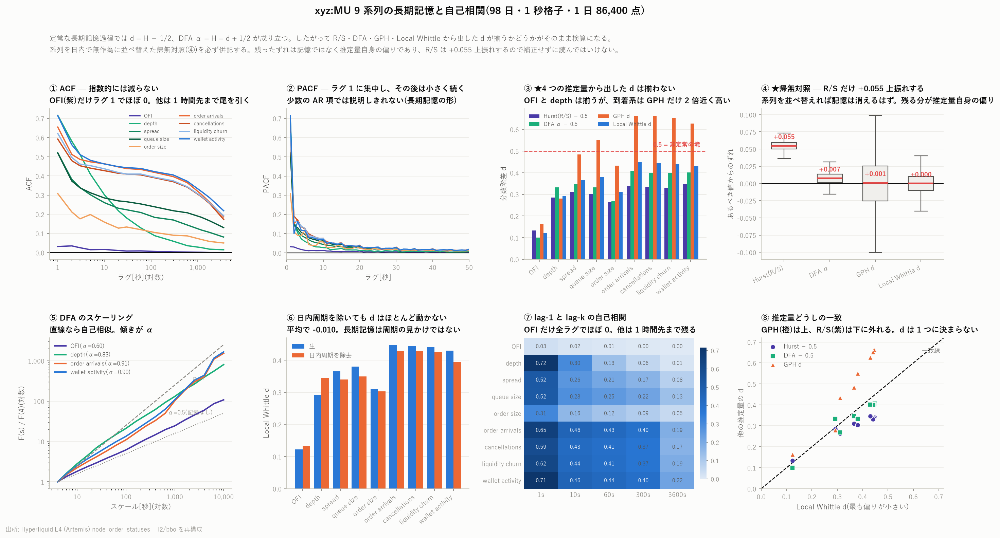

# xyz:MU 9 系列の長期記憶と自己相関(long-memory / autocorrelation)

[← xyz:MU 分析索引](README.md)

板と注文フローの 9 つの系列を 1 秒格子に載せ、自己相関と長期記憶を
8 つの推定量で測る。標本は 2026 年 5 月 4 日から 8 月 9 日の 98 日、
**1 日 86,400 点 × 9 系列 × 98 日**。

再現: `scripts/fetch_l1.py` → `scripts/fetch_l1_extra.py` →
`scripts/build_longmem.py` → `scripts/plot_longmem.py`



---

## 1. 結論

数値は**日ごとの値の中央値**である。分数階差のパラメータ $`d`$ は
0 なら記憶なし、0.5 以上なら非定常寄りを意味する。

| 系列 | ρ(1) | ρ(60) | ρ(3600) | **d(Local Whittle)** | 4 推定量のばらつき |
|---|---:|---:|---:|---:|---:|
| **OFI** | **0.032** | 0.009 | 0.001 | **0.123** | 0.022 |
| depth | 0.716 | 0.129 | 0.015 | 0.293 | 0.021 |
| spread | 0.521 | 0.209 | 0.081 | 0.365 | 0.066 |
| queue size | 0.519 | 0.254 | 0.130 | 0.380 | 0.096 |
| order size | 0.308 | 0.120 | 0.050 | 0.310 | 0.068 |
| order arrivals | 0.655 | 0.439 | 0.218 | 0.448 | 0.121 |
| cancellations | 0.592 | 0.417 | 0.204 | 0.445 | 0.123 |
| liquidity churn | 0.622 | 0.428 | 0.211 | 0.440 | 0.120 |
| wallet activity | 0.715 | 0.439 | 0.218 | 0.430 | 0.105 |

読みどころは 4 つある。

1. **★推定量そのものに偏りがある。** 系列を日内で無作為に並べ替えた帰無対照で、
   **R/S 法の Hurst だけ +0.055 上振れする**(DFA +0.007、GPH +0.001、
   Local Whittle ±0.000)。**補正せずに H = 0.65 を「長期記憶」と読んではいけない。**
2. **★d は 1 つに決まらない。** 4 つの推定量から出した d は、OFI と depth では
   よく揃う(ばらつき 0.02)が、到着系では **GPH だけ 2 倍近く高い**
   (order arrivals で GPH 0.662 対 Local Whittle 0.448)。
   **「この系列の d は◯◯」と 1 つの値で書くのは誤り**である。
3. **OFI だけ性質が違う。** ρ(1) が 0.032 とほぼ 0 なのに d は 0.123 ある。
   **1 秒先はまったく読めないのに、記憶は長く残る**という形である。
4. **日内周期は原因ではない。** 時刻ごとの平均を引いても d は平均 −0.010 しか
   動かない。ゆっくり減る自己相関は周期の見かけではない。

---

## 2. 対象の 9 系列

いずれも **1 秒格子**(1 日 86,400 点)。日をまたがず、日ごとに推定する。

| 系列 | 中身 | 出所 |
|---|---|---|
| **OFI** | 最良気配の流量の偏り(Cont, Kukanov and Stoikov 2014)の 1 秒合計 | bbo |
| **depth** | 最良気配の両側の数量(bid_sz + ask_sz)の 1 秒平均 | bbo |
| **spread** | 相対スプレッド[bp]の 1 秒平均 | bbo |
| **order arrivals** | 1 秒間の新規発注(`open`)の件数 | l1 |
| **cancellations** | 1 秒間の終端イベント(取消 + 残量 0 の `filled`)の件数 | l1 |
| **order size** | 1 秒間に出された注文の平均数量 | l1 |
| **liquidity churn** | 1 秒間に板へ入った数量 + 出ていった数量 | l1 |
| **queue size** | 最良気配に並んでいる**注文の本数** | l1 × bbo |
| **wallet activity** | 1 秒間に何かメッセージを出した口座の数 | l1 × l1user |

**depth は数量、queue size は本数**で別の量である。
queue size は[最良気配の入れ替わり](mu_bbo_turnover_report.md)と同じ区間の
交差から数えている。

---

## 3. 8 つの推定量と、その関係

| 推定量 | 中身 |
|---|---|
| **ACF** $`\rho(k)`$ | 自己相関。FFT でラグ 3,600 秒まで |
| **PACF** | 偏自己相関。Durbin-Levinson で 50 ラグまで |
| **lag-1 autocorrelation** | $`\rho(1)`$ |
| **lag-k autocorrelation** | $`\rho(10)`$ / $`\rho(60)`$ / $`\rho(300)`$ / $`\rho(3600)`$ |
| **Hurst exponent** H | R/S 法。スケール n に対する R/S の傾き |
| **DFA** α | 累積和の 1 次トレンドを除いた変動の傾き |
| **GPH d** | ペリオドグラムの低周波 $`m = n^{0.5} = 293`$ 本を対数回帰 |
| **fractional differencing d** | Local Whittle 推定量($`m = n^{0.65} = 1{,}585`$) |

### ★4 つは同じものを違う道から測っている

定常な長期記憶過程では次が成り立つ。

```math
d = H - \tfrac{1}{2}, \qquad \alpha_{DFA} = H = d + \tfrac{1}{2}
```

したがって **R/S・DFA・GPH・Local Whittle から出した d が揃うかどうかが、
そのまま検算になる。** 揃わなければ、長期記憶ではない何か(周期・トレンド・
外れ値・短期相関)を拾っている。

---

## 4. ★検算 — 帰無対照が推定量の偏りを暴いた

系列を**日内で無作為に並べ替える**と、記憶は完全に消えるので
H = 0.5 / α = 0.5 / d = 0 にならなければならない。実測は次のとおり。

| 推定量 | 中央値のずれ | p10 | p90 |
|---|---:|---:|---:|
| **Hurst(R/S)** | **+0.055** | +0.045 | +0.063 |
| DFA α | +0.007 | −0.004 | +0.019 |
| GPH d | +0.001 | −0.047 | +0.049 |
| **Local Whittle d** | **±0.000** | −0.015 | +0.015 |

**R/S 法の Hurst には +0.055 の上方バイアスがあり、しかも非常に安定している**
(p10〜p90 が +0.045〜+0.063)。これは有限標本での既知の性質で、
Anis-Lloyd 補正を当てるのが本来である。本レポートでは補正せずに出したうえで、
**H をそのまま読まないことを明記する。**

**Local Whittle が最も偏りが小さく、ばらつきも小さい**(±0.015)。
GPH は不偏だがばらつきが 3 倍大きい(±0.049)。
以下の議論では **Local Whittle を主**とし、他は対照として並べる。

---

## 5. 結果

### 5.1 自己相関は指数的に減らない

| 系列 | ρ(1) | ρ(10) | ρ(60) | ρ(300) | ρ(3600) |
|---|---:|---:|---:|---:|---:|
| OFI | 0.032 | 0.016 | 0.009 | 0.004 | 0.001 |
| depth | 0.716 | 0.302 | 0.129 | 0.059 | 0.015 |
| spread | 0.521 | 0.260 | 0.209 | 0.170 | 0.081 |
| queue size | 0.519 | 0.285 | 0.254 | 0.218 | 0.130 |
| order size | 0.308 | 0.159 | 0.120 | 0.091 | 0.050 |
| order arrivals | 0.655 | 0.463 | 0.439 | 0.405 | 0.218 |
| cancellations | 0.592 | 0.428 | 0.417 | 0.389 | 0.204 |
| liquidity churn | 0.622 | 0.443 | 0.428 | 0.398 | 0.211 |
| wallet activity | 0.715 | 0.462 | 0.439 | 0.405 | 0.218 |

**到着系(arrivals / cancellations / churn / wallet activity)は 1 時間先でも
0.20 以上残る。** 指数関数なら 1 秒で 0.65 なら 1 時間後は 0 である。
べき乗則的にしか減らない。

PACF はラグ 1 に集中し、その後も小さな値が続く(図②)。
**少数の AR 項では説明しきれない**形で、長期記憶の典型である。

### 5.2 ★OFI だけ性質が違う

OFI は ρ(1) = 0.032 とほぼ無相関なのに、d は 0.123 ある。
4 推定量のばらつきも 0.022 と小さく、**推定量が一致して「弱いが確かな長期記憶」を
示している。**

**1 秒先の OFI はまったく読めないのに、記憶は長く残る。**
これは短期相関と長期記憶が別物であることの実例で、
ρ(1) だけを見て「OFI に記憶は無い」と結論すると誤る。

### 5.3 ★d は 1 つに決まらない

| 系列 | H − 0.5 | DFA α − 0.5 | GPH d | **LW d** | ばらつき |
|---|---:|---:|---:|---:|---:|
| **OFI** | 0.134 | 0.101 | 0.162 | 0.123 | **0.022** |
| **depth** | 0.285 | 0.333 | 0.280 | 0.293 | **0.021** |
| spread | 0.310 | 0.346 | 0.485 | 0.365 | 0.066 |
| order size | 0.263 | 0.268 | 0.433 | 0.310 | 0.068 |
| queue size | 0.303 | 0.332 | 0.551 | 0.380 | 0.096 |
| wallet activity | 0.346 | 0.401 | 0.626 | 0.430 | 0.105 |
| liquidity churn | 0.331 | 0.400 | 0.651 | 0.440 | **0.120** |
| order arrivals | 0.339 | 0.407 | 0.662 | 0.448 | **0.121** |
| cancellations | 0.335 | 0.399 | 0.663 | 0.445 | **0.123** |

**OFI と depth では 4 つがよく揃う**(ばらつき 0.02)。
一方**到着系では GPH だけが突出して高く**、Local Whittle の 1.5 倍になる。
GPH は使う周波数が $`m = 293`$ 本と狭く、いちばん低い周波数の挙動に
引きずられやすい。第 4 節で見たとおり GPH のばらつき自体も大きい。

**「order arrivals の d は 0.66」と書くのも「0.45」と書くのも一面的である。**
推定量を並べて幅で報告するのが正しい。

なお H は第 4 節の +0.055 を引いて読むこと。補正すると OFI は 0.079、
order arrivals は 0.284 になり、**DFA との差はむしろ広がる**。

### 5.4 日内周期は原因ではない

98 日から時刻(秒)ごとの平均を作り、それを引いた系列で同じ推定をかけた。

| 系列 | LW d(生) | LW d(周期除去) | 差 |
|---|---:|---:|---:|
| OFI | 0.123 | 0.133 | +0.010 |
| depth | 0.293 | 0.345 | +0.053 |
| spread | 0.365 | 0.340 | −0.025 |
| order arrivals | 0.448 | 0.428 | −0.020 |
| cancellations | 0.445 | 0.428 | −0.018 |
| liquidity churn | 0.440 | 0.425 | −0.015 |
| queue size | 0.380 | 0.350 | −0.030 |
| wallet activity | 0.430 | 0.395 | −0.035 |
| order size | 0.310 | 0.303 | −0.008 |

**平均で −0.010 しか動かない。** 日内周期はこれらの系列に確かに存在するが、
**長期記憶の主因ではない。**

#### ★この節で自分が踏んだ誤り

先に 3 日だけで試したとき、周期除去で order arrivals の GPH d が
0.686 → 0.514 と大きく下がり、「周期の寄与が大きい」と読んだ。
**これは誤りだった。** 3 日しかないと時刻プロファイルは各日が 1/3 を占め、
**自分自身を引いてしまう**ため系列の変動そのものが削られる。
98 日なら 1 日の寄与は 1/98 なので、この汚染はほぼ消える。
98 日での実測は 0.662 → 0.629 で、下がり幅は 5 分の 1 だった。

### 5.5 DFA のスケーリング

図⑤ のとおり、DFA の $`F(s)`$ は 4 秒から 10,000 秒まで両対数でほぼ直線に乗る。
**4 桁のスケールにわたって自己相似**ということで、
特定の時間スケールに支配された構造ではない。

傾き α は OFI 0.60、depth 0.83、order arrivals 0.91、wallet activity 0.90。
**α が 1 に近い系列は非定常の境に近く**、定常長期記憶の枠組みで読むには注意が要る。

---

## 6. 限界

1. **R/S の Hurst は補正していない。** +0.055 の偏りを第 4 節で測ってあるので、
   引いて読むこと。Anis-Lloyd 補正を実装すればこの手当ては要らなくなる。
2. **推定量によって d が 1.5 倍違う系列がある**(第 5.3 節)。
   本レポートは幅で報告しており、1 つの値に決めていない。
3. **d が 0.5 に近い系列(到着系)は非定常の境にある。** 定常長期記憶を仮定した
   推定量なので、この領域では偏りが増える。DFA α が 0.9 を超える系列は
   とくに注意。
4. **周期除去は全 98 日の時刻プロファイルを使っている。** その日自身も
   プロファイルに 1/98 だけ含まれる。標本外の手続きではない。
5. **1 秒格子である。** これより速い構造(ブロック周期 67ms など)は見えない。
   そちらは[メッセージの流量](mu_msg_activity_report.md)が扱う。
6. **記述統計であって予測ではない。** 長期記憶があることと、それで将来を
   当てられることは別である。判定の作法は
   [予測の定義](../../predicting_definition.md) に従う。
7. **1 銘柄である。** 銘柄横断の比較には他の 5 銘柄の `l1` と口座情報が要る。
