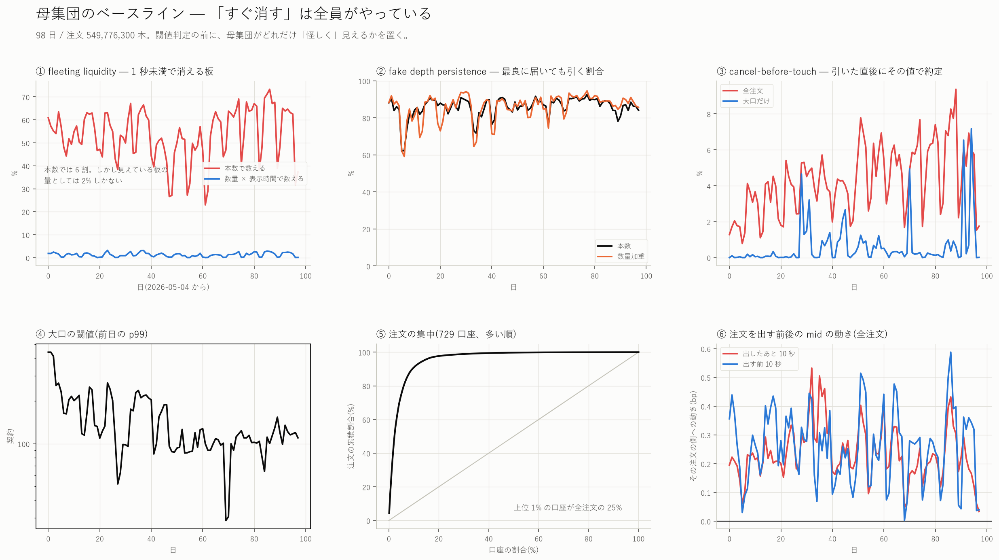
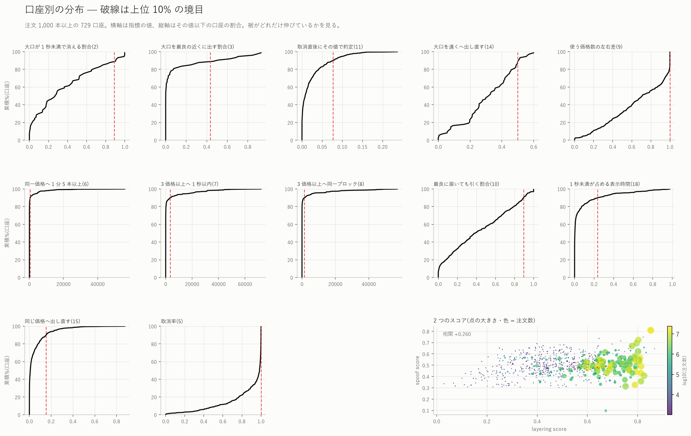
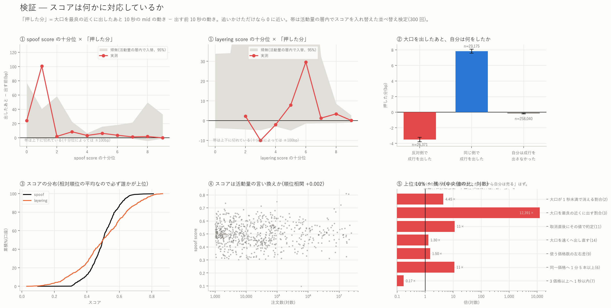

# 見せかけの板を疑う 18 指標 — そして「疑わしい」が何も意味しない理由

[← xyz:MU 分析索引に戻る](README.md)

板に大きな注文が現れ、値段が近づくと消える。繰り返し出しては引く。片側だけに
何段も積む。これらは spoofing / layering の教科書的な形である。本レポートは
その 18 通りの形を注文 1 本ごとに測り、口座ごとに集計し、**それが何かを
意味しているのかを検証する**。

---

## 0. 最初に立場を明確にする

**これは疑いの指標であって、証拠ではない。** 理由は 3 つある。

1. **意図は観測できない。** spoofing の構成要件は「約定させる意思がないこと」で
   あり、板の記録からは出てこない。ここで測れるのは行動の形だけである。
2. **この市場では「すぐ消す」が既定の行動である。**
   [指値注文の生存率](mu_hazard_report.md)で測ったとおり、板に置かれた指値の
   **99.1% は取り消され、寿命の中央値は 565 ミリ秒**しかない。閾値をそのまま
   当てれば、正当なマーケットメイクが丸ごと引っかかる。
3. **相対順位で作ったスコアは、定義上かならず誰かを最上位にする。**
   母集団が全員おとなしくても上位 10% は出る。したがってスコアそのものは
   何の主張でもなく、**別の観測量と対応して初めて意味を持つ**。

そこで本レポートは順序を変える。**まず母集団のベースラインを置き**(第 3 節)、
**次に口座ごとの分布を見て**(第 4 節)、**最後に spoofing の本質
「押してから反対側で売り抜けたか」を約定記録で直接確かめる**(第 5 節)。

口座は本リポジトリ内部の連番(`wid`)だけで扱い、**アドレスは出さない**。
特定の口座を名指しして操縦と結びつける主張は一切しない。

### ★ この指標群は将来の情報を使う。取引シグナルにはならない

「近づいたら逃げたか」を判定するには、取り消した**あとに**値段がそこへ来たかを
見る必要がある。cancel-before-touch 系は設計上ルックアヘッドを含む。
**記述と監視のための量である。**予測に使える板の量は
[仮想成行 Q に対する板の応答](mu_impact_fragility_report.md)のほうで別に測ってある。

---

## 1. 18 指標の定義

注文 1 本ごとの属性(A)と、口座 × 窓ごとの行動(B)に分かれる。閾値はすべて
事前に決め、本文に明示する。

### A. 注文 1 本ごと

| # | 指標 | 定義 |
|---|---|---|
| 1 | large-order appearance | 数量が**前日**の p99 以上(閾値は日ごとに動く) |
| 2 | short-lived large order | 1 かつ 寿命 < 1 秒 |
| 3 | large order near touch | 1 かつ 発注時に同じ側の最良から 1 ティック以内 |
| 10 | fake depth persistence | 生存中に最良へ**到達した**注文のうち、1 枚も約定せず取り消された割合 |
| 11 | cancel-before-touch | 約定せず取り消し、かつ**取消後 1 秒以内**にその値段で約定が起きた(= 残っていれば約定した) |
| 18 | fleeting-liquidity ratio | 寿命 < 1 秒の注文が占める「数量 × 表示時間」の割合 |

10 の「到達した」は、生存中の同じ側の最良気配がその注文の価格に一致したこと。
買い注文なら最良買いが自分の値段まで下りてきた瞬間があること。区間の最小/最大は
スパーステーブル(1 件あたり O(1))で引いている。

11 の「その値段で約定が起きた」は、買い注文なら**売りテイカーの約定がその価格
以下で**起きたこと。価格優先なので、残っていれば約定していたはずである。

同じリポジトリの[束の間の注文](mu_fleeting_report.md)は閾値 2 秒で
同じ現象を別の切り口(側・距離・数量・口座)から測っている。本レポートは
閾値 1 秒で、**監視指標としての使えるか**を問う点が違う。

18 は**数量 × 表示時間**で測る。本数で数えると「1 秒未満が 6 割」だが、
短命な注文は表示されている時間がほぼ無いので、**任意の瞬間に見えている板の量**
としての寄与は桁違いに小さい。両方を並べる(第 3 節)。

### B. 口座 × 窓ごと

| # | 指標 | 定義 |
|---|---|---|
| 4 | repeated large-order placement | 1 分間に大口を 3 本以上出した窓の数 |
| 5 | repeated cancellation | 取消率と、1 秒あたり取消数の最大 |
| 6 | placement/cancel cycling | 同じ側の**同一価格**へ 1 分間に 5 本以上出した (価格, 分) の数 |
| 7 | same-wallet layering | 同じ側の **3 価格以上**へ 1 秒以内に出した秒の数 |
| 8 | multiple-level simultaneous | 同じ側の 3 価格以上へ**同一ブロック**(同じ ts)で出した回数 |
| 9 | asymmetric layering | 1 分ごとの使用価格数の左右差 $`(L_b-L_a)/(L_b+L_a)`$ の絶対値の平均 |
| 12 | move-away-before-touch | 取消 → 1 秒以内に同じ側の**より遠い**価格へ出し直した回数 |
| 13 | order chasing price | 取消 → 1 秒以内に**より近い**価格へ出し直した回数 |
| 14 | large-order retreat | 12 を大口に限ったもの |
| 15 | repeated re-entry | 取消 → 1 秒以内に**同じ**価格へ出し直した回数 |
| 16 | spoof score | 2・3・11・14・9 の**母集団内の順位**を [0,1] にして平均 |
| 17 | layering score | 6・7・8・9・4 の順位を同様に平均 |

12 と 13 は「買い注文なら価格が下がるほど mid から遠い」で判定する
(mid そのものは使わない)。8 は同一ブロック、7 は 1 秒窓で、8 のほうが厳しい。

---

## 2. データと手続き

| | |
|---|---|
| 標本 | 2026-05-04 〜 08-09 の 98 日 |
| 母集団 | 板に留まる指値(tif が Alo・Gtc、トリガーと reduce_only を除く)で、**その日のうちに出て消えた**もの |
| 口座 | l1 の発注元。内部連番 `wid` に置き換えて保持 |
| 板 | `bbo`(l2 由来)。到達判定は区間の最小/最大 |
| 約定 | `fills` のテイカー行。口座表と 99.7% が突合できた |

日を跨ぐ注文はその日の板・約定だけで閉じないので落とす(全体の 0.026%)。

**時間契約**: 指標は監視のための記述量であって予測の説明変数ではない。
11・12・14 は取消後 1 秒の情報を、5-2 節の検証は発注後 10 秒の情報を使う。
そう設計している。

---

## 図

**母集団のベースライン** — 閾値判定の前に、全体がどれだけ「怪しく」見えるか



**口座別の分布と 2 つの合成スコア**



**検証** — スコアは何かに対応しているか



---

## 3. ベースライン — 母集団はどれだけ「怪しく」見えるか

98 日、**549,776,300 本**の指値。日次の分布。

| # | 指標 | 中央値 | p5 | p95 |
|---|---|---:|---:|---:|
| 1 | 大口の割合 | 1.03% | 0.10% | 3.16% |
| 1 | 大口の閾値(前日 p99) | 117.5 契約 | 78.6 | 258.7 |
| — | 1 秒未満で消える(**本数**) | 54.4% | 31.4% | 67.7% |
| **18** | **1 秒未満が占める表示時間** | **1.32%** | 0.11% | 2.70% |
| 3 | 最良から 1 ティック以内に置く | 15.1% | 11.2% | 22.1% |
| 5 | 取消率 | 98.9% | 97.4% | 99.4% |
| 10 | 最良に届いても引く(本数) | 87.1% | 75.8% | 90.8% |
| 10 | 同(数量加重) | 88.3% | 70.8% | 93.3% |
| 11 | 取消直後にその値で約定 | 4.17% | 1.51% | 7.44% |
| 11 | 同(大口だけ) | **0.18%** | 0% | 3.07% |

**判ったこと。**

1. **fleeting liquidity は数え方で 41 倍変わる。** 本数では 54.4% が 1 秒未満で
   消えるが、**見えている板の量(数量 × 表示時間)としては 1.32% しかない**。
   短命な注文は、定義上ほとんど表示されていないからである。
   「板の半分は幻」という言い方は本数の話で、**任意の瞬間に見えている板の
   98.7% は 1 秒以上そこにある**。ここを取り違えると結論が逆になる。
2. **最良に届いた注文の 87% は約定せずに引かれる。**「値段が近づいたら逃げた」
   という形は、**多数派の行動である**。数量加重でも 88.3% で、
   本数と数量でほぼ同じ ── 大口だけが逃げるのでも、小口だけが逃げるのでもない。
3. **★大口ほど「逃げない」。** 取消直後にその値段で約定が起きた割合は
   全体で 4.17% なのに、**大口だけだと 0.18% と 23 分の 1** である。
   spoofing の予想(大きく見せて、当たる前に引く)とは**逆向き**の事実である。
4. 注文は極端に集中している。**上位 1% の口座が全注文の 25%** を出す。
   板を厚く出している口座が何者かは[このウォレットはマーケットメイカーか](mu_wallet_mm_report.md)
   で 13 基準に分けて調べてある。

---

## 4. 口座別の分布 — スコアは何を拾っているか

注文 1,000 本以上の **729 口座**を採点した。上位 10%(72 口座)と残りの中央値の比。

| 指標 | 上位 10% | 残り | 比 |
|---|---:|---:|---:|
| 1 秒未満が占める表示時間(18) | 0.102 | 0.0018 | **56×** |
| 大口を最良の近くに出す割合(3) | 0.156 | ≈0 | (残りがほぼ 0) |
| 同一価格へ 1 分 5 本以上(6) | 5.52 /日 | 0.50 /日 | **11.0×** |
| 取消直後にその値で約定(11) | 0.056 | 0.0051 | **11.1×** |
| 大口が 1 秒未満で消える(2) | 0.815 | 0.183 | 4.5× |
| 同じ価格へ出し直す(15) | 0.029 | 0.0071 | 4.2× |
| 最良に届いても引く(10) | 0.642 | 0.344 | 1.9× |
| 使う価格数の左右差(9) | 1.000 | 0.667 | 1.5× |
| 大口を遠くへ出し直す(14) | 0.355 | 0.273 | 1.3× |
| 近くへ出し直す(13) | 0.331 | 0.321 | 1.0× |
| **取消率(5)** | 0.890 | 0.987 | **0.90×** |
| **1 秒あたり取消数の最大(5)** | 3 | 6 | **0.50×** |
| **遠くへ出し直す(12)** | 0.069 | 0.247 | **0.28×** |
| **3 価格以上へ 1 秒以内(7)** | 0.525 /日 | 2.18 /日 | **0.24×** |
| **3 価格以上へ同一ブロック(8)** | 0 | 0.11 /日 | **0×** |

**判ったこと。**

1. **spoof score の上位は、取消率がむしろ**低い**。**(0.890 対 0.987、
   1 秒あたり取消数の最大も半分)。つまり「大量に取り消す口座」= 高速の
   マーケットメイカーは、このスコアでは上位に来ない。指標を率で作り、
   順位で合成したことが効いている。
2. **spoofing と layering は別の口座がやっている。** 2 つのスコアの相関は
   **+0.258** しかなく、spoof 上位は layering 指標(7・8)が母集団より
   **低い**(0.24 倍、0 倍)。「大口を見せて引く」口座と「何段も積む」口座は
   重ならない。
3. **スコアは活動量の言い換えではない。** log(注文数)との相関は **+0.004**。
   これは意図した設計(すべて率で作った)が効いていることの確認になる。

---

## 5. 決定的な検証 — 押したあと、自分は何をしたか

板の形をいくら数えても spoofing かどうかは判らない。見せかけの買い板の目的は
「値段を上げてから**自分は売る**」ことなので、そこを約定記録で直接見る。

**最良から 1 ティック以内に出した大口 307,599 件**(606 口座)について、
発注の直後 10 秒に **その口座自身**が出した成行を引いた。

「押した分」= 発注後 10 秒の mid の動き − 発注**前** 10 秒の動き
(その注文の側を正とする)。追いかけただけなら 0 に近い。

| その後 10 秒に自分がしたこと | 件数 | 割合 | 押した分 | 約定率 |
|---|---:|---:|---:|---:|
| **反対側で成行を出した** | 26,372 | 8.57% | **−3.500 ± 0.281 bp** | 0.47% |
| 同じ側で成行を出した | 23,177 | 7.53% | **+7.841 ± 0.256 bp** | 2.57% |
| 自分は成行を出さなかった | 258,050 | 83.89% | −0.171 ± 0.050 bp | 1.34% |
| **全体** | 307,586 | 100% | **+0.147 ± 0.053 bp** | 1.35% |

**spoofing の署名は出ない。しかも符号が逆である。**

- 大口を出して**反対側で売り抜けた**層では、値段はその注文の側と**逆に**
  3.50 bp 動いている。見せかけの買い板が成功したなら値段は**上がって**いなければ
  ならない。実際に起きているのは「買い板を出した → 値段が下がった → 売った」で、
  これは**損切りかヘッジ**の形である。
- 逆に、**同じ側で買い増した**層では値段が 7.84 bp その向きへ動いている。
  情報を持った参加者が板と成行の両方で同じ向きに動いている形で、
  正当な方向性取引である。
- 全体では +0.147 bp。統計的には 0 と区別できる(t = 5.4)が、
  **スプレッドの中央値 1.083 bp の 7 分の 1** で、経済的な意味はない。

### スコアは「押した分」に対応しない

spoof score の十分位ごとに「押した分」をプールして計算し(口座ごとの平均を
平均すると、episode が数件の口座の雑音が支配する ── 実際に 376bp が出た)、
**活動量の層内でスコアを入れ替える並べ替え検定**(300 回)と比べた。

| spoof score 十分位 | 0 | 1 | 2 | 3 | 4 | 5 | 6 | 7 | 8 | 9 |
|---|---:|---:|---:|---:|---:|---:|---:|---:|---:|---:|
| 押した分(bp) | 24.1 | 100.7 | 1.9 | 8.4 | 3.2 | −0.6 | 3.6 | 1.2 | 1.7 | **−0.1** |

**単調でもなく、最上位が最大でもない。**全十分位で実測が帰無の 95% 帯の内側に
収まる。layering score も同様(帯の内側)。

**つまり、18 指標から作ったスコアは「大口で値段を動かせる口座」を
選び出していない。**

### なぜ大口 episode が少数の口座に偏るか

307,599 件のうち**上位 2 口座で 57.4%、上位 10 口座で 97.7%** を占める。
「最良の近くに大口を出す」行動をとる口座はごく少数である。この偏りのため、
第 5 節の全体平均は事実上この数口座の性質を表している。
口座ごとの分解(上の表)を必ず併せて読むこと。

---

## 6. 検算

| 項目 | 値 | 判断 |
|---|---:|---|
| open イベント | 549,920,651 | — |
| その日のうちに閉じた(母集団) | 549,776,300(99.974%) | 日跨ぎは 0.026%。落とした |
| 口座が引けなかった注文 | **0** | l1user の突合は完全 |
| 最良気配が引けなかった | 1,228 | 無視できる |
| **板と l1 の食い違い** | 9,880,258(1.80%) | 発注時に同じ側の最良が自分の値段より内側だった件数。bbo(l2 由来)と l1 の timing 差。距離と到達判定はこの割合の誤差を含む |
| 成行と口座表の突合 | 11,145,390 / 11,174,755(99.7%) | — |

### 途中で踏んだ実装の罠(記録)

1. **UInt32 のアンダーフロー。** `n_unique()` は UInt32 を返すので、
   layering の左右差 $`(L_b - L_a)`$ が $`L_b \lt  L_a`$ のとき 2³² へ回り込んでいた
   (最大値がちょうど 4,294,967,295 = 2³²−1 だったことで気づいた)。
   Int64 へ上げてから引く。
2. **Int32 の桁あふれ。** 省メモリ化で数量を Int32(ロット)にしたところ、
   日次合計が 2³¹ に届き、数量加重の割合が 0 と 100 の間で暴れた。合計の前に
   Int64 へ上げる。**最初の版はこの 2 つが無く、数字が静かに壊れていた。**
3. **null と 0 の取り違え。** layering を一度もしない口座は集計に現れず null に
   なる。順位付けで null を「中央」に置くと、一度もやらない口座が中位に来る。
   0 で埋める。
4. **口座ごとの平均を平均しない。** 大口 episode は口座ごとの件数の差が
   4 桁あるので、口座平均の平均は数件の口座に支配される(376bp が出た)。
   件数で加重してプールする。

---

## 6-2. 18 指標の一覧と結果

| # | 指標 | 母集団の水準 | 上位 10% との比 | 判定に効いたか |
|---|---|---|---|---|
| 1 | large-order appearance | 1.03%(定義上) | — | 閾値の定義そのもの |
| 2 | short-lived large order | 大口の 18%(全体) | 4.5× | 効く |
| 3 | large order near touch | 15.1% が最良 1 ティック以内 | 残りがほぼ 0 | 効く(ただし 606 口座のみ) |
| 4 | repeated large-order placement | ほぼ全口座 0 | — | ほぼ発火しない |
| 5 | repeated cancellation | 取消率 98.9% | **0.90×(逆)** | 効かない(全員がやる) |
| 6 | placement/cancel cycling | 0.5 件/日 | 11.0× | 効く |
| 7 | same-wallet layering | 2.2 件/日 | **0.24×(逆)** | spoof とは別の行動 |
| 8 | multiple-level simultaneous | 0.11 件/日 | **0×(逆)** | 同上 |
| 9 | asymmetric layering | 0.667 | 1.5× | 弱い |
| 10 | fake depth persistence | **87.1%** | 1.9× | ベースラインが高すぎる |
| 11 | cancel-before-touch | 4.17%(大口 0.18%) | 11.1× | 効く。ただし大口は**逆** |
| 12 | move-away-before-touch | 24.7% | **0.28×(逆)** | 効かない |
| 13 | order chasing price | 32.1% | 1.03× | 効かない |
| 14 | large-order retreat | 27.3% | 1.3× | 弱い |
| 15 | repeated re-entry | 0.71% | 4.2× | 効く |
| 16 | spoof score | — | — | 「押した分」に対応せず |
| 17 | layering score | — | — | 同上。spoof との相関 0.26 |
| 18 | fleeting-liquidity ratio | **1.32%**(本数では 54.4%) | 56× | 効く。ただし数え方に注意 |

---

## 8. 再現手順

```bash
uv run python scripts/fetch_bbo.py --coin xyz:MU
uv run python scripts/fetch_fills.py --coin xyz:MU
uv run python scripts/fetch_l1.py --coin xyz:MU
uv run python scripts/fetch_l1_extra.py --coin xyz:MU     # 口座 ID
uv run python scripts/build_manip.py --coin xyz:MU        # 98 日で約 45 分
uv run python scripts/plot_manip.py --coin xyz:MU
```

| ファイル | 内容 |
|---|---|
| `data/manip_wallet_<coin>.parquet` | 口座 × 日 の集計(69,448 行、版管理外) |
| `data/manip_episodes_<coin>.parquet` | 最良の近くに出した大口 1 本ごと(307,599 行、版管理外) |
| `data/manip_daily_<coin>.csv` | 市場全体の日次ベースライン(98 行) |
| `data/manip_scores_<coin>.csv` | 口座ごとの 18 指標と 2 つのスコア(729 行) |
| `data/manip_meta_<coin>.csv` | 日ごとの検算(98 行) |

---

## 7. この結果が言っていないこと

1. **特定の口座を操縦者と同定していない。** スコアは母集団内の相対順位であり、
   上位に来ることは「他より極端」以上を意味しない。アドレスも出していない。
2. **意図を測っていない。** spoofing の構成要件は約定させる意思がないことで、
   板の記録には現れない。
3. **閾値は恣意的である。** 「大口 = 前日 p99」「短命 = 1 秒」「layering = 3 価格」
   はすべて事前に決めた便宜的な線で、別の線を引けば数は変わる。順位で合成して
   いるのは、この恣意性を絶対水準から切り離すためである。
4. **板に載らない注文は見ていない。** トリガー注文とテイカーは母集団の外。
5. **1 銘柄(xyz:MU)、98 日の結果である。**
