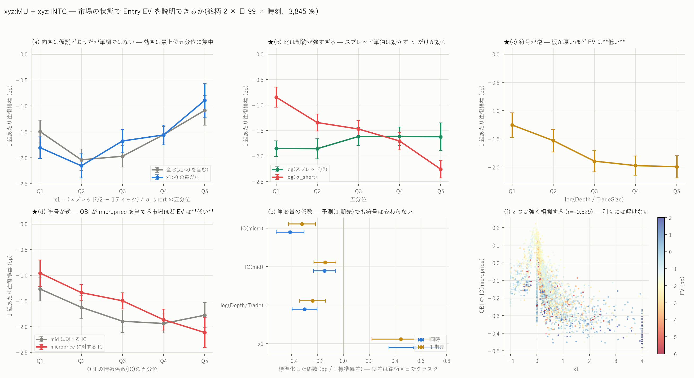

# 市場の状態で Entry EV を説明できるか(xyz:MU + xyz:INTC)

図: `mktpanel_ev.png`



検定する仮説:

    EV ≈ f( (Spread/2 − 1tick) / σ_short ,  Depth / TradeSize ,  OBI の IC )

「price-improvement 後の余裕が大きく、逆行が小さく、食い切られにくく、
OBI の方向予測力が高い市場ほど Entry EV が高い」。

---

## 0. 結論を先に

| 仮説の項 | 結果 |
|---|---|
| **(Spread/2 − 1tick) / σ_short** が大きいほど良い | **向きは支持。ただし単調ではなく、効きは最上位五分位に集中**(β=+0.553、t=+5.43) |
| ↳ 比の形が正しいか | **正しくない。** スプレッドと σ を分けると R² が 0.083 → 0.180 に上がる。**σ の効きがスプレッドの 2.5 倍**(−0.604 対 +0.244) |
| **Depth / TradeSize** が大きいほど良い | **★ 符号が逆。厚いほど EV は低い**(β=−0.299、t=−6.06)。しかも**効いているのは Depth だけで TradeSize は無関係**(t=−0.38) |
| **OBI の IC** が高いほど良い | **★ 符号が逆。**microprice に対する IC が高い(= OBI が本当に当てる)市場ほど EV は**低い**(β=−0.411、t=−7.47) |

**3 つのうち支持されたのは 1 つで、2 つは符号が逆だった。**
そして**どの五分位でも EV は負**(最良でも −0.894 bp)なので、これは
「どこが相対的にましか」の説明であって、黒字への道ではない。

---

## 1. 標本と作り方

**本来これは市場横断の仮説だが、手元にあるのは 2 銘柄だけ**である。
このリポジトリのスコープはメモリ半導体 6 銘柄(DRAM / KIOXIA / MU / SKHX /
SMSN / SNDK)だが、ローカルに bbo/fills が揃っているのは **MU だけ**である。
残る **5 銘柄**は WORK_BUCKET からの取得(費用が発生する操作)が要る。
比較対象に使った **xyz:INTC はメモリ銘柄ではなく**、並行して別セッションが
取得していたものを借りている。
そこで**銘柄 × 日 × 時刻(UTC 1 時間)のパネル**にして、識別は主に
条件の時間変動から取った。MU のスプレッドは日中央値で 0.11〜6.57 bp まで動くので、
時間変動でも十分な広がりがある。

| | |
|---|---|
| 銘柄 | xyz:MU(2,284 窓・メモリ)/ xyz:INTC(1,561 窓・比較用) |
| 期間 | 2026-05-04 〜 08-10、99 日 |
| 窓 | 1 時間。建玉 20 本以上の窓のみ(**3,845 窓**) |
| EV | **在庫を持つメイカー(在庫上限 1・BBO 追随・時間切れなし・門なし)の実績**。その窓で建てた玉の往復損益の平均 |
| 誤差 | **銘柄 × 日でクラスタ**(同じ日の 24 窓は独立でない)。重みは窓内の建玉数 |

説明変数:

    room_bp        = スプレッド/2 − 1 ティック(bp、中央値)
    sigma_short_bp = 1 秒刻みの mid 対数リターンの標準偏差(bp)
    x1             = room_bp / sigma_short_bp
    depth_over_trade = 最良気配の数量の中央値 ÷ 約定 1 件の数量の中央値
    obi_ic_mid     = corr(OBI_t, r^mid_{t→t+1s})
    obi_ic_micro   = corr(OBI_t, r^micro_{t→t+1s})

### 時間契約について

**説明変数と EV を同じ窓で取ると、それは予測ではなく同時性である。**
そこで **1 つ前の窓の説明変数で次の窓の EV を説明する**版も作り、両方を並べた。
IC 自体も窓内で t→t+1s の先読みを含むので、**市場の性質を記述する量**であって
発注時に使える予測子ではない。

結論は同時と 1 期先で変わらない(下表)。

| 変数 | 同時 β(t) | 1 期先 β(t) |
|---|---:|---:|
| x1 | +0.5532 (+5.43) | +0.4446 (+3.90) |
| log(Depth/Trade) | −0.2985 (−6.06) | −0.2376 (−4.63) |
| IC(mid) | −0.1453 (−3.37) | −0.1418 (−3.29) |
| IC(micro) | −0.4111 (−7.47) | −0.3192 (−5.99) |

係数は標準化してある(説明変数 1 標準偏差あたりの bp)。

---

## 2. x1 — 向きは合っているが、比の形が正しくない

### 五分位

| | Q1 | Q2 | Q3 | Q4 | Q5 |
|---|---:|---:|---:|---:|---:|
| 全窓 | −1.495 | −2.039 | −1.970 | −1.555 | **−1.086** |
| x1>0 の窓だけ | −1.805 | −2.154 | −1.676 | −1.559 | **−0.894** |

**単調ではない。**Q1 が Q2 より良い。線形の係数(β=+0.553、t=+5.43)は
**ほぼ最上位五分位だけで作られている**。x1>0 に限ると係数は +0.731(t=+11.19)、
R² は 0.136 まで上がるが、**それでも Q1 > Q2 のまま**である。

x1 ≤ 0(スプレッド/2 が 1 ティック以下)の窓が **22.2%** あり、そこの EV は
−1.517 と中位五分位より良い。仮説の形は「余裕が正」の領域を想定していると思うが、
実際には**余裕がほぼ無い極端に狭い市場も悪くない**ので、線形では捉えられない。

### ★ 比にすると情報が落ちる

x1 は `room / σ` という比なので、**スプレッドと σ の係数が等しく逆であることを
暗黙に課している**。データはそれを否定する。

| 定式化 | R² | 係数 |
|---|---:|---|
| x1(比) | 0.083 | x1 = +0.553 (t=+5.43) |
| **log(スプレッド/2) と log(σ) を別々** | **0.180** | log(spread/2) = **+0.244** (t=+4.70)、log(σ) = **−0.604** (t=−12.63) |
| + log(Depth/Trade) | 0.190 | 上に加えて −0.149 (t=−3.84) |

**σ の効きがスプレッドの 2.5 倍**である。しかも**スプレッド単独ではほとんど効かない**
(β=+0.093、t=+1.78、R²=0.006)。σ を統制して初めて +0.244 になる。
五分位で見ても、log(σ) は Q1 −0.846 → Q5 −2.259 と単調に効くのに対し、
log(スプレッド/2) は Q1 −1.854 → Q5 −1.622 とほぼ平らである。

**つまり効いているのは「余裕」ではなく「逆行の小ささ」である。**
スプレッドを広く取れる市場が良いのではなく、**動かない市場が良い**。

---

## 3. Depth / TradeSize — 符号が逆で、しかも比が意味を持たない

| Q1 | Q2 | Q3 | Q4 | Q5 |
|---:|---:|---:|---:|---:|
| **−1.255** | −1.531 | −1.894 | −1.972 | −1.993 |

**単調に悪化する。**仮説は「食い切られにくいほど良い」だが、実測は逆である。

分解するとさらにはっきりする。

| 変数 | β | t |
|---|---:|---:|
| log(Depth) | **−0.657** | **−7.10** |
| log(TradeSize) | −0.032 | −0.38 |

**効いているのは Depth だけで、TradeSize は何もしていない。**
比の形(Depth/TradeSize)が意味を持つのは「食い切られにくさ」という機構を
想定したときだが、その機構は働いていない。

**働いているのは待ち行列である。**本プロジェクトで繰り返し出ている構造
(`mu_heatmap_report.md`「約定できるかは待ち行列の軸だけ」)と一致する —
板が厚いと自分の前の行列が長く、**約定するまで待たされ、その間に不利に動く**。
最後尾に並ぶメイカーにとって、厚い板は保護ではなく待ち時間である。

---

## 4. OBI の IC — 符号が逆。しかも mid で測ると別物になる

| | Q1 | Q2 | Q3 | Q4 | Q5 |
|---|---:|---:|---:|---:|---:|
| IC(mid) | −1.269 | −1.625 | −1.896 | −1.940 | −1.779 |
| **IC(microprice)** | **−0.959** | −1.339 | −1.497 | −1.866 | **−2.115** |

**microprice に対する IC が高い市場ほど EV は低い**(単調)。仮説と逆である。

経済的には筋が通る。**OBI が本当に方向を当てるということは、板の偏りが
情報を含んでいるということ**であり、それはそのまま**情報のある注文フローに
食われる**という意味になる。メイカーが欲しいのは逆で、**偏りが情報を持たない市場**である。

### mid と microprice で符号が違う

パネル全体で **IC(mid) は平均 +0.136、IC(microprice) は平均 −0.152** である。
既報 `mu_prediction_report.md` のとおり、OBI が mid を当てて見えるのは
**mid が既知の microprice へ追いつく機械的な動き**が大半で、
microprice に対しては逆に効く。したがって

- **IC を mid で測ると、仮説の第 3 項は事実上スプレッドの大きさの代理になる**
  (相関 −0.354 で x1 と絡む)
- **microprice で測ると、単変量の説明力は 3 つの中で最大**(R²=0.105)

「OBI の予測力」を語るときは、どちらの価格に対してかを必ず書く必要がある。

---

## 5. 3 つを同時に入れると解けない

説明変数どうしの相関(同時):

| | x1 | log(D/T) | IC(mid) | IC(micro) |
|---|---:|---:|---:|---:|
| x1 | 1.000 | −0.283 | −0.354 | **−0.529** |
| log(D/T) | −0.283 | 1.000 | 0.216 | 0.192 |
| IC(mid) | −0.354 | 0.216 | 1.000 | **0.652** |
| IC(micro) | −0.529 | 0.192 | 0.652 | 1.000 |

`x1` と `IC(micro)` の相関が **−0.529** あるので、3 変数を同時に入れると
x1 の t が +5.43 → **+1.19** に落ちる(β は +0.553 → +0.249)。
**この 2 つは別々には解けない。**
どちらか片方だけを「効いている変数」と言ってはいけない。

3 変数まとめての R² は **0.129**(micro の IC 版)。
**市場の状態で説明できるのは時間ごとの EV の変動の 13% 程度**である。

---

## 6. 実務的な含意

1. **「動かない市場を選ぶ」が最も効く。**σ の係数 −0.604 は 4 つの中で最大で、
   五分位も単調である。スプレッドの広さを狙うより、σ の小ささを狙うほうが強い。
2. **板は厚いほうがよい、は誤り。**最後尾に並ぶ前提では、厚い板は待ち時間である。
   これは既報の「約定できるかは待ち行列の軸だけで決まる」と同じ現象を、
   市場の断面で見たものである。
3. **OBI が効く市場は避ける。**偏りが情報を持つ市場では、その情報の反対側に
   置かれるのがメイカーである。
4. **ただしどの層でも黒字にならない。**最良の層(IC(micro) の Q1)でも
   −0.959 bp である。§1 の EV は**門を掛けていない**素の在庫メイカーなので、
   `mu_inventory_mm_report.md` の門つき(+0.036 ± 0.084)と直接は比べられないが、
   **市場の選択だけでゼロを跨ぐ層は無い**。

---

## 7. 限界

1. **★ 市場横断ではない。**銘柄は 2 つしかなく、固定効果に吸われる差も小さい
   (MU −1.768 / INTC −1.661)。**識別はほぼ時間変動から来ている。**
   本来の仮説を検定するには残り 5 銘柄が要る(§8)。
2. **EV は門なしの在庫メイカーの実績**である。門つきの EV で同じ回帰をすると
   窓あたりの建玉が数本になり、推定できない。
3. **同時性**。§1 のとおり 1 期先でも符号は変わらないが、
   1 時間先の市場状態は現在と強く相関するので、これは弱い予測性の証拠にすぎない。
4. **IC は窓内の先読みを含む**。市場の記述であって、発注時の予測子ではない。
5. **σ と EV の関係には機械的な部分がありうる。**EV は bp で測っているので、
   σ が大きい窓では損益の分散も大きい。ただし平均が下がる理由にはならないので、
   逆選択の効果と見ている。念のため σ の五分位で建玉数を確認すると
   **46 → 64 → 90 → 120 → 183 本(中央値)と単調に増えており**(σ の中央値は
   0.46 → 2.92 bp)、**「取引が少ない静かな窓を拾っているだけ」ではない**。
   むしろ σ が大きい窓のほうが約定は多く、それでも EV は悪い。
6. **多重比較**。定式化を 6 通り × 2(同時/1 期先)試している。
   ただし主要な 3 つの符号はすべて |t| > 3 で、探索で作った結論ではない。

---

## 8. 次にやるなら

**残り 5 銘柄(DRAM / KIOXIA / SKHX / SMSN / SNDK)を WORK_BUCKET から取得すれば、
メモリ 6 銘柄そろっての市場横断の検定ができる。**必要なのは各銘柄の bbo と fills だけで、
在庫シミュレータは 54 列の候補テーブルを必要としない(`build_inventory.py` は
bbo と fills だけで動くように直してある)。

**これは S3 からの取得なので費用が発生する。**累計は既に予算に達しているので、
実行の可否は判断を仰ぎたい。取得量とおおよその費用を見積もって提示する。

---

## 9. 再現手順

```bash
uv run python scripts/build_inventory.py --coin xyz:MU   --qmax 1
uv run python scripts/build_inventory.py --coin xyz:INTC --qmax 1
uv run python scripts/build_mktpanel.py --coins xyz:MU xyz:INTC
uv run python scripts/build_mktreg.py
uv run python scripts/plot_mktpanel.py
```

生成物: `data/mktpanel.csv`(3,845 窓の説明変数と EV)/ `data/mktreg.csv`(回帰の結果)。
