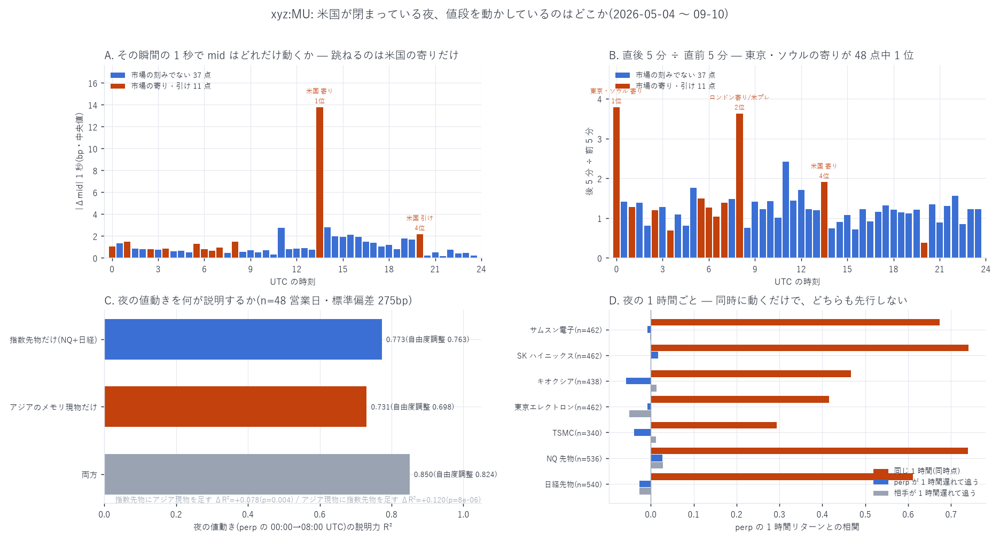

# 米国が閉まっている夜、値段を動かしているのはどこか

[← `xyz:MU` の索引](README.md) / [Hyperliquid の分析](../README.md) / [ホーム](../../../README.md)

**前提** — [24 時間動く perp は米国市場の寄り付きを先に知っているか](mu_price_discovery_report.md)で、
`xyz:MU` は原資産の寄り値に対して「速い追随者」であり、追い越せる場面は
**現物が世界のどこでも取引されない 00:00〜08:00 UTC の 8 時間**だけだと判った。
この 8 時間で `xyz:MU` は 1 日の分散の **24.7%** を作る。**ではその 8 時間、
値段を作っているのはどこなのか。** 本レポートはそれを 4 通りに切り分ける。

**この 8 時間は、そのままアジアの取引時間である**(標本期間 5〜9 月はアジアに夏時間が無い)。

| UTC | 出来事 |
|---|---|
| 00:00 | 東京・ソウル 寄り(09:00 JST / KST) |
| 01:00 | 台北 寄り |
| 02:30 / 03:30 | 東京 前引け / 後場寄り |
| 05:30 / 06:00 / 06:30 | 台北 引け / 東京 引け / ソウル 引け |
| 07:00 | アムステルダム・フランクフルト 寄り |
| 08:00 | ロンドン 寄り・**米国プレマーケット開始** |

メモリ半導体の同業 — **サムスン電子**(005930.KS)・**SK ハイニックス**(000660.KS)・
**キオクシア**(285A.T)・**東京エレクトロン**(8035.T)・**TSMC**(2330.TW) — はここで動く。

**時間契約** — 検定 A は事象時刻の前後を分けて測るだけ。検定 B / C はラグを明示する。
検定 D は説明変数がすべて寄り付き(13:30 UTC)より前。`shift(-k)` は目的変数専用。

---

## 先に結論

**夜の値段を作っているのは、株価指数先物(マクロ)が主で、アジアのメモリ現物が従。
Hyperliquid の perp はそのどちらでもなく、両方を映す鏡である。**

| 問い | 答え |
|---|---|
| 夜の値動き(perp の 00:00→08:00)は何で説明できるか | **指数先物だけで $`R^2`$ = 0.773**。アジアのメモリ現物を足すと **0.850**(Δ +0.078、p=0.004) |
| アジア現物だけでは | $`R^2`$ = 0.731。そこに先物を足すと +0.120(p=8×10⁻⁶) |
| アジアの中で効くのは誰か | **SK ハイニックスだけ**(係数 +0.25、t=2.7)。サムスン・キオクシア・東エレ・TSMC は 0 と区別できない |
| 夜のあいだ、どちらが先に動くか | **決まらない。** 1 時間粒度では同時に動くだけ(同時点の相関 0.29〜0.74、前後 1 時間のラグは全て \|·\| ≤ 0.064) |
| 「価格が現れる瞬間」はどこにあるか | **米国の寄り付きだけ。** 1 日 48 個の刻みのうち 1 秒の跳ねが 1 位(13.79bp、背景の最大 2.82bp) |
| アジアの寄り付きは何なのか | **値段が現れる瞬間ではなく、値段が動き始める瞬間。** 直後 5 分 ÷ 直前 5 分 は **48 点中 1 位**(3.79)だが、1 秒の跳ねは 18 位で背景と区別できない |



---

## 1. 「値段が現れる瞬間」は 1 日に 1 回しか無い

恣意的な対照時刻を選ばないため、**1 日 48 個の 30 分刻みすべて**で同じ量を測り、
市場の寄り引け(11 点)が残り 37 点の背景から浮くかを見た。

| UTC | 出来事 | 1 秒の跳ね | 週末の同時刻 | 直後 5 分 ÷ 直前 5 分 |
|---|---|---:|---:|---:|
| 00:00 | 東京・ソウル 寄り | 1.05bp(18 位) | 0.00bp | **3.79(1 位)** |
| 01:00 | 台北 寄り | 1.49bp(13 位) | 0.43bp | 1.28(19 位) |
| 06:00 | 東京 引け | 0.82bp(25 位) | 0.44bp | 1.26(21 位) |
| 07:00 | 欧州 寄り | 0.97bp(20 位) | 0.06bp | 1.39(14 位) |
| 08:00 | ロンドン寄り・米プレ開始 | 1.50bp(11 位) | 0.24bp | **3.63(2 位)** |
| 13:30 | **米国 寄り** | **13.79bp(1 位)** | 0.05bp | 1.91(4 位) |
| 20:00 | 米国 引け | 2.17bp(4 位) | 0.06bp | 0.38(48 位) |

背景 37 点の 1 秒の跳ねは中央 0.78bp・最大 **2.82bp**。
**米国の寄り付き 13.79bp は背景の最大の 4.9 倍**で、明らかに別物である。
一方 **アジアの寄り付きは 1.05bp**(48 点中 18 位)で、背景の中央値 0.78bp と
ほとんど変わらない。**寄り付きの瞬間に値が飛ぶということが起きていない。**

★**しかし「動き始める」のはアジアの寄りである。** 直後 5 分 ÷ 直前 5 分で測ると
東京・ソウルの寄りが **48 点中 1 位**、ロンドン寄り・米プレ開始が 2 位、米国の寄りが 4 位。
米国の引け(20:00)は **48 位**で、そこから活動が落ちる。

つまり夜の価格発見は、**寄り付きの一撃で値が決まるのではなく、
アジアの板が開いてから数時間かけて連続的に起きている**。

---

## 2. 夜の値動きを何が説明するか

目的変数は **perp の 00:00→08:00 UTC のリターン**(この窓の値動きを連続して
観測できるのは perp だけなので、これを「夜の値動き」の代理にする)。
標本は全変数がそろう **48 営業日**、標準偏差は **275bp**。

| 説明する側 | $`R^2`$ | 自由度調整 $`R^2`$ |
|---|---:|---:|
| 指数先物だけ(NQ + 日経、00:00→08:00) | **0.7727** | 0.7626 |
| アジアのメモリ現物だけ(5 銘柄のセッション内リターン) | 0.7305 | 0.6985 |
| 両方 | **0.8502** | 0.8240 |

- 指数先物にアジア現物を足す: Δ$`R^2`$ **+0.0776**、F(5,40)=4.14、**p=0.004**
- アジア現物に指数先物を足す: Δ$`R^2`$ **+0.1197**、F(2,40)=15.99、**p=7.9×10⁻⁶**
- プラセボ(アジアを 1 営業日ずらす): Δ$`R^2`$ +0.018(実測 +0.078 の 4 分の 1 以下)

**夜の値動きの 4 分の 3 はマクロ(指数先物)で説明できる。**
NQ 先物の係数は **+4.34**(t=8.0)— この銘柄のナスダック 100 に対する感応度は 4 倍を超える。
そのうえでメモリ固有の情報が +7.8 ポイントぶん乗る。

### アジアの中で効いているのは 1 社だけ

5 銘柄を同時に入れたときの係数(両方モデル):

| 銘柄 | 係数 | t |
|---|---:|---:|
| **SK ハイニックス** | **+0.25** | **+2.7** |
| サムスン電子 | +0.00 | +0.0 |
| キオクシア | −0.02 | −0.3 |
| 東京エレクトロン | −0.05 | −0.5 |
| TSMC | −0.01 | −0.0 |

5 銘柄は互いに強く相関しているので個別の係数は分離しにくいが、
**t が 2 を超えるのは SK ハイニックスだけ**である。DRAM と HBM の純度が最も高い銘柄が
残るのは筋が通る。ただし n=48 で 5 銘柄を同時に入れているので、
「サムスンは効かない」と読むのは行き過ぎで、正しくは「この標本では分離できない」。

---

## 3. 夜のあいだ、どちらが先に動くか

アジアの 1 時間足 $`i`$ = $`[t_i,\, t_i+1\text{h})`$ と**同じ窓**で perp を取り、
前後 1 時間のラグつきでも相関を測った。

| 相手 | n | 同じ 1 時間 | perp が 1 時間遅れて追う | 相手が 1 時間遅れて追う |
|---|---:|---:|---:|---:|
| **SK ハイニックス** | 462 | **+0.741** | +0.017 | +0.000 |
| **NQ 先物** | 536 | **+0.739** | +0.027 | +0.029 |
| サムスン電子 | 462 | +0.673 | −0.008 | −0.002 |
| 日経先物 | 540 | +0.611 | −0.026 | −0.027 |
| キオクシア | 438 | +0.467 | −0.058 | +0.014 |
| 東京エレクトロン | 462 | +0.416 | −0.008 | −0.050 |
| TSMC | 340 | +0.293 | −0.039 | +0.012 |

**同時点の相関は高いが、前後 1 時間のラグは全て \|·\| ≤ 0.064 で消える。**
情報は 1 時間より短い時間で行き来しており、**この粒度では先行関係を決められない**。

★これは「どちらも先行しない」という結論ではなく、**「1 時間足では分解できない」**という
測定の限界である。アジア現物の分足は無料では取れない(1 分足は直近 30 日まで)。
1 秒粒度で言えるのは perp 側だけで、その perp 側から見た限りでは
**アジアの寄り付きに 1 秒の跳ねは無い**(第 1 節)。

---

## 4. それは MU の寄り値に残るか

最後に、夜に作られた情報が**翌朝の寄り値**まで生き残るかを確かめた。
**MU 自身の 00:00→08:00 の飛び**(アフターの引け値 → 最初のプレマーケット気配)を
統制に入れている。これを入れないと「夜の perp が効く」という偽の結論が出る
([前レポート](mu_price_discovery_report.md)の §3.2 で踏んだ罠)。標本 51 営業日。

| モデル | $`R^2`$ |
|---|---:|
| D1 = MU のアフター + MU の夜の飛び + 指数先物(夜・朝) | 0.8680 |
| D2 = D1 + アジア現物 | 0.8840 |
| D3 = D1 + 夜の perp | 0.8848 |
| D4 = D1 + 米プレマーケット | **0.9960** |
| D5 = D4 + アジア現物 + 夜の perp | 0.9960 |

- D1 → D2(アジア現物を足す): Δ$`R^2`$ +0.0161、F(2,44)=3.05、p=0.057
- D1 → D3(夜の perp を足す): Δ$`R^2`$ +0.0168、F(1,45)=6.56、**p=0.014**
- D4 → D5(米プレの上に両方を足す): Δ$`R^2`$ **+0.0001**、F(3,42)=0.23、**p=0.88**

**米国のプレマーケットが開いた時点で、夜に作られた情報はすべてそこに入っている。**
アジア現物も perp も、それ以上は何も足さない。

---

## 5. まとめ — 夜の情報の流れ

```math
\underbrace{\text{マクロ(指数先物)}}_{R^2 = 0.77}
\;+\;
\underbrace{\text{アジアのメモリ現物(SK ハイニックス)}}_{+0.08}
\;\longrightarrow\;
\underbrace{\texttt{xyz:MU}\ \text{の夜の値段}}_{R^2 = 0.85}
\;\longrightarrow\;
\underbrace{\text{米プレマーケット}}_{08{:}00\ \text{UTC}}
\;\longrightarrow\;
\underbrace{\text{寄り値}}_{13{:}30\ \text{UTC}}
```

- **値段を作っているのはアジアと先物**であって、Hyperliquid ではない。
- ただし **perp は「連続して観測できる唯一の窓」**である。00:00〜08:00 UTC のあいだ、
  MU そのものの値段を 1 秒粒度で見られる場所はほかに無い
  (アジア現物は別銘柄、指数先物は別商品、MU 自身の気配は 08:00 まで存在しない)。
  **価格発見の場ではないが、価格の観測手段としては唯一である。**
- 「値が現れる瞬間」は 1 日 1 回、**米国の寄り付き**だけである。

---

## 6. 限界 — 何を言っていないか

1. **アジア現物の分足が無料では取れない。** 1 時間足しか無いので、
   第 3 節の「先行関係が決まらない」は**測定の限界**であって、
   「同時に動いている」ことの証明ではない。
2. **為替を統制していない。** アジア現物は現地通貨建て。6 時間で 10〜30bp 程度なので
   同業の 100〜300bp の動きに対しては二次的だが、ゼロではない。
3. **n = 48〜51 営業日**しかない。アジア現物 5 銘柄を同時に入れると自由度が厳しく、
   個別の係数(特に「サムスンは効かない」)は信用できない。
4. **「夜の値動き」を perp で代理している。** perp 自身がどこかを追っているなら、
   その追い方の癖が $`R^2`$ に混ざる。MU 自身の飛び(X0)で測った版は第 4 節にある。
5. **因果を言っていない。** 第 2 節は同じ窓での分散分解であって、
   どちらが先かを言うものではない。先行関係は第 1 節(1 秒)と第 3 節(1 時間)で別に測った。
6. **多重比較**: 本レポートの検定は A の 48 点 × 3 指標(記述)、
   B の 3 モデル + 2 F + 1 プラセボ、C の 7 市場 × 4 相関、D の 5 モデル + 3 F。
   結論を担うのは p=0.004 / 7.9×10⁻⁶(B)と p=0.88(D)で、いずれも余裕がある。
   p=0.057(D2)と p=0.014(D3)は Bonferroni を通らない。
7. **執行の話をしていない。**

---

## 7. 再現手順

```bash
uv run python scripts/fetch_cash.py --symbols MU NQ=F SMH \
    005930.KS 000660.KS 2330.TW 285A.T 8035.T ASML.AS NKD=F
uv run python scripts/fetch_hlcandle.py --coin xyz:MU --interval 1h
uv run python scripts/build_pricedisc.py  --coin xyz:MU   # パネルを先に作る
uv run python scripts/build_nightdisc.py  --coin xyz:MU
uv run python scripts/plot_nightdisc.py   --coin xyz:MU
```

---

リポジトリ全体の目次は [../../../README.md](../../../README.md) にあります。
