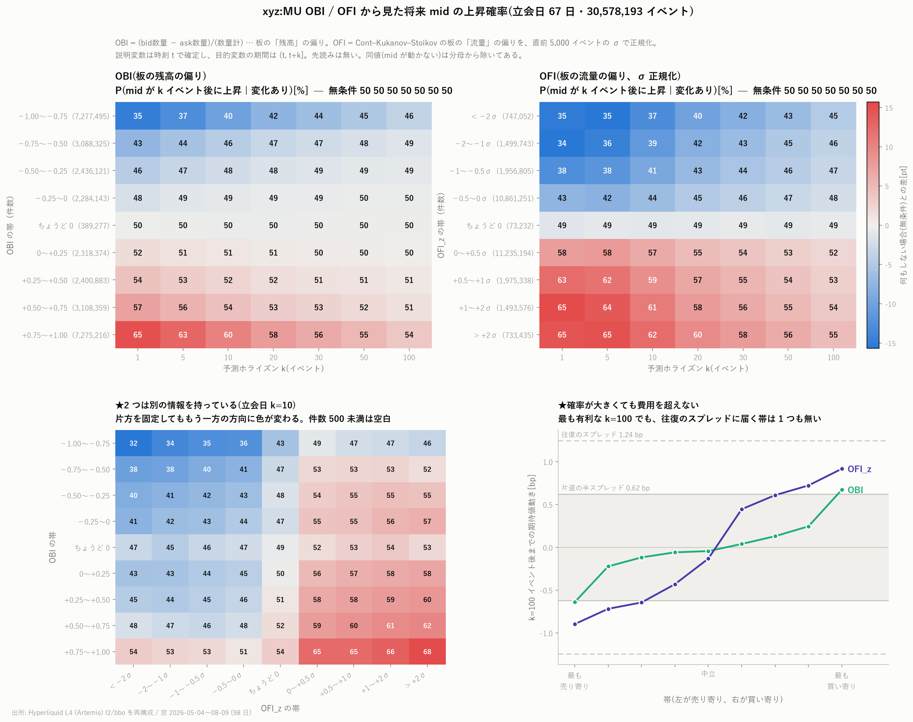

# xyz:MU OBI と OFI から見た将来 mid の上昇確率

[← xyz:MU 分析索引](README.md)

イベントごとに **OBI**(板の残高の偏り)と **OFI**(板の流量の偏り)を出し、
1 / 5 / 10 / 20 / 30 / 50 / 100 イベント先のリターンが正になる確率を行列にした。
標本は **35,169,386 イベント**、2026 年 5 月 4 日から 8 月 9 日の 98 日間
(立会日 67 日・閉場日 31 日)。

再現: `scripts/fetch_bbo.py` → `scripts/build_obi_ofi.py` → `scripts/plot_obi_ofi.py`



---

## 1. 定義

### OBI —— 板の「残高」の偏り

```math
\mathrm{OBI}_t = \frac{Q^{\mathrm{bid}}_t - Q^{\mathrm{ask}}_t}{Q^{\mathrm{bid}}_t + Q^{\mathrm{ask}}_t} \in [-1, +1]
```

今この瞬間に、最良気配のどちら側が厚いか。

### OFI —— 板の「流量」の偏り

Cont–Kukanov–Stoikov (2014) の定義を 1 イベントごとに取る。

```math
\mathrm{OFI}_t =
  \mathbb{1}\{P^{b}_t \ge P^{b}_{t-1}\} Q^{b}_t
- \mathbb{1}\{P^{b}_t \le P^{b}_{t-1}\} Q^{b}_{t-1}
- \mathbb{1}\{P^{a}_t \le P^{a}_{t-1}\} Q^{a}_t
+ \mathbb{1}\{P^{a}_t \ge P^{a}_{t-1}\} Q^{a}_{t-1}
```

1 イベントで買い側にどれだけ足され、売り側からどれだけ引かれたか。正なら買い圧。

**この 2 つは「残高」と「流量」であって別物である。** OBI は水準、OFI は差分に近い。
実際に別の情報を持っていることは第 5 節で確かめる。

### ★OFI は正規化しないと帯が意味を持たない

OFI は枚数の単位を持ち、**尺度が日によって 5 倍以上変わる**
(実測: 1 日の標準偏差が土曜 5/16 で 6.8、決算日 6/24 で 37.7)。
固定の帯を当てると、活発な日は全部が外側の帯に、静かな日は全部が内側の帯に落ちる。

そこで **直前 5,000 イベントの標準偏差**で割って無次元にした。

```math
\mathrm{OFI\_z}_t = \frac{\mathrm{OFI}_t}{s_{t-1}}, \qquad
s_{t-1} = \mathrm{std}\bigl(\mathrm{OFI}_{t-5000}, \dots, \mathrm{OFI}_{t-1}\bigr)
```

`shift(1)` を入れて **自分自身を尺度の計算に含めていない**。
全標本の標準偏差で割ると「標準化のパラメータを全標本から作らない」という規約に反する。
正規化できたのは 35,166,788 行で、外れるのは助走 5,000 イベント分と各日の初回だけである。

### 帯の切り方は先に機械的に決めた

分布を見てから決めると「結果を見てからの選択」になる。次の規則で先に決めている。

| | 規則 |
|---|---|
| OBI | $`[-1, +1]`$ を **等幅 0.25 で 8 分割**(対称・等間隔) |
| OFI_z | 標準得点の慣用的な切れ目 **±0.5, ±1, ±2** で 8 分割(対称) |

これに **「ちょうど 0」の帯**を加えて 9 帯とした(理由は第 3 節)。

### 時間契約

| | 内容 | 確定する時刻 |
|---|---|---|
| 説明変数 $`x`$ | $`\mathrm{OBI}_t`$ または $`\mathrm{OFI\_z}_t`$ | 時刻 $`t`$ までの板だけで決まる |
| 目的変数 $`y`$ | $`\mathrm{mid}_{t+k} - \mathrm{mid}_t`$ | 期間は $`(t, t+k]`$ |

説明変数が確定する時刻が目的変数の期間の開始時刻と一致しており、先読みは無い。
`shift(-k)` は目的変数側にしか使っていない。判定の作法は
[予測の定義](../../predicting_definition.md) に従う。

$`\mathrm{mid} > 0`$ なので $`y`$ の符号はリターンの符号と厳密に一致する。

### 除外した行

| 条件 | 件数 | 理由 |
|---|---:|---|
| クロス・ロック($`P^{a} \le P^{b}`$)、数量 0 | 19,186(0.05%) | mid も OBI も意味を持たない |

日を跨ぐ組は使っていない(跨がせると閉場日の事象の結果が立会日に実現する)。
OFI も日の初回イベントでは無効にしている。

---

## 2. 確率推移行列

セルは **P(mid が $`k`$ イベント後に上昇 | 変化あり)[%]**。同値を分母から除いてある
(理由は第 3 節)。図の色は「何もしない場合」との差。

### 立会日(67 日)

**OBI**

| OBI の帯 | 件数 | k=1 | k=5 | k=10 | k=20 | k=30 | k=50 | k=100 |
|---|---:|---:|---:|---:|---:|---:|---:|---:|
| −1.00〜−0.75 | 7,277,495 | **35.4** | 37.4 | 39.9 | 42.3 | 43.6 | 45.0 | 46.4 |
| −0.75〜−0.50 | 3,088,325 | 42.7 | 44.4 | 45.7 | 46.9 | 47.4 | 48.0 | 48.6 |
| −0.50〜−0.25 | 2,436,121 | 45.8 | 46.9 | 47.7 | 48.3 | 48.6 | 49.0 | 49.2 |
| −0.25〜0 | 2,284,143 | 48.2 | 49.0 | 49.2 | 49.4 | 49.5 | 49.5 | 49.6 |
| ちょうど 0 | 389,277 | 50.0 | 49.8 | 49.7 | 49.6 | 49.7 | 49.7 | 49.7 |
| 0〜+0.25 | 2,318,374 | 52.0 | 51.3 | 50.9 | 50.6 | 50.4 | 50.4 | 50.1 |
| +0.25〜+0.50 | 2,400,883 | 54.4 | 53.4 | 52.5 | 51.7 | 51.3 | 51.0 | 50.6 |
| +0.50〜+0.75 | 3,108,359 | 57.4 | 55.8 | 54.4 | 53.2 | 52.6 | 52.0 | 51.3 |
| +0.75〜+1.00 | 7,275,216 | **65.0** | 63.0 | 60.3 | 57.8 | 56.4 | 55.1 | 53.6 |
| **無条件(何もしない場合)** | | **50.2** | **50.1** | **50.1** | **50.0** | **50.0** | **50.0** | **49.9** |
| 変化なし率 | | 36.1 | 11.3 | 5.8 | 3.1 | 2.2 | 1.5 | 0.9 |

**OFI_z**

| OFI_z の帯 | 件数 | k=1 | k=5 | k=10 | k=20 | k=30 | k=50 | k=100 |
|---|---:|---:|---:|---:|---:|---:|---:|---:|
| < −2σ | 747,052 | 35.0 | 34.6 | 37.1 | 40.1 | 41.7 | 43.4 | 45.2 |
| −2〜−1σ | 1,499,743 | **34.5** | 35.7 | 38.9 | 41.9 | 43.3 | 44.8 | 46.2 |
| −1〜−0.5σ | 1,956,805 | 37.5 | 38.3 | 40.7 | 43.2 | 44.4 | 45.6 | 46.7 |
| −0.5〜0σ | 10,861,251 | 42.6 | 42.1 | 43.5 | 45.2 | 46.1 | 46.9 | 47.7 |
| ちょうど 0 | 73,232 | 48.8 | 49.3 | 49.0 | 49.3 | 49.3 | 49.1 | 49.2 |
| 0〜+0.5σ | 11,235,194 | 57.7 | 58.1 | 56.5 | 54.8 | 53.9 | 53.0 | 52.2 |
| +0.5〜+1σ | 1,975,338 | 62.5 | 61.7 | 59.1 | 56.7 | 55.4 | 54.1 | 52.9 |
| +1〜+2σ | 1,493,576 | **65.4** | 64.1 | 61.0 | 57.9 | 56.4 | 55.0 | 53.6 |
| > +2σ | 733,435 | 64.7 | **64.9** | 62.4 | 59.5 | 57.9 | 56.2 | 54.6 |
| **無条件** | | **50.2** | **50.1** | **50.1** | **50.0** | **50.0** | **50.0** | **49.9** |
| 変化なし率 | | 36.4 | 10.4 | 5.3 | 2.9 | 2.1 | 1.4 | 0.9 |

### 閉場日(31 日)

**OFI_z** のみ抜粋(OBI も同様に単調)。

| OFI_z の帯 | 件数 | k=1 | k=5 | k=10 | k=20 | k=30 | k=50 | k=100 |
|---|---:|---:|---:|---:|---:|---:|---:|---:|
| < −2σ | 107,410 | 31.4 | **28.2** | 30.4 | 34.5 | 37.5 | 41.1 | 44.5 |
| −0.5〜0σ | 1,813,682 | 42.1 | 40.4 | 42.0 | 44.5 | 45.9 | 47.3 | 48.7 |
| 0〜+0.5σ | 1,942,252 | 58.5 | 60.0 | 58.2 | 55.8 | 54.6 | 53.4 | 52.6 |
| > +2σ | 108,345 | 68.9 | **72.7** | 70.4 | 66.0 | 63.1 | 59.8 | 57.2 |
| **無条件** | | **50.5** | **50.6** | **50.4** | **50.3** | **50.4** | **50.5** | **50.7** |

**閉場日のほうが効きが強い。** 無条件値からの最大乖離は、立会日が
15.68pt(OFI_z、`−2〜−1σ`、k=1)なのに対し、閉場日は **22.41pt**
(OFI_z、`< −2σ`、k=5)に達する。原資産が動かない間は板の情報だけが価格を決めるため、
と読める。ただし件数は 10 分の 1 なので区間も広い。

### 読み取れること

1. **どちらも単調である。** 帯を跨いで順序が入れ替わる箇所は 1 つも無い。
2. **OBI は k=1 が最強で単調に減衰する**(65.0 → 53.6)。板の残高は
   「次の 1 手」を最もよく当てる。
3. **OFI は k=5 で最大になる**(立会日 +2σ 超で 64.7 → 64.9、閉場日で 68.9 → 72.7)。
   流量の情報が価格に織り込まれるまでに数イベントかかる。
4. **k=100 でも消えない。** 最も強い帯で 53.6〜54.6% を保つ。

---

## 3. ★生の確率で順位を付けてはいけない

上の表は同値(mid が動かない)を分母から除いてある。除かないとどうなるかを示す。

**立会日 k=1、OBI の帯ごとの内訳:**

| OBI の帯 | 生の P(上昇) | P(下落) | 変化なし | P(上昇 \| 変化あり) |
|---|---:|---:|---:|---:|
| −1.00〜−0.75 | 21.6 | 39.5 | 38.9 | 35.4 |
| −0.25〜0 | 29.7 | 31.8 | 38.5 | 48.2 |
| **ちょうど 0** | **40.9** | 40.9 | **18.2** | **50.0** |
| +0.50〜+0.75 | 35.7 | 26.5 | 37.9 | 57.4 |
| **+0.75〜+1.00** | **40.0** | 21.5 | 38.6 | **65.0** |

**中立の帯の生の P(上昇)(40.9%)が、最も買い寄りの帯(40.0%)を上回っている。**
生の確率だけで並べると「板が中立のときが最も上がりやすい」という逆の結論になる。

理由は変化なし率である。$`Q^{\mathrm{bid}} = Q^{\mathrm{ask}}`$ ちょうどの状態では
**変化なしが 18.2% しかなく**、他の帯の 38% の半分以下である。分母に入る同値が少ない分、
生の確率が持ち上がる。方向の情報は 50.0%(コイン投げ)で皆無なのに、である。

**したがって帯の比較には必ず $`P(y>0 \mid y \ne 0)`$ を使う。**
生の確率は第 2 節の「変化なし率」の行と併せてしか読めない。

### 「ちょうど 0」を専用の帯に分けた理由

$`Q^{\mathrm{bid}} = Q^{\mathrm{ask}}`$ ちょうどの行が **473,937 件(全体の 1.35%)** ある。
数量は 0.027 / 0.509 / 0.511 … と丸い値ではないので、
これはデータ異常ではなく **両建てで同数量を出す気配** の実在の振る舞いである。

`np.digitize` は既定で右開なので、これを正側の帯に入れてしまう。
方向の情報が皆無(50.0%)の行を 47 万件混ぜると、
`0〜+0.25` の帯は k=1 で 52.0% → **51.6%** と 0.4pt 押し下げられる。
分けて数えることで解消した。

---

## 4. 対照

### 帰無対照(帯の割り当てを日内で巡回シフト)

$`y`$ との対応だけを壊し、$`x`$ 自身の分布と自己相関は保つ。偶然なら無条件値に潰れる。

| | \|帰無 − 無条件\| 中央 | 同 最大 | 実測の \|乖離\| 最大 | 最大の比 |
|---|---:|---:|---:|---:|
| OBI / 立会日 | 0.030 pt | 0.108 pt | 14.88 pt | **138 倍** |
| OBI / 閉場日 | 0.089 pt | 0.437 pt | 17.21 pt | 39 倍 |
| OFI_z / 立会日 | 0.049 pt | 0.185 pt | 15.68 pt | 85 倍 |
| OFI_z / 閉場日 | 0.098 pt | 0.661 pt | 22.41 pt | 34 倍 |

**帰無側は 0.7pt 以内に潰れ、実測とは 34〜138 倍の開きがある。**

### ★この比較は「変化あり」基準で取らなければならない

最初に生の確率 $`P(y>0)`$ で帰無対照を取ったところ、帰無側の最大乖離が **3.25pt**
出て、潰れきっていないように見えた。原因は帰無ではなく指標のほうにある。
生の確率は変化なし率に強く依存し(第 3 節)、その変化なし率は日内で時間変動する。
巡回シフトは日内の構造を部分的に保つので、対応を壊しても変化なし率との
つながりが残ってしまう。

**同値を除いた $`P(y>0 \mid y \ne 0)`$ で取り直すと 0.7pt 以内に潰れた。**
帰無対照は本表と同じ指標で取ること。

### 何もしない場合

各セルの比較対象は 0.5 ではなく、同じホライズン・同じ日区分での無条件の確率である。
同値を除いた無条件値は立会日 49.9〜50.2%、閉場日 50.3〜50.7% で、ほぼ 50% に収まる。

---

## 5. ★OBI と OFI は別の情報を持っているか

片方が他方の言い換えなら、一方で層別したときにもう一方の効きが消えるはずである。
立会日 k=10 の同時分布(図の左下)で確かめた。

| 固定する側 | もう一方の方向の振れ幅(中央) | 最大 |
|---|---:|---:|
| OBI を固定 → OFI_z が動く | **15.2 pt** | 17.1 pt |
| OFI_z を固定 → OBI が動く | **17.3 pt** | 22.1 pt |

**どちらを固定しても、もう一方の方向に 15pt 以上振れる。片方の言い換えではない。**

四隅を見ると効果は積み上がる。

| | OFI_z < −2σ | OFI_z > +2σ |
|---|---:|---:|
| **OBI −1.00〜−0.75** | **31.8%** | 46.2% |
| **OBI +0.75〜+1.00** | 54.0% | **67.9%** |

両方が同じ向きに極端なとき 31.8% 対 67.9% で、**36.1pt の開き**になる。
同じ k=10 で単独に見たときの開き(OBI 20.4pt、OFI_z 25.3pt)を上回る。

---

## 6. ★★確率が大きくても費用を超えない

**ここを出さないと読み手が必ず誤る。** P(上昇) が 65% と聞けば大きく見えるが、
**動く幅**を見ないと意味がない。

実測のスプレッドは **中央値 1.245 bp**(平均 1.680、四分位 0.661–2.299)。
板を取りに行けば片道で半スプレッド **0.622 bp** を払う。

帯ごとの **期待される符号つき値動き(bp)**、立会日:

| 帯 | k=1 | k=10 | k=100 |
|---|---:|---:|---:|
| OBI −1.00〜−0.75 | −0.125 | −0.485 | −0.639 |
| OBI +0.75〜+1.00 | +0.125 | +0.487 | +0.673 |
| OFI_z < −2σ | −0.154 | −0.693 | −0.896 |
| OFI_z > +2σ | +0.149 | +0.667 | **+0.918** |

| | 値 |
|---|---:|
| 最も大きい期待値動き(OFI_z > +2σ、k=100) | **0.918 bp** |
| 片道の半スプレッド | 0.622 bp |
| 往復のスプレッド | 1.245 bp |

- **k=1 では、最強の帯でも期待値動きは 0.125〜0.154 bp。半スプレッドの 4〜5 分の 1 である。**
  P(上昇) 65% を取りに板を叩くと、確実に負ける。
- **最も有利な k=100 でも 0.918 bp で、往復のスプレッド 1.245 bp に届かない**(0.74 倍)。
  片道の半スプレッドは 1.47 倍で超えるが、それは
  **入りが受動的に約定した場合**の話であって、その場合は逆選択を別途評価しなければならない
  (本レポートでは評価していない)。
- ここに手数料は含めていない。同一取引所の別銘柄の分析では
  メイカー手数料 0.088 bp/約定 を用いており、往復で 0.176 bp が上乗せされる。

**結論: この信号は統計的には極めて強いが、板を叩いて取れる利益ではない。**
気配をどちら側に置くか、いつ引くかという **受動的な判断**の材料である。

---

## 7. 不確かさと多重比較

窓が重なり板の状態には強い自己相関があるので、二項分布の信頼区間は使えない。
**日を単位にしたブロックブートストラップ**(98 日を復元抽出、400 反復)で、
無条件値からの差の 95% 区間を出した。

立会日 k=10 の例(無条件からの差、pt):

| OFI_z の帯 | 件数 | 差 | 95% 区間 |
|---|---:|---:|---|
| < −2σ | 747,031 | −12.12 | [−13.22, −11.14] |
| −0.5〜0σ | 10,861,014 | −6.26 | [−6.60, −5.94] |
| ちょうど 0 | 73,231 | +0.97 | [+0.36, +1.70] |
| 0〜+0.5σ | 11,234,957 | +5.89 | [+5.57, +6.27] |
| > +2σ | 733,422 | +11.68 | [+10.64, +12.63] |

**多重比較**: 説明変数 2 × 帯 9 × ホライズン 7 × 日区分 2 = **252 セル**。
Bonferroni の閾値は $`0.05/252 = 1.98\times10^{-4}`$(正規近似で $`|z| > 3.86`$)。

| 判定 | セル数 |
|---|---:|
| 95% 区間が 0 をまたがない | 236 / 252 |
| **Bonferroni を超える** | **223 / 252** |

**閾値を超えなかった 29 セルは、29 件すべてが中立付近の帯**
(`ちょうど 0` / `−0.25〜0` / `0〜+0.25`)である。外側の帯で落ちたセルは 1 つも無い。
中立の状態が方向の情報を持たないのは予期どおりで、
これは検出力の不足ではなく効果が無いことの現れと読める。

---

## 8. 既存レポートとの関係

### ★MicroPrice レポートの「中央帯」は情報を捨てていた

[MicroPrice のレポート](mu_microprice_report.md)は恒等式

```math
\mathrm{micro}_t - \mathrm{mid}_t = \left(I_t - \tfrac{1}{2}\right)\cdot \mathrm{spread}_t
= \frac{\mathrm{OBI}_t}{2}\cdot\mathrm{spread}_t
```

を示したうえで、§7-1 に「帯の順序は偏りの強さの順序ではない。偏りだけを見たい場合は
$`I_t`$ で層別し直す必要がある」と自ら課題を挙げていた。**本レポートがその層別である。**

恒等式は再検算し、最大相対誤差 **4.29e-14** で一致した(同レポートの 4.3e-14 と同値)。

同レポートは中央帯(|micro − mid| ≤ 1bp)を「全体の 74%、ちょうど 50.1% =
コイン投げで方向の情報を持たない」と結論している。しかし実測すると:

| | 件数 | 全標本比 |
|---|---:|---:|
| 中央帯(\|micro − mid\| ≤ 1bp) | 30,107,889 | **85.6%** |
| うち \|OBI\| > 0.75 | **12,405,082** | **35.3%** |

中央帯の中の OBI の分布はほぼ一様(20.6 / 19.6 / 19.7 / 19.4 / 20.6%)で、
**中央帯は「偏りが小さい」帯ではなく、単に「スプレッドが狭い」帯である。**

スプレッドの中央値が 1.245 bp しかないため、$`(\mathrm{OBI}/2)\times\mathrm{spread}`$ は
OBI がどれだけ極端でも ±1bp に収まってしまう。結果として、
**方向を 39.9% / 60.3%(k=10)に振り分ける 1,240 万件が、
情報の無い中央帯に押し込められていた。**

MicroPrice の両端の帯は 1 件あたりの効きがやや強い(`+10〜+20bp` で k=10 に 66.3%)が、
**件数が 1,894 件しかない**。OBI の `+0.75〜+1.00` は 60.3% とやや劣るものの、
**件数は 727 万件と 3,800 倍**ある。1 件あたりを取るか、母数を取るかの違いである。

しかも MicroPrice の強い帯は定義上スプレッドが広い局面に偏るので、
第 6 節の費用の議論ではいっそう不利になる(捕まえるべき値動きに対して
払うスプレッドが大きい)。

### 件数の食い違いについて

MicroPrice レポートの立会日 30,578,193 件 / 閉場日 4,591,095 件は、
本レポートの 30,578,260 / 4,591,126 より **各日区分でちょうど日数分**
(67 件 / 31 件)少ない。これは k=1 の組を作る際に各日の末尾 1 件が落ちるためで、
**同じ定義の別の数え方**である(誤りではない)。
なお同レポート冒頭の合計 35,169,229 は内訳の和 35,169,288 と 59 件合わない。

---

## 9. 限界

1. **これは方向の確率であって、損益ではない。** 第 6 節のとおり、
   最も有利な帯・最も有利なホライズンでも往復のスプレッドに届かない。
   逆選択・約定確率・手数料は評価していない。
2. **k=1 の「次のイベント」は時間で等間隔ではない。** 立会日は 1 日 45.6 万イベント、
   閉場日は 14.8 万イベントで、同じ k でも経過時間が 3 倍違う。
   ホライズンを時間で揃えた分析は別途要る。
3. **OFI の正規化窓 5,000 イベントは決め打ちである。** 窓長への感度は調べていない。
   短すぎれば尺度が雑音を拾い、長すぎれば regime の変化に追従しない。
4. 窓が重なるため、隣接するイベントの $`y`$ はほぼ同じ情報を持つ。
   **件数の大きさをそのまま独立な標本数と読まないこと。**
5. ブロックブートストラップは日をまたぐ依存を扱わない。日次でも自己相関が
   残る場合、区間はなお狭すぎる可能性がある。
6. 最良気配のみを使っている。板の深い側の情報(第 2 階層以降)は入っていない。
   OBI は最良気配 1 枚だけの偏りである。
7. 標本期間は 98 日で、8 月 10 日は L2 が未完成のため入っていない
   ([データ保有状況](mu_inventory_report.md) 第 4 節)。
8. 1 銘柄の記述統計である。銘柄横断の比較は他の 5 銘柄に同じ手順を適用してから行う。
