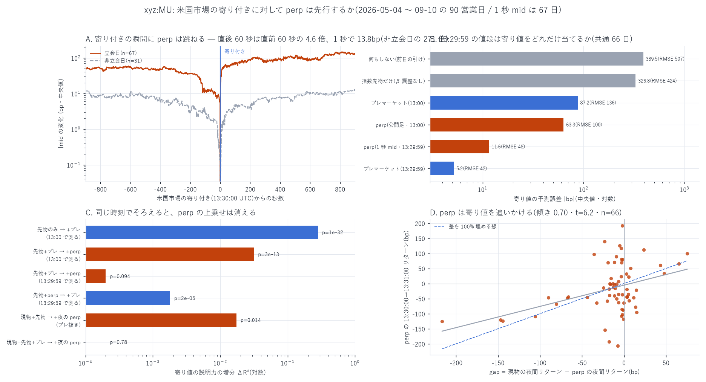
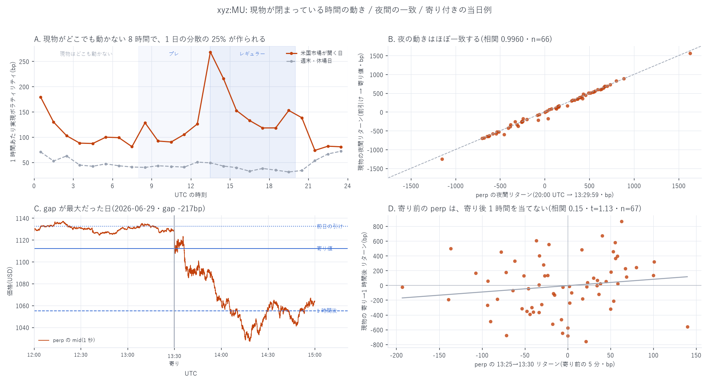

# 24 時間動く perp は、米国市場の寄り付きを先に知っているか

[← `xyz:MU` の索引](README.md) / [Hyperliquid の分析](../README.md) / [ホーム](../../../README.md)

**何を測ったか** — 米国市場が閉まっている間に動く `xyz:MU`(perp)の値段と、
原資産 MU(NasdaqGS)の**寄り付き**および**寄り後 1 時間**を突き合わせ、
perp に価格発見能力があるかを 7 通りに検定した。
標本は **2026-05-04 〜 09-10 の 90 営業日**(1 秒粒度の板がある日は 66〜67 日)。

**「価格発見能力」をどう定義したか** — 「先に動いた」だけでは足りない。
perp が単に**原資産のプレマーケット**や**株価指数先物**をなぞっているだけなら、
perp 自身は何も発見していない。そこで **他の情報源を統制したうえでの増分**で測る。

**時間契約** — 夜間の窓は全ての情報源で **[前営業日 20:00 UTC, 当日 13:00 UTC]** に
そろえた。指数先物の足は正時区切りで 13:30 UTC が取れないため、**perp に有利に
ならないよう**寄り付きの 30 分前で全部を切っている。1 秒粒度がある部分だけ
**13:29:59** でもそろえ直した。`join_asof` は backward のみ、`shift(-k)` は目的変数専用。
標本期間(5〜9 月)は全て米国夏時間なので寄り 13:30 UTC / 引け 20:00 UTC で固定である。

---

## 先に結論

**xyz:MU は「速い追随者」であって「発見者」ではない。**

| 問い | 答え | 数字 |
|---|---|---|
| 夜間の情報を取り込んでいるか | **ほぼ完全に** | 13:29:59 の perp は寄り値を誤差 **中央 11.6bp** で当てる(夜間の値動きは中央 **389.5bp**) |
| 原資産のプレマーケットより先か | **後** | 同時刻のプレマーケットの誤差は **5.2bp** で perp の 2.2 倍正確 |
| プレマーケットに上乗せがあるか | **ほぼ無い** | 増分 $`R^2`$ **+0.0002**(F=2.90, p=0.094)。逆にプレマーケットは perp に **+0.0018**(p=2×10⁻⁵)上乗せする |
| 現物が世界のどこでも動かない 8 時間は | **そこでは効く。ただし朝までに追いつかれる** | プレマーケット抜きなら夜の perp は増分 $`R^2`$ **+0.0174**(p=0.014)。プレマーケットを入れると **+0.0000**(p=0.78) |
| 寄り付きの瞬間に何が起きるか | **perp が跳ねる** | 13:30:00 の直後 1 秒で **13.8bp**。非立会日の同時刻の **271 倍**、立会時間の平常の 1 秒の **16 倍** |
| 寄り値との差はどちらが埋めるか | **perp が埋めに行く** | 差の **70%** を 1 分で埋める(t=6.2、95% 区間 [0.51, 0.92]) |
| 寄り前の perp は寄り後 1 時間を当てるか | **当てない** | β=+0.86(t=1.13、$`R^2`$=0.022)。プラセボでも β=+0.65(t=0.75) |

**1 つだけ perp が勝っている場面がある。** 現物が世界のどこでも取引されない
**00:00〜08:00 UTC の 8 時間**に、この銘柄は **1 日の分散の 24.7%** を作る。
その間の値動きは perp にしか無い。ただし **08:00 UTC にプレマーケットが開くと
朝までに完全に追い越される**ので、寄り値に対する「独自の」寄与は残らない。

---

## 1. 寄り付きの瞬間に何が起きるか



寄り付き(13:30:00 UTC)を 0 として、perp の mid が 1 秒ごとにどれだけ離れたかの
中央値を取った。対照は**同じ時刻の非立会日**(週末・休場日 31 日)。

| 13:30 からの秒 | 立会日 | 非立会日 | 比 |
|---:|---:|---:|---:|
| −300 秒 | 44.1bp | 6.8bp | 6.5 |
| −60 秒 | 13.0bp | 1.8bp | 7.2 |
| −5 秒 | 6.9bp | 0.15bp | 45.5 |
| **+1 秒** | **13.8bp** | **0.05bp** | **270.9** |
| +5 秒 | 32.2bp | 0.16bp | 198.5 |
| +60 秒 | 60.2bp | 3.6bp | 16.6 |
| +900 秒 | 124.5bp | 12.3bp | 10.2 |

- **直後 60 秒の動きは直前 60 秒の 4.6 倍**(60.2 対 13.0)。時間の向きに対して非対称で、
  perp は寄り付きの**前**ではなく**後**に動く。
- 立会時間中の「ふつうの 1 秒」の \|Δmid\| は中央値 **0.857bp**。寄り直後の 1 秒はその **16 倍**。
- 非立会日の同時刻は 0.05bp で、**何も起きない**。13:30 UTC という時刻そのものに
  意味があるのではなく、**現物が開くことに意味がある**。

図 2C は差が最大だった日の実例である。



2026-06-29、perp は 13:30 まで 1,130 前後(前日の引け 1,133)に居た。
寄り値は **1,112**(−187bp)。perp は**寄ってから**崩れ、1 時間で 1,055 まで落ちた。
perp はこの下げを 1 秒も先に知らなかった。

---

## 2. 夜間の情報をどれだけ取り込んでいるか

### 2.1 13:29:59 の値段は寄り値をどれだけ当てるか

現物の夜間リターン(前営業日の引け → 寄り値)を、各情報源の同じ窓のリターンで
「そのまま」当てにいったときの誤差。共通 66 日。

| 情報源 | 誤差の中央値 | RMSE |
|---|---:|---:|
| **プレマーケット(13:29:59)** | **5.2bp** | 41.7bp |
| perp(1 秒 mid・13:29:59) | 11.6bp | 47.6bp |
| perp(公開足・13:00) | 63.3bp | 100.5bp |
| プレマーケット(13:00 の最初の気配) | 87.2bp | 135.6bp |
| 指数先物だけ(β 調整なし) | 326.8bp | 424.1bp |
| 何もしない(前日の引け) | 389.5bp | 506.8bp |

**perp の誤差 11.6bp は、夜間の値動きの中央値 389.5bp の 3.0% にすぎない。**
分散でいえば 99.1% を取り込んでいる(RMSE 47.6bp 対 現物の夜間リターンの標準偏差 501.3bp)。これは十分に速い。
しかし**同時刻のプレマーケットはその 2.2 倍正確**である。

### 2.2 入れ子回帰 — 測る時刻をそろえると結論が変わる

`R_cash_on`(現物の夜間リターン)を説明する入れ子モデル。

**(a) 13:00 UTC でそろえた場合(90 営業日)**

| モデル | $`R^2`$ |
|---|---:|
| 指数先物のみ | 0.650 |
| 先物 + プレマーケット | 0.932 |
| 先物 + perp | 0.963 |
| 先物 + プレ + perp | 0.963 |

- perp を足す: Δ$`R^2`$ **+0.0316**、F(1,86)=73.9、**p=3.3×10⁻¹³**
- プレを足す: Δ$`R^2`$ +0.0003、F=0.74、p=0.39
- 前半 45 日 +0.0270 / 後半 45 日 +0.0409(符号も大きさも保たれる)
- プラセボ(perp を ±1 / +5 営業日ずらす): Δ$`R^2`$ +0.0000 / +0.0001 / +0.0016

**これだけ見ると「perp の圧勝」に見える。**

**(b) 13:29:59 でそろえ直した場合(66 営業日)**

| モデル | $`R^2`$ |
|---|---:|
| 先物 + プレマーケット | 0.9944 |
| 先物 + perp | 0.9929 |
| 先物 + プレ + perp | 0.9947 |

- perp を足す: Δ$`R^2`$ **+0.0002**、F=2.90、**p=0.094**
- プレを足す: Δ$`R^2`$ **+0.0018**、F=21.2、**p=2.1×10⁻⁵**

**(a) の圧勝は「測った時刻の差」だった。** 13:00 の「プレマーケット」は
13:00〜13:30 の足の**最初の気配**であり、プレマーケットの約定は疎なので古い。
一方 perp は連続的に約定しているので新しい。同じ 13:29:59 でそろえると、
**上乗せの向きは逆転する** — プレマーケットは perp を包含するが、逆は成り立たない。

なお両者の $`R^2`$ は 0.993〜0.994 でほぼ共線であり、**同時に入れたときの個別の係数は
定まらない**(プレ +1.655 / perp −0.615)。意味があるのは増分 $`R^2`$ の検定のほうで、
その結果が上表である。

---

## 3. 現物が世界のどこでも動かない 8 時間

米国株の時間外は **20:00〜00:00 UTC(アフター)** と **08:00〜13:30 UTC(プレ)** で、
**00:00〜08:00 UTC の 8 時間はどこでも取引されない**。この窓は perp にしか無い。

### 3.1 その 8 時間で何割の値動きが起きるか

perp の 5 分リターンから作った 1 時間あたり実現ボラティリティ(立会日)。

| 時間帯(UTC) | RV | 1 日の分散に占める割合 |
|---|---:|---:|
| 00〜08(現物はどこでも動かない) | 318bp | **24.7%** |
| 08〜13(プレマーケット) | 245bp | 14.6% |
| 13〜20(レギュラー) | 459bp | 51.4% |
| 20〜24(アフター) | 194bp | 9.2% |

週末・休場日でも 1 時間あたり 30〜72bp 動いており、**止まってはいない**
(立会日の同じ時刻との比は 1.1〜5.5 倍)。
時間の境は正時で近似しているので、13 時台には寄り付きの前後が混ざっている。

★1 秒リターンは使っていない。8,462,534 秒のうち **34 秒**で mid が一瞬だけ桁違いに
飛んで戻る(例 2026-06-14 10:58:37 に 1,009 → 198.7 → 1,005)。
板が一瞬空いた痕跡であって価格情報ではないが、2 乗和はこれに支配される。

### 3.2 その 8 時間に見つけた分は寄り値に残るか

夜間を 4 つの窓に分解して入れ子回帰にかけた。**全変数がそろう 55 日**で統一している
(標本が違うモデル同士を F 検定にかけると意味を成さない)。

| 変数 | 窓 |
|---|---|
| `A` 現物のアフター | 前日の引け → 00:00 UTC |
| `X0` 現物が夜を跨いだ飛び | 00:00 UTC → 08:00 UTC の最初の気配 |
| `Nn` / `Nm` 指数先物 | 00:00→08:00 / 08:00→13:00 |
| `Pn` **夜の perp** | **00:00 → 08:00 UTC** |
| `Pm` プレマーケット | 08:00 → 13:29:59 |

| モデル | $`R^2`$ |
|---|---:|
| S1 = A + X0 + Nn + Nm | 0.8522 |
| S2 = S1 + **Pn** | 0.8696 |
| S3 = S1 + Pm | 0.9960 |
| S4 = S3 + **Pn** | 0.9960 |

- **プレマーケットが無い状態から**夜の perp を足す: Δ$`R^2`$ **+0.0174**、F=6.56、**p=0.014**
- **プレマーケットを入れた状態から**足す: Δ$`R^2`$ **+0.0000**、F=0.08、**p=0.78**
- プラセボ(夜の perp を ±1 営業日ずらす): いずれも Δ$`R^2`$ +0.0000

**読み方** — 夜の 8 時間、perp は確かに何かを持っている(S1→S2 で有意)。
だがその「何か」は、**08:00 に開くプレマーケットが 13:29 までに完全に吸収してしまう**。
寄り値に対する独自の寄与はゼロである。

なお S1→S2 の +0.0174 は「perp が知っていた」というより「**perp のほうが夜の動きを
正確に測れている**」寄与の可能性が高い。`X0`(08:00 の最初のプレマーケット気配で測った
夜の飛び)の係数は、perp を入れると +1.04(t=3.4)から +0.51(t=1.4)へ落ちる。
2 つは同じものを別の精度で測っている。

---

## 4. 寄り値との差はどちらが埋めるか

$`\mathrm{gap}`$ = 現物の夜間リターン − perp の夜間リターン(13:29:59 まで)と定義する。
**gap は寄り値が出た 13:30:00 の時点で確定する**ので、13:30 以降を説明するのに使える。
gap の散らばりは標準偏差 44.9bp、\|gap\| の中央値 11.6bp。

| 目的変数 | β | t | 95% 区間 | $`R^2`$ |
|---|---:|---:|---|---:|
| **perp 13:30:00→13:31:00** | **+0.704** | **6.17** | **[+0.51, +0.92]** | 0.155 |
| perp 13:30→13:35 | +0.674 | 2.40 | [+0.10, +1.33] | 0.063 |
| perp 13:30→14:30 | +2.597 | 2.43 | [+0.45, +4.67] | 0.110 |
| 現物 寄り→1 時間後 | +1.767 | 1.59 | [−0.39, +3.95] | 0.049 |
| 現物 1 時間後→2 時間後 | −0.002 | −0.00 | [−0.96, +1.27] | 0.000 |
| 現物 寄り→引け | +0.664 | 0.43 | [−1.64, +3.77] | 0.004 |

区間は 2,000 回のブートストラップ。

- **perp は 1 分で差の 70% を埋めに行く。** 追いかけているのは perp のほうである。
- **現物は gap の向きに動かない。** 「寄り付きの板より perp のほうが正しかった」なら
  β は**負**になるはずだが、観測されたのは弱い正(=モメンタム)で、しかも有意でない。

★**頑健性の但し書き。** 上下 5% を刈ると β は +0.704 → **+0.393(t=1.28, n=58)** に落ちる。
順位相関は **+0.262**(n=66, p≈0.034)。つまりこの効果は **gap が大きかった日に集中**している。
gap が小さい日に「追いつく余地」が無いのは当然なので不自然ではないが、
**毎日ちゃんと 70% 埋まる、という読み方はできない**。
プラセボ(gap を ±1 営業日ずらす)は β=+0.04 / −0.01 で消える。

★**観測誤差の向き。** gap は寄り値を含むので、「現物 寄り→1 時間後」とは
寄り値の観測誤差 $`\varepsilon`$ を共有し、**仮説(負)の向きに見かけの相関**が乗る。
大きさは $`\sigma_\varepsilon^2/\sigma_{\mathrm{gap}}^2`$ 程度で、板寄せ値の誤差を 1bp と置くと
$`(1/44.9)^2 \approx 5\times10^{-4}`$。観測された +1.767 とは桁が違うので効かない。
重ならない「1 時間後→2 時間後」でも β≈0 である。

---

## 5. 寄り後 1 時間 — perp は先読みできるか

| 説明変数(確定時刻) | 目的変数(期間) | β | t | $`R^2`$ | プラセボの β |
|---|---|---:|---:|---:|---:|
| perp 13:25→13:30(13:30:00) | 現物 寄り→1 時間後 | +0.862 | 1.13 | 0.022 | +0.653(t=0.75) |
| perp 13:25→13:30(13:30:00) | 現物 1 時間後→2 時間後 | +0.089 | 0.28 | 0.001 | +0.321(t=0.94) |

**当てない。** プラセボ(1 営業日ずらした同じ変数)がほぼ同じ大きさを出しており、
実測との差は無い。

一方、**同時点では両者はほぼ同じもの**である。
perp の 13:30→14:30 リターンと現物の寄り→1 時間後リターンの相関は **0.9816**(n=67)。
これは予測ではなく、寄り付き後は裁定が効いて 2 つが同じ値段を指しているという事実である。

---

## 6. データの欠陥を 2 つ直した

### 6.1 「始値」の出どころ

Yahoo の**日足の `open`** は、95 日中 **15 日**で 13:30 UTC の足の値幅の外に出ていた
(5 日は完全に外)。食い違う日では、日足の `open` は**直前のプレマーケットの値と
3.1bp しか離れておらず**、13:30 足の始値とは 61.3bp 離れている。
つまり日足の `open` はレギュラーの寄り付き値ではない日がある。

→ **13:30 UTC の足の `open`(レギュラー最初の約定)を寄り値として採用した。**
一致する日での差は中央値 1.48bp。

### 6.2 前「営業日」を前「カレンダー日」と取り違えていた

最初の実装で perp の前日引けを `当日 − 86400 秒` で取っていたため、
**月曜と休場明けが全部壊れていた**(土日の 20:00 UTC を「前日の引け」にしていた)。
\|gap\| 上位 10 日が全て月曜・休場明けだったことで気づいた。修正後、
gap の標準偏差は **127.8bp → 44.9bp** に落ちた。

### 6.3 そのほかの検算

- 公開 API の 1 時間足(13:00 終値)と手元の 1 秒 mid: 67 日で差は中央 **1.15bp** /
  90% 点 4.39bp / 最大 8.3bp。公開足で標本を 66 日から 90 日へ伸ばしてよいと判断した。
- 時間外の足の `high` / `low` には明らかな誤気配が混ざる
  (例 2026-06-01 の 20:00 UTC 足の `low` = 928.41、前後は 1,035 前後)。
  **時間外は `open` と `close` しか使っていない。**

---

## 7. 限界 — 何を言っていないか

1. **現物の分足が取れない。** この標本期間(2026-05〜08)で無料に取れる原資産の
   最小粒度は **1 時間足**である(1 分足は直近 30 日、5 分足は 60 日まで)。
   したがって**寄り後 1 時間の中でどちらが先行するかは分解できていない**。
   本レポートが 1 秒粒度で言えるのは perp 側だけである。
2. **「上乗せが無い」は「ゼロである」ことの証明ではない。** 66 日の標本で
   検出できる増分 $`R^2`$ の下限はおよそ 0.0003 で、観測値 +0.0002 はその近傍にある。
   もっと長い標本なら小さな上乗せが見つかる可能性は残る。
3. **マーク価格がオラクル由来かもしれない。** HIP-3 の配備 perp のマーク価格が
   原資産の価格をオラクルで引いているなら、追随は**機構的に強制されている**もので、
   参加者の行動ではない。この点は手元のデータからは観測できない。
4. **1 銘柄・1 期間**である。90 営業日、うち 1 秒粒度は 66〜67 日。
   他の 6 銘柄(INTC / AMD / KIOXIA / SKHX / SMSN / SNDK)には適用していない。
5. **多重比較の規模**: 本レポートで走らせた検定は
   T1 の 8 ホライズン、T2 の 6 モデル + 3 つの F 検定 + 2 分割 + 3 プラセボ、
   T2b の 3 モデル + 2 F、T3/T4 の 6 回帰 + 刈り込み + 2 プラセボ、
   T5 の 2 + 2 プラセボ、T7 の 4 モデル + 2 F + 2 プラセボ で **およそ 50 通り**。
   結論を担っているのは p = 3×10⁻¹³(T2a)、p = 2×10⁻⁵(T2b)、t = 6.2(T4)で、
   いずれも Bonferroni 閾値 0.05/50 = 1.0×10⁻³ を通る。
   通らない側(p = 0.094 / 0.78 / 0.014)は「効果が無い」ではなく「検出されなかった」と読む。
6. **執行の話をしていない。** 手数料・スプレッド・遅延は一切考慮していない。

---

## 8. 再現手順

```bash
uv run python scripts/fetch_cash.py     --symbols MU NQ=F SMH     # Yahoo の公開 API
uv run python scripts/fetch_hlcandle.py --coin xyz:MU --interval 1h
uv run python scripts/build_pricedisc.py --coin xyz:MU
uv run python scripts/plot_pricedisc.py  --coin xyz:MU
```

`build_pricedisc.py` は 1 秒 mid のために `data/_liqmid_xyz_MU.npz` を使う。
無ければ `data/bbo_xyz_MU.parquet`(`fetch_bbo.py`)から自動で作られる。

---

リポジトリ全体の目次は [../../../README.md](../../../README.md) にあります。
