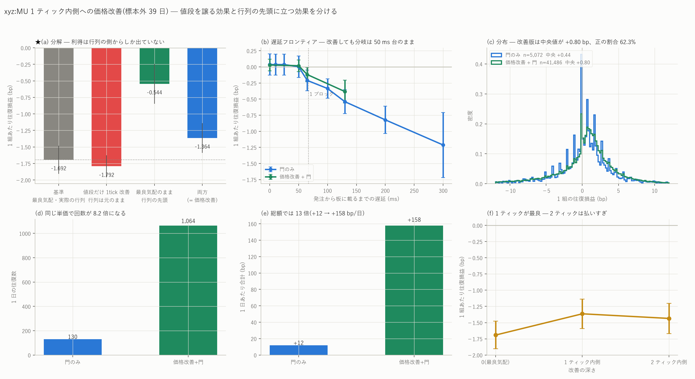

# xyz:MU — 1 ティック内側への価格改善(候補 1 の未検証部分)

図: `xyz_MU_improve.png`



候補 1 のうち、既存の検証で**まだ触れていなかったのが「内側への価格改善」**である。
既報 `mu_depth_report.md` は `bid − k tick / ask + k tick` という**外側**への配置しか
見ておらず、内側の否定にはなっていない。ここを埋める。

数値はすべて**標本外 39 日**(2026-07-02〜08-09)。門は前 59 日だけで学習し、
評価期間には一度だけ当てている。

---

## 0. 結論を先に

| | 結果 |
|---|---|
| 1 ティック内側へ改善すると | **良くなる**(門なしで −1.692 → **−1.364 bp**、往復数 +21%) |
| 2 ティックは | **払いすぎ**(−1.435)。最適は 1 ティック |
| 改善 + 往復損益で学習した門 | **+0.0285 ± 0.0460 bp、1,064 組/日、+157.7 bp/日**。門だけの版(130 組/日、+12.0 bp/日)に対し**回数 8.2 倍・総額 13 倍**で、**誤差は 0.084 → 0.046 に縮む** |
| ★ その利得はどこから来るか | **すべて行列の優先順位から**。値段だけ譲る版は基準より**悪い**(−1.792)。最良気配のまま行列の先頭に立つ版は **−0.544**(+1.148 bp) |
| 遅延 | 分岐は **50 ms 台**のまま。65 ms(1 ブロック)で −0.120(t=−2.08) |
| **ご提示の見送り条件**(区間下限が正) | **満たさない。**最良でも 95% 区間は [−0.062, +0.119] |

**回数と総額は大きく伸びたが、単価の区間下限は依然として負である。**
ご提示の判定基準に照らすと、候補 1 は**このままでは見送りの側**にある。
ただし後述のとおり、**何を買うべきかが 1 つはっきりした**。

---

## 1. 何をどう実装したか

在庫を増やす側の指値を、最良気配より **1 ティック内側**に置く。

    買い: bid + 1tick    売り: ask − 1tick

**スプレッドが 2 ティック以上あるときだけ**改善する(反対気配を跨がない
post-only を保つ条件でもある)。足りなければ最良気配のまま置く。
評価期間では **77.3% の窓**でこの条件を満たす。
在庫を減らす側は改善しない(そちらは在庫を消すのが目的で、譲る理由がない)。

内側の値段には誰も並んでいない(スプレッドの中は空)ので、**待ち行列は 0**、
すなわち行列の先頭に立つ。ただし待ち行列 0 だと `fill_times` が値段を無視して
埋まる退化があるので、1 ロットを下限にしてある
(この不具合は `mu_inventory_mm_report.md` §2 で見つけたもの)。

### ティックの値段

評価期間の MU では **1 ティック = 0.113 bp**(中央値)、半スプレッド 0.407 bp、
スプレッドは **7.19 ティック**。したがって 1 ティック譲るのは
半スプレッドの 28% を手放すことに当たる。
(価格が 1000 を超える日はティックが 0.1 になり、p90 では 0.964 bp と高くつく。)

---

## 2. 結果

### 門なし

| 方策 | 往復/日 | 1 組あたり | t |
|---|---:|---:|---:|
| 最良気配(基準) | 6,248 | −1.692 ± 0.109 | −15.57 |
| **1 ティック内側** | **7,541** | **−1.364 ± 0.115** | −11.84 |
| 2 ティック内側 | 7,335 | −1.435 ± 0.119 | −12.09 |

**+0.33 bp 改善し、往復数も 21% 増える。**2 ティックは払いすぎで悪化する。

### 門つき(往復損益で学習し直した門)

改善方策のもとで発注記録を取り直し、**その方策の往復損益を目的変数**にして
入口の門を学習し直した(門を通るのは発注の 18.2%。改善なしの版では 6.4%)。

| | 往復/日 | 1 組あたり | t | 1 日あたり |
|---|---:|---:|---:|---:|
| 門のみ | 130 | +0.0360 ± 0.0835 | +0.43 | +12.0 bp |
| **価格改善 + 門** | **1,064** | **+0.0285 ± 0.0460** | +0.62 | **+157.7 bp** |

**単価はほぼ同じだが、回数が 8.2 倍・総額が 13 倍になる。**
標本が増えたぶん**誤差が 0.084 → 0.046 とほぼ半分**になり、
「ゼロと区別できない」という判定の精度自体は上がっている。

分布も改善する(評価期間 41,486 組):

| | 建玉 | 平均 | 中央 | 正の割合 | 相殺中央 | 60 秒相殺 |
|---|---:|---:|---:|---:|---:|---:|
| 門のみ | 5,072 | +0.092 | +0.440 | 56.3% | 5.28 s | 93.8% |
| 価格改善 + 門 | 41,486 | +0.148 | **+0.804** | **62.3%** | **3.33 s** | **97.5%** |

### 遅延

| 遅延 | 往復/日 | 1 組あたり | t |
|---:|---:|---:|---:|
| 0 ms | 1,064 | +0.0285 ± 0.0460 | +0.62 |
| 50 ms | 1,049 | +0.0176 ± 0.0460 | +0.38 |
| **65 ms**(1 ブロック) | 890 | **−0.1196 ± 0.0574** | −2.08 |
| 130 ms | 673 | −0.3828 ± 0.0903 | −4.24 |

**分岐は 50 ms 台のまま**で、価格改善は遅延の壁を動かさない。
`mu_latency_frontier_report.md` の結論(1 ブロックで崩れる)は変わらない。

---

## 3. ★ 利得の分解 — 買っているのは値段ではなく順番である

価格改善は 2 つのことを同時にやっている。**値段を 1 ティック譲る**ことと、
**行列の先頭に立つ**ことである。これを分けて回した。

| 方策 | 往復/日 | 1 組あたり | t | 基準との差 |
|---|---:|---:|---:|---:|
| 基準(最良気配・実際の行列) | 6,248 | −1.692 ± 0.109 | −15.57 | — |
| **値段だけ 1 ティック改善**(行列は元のまま) | 6,276 | **−1.792 ± 0.085** | −21.12 | **−0.10** |
| **最良気配のまま行列の先頭**(値段は譲らない) | 14,013 | **−0.544 ± 0.154** | −3.54 | **+1.15** |
| 両方(= 価格改善) | 7,541 | −1.364 ± 0.115 | −11.84 | +0.33 |

**値段だけ譲るのは基準より悪い。**1 ティック払って得られるのは
「約定判定の閾値が少し緩む」ことだけで、そこで増える約定は不利なものが多い。

**利得はすべて行列の側から出ている。**最良気配のまま先頭に立てるなら **+1.15 bp**、
往復数も 6,248 → 14,013 と 2.2 倍になる。これは既報
`mu_hazard_report.md` の「先客数量 100〜300 契約の群の最終約定率は先頭群の 1/8.4」を
**損益の単位で測り直したもの**にあたる(あちらは条件付分布であって因果ではない、
という留保はここでも同じ)。

そして **1 ティック払って先頭を買うと、+1.15 の利得のうち手元に残るのは +0.33 だけ**である。
足し算(−0.10 + 1.15 = +1.05)にならないのは、内側に置くと約定判定が緩むぶん
**先頭でありながら不利な約定も拾う**ためで、2 つの効果は独立ではない。

> **ご指摘のとおり「+0.480 bp から 1 ティックを引く」計算では足りなかった。**
> ただし方向が逆で、**引きすぎではなく足りなさすぎ**だった —
> 1 ティックの費用(0.113 bp)より、内側に置くことで増える不利な約定のほうが重い。

なお「最良気配のまま行列の先頭」は**実装できない方策**である。
自分の意思で BBO の先頭には立てない(先に並んでいるか、前の行列が消えるかしかない)。
`mu_depth_report.md` の「BBO 売り・100ms で +0.036 bp/候補、t=4.15」も
同じ先頭仮定の上にあり、**その仮定を実装可能な形にする唯一の手段が価格改善**である。
そして今回、その手段の価格が高すぎることが分かった。

---

## 4. ご提示の判定基準に照らして

> 実測遅延分布を使った往復評価でも区間下限が正にならない場合、この候補は見送る。

**満たしません。**最良の設定(改善 + 門・遅延 0)でも
95% 区間は **[−0.062, +0.119]** で、下限は負である。
遅延 50 ms では [−0.073, +0.108]、65 ms では [−0.232, −0.007] と
**上限まで負に入る**。

なお「実測遅延分布」そのものはまだ得られていない
(`probe_latency.py` は用意したが、取引用の鍵が無く実行していない)。
ここで使っているのは固定遅延の格子である。

---

## 5. 限界(この結果を強く読まないために)

1. **★ 他者の反応を再現できない。**内側に置けば他のメイカーも改善してくるはずだが、
   再生では過去の板の系列がそのまま流れる。したがって
   **価格改善の効果はここでの推定が上限**である。
2. **自分の注文が板を変えない前提。**内側に置いた時点で BBO は自分の値段になるが、
   再生では過去の BBO がそのまま続く。注文の有効期限も過去の気配変化で切っている。
3. **約定を横取りしている。**過去に他者へ約定した取引を、自分が先に取ったことにしている。
   1 ロットなので影響は小さいはずだが、無視できるという証拠は無い。
4. **「両方」の 23% は改善していない。**スプレッドが 2 ティック未満の窓では
   最良気配のまま置くので、上表の「両方」は 77% だけが改善版である。
   純粋な比較にはなっていない。
5. **門は方策ごとに学習し直している。**改善版と非改善版で門が違うので、
   「同じ門で改善だけを入れた」比較ではない(そのほうが公平だと判断した)。
6. **単価の区間はゼロを跨いだままである。**総額 +158 bp/日 という数字は
   単価に回数を掛けたもので、単価が有意でない以上、総額も有意ではない。

---

## 6. 候補 1 のうち、まだ手を付けていないもの

- **条件つきの出し直し。**いまは「自分側の気配が動いたら必ず出し直す」(追随)か
  「値段を固定して置き続ける」かの 2 通りしか試していない。
  期待往復利益の悪化・板の変化に応じて出し直す方策は未実装である。
  §3 のとおり**行列の順番が 1.15 bp の価値を持つ**以上、
  「不要な出し直しで順番を捨てない」規則には見込みがあると考える。
  **候補 1 の残りとしてはここが最有望**である。
- 状態依存の出口(共通部品)。固定 timeout がどれも改善しなかったことは
  `mu_inventory_mm_report.md` §4 で示したが、状態依存版は未実装のまま。

候補 2(sweep インパクト非対称 + 観測済み補充)と候補 3(参加者の約定品質)は
未着手である。ご指摘のとおり、現行 36 変数には Q=5 の sweep インパクト非対称は無く、
`resilience` 列は過去 10 秒の追加量 ÷ 板厚でショック後 1 秒の回復とは別物なので、
**既存の門が同じ仮説を検証済みとは言えない**。

---

## 7. 再現手順

```bash
uv run python scripts/build_inventory.py --coin xyz:MU --qmax 1 --improve 1
uv run python scripts/build_inventory.py --coin xyz:MU --qmax 1 --improve 2
uv run python scripts/build_inventory.py --coin xyz:MU --qmax 1 --improve 1 --front price
uv run python scripts/build_inventory.py --coin xyz:MU --qmax 1 --front queue
uv run python scripts/build_inventory.py --coin xyz:MU --qmax 1 --improve 1 --posts
uv run python scripts/build_entrygate.py --coin xyz:MU --sfx _q1_imp1
uv run python scripts/build_inventory.py --coin xyz:MU --qmax 1 --improve 1 \
    --gate data/entrygate_xyz_MU_q1_imp1.parquet
for L in 0.050 0.065 0.130; do \
  uv run python scripts/build_inventory.py --coin xyz:MU --qmax 1 --improve 1 \
      --lat $L --gate data/entrygate_xyz_MU_q1_imp1.parquet; done
uv run python scripts/build_inv_summary.py --coin xyz:MU
uv run python scripts/plot_improve.py --coin xyz:MU
```
