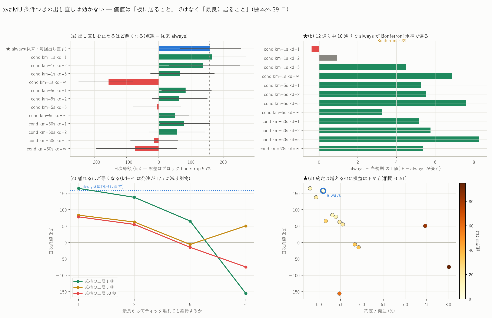

# xyz:MU — 条件つきの出し直しは効かない(候補 1 手順②)

図: `xyz_MU_requote.png`



これまでのシミュレータは `follow`、つまり**自分側の最良気配が動くたびに無条件で
取り消して並び直す**規則だった。順番に +1.15 bp の価値があると分かった以上
(`mu_price_improvement_report.md`)、毎回順番を捨てるのは無駄に見える。
そこで「維持 / 取消して再発注」を条件で選ぶ規則を実装して検定した。

結論から書くと、**効かない。12 通り中 10 通りで従来の「毎回出し直す」が
Bonferroni 水準で有意に優り、残り 2 通りも差が検出できない。**
数値はすべて標本外 39 日(2026-07-02〜08-09)の**日次総額**。

---

## 0. 実装した規則

自分側の最良気配が動いた瞬間に、生きている注文について次を判定する。

| | 内容 |
|---|---|
| `always` | 従来。必ず取り消して新しい最良気配に出し直す(行列の最後尾) |
| `cond` | 自分側の最良が **mid 側へ動いた**ときだけ維持する |
| `keep` | 向きを問わず維持する |

`cond` を選んだ理由は幽霊注文の仮定である。**mid 側へ動いた場合**、自分の指値は
最良より不利な位置に隠れ、最良は他人が作る。自分の注文が板に無いという仮定は
壊れない。**mid から遠ざかる向き**で維持すると、自分が唯一の最良気配になって
しまい、仮定が結論を作る。だから `keep` は上界としてのみ読む。

閾値は 2 つ置いた(ご指示の `V_replace − V_keep > η` の代わりに、
**各時点で計算できる量**で書いた)。

- `keepmax`(km): 何秒まで同じ注文を置いておくか。1 / 5 / 60 秒
- `keepdt`(kd): 最良から何ティックまで離れても維持するか。1 / 2 / 5 / ∞

---

## ★ 先に訂正 — 最初の実装は各時点で判定できない規則だった

最初の版は「60 秒以内に約定しない注文は板に置かない」実装になっていた。
置かなくても次の気配変化(ミリ秒後)で出し直せるので、結果として
**「約定する注文だけを持ち続ける」**方策になる。これは
**その注文が約定するかどうかを見てからでないと判定できない**(自己精査 D16)。

出た数字は **+11.2 bp/組**。半スプレッド 0.407 bp の 27 倍で、桁がおかしい。
約定時に板を跨いでいた割合は 0.0% だったので板の物理ではなく規則の問題と
絞れた。**約定しない注文も板を占有させる**ように直したところ
−0.35 bp/組 になり、以下はすべて修正後の値である。

`always` の経路は改修の影響を受けていないことを回帰検査で確認した
(同じ 3 日で約定件数・日次総額が小数以下まで一致)。

---

## 1. 結果(格子 13 通り・全件)

| 規則 | 組/日 | 日次総額 (bp) | t | ブロック bootstrap 95% | 正の日 |
|---|---:|---:|---:|---|---:|
| **★ always(従来)** | 1,064 | **+157.72** | +3.62 | [+66.3, +255.9] | 27/39 |
| cond km=1s kd=1 | 955 | +164.96 | +3.14 | [+66.9, +270.1] | 26/39 |
| cond km=1s kd=2 | 935 | +137.73 | +2.44 | [+32.7, +252.2] | 25/39 |
| cond km=1s kd=5 | 893 | +65.53 | +1.25 | [−26.0, +173.0] | 20/39 |
| cond km=1s kd=∞ | 697 | −155.87 | −3.52 | [−248.9, −79.9] | 11/39 |
| cond km=5s kd=1 | 1,022 | +83.28 | +2.35 | [+8.1, +163.6] | 22/39 |
| cond km=5s kd=2 | 998 | +62.41 | +1.58 | [−22.1, +150.8] | 16/39 |
| cond km=5s kd=5 | 952 | −6.04 | −0.16 | [−80.2, +68.8] | 14/39 |
| cond km=5s kd=∞ | 652 | +50.66 | +1.98 | [+3.4, +94.1] | 24/39 |
| cond km=60s kd=1 | 1,034 | +78.18 | +2.18 | [+2.6, +158.8] | 21/39 |
| cond km=60s kd=2 | 1,008 | +55.07 | +1.38 | [−30.9, +144.7] | 16/39 |
| cond km=60s kd=5 | 959 | −14.81 | −0.39 | [−87.8, +60.1] | 14/39 |
| cond km=60s kd=∞ | 340 | −74.77 | −1.10 | [−193.4, +55.6] | 16/39 |
| keep km=60s(上界) | 1,032 | **−4,753.21** | −14.49 | [−5,596.7, −3,957.3] | **0/39** |

**同じ日で対にした差(always − 各規則。正なら always が優る)**

| 規則 | 差 (bp/日) | t | 95% | always が勝つ日 |
|---|---:|---:|---|---:|
| cond km=1s kd=1 | −7.24 ± 18.66 | −0.39 | [−43.7, +28.8] | 19/39 |
| cond km=1s kd=2 | +19.99 ± 21.13 | +0.95 | [−22.4, +63.8] | 22/39 |
| cond km=1s kd=5 | **+92.19 ± 20.56** | **+4.48** | [+47.8, +139.9] | 26/39 |
| cond km=1s kd=∞ | **+313.60 ± 45.64** | **+6.87** | [+196.2, +454.4] | 27/39 |
| cond km=5s kd=1 | **+74.44 ± 14.17** | **+5.26** | [+46.0, +101.8] | 33/39 |
| cond km=5s kd=2 | **+95.31 ± 17.25** | **+5.53** | [+59.8, +129.1] | 32/39 |
| cond km=5s kd=5 | **+163.76 ± 21.59** | **+7.59** | [+110.2, +212.5] | 33/39 |
| cond km=5s kd=∞ | **+107.06 ± 32.79** | **+3.26** | [+11.9, +213.4] | 22/39 |
| cond km=60s kd=1 | **+79.54 ± 15.44** | **+5.15** | [+47.7, +109.3] | 34/39 |
| cond km=60s kd=2 | **+102.66 ± 17.80** | **+5.77** | [+67.0, +137.4] | 34/39 |
| cond km=60s kd=5 | **+172.53 ± 20.90** | **+8.25** | [+123.5, +218.8] | 34/39 |
| cond km=60s kd=∞ | **+232.49 ± 43.23** | **+5.38** | [+126.1, +368.4] | 25/39 |
| keep km=60s | **+4,910.93 ± 322.44** | **+15.23** | [+4,088.0, +5,784.0] | **39/39** |

**格子は 13 通り。Bonferroni(両側 5%)の |t| 閾値は 2.891。太字は閾値超え。**
12 通りの `cond` のうち **10 通りで always が有意に優る**。残る 2 通り
(km=1s の kd=1・kd=2)は**差を検出できない**であって、
「差が無い」ではない — この標本で検出できるのは ±37〜42 bp/日 程度である
(自己精査 C9)。

---

## 2. なぜ効かないか — 約定は増えるのに損益は下がる

| 規則 | 維持率 | 発注/日 | 約定/発注 | 日次総額 |
|---|---:|---:|---:|---:|
| always | 0.0% | 41,732 | **5.10%** | **+157.7** |
| km=1s kd=1 | 12.4% | 39,837 | 4.79% | +165.0 |
| km=1s kd=5 | 29.9% | 34,630 | 5.16% | +65.5 |
| km=1s kd=∞ | 60.4% | 25,481 | 5.47% | −155.9 |
| km=5s kd=5 | 34.1% | 32,661 | 5.83% | −6.0 |
| km=5s kd=∞ | 81.6% | 17,482 | 7.47% | +50.7 |
| km=60s kd=5 | 35.0% | 32,385 | 5.92% | −14.8 |
| km=60s kd=∞ | 94.9% | 8,477 | **8.01%** | −74.8 |

**注文を置きっぱなしにすると約定率は 5.10% から 8.01% へ上がるのに、
損益は下がる。**13 通りを 1 点ずつ見た相関は −0.51(点が 13 個なので
これは検定ではなく傾向の記述である)。

増える約定は**自分の指値が最良から取り残された状態での約定**であり、
それは「市場が自分の値段まで掃いてきた」ということである。つまり
逆選択そのものになる。`keep` が 39 日すべて負(−4,753 bp/日)なのは
その極端形で、下がっていく市場に高い買い指値を置き続ける方策になる。

**この結果は既報と整合する。**価値があるのは**最良に居ること**であって
**板に居ること**ではない。`mu_price_improvement_report.md` の分解
(値段だけ改善 −0.10 / 行列の先頭 +1.15)も、
`mu_candidates_report.md` の候補 3(先頭で約定した分は逆選択が 37% 少ない)も、
同じことを別の角度から言っている。順番の価値は**現在の最良における順番**の
価値であって、古い値段における順番の価値ではない。

---

## 3. 限界

1. **η を学習していない。**ご指示は `V_replace − V_keep > η` だった。ここでは
   V を推定する代わりに、**各時点で計算できる 2 つの状態量**(最良からの
   ティック差・経過秒数)で格子を切った。V を学習した規則ならこの格子の
   外に良い点があるかもしれない。ただし格子の勾配は「維持は一貫して損」で
   一方向なので、望みは薄いと見ている。
2. **維持中の待ち行列は発注時点で凍結している。**自分の値段の水準が
   取消で薄くなっても、自分の前の行列は減らない(掃かれた分だけ減る)。
   これは維持側に**不利**な方向の近似なので、上の否定的な結論は弱まらない。
3. **幽霊注文の仮定。**自分の注文が板に影響しないという前提は `keep` で
   特に効くので、`keep` の −4,753 は上界としてのみ読むこと。
4. **MU 単独・この期間**の結果である。

---

## 4. 再現手順

```bash
for km in 1 5 60; do for kd in 1 2 5 0; do
  uv run python scripts/build_inventory.py --coin xyz:MU --qmax 1 --improve 1 \
    --requote cond --keepmax $km --keepdt $kd --skip 59 \
    --gate data/entrygate_xyz_MU_q1_imp1.parquet
done; done
uv run python scripts/build_inventory.py --coin xyz:MU --qmax 1 --improve 1 \
  --requote keep --keepmax 60 --skip 59 --gate data/entrygate_xyz_MU_q1_imp1.parquet
uv run python scripts/build_dailypnl.py --coin xyz:MU --set requote
uv run python scripts/plot_requote.py --coin xyz:MU
```

生成物: `data/dailypnl_rq_xyz_MU.csv`(規則ごとの日次総額と区間)/
`dailypnl_pairs_rq_xyz_MU.csv`(同じ日で対にした差)/
`requote_mech_xyz_MU.csv`(維持率・発注数・約定率)。
