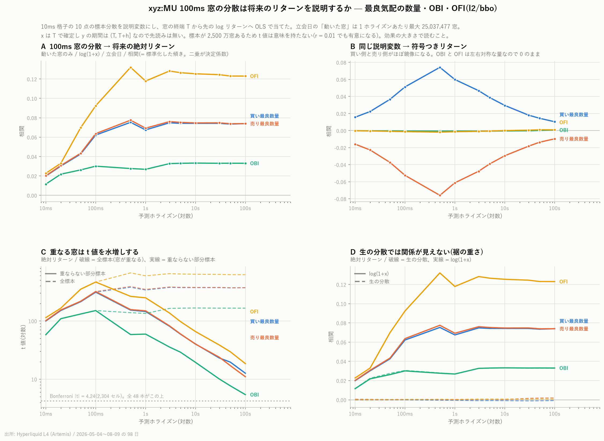

# 100ms 窓の分散は将来のリターンを説明するか

[← xyz:MU の分析索引](README.md) ／ [用語辞書](../../../GLOSSARY.md)

対象 `xyz:MU` ／ 標本 2026-05-04 〜 2026-08-09 の 98 日(立会日 67 / 閉場日 31)

板の量を 10ms の時計に載せ、100ms ごとの **標本分散** を説明変数にして、
10ms から 100 秒までの 12 のホライズンの将来 log リターンへ OLS で当てました。



---

## 1. 何を説明変数にしたか

10ms 格子に載せた 4 つの量(買いと売りは分けます)

| 記号 | 中身 | 種類 | 格子点 T の値 |
|---|---|---|---|
| `bid_depth` | 最良買い気配の数量 | 状態 | T 以前の最後の値(空区間は持ち越し) |
| `ask_depth` | 最良売り気配の数量 | 状態 | 同上 |
| `obi` | [OBI](../../../GLOSSARY.md) | 状態 | 同上 |
| `ofi` | [OFI](../../../GLOSSARY.md) | 流量 | 区間内の合計(空区間は 0) |

を 10 点ずつ(= 100ms)まとめ、その標本分散(ddof=1)を取ります。

**時間契約**: 窓 $`j`$ は格子点 $`10j \ldots 10j+9`$ を含み、最後の点の時刻を $`T`$ とすると

```math
x = \operatorname{Var}(x_{10j}, \ldots, x_{10j+9}), \qquad
y = \log \mathrm{mid}_{T+h} - \log \mathrm{mid}_{T}
```

で、$`x`$ は $`T`$ で確定し $`y`$ の期間は $`(T,\, T+h]`$ です。先読みはありません。
`shift(-k)` は $`y`$ にしか使っていません。クロスした板の行は除外しています。

立会日の「動いた窓」で、1 ホライズンあたり最大 **25,037,477 窓**です。

## 2. 目的変数を 3 つ出した理由

分散は符号を持たないので、符号つきリターンとの関係は
**左右対称な量については構造的に 0 になる**はずです。そこで 3 つ並べました。

```math
y_{\text{signed}} = \log \mathrm{mid}_{T+h} - \log \mathrm{mid}_{T}, \qquad
y_{\text{abs}} = |y_{\text{signed}}|, \qquad
y_{\text{sq}} = y_{\text{signed}}^2
```

結果として **二乗は使いものになりません**。裾が重すぎて、立会日 500ms で
相関が全特徴量とも $`|r| \le 0.0002`$ にしかなりません。少数の窓が最小二乗を支配するためです。
以下は絶対値を主に報告します。

## 3. 結果 — 絶対リターンへの相関(図 A)

立会日・動いた窓・log(1+x)・全標本。相関 $`r`$ の二乗が決定係数です。

| ホライズン | OFI | 売り最良数量 | 買い最良数量 | OBI |
|---|---:|---:|---:|---:|
| 10ms | +0.023 | +0.020 | +0.020 | +0.012 |
| 100ms | +0.092 | +0.064 | +0.062 | +0.030 |
| **500ms** | **+0.132** | **+0.078** | **+0.075** | **+0.028** |
| 1s | +0.118 | +0.069 | +0.067 | +0.027 |
| 10s | +0.125 | +0.075 | +0.074 | +0.033 |
| 100s | +0.123 | +0.074 | +0.074 | +0.033 |

最も強いのは **OFI の分散**で、500ms 先の絶対リターンに $`r = +0.132`$(決定係数 1.7%)。
最良気配の数量が 0.075〜0.078(0.6%)、OBI が 0.028(0.08%)と続きます。
10ms では全て 0.01〜0.02 と小さく、**500ms 付近で頭打ち**になってその後は横ばいです。

閉場日は桁が違います(500ms で OFI +0.016、買い +0.012、売り +0.009、OBI +0.007)。
**原資産が動く立会日の現象**です。

## 4. ★ 事前の予測を外した — 片側に紐づいた分散は向きを持つ

作業前に「分散は符号を持たないので符号つきリターンとは構造的に無関係になるはず」と書きました。
これは**左右対称な量にしか当てはまりませんでした**(図 B)。

| 500ms 先 | 絶対リターン | 符号つきリターン |
|---|---:|---:|
| 買い最良数量の分散 | +0.075 | **+0.074** |
| 売り最良数量の分散 | +0.078 | **−0.076** |
| OBI の分散 | +0.028 | −0.0007 |
| OFI の分散 | +0.132 | −0.0018 |

OBI と OFI の分散は確かに $`|r| \le 0.002`$ で 0 のままです。
しかし**買い最良数量の分散と売り最良数量の分散はほぼ完全な鏡像**になります
(500ms で +0.074 / −0.076、1s で +0.060 / −0.061)。
片側に紐づいた量の分散は、向きの情報を持ちます。

**実装の誤りではない根拠**: 符号の取り違えや添字のずれなら、両側が同じ向きに動くか、
片側だけがおかしくなります。ほぼ完全な反対称は、量の意味に由来する構造です。

**ただし解釈には留保が要ります。** 買い気配が荒れている最中の $`T`$ は、
気配が一時的に引っ込んだ瞬間を拾いやすく、その後の上昇は
**一時的な変位の戻り**かもしれません。予測ではなく測定点の性質である可能性を、
この分析からは区別できません。

## 5. ★ 生の分散では何も見えない(図 D)

500ms・絶対リターンで比べます。

| | 生の分散 | log(1+x) |
|---|---:|---:|
| 買い最良数量 | −0.000 | **+0.075** |
| 売り最良数量 | +0.000 | **+0.078** |
| OFI | +0.000 | **+0.132** |
| OBI | +0.028 | +0.028 |

分散の裾が重く、少数の窓が最小二乗を支配していました。
OBI の分散だけは $`[-1, 1]`$ に有界なので生でも変わりません。
**この変換は化粧ではなく結論を変えます**。生のままなら「関係なし」と報告するところでした。

## 6. t 値は判定に使えない(図 C)

標本が 2,500 万窓あるので $`r = 0.01`$ でも有意になります。
さらにホライズン $`h`$ の窓は隣どうしが重なるため、古典的な t 値は水増しされます
([Book Slope のレポート](mu_book_slope_report.md)で最大 6.3 倍を実測)。

| 100s・絶対リターン | 全標本 | 重ならない部分標本 |
|---|---:|---:|
| OFI | +620 | **+18.5** |
| 買い最良数量 | +372 | +12.7 |
| 売り最良数量 | +371 | +11.0 |
| OBI | +165 | +5.4 |

多重比較の規模は **2,304 セル**(特徴量 4 × 層 2 × 変換 2 × 目的変数 3 × 日区分 2 ×
ホライズン 12 × 標本 2)で、Bonferroni 閾値は $`|t| = 4.24`$。
図 C の 48 本すべてがこれを上回りますが、**それは標本の大きさの反映であって
効果の大きさではありません**。読むべきは相関のほうです。

## 7. 層別(先に決めたもの)

100ms 窓のうちイベントがあるのは **中央値 36.5%**(最小 6.1%、最大 70.1%)です。
残りは分散が厳密に 0 になるので、全窓で回すと「動いたか否か」の指標に近づきます。
結果を見る前に、`n_ev ≥ 1` に絞った層を併記すると決めました。
実測では 500ms・log(1+x)・絶対リターンで、全窓 +0.086 / +0.087 / +0.057 / +0.124 に対し
動いた窓 +0.075 / +0.078 / +0.028 / +0.132 と、結論は変わりません。

## 8. 限界

- **10 レベルの指数減衰合計 depth は本レポートに含まれていません。** `l2/book_px` が
  DEEP_ARCHIVE で読めず、かつ 1 秒スナップショットなので 10ms には使えないためです。
  l1 から板を組み直す経路(`scripts/build_var100_l1.py`)を用意して実行中です
- 空区間で状態量を持ち越しているので、動きの少ない時間帯では分散が過小に出ます
  ([自己相関のレポート](mu_acf_200ms_report.md) 第 3 節と同じ副作用)
- 相関はすべて同時点ではなく将来との関係ですが、**取引費用は一切考慮していません**。
  決定係数 1.7% がどの程度の価値かは別途の検証が要ります

## 9. 保存したもの

| ファイル | 中身 |
|---|---|
| `data/var100_xyz_MU/dt=*.parquet` | 98 日 × 864,000 窓の特徴量(`ts, n_ev, var_*, mean_*, mid_T`) |
| `data/var100_acc_xyz_MU/dt=*.parquet` | 日ごとの OLS 十分統計量(再開用) |
| [`data/var100_ols_xyz_MU.csv`](../../../data/var100_ols_xyz_MU.csv) | 2,304 セルの推定結果 |

## 10. 再現手順

```bash
uv run python scripts/fetch_bbo.py --coin xyz:MU
uv run python scripts/build_var100.py --coin xyz:MU
uv run python scripts/plot_var100.py --coin xyz:MU
```