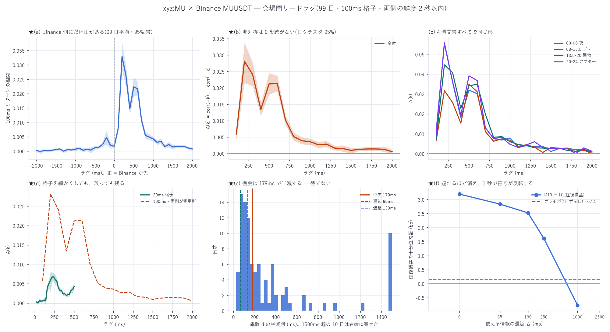

# 会場間リードラグ — Binance MUUSDT と Hyperliquid `xyz:MU`

[← `xyz:MU` 分析索引](README.md)

同じ原資産(Micron)を扱う **2 つの会場**を、同じ時計の上に並べて先行関係を測った。

| | |
|---|---|
| 標本 | 2026-05-04 〜 2026-08-10 の **99 日** |
| Hyperliquid | `xyz:MU` の最良気配(L1 から再構成。実物との一致 98〜99%) |
| Binance | **`MUUSDT`**(USD-M の株式 perp。`TRADIFI_PERPETUAL`、24/7、2026-04-07 上場) |
| 格子 | 100ms(細部の確認に 20ms) |
| 絞り | 両側とも最終更新から 2 秒以内。加えて「両側がセル内で実更新」の版も |



---

## 1. 結論

**Binance が Hyperliquid を約 200ms 先行する。** ただしその機会は
**179ms で半減する**ので、「古いあいだ待つ」戦略には使えない。

| | 値 |
|---|---|
| 非対称のピーク | **ラグ +200ms、A = 0.0281** [+0.0215, +0.0337] |
| 95% 区間が 0 を跨がないラグ | **19/20 本**(100ms 〜 1900ms) |
| 20ms 格子でのピーク | **+220ms** |
| 乖離 \|d\| | 中央 **1.60bp** / 90% 点 4.31bp |
| 乖離の半減期 | 中央 **179ms**(四分位 102〜381ms) |
| 基差(Binance − HL) | 中央 **+2.32bp** |

---

## 2. 測り方 — 何を主張し、何を主張しないか

**主張する**のは、非対称

$$A(k) = \mathrm{corr}\big(r^{\text{Bnc}}_t,\ r^{\text{HL}}_{t+k}\big) - \mathrm{corr}\big(r^{\text{HL}}_t,\ r^{\text{Bnc}}_{t+k}\big)$$

が**有意に正**であること、つまり「Binance が先、HL が後」の向きに情報が
流れていることである。

**主張しない**のは「Binance がちょうど N ms 先行する」という点推定である。
**両会場のクロック差と伝送遅延は観測できない。**一定のずれ δ があれば
ピーク位置はそのぶん動く。したがって数字は曲線として読むこと。

### 2-1. 疑似先行への対策を 2 段で入れた

**片側が疎だと、市場構造と無関係に「よく動くほうが先行」に見える。**
Uniswap の解析で実際にこれを踏んだ(1 秒格子で AMM の更新が 8% しかなく、
素朴に写すと必ず「CEX 先行」が出た)。対策:

1. **鮮度で絞る** — 両側とも最終更新から 2 秒以内。これで使えるセルは 69.7%
   (HL の鮮度 85.8% / Binance 73.4%)
2. **実更新で絞る**(`--strict`)— そのセル内で**両方が実際に更新された**行だけ

結果は**ほぼ同一**だった:

| 版 | ピーク | A(ピーク) | 95% 区間 |
|---|---|---:|---|
| 鮮度で絞る | 200ms | 0.0281 | [+0.0215, +0.0337] |
| **両側が実更新** | 200ms | **0.0281** | [+0.0212, +0.0336] |

LOCF の粘りで作られた見かけではない。

### 2-2. クロック差では説明できない

一定のずれ δ があるだけで真の関係が同時点なら、曲線は δ を中心に**対称**に
なるはずである。ピーク(200ms)のまわりで測ると:

| u (ms) | C(ピーク+u) | C(ピーク−u) | 差 |
|---:|---:|---:|---:|
| 100 | 0.0263 | 0.0078 | **+0.0185** |
| 200 | 0.0147 | 0.0017 | +0.0131 |
| 300 | 0.0223 | 0.0021 | **+0.0203** |
| 500 | 0.0108 | 0.0023 | +0.0085 |
| 800 | 0.0042 | 0.0004 | +0.0039 |

**Binance が先の側にだけ長い裾がある。**HL が先の側は即座に消える。
一定のずれでは作れない形である。

---

## 3. 4 時間帯すべてで同じ形

| ラグ | 全体 | 00-08 夜 | 08-13.5 プレ | 13.5-20 現物 | 20-24 アフター |
|---:|---:|---:|---:|---:|---:|
| 100ms | 0.0057 | 0.0117 | 0.0065 | 0.0070 | 0.0096 |
| **200ms** | **0.0281** | **0.0553** | 0.0317 | 0.0447 | **0.0558** |
| 300ms | 0.0240 | 0.0360 | 0.0257 | 0.0408 | 0.0362 |
| 500ms | 0.0212 | 0.0320 | 0.0349 | 0.0340 | 0.0391 |
| 1000ms | 0.0036 | 0.0078 | 0.0068 | 0.0060 | 0.0047 |

**米国現物が閉まっている夜間(00-08 UTC)が最も強い。**現物が開いている
時間帯だけの現象ではない。

★**200ms と 500〜600ms に山が 2 つある。**原因は特定していない。
HL 側のブロック生成の周期か、反応の速さが違う 2 つの参加者集団か、
いずれかだと思われるが、**この解析では区別できない**。

---

## 4. 機会の寿命 — ここが戦略の可否を決める

乖離 $d_t$ の AR(1) から出した半減期は **中央 179ms**(四分位 102〜381ms)。

| 自分の遅延 | 残る信号 |
|---|---:|
| 65ms | 78% |
| 130ms | 60% |
| 250ms | 38% |
| 1000ms | 2% |

**「Hyperliquid が古いあいだ、正しい側で待つ」という形にはならない。**
待っている間に消える。**既にそこに居る**必要がある。

---

## 5. 金に換算すると — 情報はあるが、それだけでは足りない

リードラグそのものは「価格を当てる力」でしかない。MU では
**価格を当てる情報が約定という条件を通ると残らない**ことが繰り返し出ている
(候補 2 は 5 秒先との相関 −0.0888 に対し往復損益との相関が +0.0045 だった)。

そこで発注候補 1,630 万件に $d$ を付け、**markout ではなく往復損益**を
目的変数にして十分位に切った(十分位の境目は前日までの分布)。

| Δ(使える情報の遅延) | D10 − D1 | 門(side·d > 2bp)の効果 | 95% 区間 |
|---|---:|---:|---|
| 0ms | +3.715 | +1.025 | [+0.933, +1.118] |
| 65ms | +3.359 | +0.899 | [+0.812, +0.990] |
| 130ms | +2.980 | +0.785 | [+0.705, +0.867] |
| 250ms | +1.816 | +0.348 | [+0.286, +0.413] |
| 1000ms | **−0.677** | **−0.317** | [−0.360, −0.273] |
| **プラセボ(1 時間ずらし)** | +0.081 | **−0.018** | **[−0.060, +0.023]** |

- **減衰の速さが §4 の半減期と独立に整合する**(0→250ms で勾配が 49% に落ちる)
- **1 秒古いと符号が反転して有害**になる
- **プラセボは 0 を跨ぐ** — 配管に細工は無い

### ★それでも儲からない

Δ=130ms・門ありの十分位は次のとおりで、**10 段すべて負**である。

| 十分位 | side·d | 約定率 | 往復損益 |
|---|---:|---:|---:|
| D1(逆側 −4.17bp) | 11.01% | −3.060 bp |
| D10(正しい側 +4.20bp) | 4.71% | **−0.960 bp** |

約定率が逆向き(11.0% → 4.7%)なのが機構の裏づけである。**逆側に居ると
「掃かれて」約定する。**これが逆選択そのものである。

そして**日次総額は最良でも −477.7 bp/日**(Δ=0ms)。1 ティック内側への
価格改善を入れた発注候補でも −231.6 bp/日。
**「何もしない」の日次総額は定義上 0 なので、この形のままでは発注しないほうがまし**
である(自己精査 B5/B6)。

$d$ は**損を減らすが利益を作らない**。取り消しの検証と同じ結末である。

---

## 6. なぜ Binance で、現物(Nasdaq)ではないのか

原資産の現物へ遡れば先行が増えるはず、という筋は通る。だが:

1. **検定できない。**標本期間の sub-second な米国現物データが手元に無い。
   手元の現物 1 分足は **2026-08-13 以降**で、HL の板が終わる 08-10 と
   **重なりがゼロ日**である
2. **手元で唯一使える現物の代理は「現物が上流」を支持しない。**
   Binance の指数価格(原資産から算出)と perp を 1 分足で見ると、
   ラグ −1 分(**perp が先**)が +0.12〜+0.19、ラグ +1 分(指数が先)が
   **−0.015**。しかも**現物が閉まっている 02:00 UTC でも指数は 98% の分で動く**ので、
   純粋な現物フィードではない
   (★ただし指数が平滑化されていれば機械的に遅れて見える。
   「現物が下流」と断定はできない)
3. **HL は現物より perp に貼りついている。**1 分足のラグ 0 相関は
   **perp→HL が 0.9237**、指数→HL が 0.6637
4. **夜の 3 分の 1 は現物が存在しない。**そこが最も先行が強い時間帯である
5. **伝送の遅延は逆に悪化しうる。**Nasdaq のフィードは Carteret(NJ)発、
   Binance のマッチングは東京。半減期 179ms に対し太平洋の片道 60〜80ms は
   信号の 25〜35% を食う

**決着のつけ方**: Nasdaq のプレマーケット NBBO を標本期間に重なる形で 1 か月ぶん
購入し(Databento / Polygon、$100〜200 程度)、**同じ発注候補・同じ十分位検定**で
「錨 = 現物」と「錨 = Binance」を A/B する。それ以外に決める方法は無い。

---

## 7. 途中で直した誤り

1. **kline の時刻規約を揃えていなかった。**`open_time` は足の**開始**で
   `close` が判るのは 60 秒後。揃えずに突き合わせたため、両系列とも
   ラグ +1 分に偽のピークが出た。**Uniswap で同じ罠を踏んだと記録してあったのに
   再発させた。**
2. **Binance 側を生の約定値で使っていた。**板幅ぶんの跳ね返りが乖離に乗る。
   符号つき約定から Δp = h·Δs + ε の OLS で実効半スプレッドを抜いて mid 推定に直した。
   ★ただし 99 日で測った実効半スプレッドの中央は **0.01bp** で、
   直した効果自体は小さかった(5 日の予備では 0.81bp と出ていたが小標本だった)
3. **出力名に発注候補の出どころを入れていなかった**ため、別条件の実行が
   前の結果を黙って上書きした(このリポジトリで 3 度目)。命名規則を直して
   全 13 本を作り直した
4. 対称性の診断の説明文で**符号の向きを逆に書いていた**。正しくは
   「差が正 = Binance が先の側だけ裾が長い」である

---

## 8. 限界

1. **クロック差は観測できない。**ピーク位置の点推定を信用しない
2. **Binance 側は約定のみ。**USD-M 先物の bookTicker は Binance Vision に
   存在せず(404)、板の最良気配は過去に遡れない。乖離は「最終約定の
   跳ね返りを抜いた推定 mid」と HL の mid の差である
3. **山が 2 つある理由を特定していない**(§3)
4. **xyz:MU のみ。**他の 6 銘柄にも Binance 上の対応する perp があるかは
   確認していない(DRAM / SNDK は `markets.json` にある)
5. 十分位の「大口」判定などに全標本の分位を使った箇所は記述用であり、
   予測に使うなら訓練期間だけで引き直すこと

---

## 9. 再現手順

```bash
uv run python scripts/xv_leadlag.py --coin xyz:MU --cell 100 --lags 20
uv run python scripts/xv_leadlag.py --coin xyz:MU --cell 100 --lags 20 --strict
uv run python scripts/xv_leadlag.py --coin xyz:MU --cell 20  --lags 25
uv run python scripts/xv_postsig.py --coin xyz:MU --delay 130 \
    --posts data/inv_posts_xyz_MU_q1.parquet
uv run python scripts/xv_analyze.py --coin xyz:MU --src _q1_d
uv run python scripts/xv_index_test.py --coin xyz:MU
uv run python scripts/xv_leadlag_report.py --coin xyz:MU
```

入力は `data/bbo_l1_xyz_MU/`(HL)と
`E:/Binance-perp-data/data/history/parquet/kind=aggTrades/symbol=MUUSDT/`。
