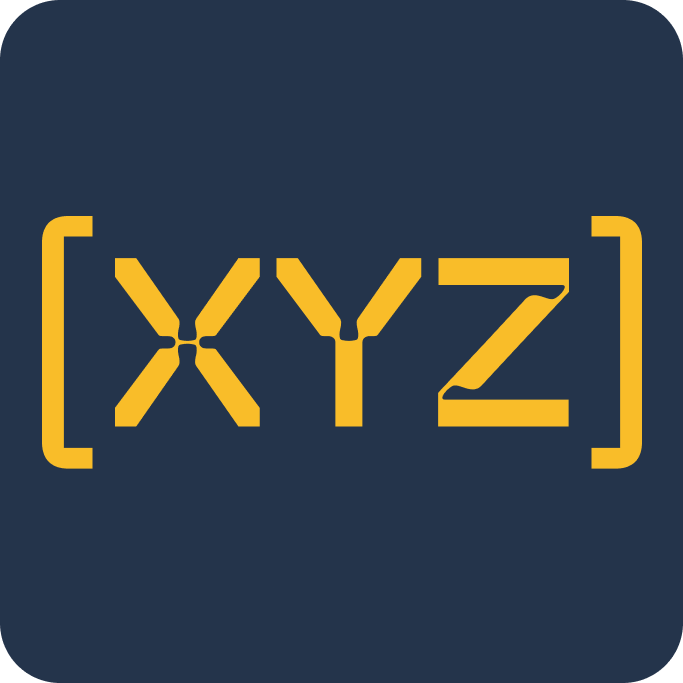
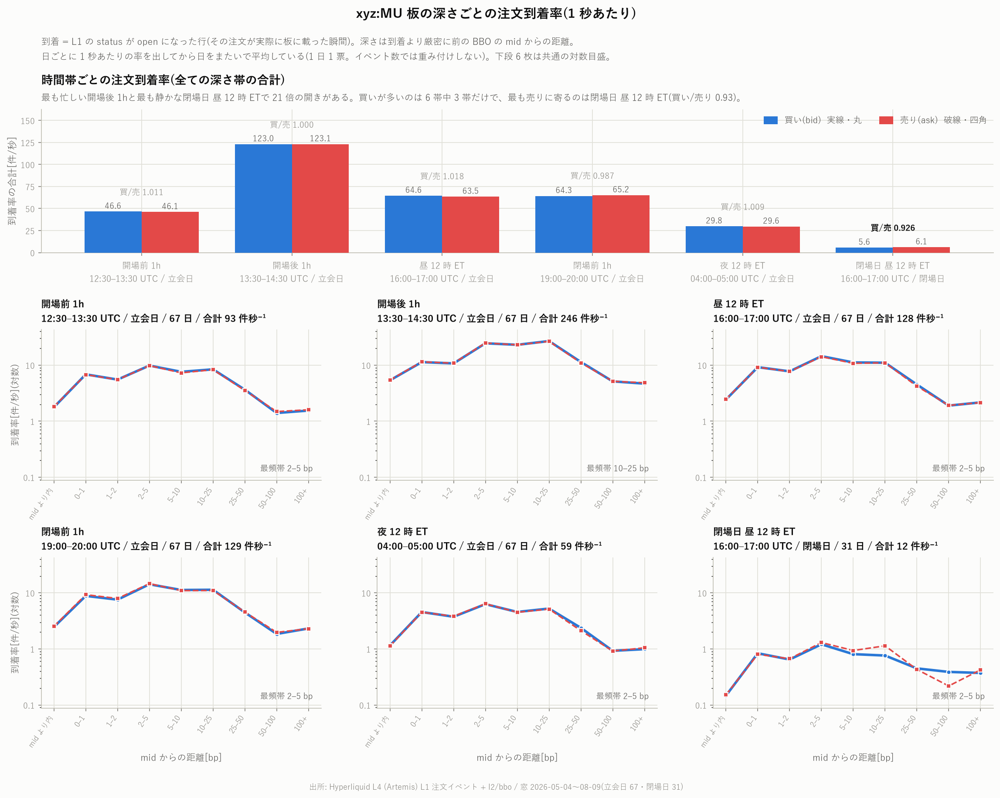
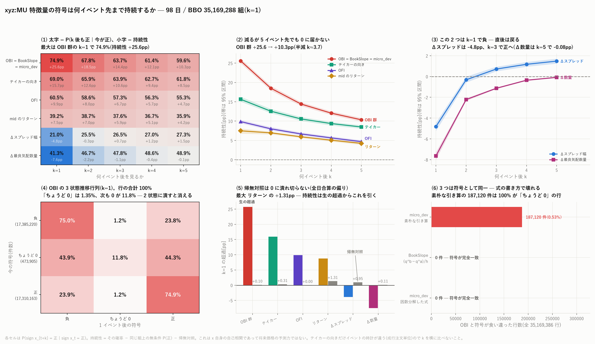
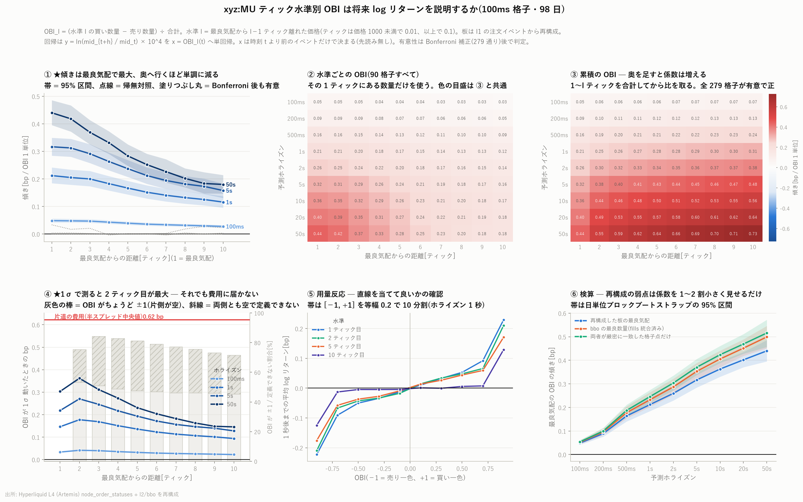

# Hyperliquid の分析

[← ホーム](../../README.md)

<p>
  <a href="https://hyperliquid.xyz/"></a>
  &nbsp;&nbsp;
  <a href="https://trade.xyz/"></a>
  &nbsp;&nbsp;
  <a href="https://about.artemis.ai/"></a>
</p>

分散型取引所 [Hyperliquid](https://hyperliquid.xyz/) 上で
[Trade.xyz](https://trade.xyz/) が配備したメモリ半導体 perp を、
**L4(注文一本ごと)**の記録から調べたものです。

この取引所を選んだ理由は記録の粒度にあります。板に出た注文・その取り消し・約定が
すべて時刻つきで公開されており、板を任意の時刻で組み直せます。

| | 行き先 |
|---|---|
| 結論だけ知りたい | 次節 [何が判ったか](#何が判ったか) |
| 銘柄ごとの分析を読みたい | [`xyz:MU` 分析索引](MU/README.md) / [`xyz:DRAM` 分析索引](DRAM/README.md) / [`xyz:INTC` 分析索引](INTC/README.md) |
| 数字を読むときの前提 | [ホームの「結果を読むときの前提」](../../README.md#結果を読むときの前提) |
| 用語の意味 | [用語辞書](../../GLOSSARY.md) |

---

## 何が判ったか

現時点で分析が終わっているのは `xyz:MU`(マイクロン)と、対照の `xyz:INTC`(インテル)です。
主な結果を抜き出します。
括弧内はその根拠となるレポートです。

- **同じ取引所・同じ配備元・同じ期間でも、板の作られ方は銘柄で別物になる。**
  `xyz:INTC` は `xyz:MU` に対し、10 水準の累積の厚みが **37 倍**、板厚に対する取消の速さが
  **1/11**。価格が 6.4 倍違うため相対的な刻みが 6.4 倍粗く、
  INTC のスプレッドは 3 ティックしかない(MU は 15 ティック)。
  **INTC は刻みに張り付いた厚くて遅い板、MU は薄くて速い板**である。
  それでも効く特徴量と符号はほぼ同じ(22 本の相関 0.965)。
  → [`xyz:INTC` 特徴量ライブラリ 229 本](INTC/intc_featlib_report.md)

- **予測力の山は 1 秒にあり、100ms では落ちる。** `xyz:INTC` の 972 本を
  100ms 〜 60 秒の 7 ホライズンで測ると、最大 \|順位相関\| は 100ms で 0.102、
  1 秒で 0.186、60 秒で 0.056。100ms が弱いのは特徴量の問題ではなく、
  **マイクロプライスの 80.7% がちょうど動かない**から。
  100ms だけは符号も逆で、直前 100ms の中値リターンの**順張り**が効く。
  → [板と注文フローの特徴量 972 本](INTC/intc_l4feat_report.md)

- **「予測」と呼べる上位はほぼ全部が『置かれたばかりの流動性』だった。**
  有意かつ \|前向き\| > \|後ろ向き\| を満たす列の筆頭は
  「最良近くで**置かれて 10 秒未満**の数量の買い売り差」(1 秒先 +0.149)。
  δ = microprice − mid は目的変数を mid に替えると**符号が反転する**のに対し、
  この量は mid 建てのほうが**強くなる**(+0.187)。
  OFI は逆に、後ろ向き +0.700 に対し前向きは +0.029 しかない同時性の指標である。
  → [板と注文フローの特徴量 972 本](INTC/intc_l4feat_report.md)

- **板に出た指値の 9.53% は 1 ナノ秒も板に居ない。** 発注と終端が同じブロックで
  処理されるため、1 秒格子の特徴量にはまったく写らない。板に出た指値の半分以上は
  1 秒以内に消え、一度でも約定するのは本数で 0.792%・数量で 0.133% しかない
  (同じ現象でも分母の取り方で 6 倍違う)。
  → [指値 1 本ごとの寿命とキュー位置](INTC/intc_orderlife_report.md)

- **`l2/bbo` は DEEP_ARCHIVE へ移行済みで、新しい銘柄では読めない。** 板は `l1` から
  組み直せるが、**素直に組むと 100% クロスする**(黙って約定した注文が残るため)。
  older-loses の退去規則で解くと、`xyz:MU` の 98 日で最良気配の 98% が実物と一致する。
  ただし最良の**数量**は 4〜8% ずれる。
  → [板の出どころを l2 から l1 へ移す](INTC/intc_bbo_l1_report.md)

- **24 時間 365 日取引できるのに、原資産の米国市場が閉まっている日は建玉がほとんど動かない。**
  取引そのものは続くが、持ち高を作る動きだけが止まる。
  → [日次平均建玉と出来高](MU/mu_oi_volume_report.md)

- **板そのものの動きも原資産市場の営業日に従う。** 注文が板に届く速さは、開場後 1 時間で
  246 件/秒、閉場日の昼はその 21 分の 1 の 11.7 件/秒。立会日の深夜のほうが閉場日の昼より
  5 倍忙しい。止まるのは「時刻」ではなく「原資産市場が閉じている日」である。
  → [板の深さごとの注文到着率](MU/mu_arrival_depth_report.md)

- **板の偏り(OBI)の符号は強く持続する。** いま買い板が厚ければ、次の気配更新でも
  厚いままである確率は無条件より **25.6 ポイント**高い。ただしこれは OBI 自身が
  滑らかに動くというだけで、価格を当てる力ではない。
  → [符号は何イベント先まで持続するか](MU/mu_sign_persistence_report.md)

- **その OBI で価格の上下を当てにいくと、費用に届かない。** 最も有利な帯・最も有利な
  ホライズンでも、期待できる値動きは往復のスプレッド(中央値 1.245 bp)を下回る。
  → [OBI と OFI から見た上昇確率](MU/mu_obi_ofi_report.md)

- **キャンセル率の傾きも同じ結末をたどる。** 検証した 16 通りすべてで統計的には
  有意だが、効果の大きさは片道費用の 1/8 以下にとどまる。
  → [キャンセル率の傾きと将来の log リターン](MU/mu_cancel_rate_report.md)

- **約定が起きるのは板が厚いときではなく、スプレッドが狭いときである。**
  スプレッド幅と約定量の順位相関は −0.24 で行列中いちばん強い一方、
  スプレッド幅と最良気配の注文量はほぼ無関係(−0.01)。厚さと狭さが別の現象になっている。
  → [スプレッド幅・注文量・約定量と OBI / OFI の関係](MU/mu_spread_flow_report.md)

- **注文サイズの上位 1% が数量の 3 分の 1 以上を占める。** これはどの時間帯でも
  変わらず、平均的な注文を想定した議論が成り立たないことを意味する。
  → [時間帯ごとのオーダーサイズ分布](MU/mu_order_size_report.md)

- **AUC 0.57 のスコアで取り消しても、markout は −1.00 → −0.85 までしか削れない。**
  遅延を織り込んだ backtest(評価 39 日)では、スコアは**無作為対照より
  明確に良い**(L=130ms で +0.231 bp)。だが**「何もしない」との差は +0.098 bp
  しかなく、L=300ms で消える**。無作為な取り消しは markout をむしろ悪化させる
  (遅い約定から先に消えるため)ので、スコアはまずそれを打ち消してから
  正味の改善を出している。そして**1 発注あたりの期待値は取り消しを増やすほど
  ゼロに近づくが超えない** — 取り消しは損を減らすのであって利益を作らない
  (block bootstrap 95% 区間が 22 通りすべてで 0 を跨がない)。
  効いたのは取り消し(+0.15 bp)よりクオート寿命(10 秒 → 100ms で +1.61 bp)。
  → [遅延を織り込んだ取り消しの backtest](MU/mu_cancel_bt_report.md)

- **判定を単価から日次損益に変えたら、結論が 2 つ変わった。**
  ★ **「単価が非有意だから総額も非有意」は誤りだった。**単価(日次等重み)と
  総額(取引重み)は別の量で、片方から他方の有意性は導けない。日次総額を直接
  検定すると、候補 1 は **+157.7 bp/日、t=+3.62、ブロック bootstrap 95%
  [+66.3, +255.9]** で**有意に正**である(39 日中 27 日が正、上位 3 日を除いても +94.7)。
  ただしドルにすると **$10/日 に最良気配の 12%、$100/日 に 122% の数量**が要り、
  後者はシミュレータの前提が壊れる領域なので、**規模は $10/日 が上限**である。
  ★ **候補 2 は「新鮮な信号」という仮説をまだ検定していなかった。**
  信号の半減期は約 **250 ms** なのに、手元の板は 5 秒格子なので発注時点での
  古さは中央 **2.49 秒** = 強度の 3% しか残らない。同じ t・側・ホライズンで
  段階分解すると**段階 1(全候補)の時点で既に勾配が無く**、落ちているのは
  約定条件ではなく**古さ**だった。100 ms 格子で作り直して再検定する。
  ★ 門と置き方を 2×2 に分けると、**効果は置き方から来ており、門は置き方に
  合わせて学習しないと有意に害**になる(BBO に改善版の門を当てると −24.9、t=−2.81)。
  → [判定を日次損益に置き換える](MU/mu_daily_pnl_report.md)

- **三つの戦略候補を同じ物差し(往復損益)に載せると、どれも待ち行列の順番という
  1 点に収束した。**
  候補 1(選択的・在庫型 MM)は往復損益で完結して測れる唯一の候補で、
  **+0.0285 ± 0.0460 bp/組・1,064 組/日・+158 bp/日**。その利得の出所を分解すると
  **順番が +1.15 bp、値段は −0.10 bp** で、価値があるのは順番のほうだった。
  ★ 候補 2(sweep インパクトの非対称)は、**5 秒先の価格との相関 −0.0888**
  (既報の −0.070 を再現)なのに、**自分の往復損益との相関は +0.0045 と 20 分の 1**。
  門に足すと +0.0285 → +0.0043 とむしろ悪化する。**価格を当てる情報は、
  約定という条件を通ると残らない。**
  ★ 候補 3(参加者の約定品質)は独立戦略としては検証できないが、
  **実参加者の約定 414 万件で順番の価値を裏づけた** — 発注時に前が空だった約定
  (全体の 55.2%)は逆選択 +0.524 bp、それ以外は +0.826 bp と **37% 少ない**。
  → [三候補のまとめ](MU/mu_candidates_report.md)

- **メイカーが買うべきなのは値段ではなく行列の順番だった。ただし 1 ティックでは高すぎる。**
  既報が見ていたのは最良気配から**外側**への配置だけだったので、
  **内側への 1 ティック価格改善**を検証した。門なしで −1.692 → **−1.364 bp**、
  往復損益で学習し直した門と組むと **+0.0285 ± 0.0460 bp / 1,064 組・日 /
  +157.7 bp・日** となり、門だけの版(130 組・日、+12 bp・日)に対して
  **回数 8.2 倍・総額 13 倍**、誤差は 0.084 → 0.046 とほぼ半分になる。
  ★ 効果を分解すると、**値段だけ 1 ティック譲る版は基準より悪く(−1.792)**、
  **最良気配のまま行列の先頭に立つ版だけが +1.15 bp を生む**(−0.544)。
  つまり価値があるのは順番であって値段ではない。ところが先頭に立つ唯一の
  実装手段が価格改善であり、**1 ティック払うと +1.15 のうち +0.33 しか残らない**。
  遅延の分岐は 50 ms 台のままで、**95% 区間の下限は依然として負**である。
  → [1 ティック内側への価格改善](MU/mu_price_improvement_report.md)

- **メイカーが選ぶべき市場の条件は、直感と 2 か所で逆だった。**
  「余裕が大きく・逆行が小さく・食い切られにくく・OBI の予測力が高い市場ほど
  Entry EV が高い」という仮説を、銘柄 2 × 日 99 × 時刻 = 3,845 窓で検定した。
  ★ **板は厚いほど EV が低い**(β=−0.299、t=−6.06)。最後尾に並ぶ以上、
  厚い板は「食い切られにくさ」ではなく**待ち時間**である。しかも効いているのは
  Depth だけで、TradeSize は何もしていない(t=−0.38)から、比の形自体が意味を持たない。
  ★ **OBI が microprice を当てる市場ほど EV は低い**(β=−0.411、t=−7.47)。
  偏りが情報を持つということは、その情報の反対側に置かれるということである。
  なお OBI の IC は mid で測ると平均 +0.136、microprice で測ると **−0.152** と
  符号が逆になるので、どちらに対する予測力かを必ず書く必要がある。
  第 1 項は向きこそ合うが**比の形が強すぎる** — スプレッドと σ を分けると
  R² が 0.083 → 0.180 に上がり、**σ の効きがスプレッドの 2.5 倍**で、
  スプレッド単独ではほぼ効かない。**効いているのは「余裕」ではなく「動かなさ」**。
  3 変数の R² は 0.129 にとどまり、**どの層でも EV は負**(最良 −0.894 bp)。
  → [市場の状態で Entry EV を説明できるか](MU/mu_market_conditions_report.md)

- **新規発注の遅延は 50 ms が損益分岐。50 ms より内側では板が動かないので
  シグナルは無傷で、崩れるのはちょうど 1 ブロック(67.3 ms)から。**
  実効遅延そのものは自分の注文を出さないと測れないので、
  **「いくつなら成立するか」を過去データだけで先に確定した。**
  在庫メイカーを遅延ごとに回すと **50 ms で ±0、65 ms で −0.211(t=−2.56)、
  130 ms で −0.540** と落ち、往復数も 130 組/日 → 65 組/日 に半減する。
  判断時点の条件がどれだけ残るかを直接測ると、**50 ms までは 97.3% が無傷**、
  1 ブロックで 92.9%、100 ms で 76.5% になる。壊れる順序は
  **まず板の偏り(OBI)が消え、あとから価格が追いかける**。
  ブロック周期の実測は 67.30 ms(標準偏差 8.3・周期格子ではない)なので、50 ms を切るには
  **次のブロックに入り、かつ送信遅延が 30 ms 未満**であることが要る
  (2 ブロック目に落ちた注文は確率 0)。したがって probe で測るべきは
  平均 ms ではなく「次のブロックに入る割合」と「送信遅延の分布」の 2 つだけ。
  → [新規発注の実効遅延はどこまで許されるか](MU/mu_latency_frontier_report.md)

- **在庫を持って自然に相殺させると損は 1.4 bp 縮む。往復で入口を学習すると、
  標本外で初めてゼロを跨ぐ。ただし発注遅延を入れると戻る。**
  1 約定ごとに手仕舞うのをやめ、在庫 q を持って反対側のメイカー約定で
  FIFO 相殺する事象駆動シミュレータを作った。**自然相殺はほぼ完全に働く** —
  60 秒で **98.0%** が片づき、強制決済は建玉の 0.012% しかない。
  それでも 1 組 **−1.847 bp**(即時手仕舞いの −3.288 から 1.44 bp の改善)。
  **手仕舞いを最良の外へ置いても改善せず**(1 ティック外で約定数が 3.4 分の 1)、
  **固定 timeout は短いほど悪い**(強制決済 1 回 1.40〜1.47 bp)。
  ★ **OBI を在庫の向きに揃えると、将来の値動きではなく「在庫を安く消せるか」を
  直接予測する**(五分位で 1 秒相殺率 10.5→19.3%、組損益 −2.87→−0.88 bp)。
  そして**往復損益を目的変数にして入口を学習すると +0.036 ± 0.084 bp**(t=+0.43)と
  本プロジェクトで初めて 95% 区間がゼロを含む。ただし **実測の発注遅延 130 ms を
  入れると −0.540 ± 0.095 bp**(t=−5.70)に戻る。遅延がこの方向の本命の制約である。
  → [在庫を持つメイカー](MU/mu_inventory_mm_report.md)

- **島は本物だが、手仕舞いの費用を越えない。そして markout と往復では効く変数が違う。**
  前項の EV>0 の島を 4 通りに検証した。**microprice で測り直しても消えず**
  (1 約定 +0.346 → +0.498 bp、セル間相関 +0.96)、**共通分母を持つ変数対をほどいて
  OLS / Ridge / ElasticNet / GAM で当てはめても 4 つとも残る**(Ridge の罰則は λ=0)。
  ところが**手仕舞いを入れた往復では 100 セル中 陽性が 0** になる —
  Taker exit −1.117、Hybrid(10s)−1.499、Hybrid(60s)−2.493 bp/約定。
  受動的に閉じれば +1.264 bp に見えるが、それは**閉じられた分だけを見た罠**で、
  10 秒以内に閉じるのは 26% しかない(閉じないのは不利に動いた側)。
  学習期間で領域を固定してから OBI と OFI の門を足すと
  −0.0145 → **−0.0056 bp/候補**まで 61% 縮むが、ゼロは超えない(t=−8.7)。
  ★ **スプレッドは markout を 16 倍にするのに往復を全く改善せず、
  OBI は markout では平らなのに往復を 3 倍改善する。**
  markout の上で変数の重要度を語ると取り違える。
  → [microprice 再検証・往復 backtest・モデル比較・門の重ね合わせ](MU/mu_roundtrip_report.md)

- **EV>0 の島はある。ただし小さく、しかも往復損益ではない。**
  60 秒 1 本の Hazard をやめ、**P(Fill 250ms)** と **E[PnL_1s | Fill]** を
  別々に当てはめて予測値の 10×10 を見ると、**55/100 のセルが正**、
  **29 が Bonferroni を超える**(無作為に割り当てた対照は 0/100・最大 −0.036 bp)。
  評価期間の前後半で相関 +0.948、買い売りとも対称、発注遅延 130 ms でも 10 セル残る。
  構造は明快で、**符号は予測損益が決め、大きさは約定確率が決める** —
  約定確率は独立した情報軸ではなく倍率なので、「稀にしか約定しない状態を狙う」
  という向きは誤り。正の側では**むしろ約定させたほうがよい**。
  ただし EV は **+0.0042 bp/候補・+0.346 bp/約定**しかなく、
  これは mid の markout なので**手仕舞いに半スプレッド 0.74 bp を払えば消える**。
  解釈可能な 3 変数版では島が 0 セルになるのが最大の留保。
  → [250ms 約定ハザード × 条件つき損益](MU/mu_fillpnl_report.md)

- **今後の分析の基礎データを 1 枚の表にした(Step 1)。**
  1 行 = 1 つの発注候補、候補時点は BBO 更新ごと、1 時点につき買い/売りの 2 行で
  **98 日 7,034 万行 × 54 列**。規則は **X_t は t までに観測可能な値だけ**。
  これを主張で済ませず、窓の端を別経路で計算し直して**相対差 5×10⁻⁸ 以下**を確認し、
  板が「t を含む 100 ms セルの開始時点」の状態であることを
  **食い違う行に限った一致率 77〜88% 対 0.1〜1.2%** で示した。
  無条件に最良気配へ置くと **1 秒 net PnL 平均 −3.756 bp・98 日中 97 日が負**で、
  候補の作り方を 1 秒格子から BBO 更新ごとに変えても既報の結論は覆らない。
  ただし**期間内で標本の性質が変わる**(候補数 1.65 倍・スプレッド 2.34→0.98 bp)ので
  98 日をまとめて平均してはいけない。
  → [仮想発注候補テーブル(Step 1)](MU/mu_quotes_table_report.md)

- **toxic を事前に選り分ける情報は、間に合う時間内には存在しない。**
  約定 δ ms 前の標本外 AUC は δ を詰めると上がるが **50 ms で 0.590 に飽和**し、
  その飽和はモデルではなく**板が動いていない**ことによる(50→20ms で 99.6%、
  20→10ms で **100%** が同一状態)。この市場のブロックは **65 ms 周期**、
  任意の時点から次の板更新までの待ちは中央値 **185 ms**、
  そして**実際に 50 ms 以内に取り消せている注文は 0.01%** しかない。
  間に合う δ=250 ms の AUC 0.577 で上位半分を捨てても markout の改善は
  **+0.267 bp** で、黒字化に必要な +1.031 bp に 1.73 bp 届かない。
  → [δ ms 前の標本外 AUC と取り消せる速さ](MU/mu_latency_report.md)

- **受動的な損の 56% は約定する前に、44% は約定した後に起きている。**
  約定を A = r(T→τ)(置いてから約定するまで)と B = r(τ→τ+h)(約定してから)に
  分けると、**A はクオートの寿命でほぼ決まり**(寿命 100ms で −0.007 bp、
  10 秒で −1.618 bp)、**B は寿命に依らない**(−1.21〜−1.50 bp)。
  実際の優位(半スプレッド + A)がゼロを切るのは寿命 2〜5 秒の間。
  ただし A を消しても B が半スプレッドを上回るので黒字にはならない。
  そして **toxic な約定を事前に見分けることはできない**(AUC 最良 0.452)。
  → [約定の 3 分解と toxic な約定の事前兆候](MU/mu_markout_report.md)

- **alpha は「約定した」という条件だけで平均 16 倍の大きさで消える。**
  SelectionPenalty = E[r|Fill,S,D] − E[r|S,D] を同じ窓で作ると、
  誤差を付けた **1,717 セルすべてが負**(1,715 が Bonferroni 突破、正は 0)。
  最も破壊されるのは**自分がクオートしたい向きに信号が出ている状態**で、
  OBI S10 は 無条件 +0.560 bp → 約定時 −4.135 bp(penalty −4.694)。
  BBO から 10 ティック奥まで見ても、名目の k ティックの割引は
  「そこまで価格が落ちないと約定しない」ことで丸ごと消え、
  88 通り中**正で有意なのは「最良気配・待ち行列の先頭・保有 100 ミリ秒」の 1 つだけ**。
  → [SelectionPenalty](MU/mu_penalty_report.md) /
  [深い水準の P(Fill)×PnL](MU/mu_depth_report.md)

- **受動的に流動性を出す費用の下限は「自分を食った約定そのもの」である。**
  約定時刻 τ から測った逆選択 AS = E[r(τ→τ+h) | Fill] で EV を組むと、
  **クオートすべきセルは 1,717 中 0 件**。内訳は 半スプレッド +0.58 /
  手数料 −0.09 / **自分を食った約定の即時の影響 −0.54** / その後 10 秒 −0.72。
  即時の影響だけで半スプレッドがほぼ消えるので、保有を 100 ミリ秒まで
  縮めても、信号や待ち行列でセルを選んでも逃げられない。
  → [約定時刻から測った逆選択 AS と EV](MU/mu_ev_report.md)

- **「約定できるか」と「情報があるか」は別々の軸で決まる。** 信号の十分位 ×
  待ち行列がはける時間の十分位で 10×10 に切ると、約定率はほぼ**横軸だけ**で
  決まり(OFI で横 46.9pp 対 縦 5.0pp)、microprice で測った将来リターンは
  ほぼ**縦軸だけ**で決まる(縦 0.601bp 対 横 0.066bp)。
  「信号が効くのは約定できない場所だけ」という思い込みは成り立たない。
  ただし mid で測ると横軸に偽の勾配が出る(同じ比が 1.21 → 9.04 に変わる)。
  そして **300 セルすべてで約定時の損益は負**、最良でも −1.20 bp。
  → [信号 × 待ち行列時間の 2 次元ヒートマップ](MU/mu_heatmap_report.md)

- **信号を見て受動的に構えると、逆選択はむしろ悪化する。** 信号の向きに
  最良気配へ指値を置く反実仮想では、10 秒の約定率は 11.9〜31.3% で、
  約定したときの損益は 8 ホライズンすべて負。受け取る半スプレッド 0.6〜0.9 bp を
  約定後の価格の動き −2.2〜−3.9 bp が必ず上回る。しかも**信号のない Q3 に
  置いたほう(−2.2)が Q5 に置くより 1 bp ましである**。
  待ち行列の十分位で分けると、mid で測るか microprice で測るかで
  リターンの向きが逆になる(OFI の D1 は mid −0.178 / micro +0.206)。
  → [信号を検出した瞬間に BBO へメイカー注文を置いたら](MU/mu_maker_report.md)

- **1 秒刻みの 170 万標本は、独立な 170 万標本ではない。** Q1/Q5 の選ばれ方は
  塊で(連は独立の想定より 1.9〜8.1 倍長く、Fano 因子は 1 時間窓で 105〜393)、
  独立とみなした標準誤差は**最大 15.8 倍過小**だった。さらに日ごとの値にも
  ラグ 7 で +0.703 の週次の山があり、日でまとめるだけでも足りない。
  一方でリターン自体はほぼ白色(ラグ 1 秒で 0.040)なので、
  誤差を膨らませているのは向きの持続ではなく**ボラティリティの塊**である。
  → [絞った標本の burstiness と自己相関](MU/mu_burstiness_report.md)

- **板の不均衡(OBI)が値動きを当てるように見えるのは、mid が既に判っている
  microprice に追いつくだけである。** 五分位の両端の差は mid で測ると 60 秒で
  +1.096 bp と 3 指標中最大なのに、microprice で測ると **全ホライズンで負**
  (1 秒で −0.252、t=−6.1)。T 時点で既知の microprice−mid の差 +1.300 bp を
  一度も超えない。逆に OFI と攻撃的注文は microprice 自体を動かすので本物。
  ただし**板を叩いて取ると 4 指標 × 8 ホライズンの 32 通りすべてが赤字**
  (−0.96〜−1.54 bp / 往復)。
  → [OBI・OFI・攻撃的注文の五分位と予測ホライズン](MU/mu_prediction_report.md)

- **隠れ数量(iceberg)の痕跡は、板の記録には出ない。** 「削られたから足す」
  (約定の後 1 秒以内の出し直し 12.99%)と「値段を付け直す」(取消の後 12.79%)が
  ほぼ同じで、約定のあった補充の 96.1% は**見せた最大の数量以下**しか約定していない。
  距離帯を揃えても 9 帯中 8 帯で約定後のほうが低く、唯一の例外はスプレッドの内側
  (比 1.18)。395 口座のうち 3 条件すべてを満たすのは 1 口座(全注文の 0.034%)。
  → [隠れ数量と注文分割の代理指標 8 つ](MU/mu_iceberg_report.md)

- **口座たちは同じ瞬間に動くが、同じ側には立たない。** 上位 60 口座の 1,445 ペアで、
  同じブロックに一緒に発注する回数は偶然の 1.43 倍、一緒に取り消す回数は 1.70 倍。
  ところが**向き**(符号つき出し入れ)の超過相関は +0.0085 しかない。さらに
  **その同時性の 9 割は「全員が同じ市場に反応している」で説明でき**、両者を除いた
  市場を統制すると超過相関は +0.137 → +0.014 へ落ちる。ただし 1,445 ペア中
  **18〜19 ペアだけは残差相関が 0.5 を超える**(帰無では 1 件も出ない)。
  → [複数の口座は同時に動くか](MU/mu_sync_report.md)

- **「見せかけの板」を疑う 18 指標は、この市場ではほとんど何も選り分けない。**
  最良気配に届いた注文の 87% は約定せずに引かれ、取消率は 98.9%。「値段が近づくと
  逃げる」は多数派の行動である。決め手として、大口を出したあと自分が反対側で
  売り抜けたかを約定記録で直接確かめると、**署名が出ないどころか符号が逆**だった
  (反対側で売った層では値段がその注文と逆へ 3.50 bp 動いていた)。
  → [見せかけの板を疑う 18 指標](MU/mu_manipulation_report.md)

- **板の左右の非対称は、板の厚さより強い予測子である。** 仮想の成行 5 契約に対する
  価格インパクトの左右差は 5 秒先の値動きと相関 −0.070 で、古典的な最良気配の
  数量の偏り(マイクロプライス、+0.064)と直前 1 秒の OFI(+0.049)を上回る。
  しかも OFI と違って後ろ向きの相関がほぼ 0 で、値動きの後始末ではない。
  ただし成行で取りに行くと往復のスプレッドに届かない。
  → [仮想成行 Q に対する板の応答と脆さ](MU/mu_impact_fragility_report.md)

- **板に置かれた指値のうち、最終的に約定するのは 0.915% だけである。** 10.45% は発注と
  同じブロックのうちに消え、寿命の中央値は 565 ミリ秒。約定率を最も大きく分けるのは
  価格でも数量でもなく**発注元の口座**で、初めて注文を出す口座の 57.8% に対し、
  10 万本以上出している口座は 0.713%(81 倍)。板を作っているのはほぼ後者である。
  → [指値注文の生存率・取消率・約定率](MU/mu_hazard_report.md)

- **板の書き換わりは、値動きの前触れではなく後始末である。** 板に注文が出入りする量と
  将来リターンの関係を 7 通り × 11 ホライズンで測ると、**77 通りすべてで**
  「過去のリターンとの関係」が「将来との関係」を上回りました。向きの予測力は
  $`\|r\| \le 0.0154`$ で実質ゼロです。
  → [板の入れ替わり(churn)7 種と将来 log リターン](MU/mu_churn_report.md)

- **板の偏りが効くのは最良気配のまわりだけで、奥を足しても情報は増えない。**
  ティック水準ごとの OBI を 10 水準 × 9 ホライズンで将来 log リターンへ回帰すると、
  279 通りすべてが Bonferroni 後も有意でした。ただし生の係数が最大なのは最良気配でも、
  ばらつきで割ると **2 ティック目**が最大になり、累積は **4 ティックで頭打ち**になります。
  最も強い格子でも片道費用の 69% にとどまります。
  → [ティック水準別 OBI と将来 log リターンの回帰](MU/mu_obi_levels_report.md)

- **板の厚みの 3 分の 2 は 2 秒ももたない。** 板に置かれてすぐ約定せずに
  取り消される指値(束の間の注文)が、数量の **66.4%**、最良気配のそばに限れば
  **90.0%** を占める。ただし大口(上位 1%)は 36.1% で、200ms 以内に消えるのは
  1.7% しかない。**大口だけは置いてすぐ引くのではなく、数百ミリ秒は置いてから引く。**
  → [束の間の注文は板の何割を占めるか](MU/mu_fleeting_report.md)

繰り返し現れる結論は「**統計的に有意であることと、費用を引いて残ることは別**」です。
本リポジトリのレポートは、有意性を示したところで止めず、必ず費用と比べます。

### 図の例

**板に注文が届く速さは、原資産市場の営業日に従う。**
開場後 1 時間は 246 件/秒、閉場日の昼はその 21 分の 1 しかありません。



→ [板の深さごとの注文到着率](MU/mu_arrival_depth_report.md)

**板の偏りの符号は自分自身を引きずるが、それは価格を当てる力ではない。**



→ [符号は何イベント先まで持続するか](MU/mu_sign_persistence_report.md)

**板の偏りが効くのは最良気配のまわりだけ。**
生の係数は水準について単調に減り、累積の係数の伸びは情報の増加ではなく
ばらつきの縮小です(1σ で測ると 4 ティックで頭打ち)。



→ [ティック水準別 OBI と将来 log リターンの回帰](MU/mu_obi_levels_report.md)

---

## 1. この取引所で何を狙っているか

同じメモリ半導体という産業に連動する複数の銘柄を **横断して** 比べることに主眼を
置いています。具体的には、銘柄間の共通要因、値動きの先行と遅行の関係、
流動性の相対的な厚み、そして一つの銘柄で起きた注文の流れが他の銘柄へどう伝わるかです。

単独銘柄を深く掘る分析ではなく、複数銘柄を同じ物差しで並べることを狙っています。

## 2. 対象銘柄と標本期間

扱うのは次の 6 銘柄です。いずれも分散型取引所 [Hyperliquid](https://hyperliquid.xyz/)
上で [Trade.xyz](https://trade.xyz/) が配備した銘柄で、正式な表記は `xyz:` で始まります。

| 銘柄コード | 原資産 | 分析索引 | 備考 |
|---|---|---|---|
| `xyz:MU` | マイクロン・テクノロジー | **[開く](MU/README.md)** | 分析済み |
| `xyz:DRAM` | DRAM 価格指数 | **[開く](DRAM/README.md)** | 分析済み(旧 DRAM-microprice リポジトリを 2026-08-29 に統合。レポート 51 本)。2026 年 5 月 4 日 15 時 33 分(UTC)が最初の記録 |
| `xyz:KIOXIA` | キオクシア | 未着手 | |
| `xyz:SKHX` | SK ハイニックス | 未着手 | |
| `xyz:SMSN` | サムスン電子 | 未着手 | |
| `xyz:SNDK` | サンディスク | 未着手 | |

これに加えて、**メモリではない銘柄を 1 つだけ対照として**入れています。
同じ配備元・同じ期間で、板の作られ方がどれだけ違うのかを見るためです。

| 銘柄コード | 原資産 | 分析索引 | 備考 |
|---|---|---|---|
| `xyz:INTC` | インテル(ロジックとファウンドリ) | **[開く](INTC/README.md)** | 対照。`l2/bbo` が DEEP_ARCHIVE のため板を `l1` から組み直している |

標本期間は **2026 年 5 月 4 日から 8 月 10 日までの 99 日間**です。
分析によっては最終日のデータが揃わず 98 日を使うものがあり、その場合は
各レポートの冒頭に日数と件数を明記しています。

関係する組織と役割は次のとおりです。

| | 役割 | 公式サイト |
|---|---|---|
| Hyperliquid | 銘柄が上場している分散型取引所 | https://hyperliquid.xyz/ |
| Trade.xyz | 本リポジトリが扱う銘柄を配備した発行者 | https://trade.xyz/ |
| Artemis | 板情報の公開元 | https://about.artemis.ai/ |
| Python | 分析に使用している言語 | https://www.python.org/ |

## 3. データはどこから来るか

Artemis が公開する保管庫から生データを読み出し、段階的に加工したものを使います。
生データそのものは保存せず、加工後のものだけを作業用バケットに置いています。

| 階層 | 内容 | 保有状況 |
|---|---|---|
| L1 | 正規化した注文イベントの記録。板に出た注文・取り消し・約定が時系列に並ぶ | 14 銘柄 × 99 日 |
| fills | 約定の記録。1 つの取引につき買い手と売り手の 2 行が入る | 14 銘柄 × 99 日 |
| L2 | 注文の一生(発注から消滅まで)と板の状態の復元。5 種類の表からなる | 12 銘柄 × 99 日 |
| L3 | 一定時間ごと、あるいは一定約定数ごとに集計した特徴量 | 12 銘柄 × 4 種類のバー |

本リポジトリの分析は主に L1・fills・L2 を入力とし、必要に応じて最良気配(BBO)を
別途取得します。生成の手順は、パイプライン側のリポジトリ `hl-l4-pipeline` にあります。

手元にどの銘柄の何が揃っているかは `scripts/inventory_s3.py` で列挙できます。
棚卸しの結果は各銘柄の分析索引に置いています
(例: [`xyz:MU` のデータ保有状況](MU/mu_inventory_report.md))。

## 4. 分析索引

成果物は銘柄ごとに `reports/<銘柄コード>/` へまとめています。各フォルダの
**分析索引**に、その銘柄のレポート・図・数値データが漏れなく並んでいます。

- [`xyz:MU` 分析索引](MU/README.md)

銘柄に紐づかないレポート:

| レポート | 内容 |
|---|---|
| [予測の定義](../predicting_definition.md) | 「予測」と「同時点の関係」の区別を定式化し、判定の手順とチェックリストをまとめたもの。各銘柄のレポートはここへリンクし、個別に再定義しない。 |

## 5. 再現手順

依存は `pyproject.toml` に宣言してあります。初回だけ `uv sync` を実行してください。

```bash
uv sync
uv run python scripts/inventory_s3.py --refresh --coin xyz:MU
uv run python scripts/fetch_fills.py --coin xyz:MU
uv run python scripts/build_oi_volume.py --coin xyz:MU
uv run python scripts/plot_oi_volume.py --coin xyz:MU --unit usd
```

**銘柄のレポートをすべて再現する完全な実行順**は、その銘柄の分析索引の末尾に
あります(例: [`xyz:MU` の再現手順](MU/README.md#再現手順))。

スクリプトの命名規則と一覧は [ホームの再現手順](../../README.md#再現手順) にあります。
各スクリプトの docstring に、目的・入出力・実行例・時間契約(説明変数が確定する
時刻と目的変数の期間)が書いてあります。
