# `xyz:SNDK` — MU の分析一式を当てる(17 分析 + 特徴量 199 本 × 7 ホライズン)

[← xyz:SNDK の分析索引](README.md) ／ [7 銘柄の横並び](../cross_coin_report.md)
／ [予測の定義](../../predicting_definition.md)

対象 `xyz:SNDK`(サンディスク perp)／ 標本 2026-05-04 〜 2026-08-10 の 99 日
／ 数字の出所は [suite_headline_xyz_SNDK.json](../../../data/suite_headline_xyz_SNDK.json)

## 先に結論

- **回転が速い投機の板。** 出来高中央値 \$1.11 億/日 に対し建玉 \$3,463 万で、
  **回転 3.2 回/日は 7 銘柄で最大**。清算も 49 件/日と最多
- **板の端(OBI・OFI の極端な帯)の情報は 7 銘柄で最大**なのに、
  **特徴量の予測力は 7 銘柄で最弱・減衰最速**(1 秒 0.167 → 10 秒 0.065)。
  情報が出た瞬間に消費される、最も効率的な板である
- δ = microprice − mid の 1 秒逆張りは −0.161(7 銘柄で最弱)、
  mid 建てでは **+0.110 と正**(mid が microprice に追いつく構造は共通)
- スプレッド中央値 1.30bp・実効半スプレッド 0.85bp は MU と並んで最狭。
  **予測力の弱さは市場の速さの裏返し**で、費用を引いた後に残る余地は
  MU 同様に見当たらない

---

## A. この銘柄はどういう市場か

| 量 | 値 |
|---|---|
| 日次出来高(テイカー側、中央値) | \$110,997,162 |
| 日次取引件数(中央値) | 63,775 |
| 日中平均建玉(中央値) | \$34,628,136 |
| テイカー参加者/日(中央値) | 1,192 |
| 清算 fill/日(中央値) | **49** |
| 価格の中央値 | \$1,589 |
| 成行 1 本の中央値 / p99 | 0.211 枚 / 10.4 枚 |
| 買いの割合(平均) | 50.29% |
| \|z\|(HAC) > 2 の日 | 28 / 99 |

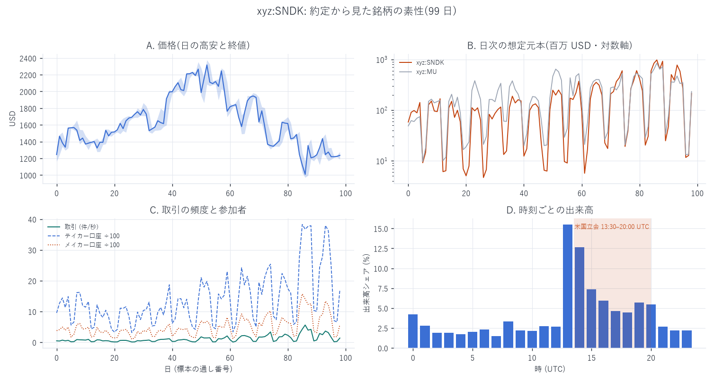

出来高・建玉とも他のメモリ銘柄と同じく米国立会日に集中する
(図の時刻分布)。買いの割合は期間平均 50.3% でほぼ対称だが、
日次では 99 日中 28 日が \|z\|>2 で、日単位の偏りは頻繁にある。

## B. 板の状態は将来の値動きを教えてくれるか

**特徴量 199 本 × 7 ホライズン**(前向き順位相関、マイクロプライス建て。
測り方は[横並びレポート 1 節](../cross_coin_report.md)と同じ):

| h | 100ms | 500ms | 1s | 5s | 10s | 30s | 60s |
|---|---|---|---|---|---|---|---|
| 実測の最大 \|r\| | 0.098 | **0.183** | 0.167 | 0.098 | 0.065 | 0.040 | 0.033 |
| 帰無対照の最大 | 0.011 | 0.005 | 0.006 | 0.006 | 0.008 | 0.009 | 0.010 |

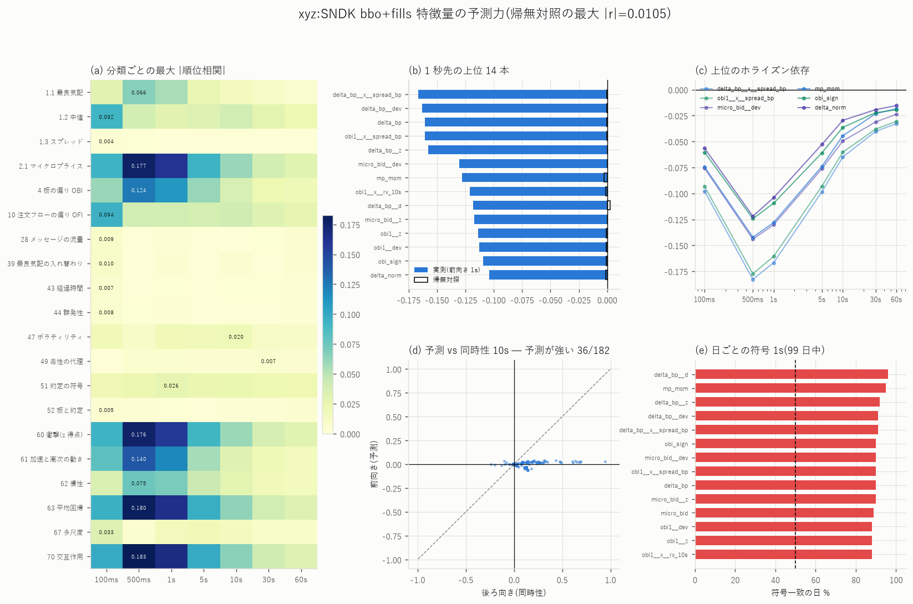

- 山は 500ms。**10 秒で既に 1/3 に落ちる減衰は 7 銘柄で最速**
  (MU と並ぶ)。上位は全て δ 系(`delta_bp__x__spread_bp` −0.167 等)
- 日で前半・後半に割った r の相関 0.894、上位の日次符号一致は 9 割前後

**MicroPrice / OBI / OFI の帯 × ホライズン**(上昇確率 − 基準):

| 指標 | 最大エッジ | セル | 帰無対照 |
|---|---|---|---|
| MicroPrice 乖離 | +0.168 | 閉場日 / +1〜+5bp / k=1 | 0.017 |
| OBI | **+0.232** | 閉場日 / +0.75〜+1.00 / k=1 | — |
| OFI | **+0.239** | 閉場日 / < −2σ / k=5 | — |

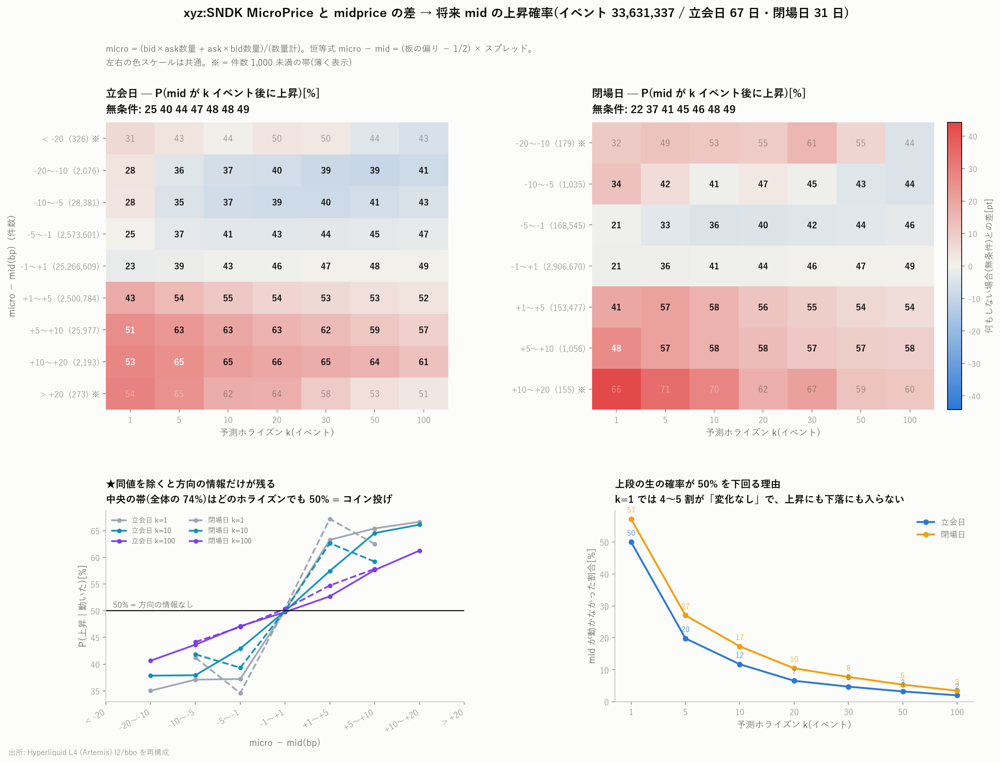

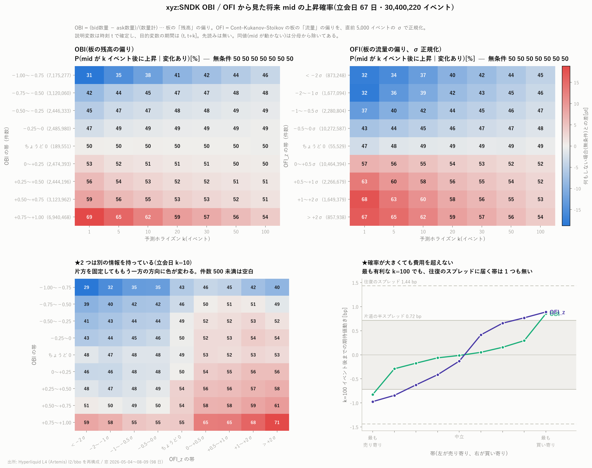

OBI・OFI の端は 7 銘柄で最大。ただしいずれも**格子(帯 × k)の最大統計量**で、
最有利セルでもスプレッド(往復 ≈1.7bp)に対して余裕はない。

- Book Slope の 1 イベント先回帰: β=0.057、HAC t=23.8
- キャンセル率の傾き: 最大差 +0.083bp(立会日/10 秒)、帰無対照 −0.006bp。
  **有意だが片道費用(0.85bp)の 1/10** — MU の結論と同じ

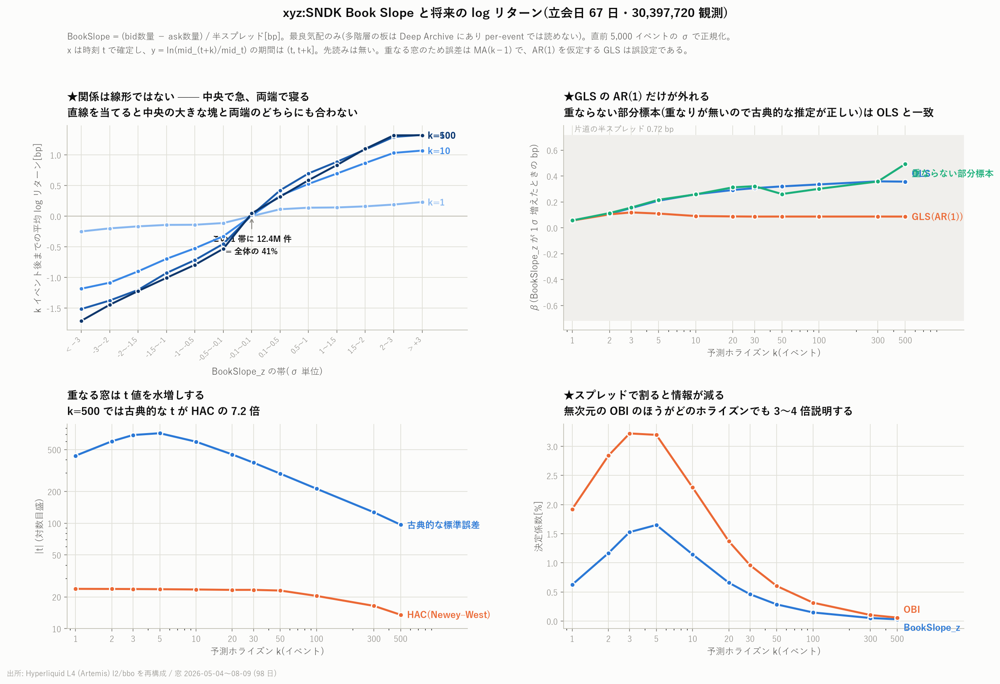

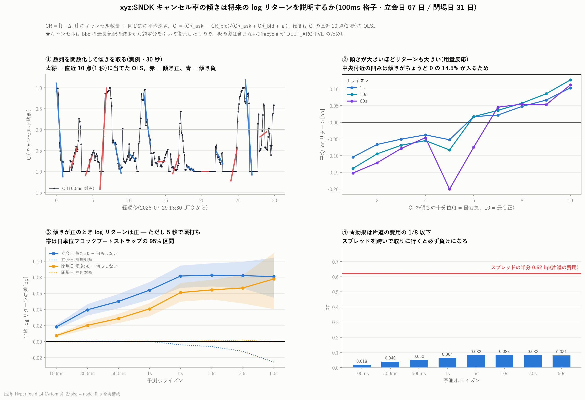

## C. 注文フローはどれだけ自分自身を引きずるか

| 量 | 値 |
|---|---|
| OBI 符号持続の超過(k=1) | +0.275 |
| OBI の lag1(200ms 格子) | +0.816 |
| OFI の lag1(200ms 格子) | +0.017(実質無記憶) |

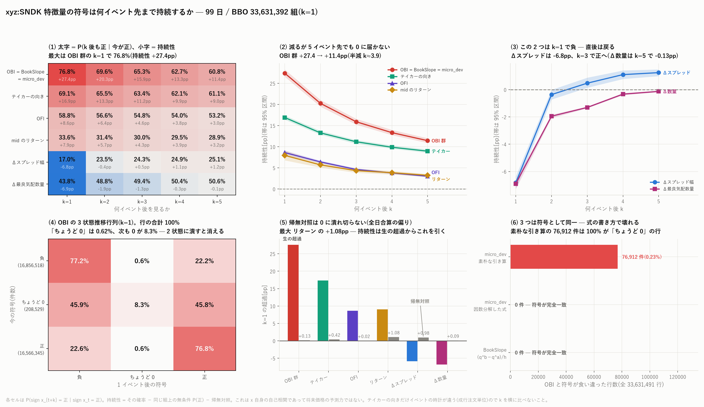

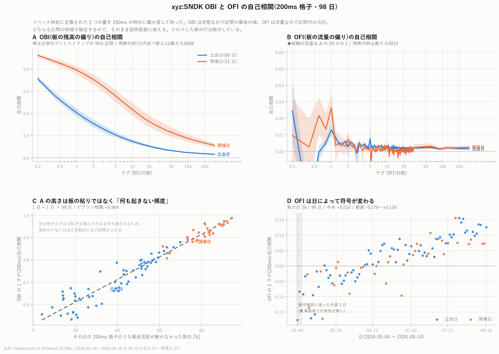

OBI の高い lag1 は [MU で示した標本化の副作用](../MU/mu_acf_200ms_report.md)
がそのまま出たもの。OFI は無記憶で、これも 7 銘柄共通。

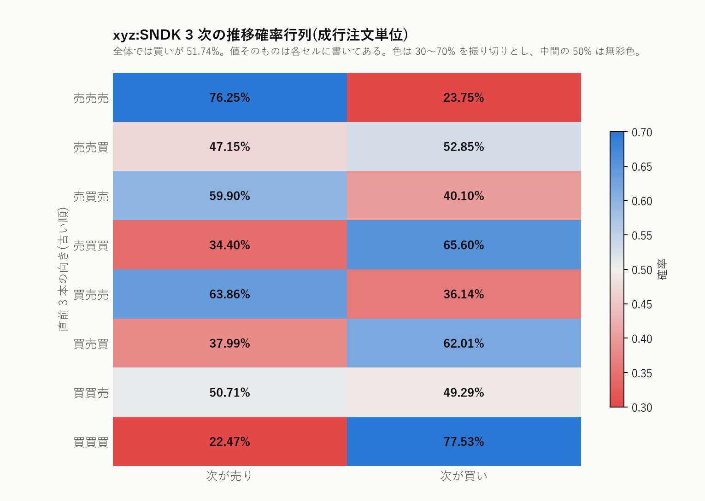

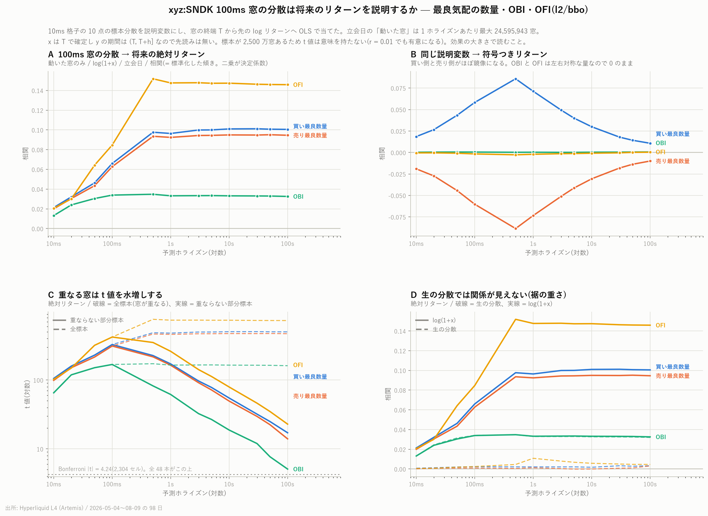

## D. 板の中の量どうし

- corr(スプレッド, 約定量) = **−0.183**: 約定は板が狭いときに起きる
- corr(最良数量, 約定量) = +0.287

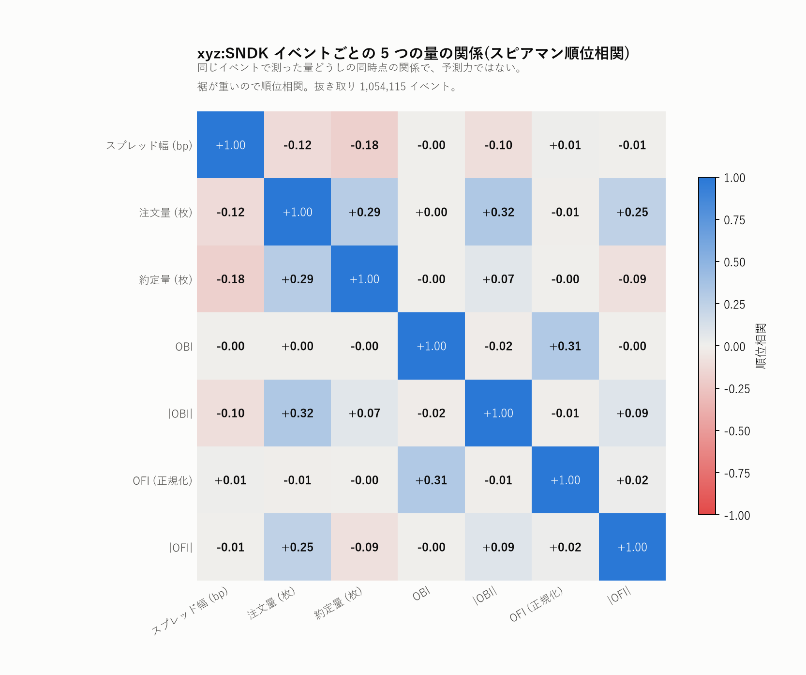

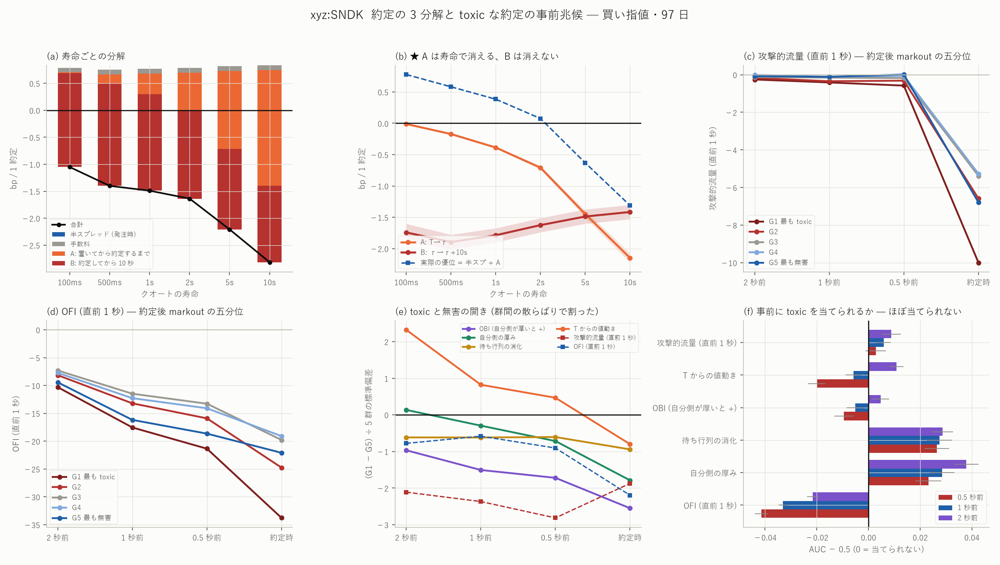

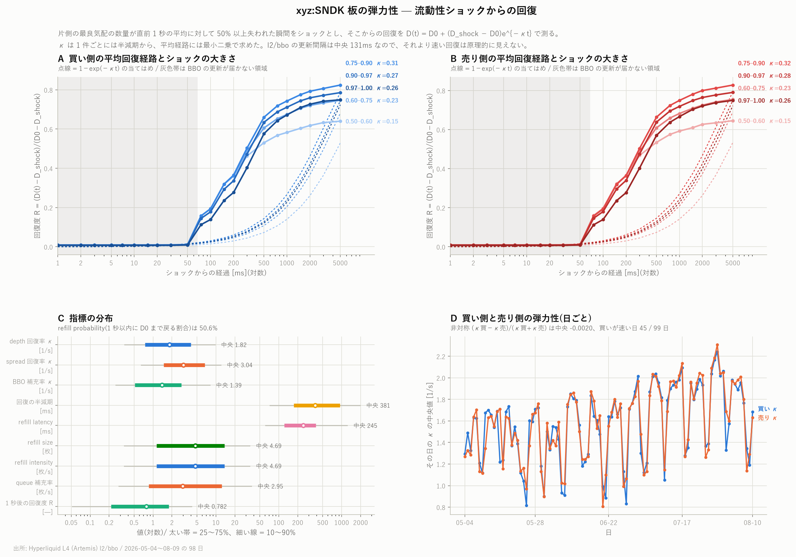

## 限界

1. bbo(最良 1 段)+ fills だけの物差し。キュー・寿命・口座の層は無い
2. 費用は引いていない。エッジ表は格子の最大値(多重比較あり)
3. MU と同一期間・同一相場つき(独立な再現ではない)

数字の再現は [README の再現手順](README.md#再現手順) を参照。
