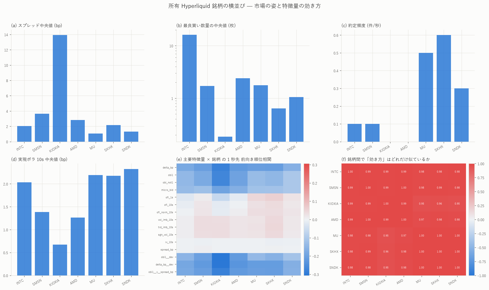

# 所有 7 銘柄の横並び — 同じ物差しで測ると、板の姿は別物でも「効き方」は同じだった

[← Hyperliquid の分析](README.md) ／ [用語辞書](../../GLOSSARY.md)
／ [予測の定義](../predicting_definition.md)

対象 `xyz:MU` / `xyz:INTC` / `xyz:AMD` / `xyz:KIOXIA` / `xyz:SKHX` / `xyz:SMSN` / `xyz:SNDK`
／ 標本 2026-05-04 〜 2026-08-10(KIOXIA のみ板の稼働開始が 2026-06-25 で 47 日)

`xyz:MU` で作った分析一式(17 スクリプト)と、bbo+fills から作る特徴量パネル
(199 列 × 7 ホライズン)を、**所有している全銘柄に同じ設定で**当てました。
データはローカルミラー(`E:/hlpipe` の l2/bbo と fills)から組んだので、
S3 の追加費用はゼロです。



## 先に結論

- **板の姿は銘柄で 20 倍違うのに、特徴量の「効き方」はほぼ同一。**
  主要 15 特徴量 × 1 秒先の前向き順位相関を銘柄ごとのベクトルにして
  相互相関を取ると、21 ペア全てで **+0.95〜+1.00**(図 f)。
  δ = microprice − mid の逆張りは 7 銘柄すべてで負
  (1 秒先 −0.16 〜 −0.28)、mid 建てに替えると 7 銘柄すべてで正
  (+0.03 〜 +0.11)に反転する。**MU で見つけた構造は銘柄の個性ではなく、
  この取引所の板の性質**である
- **予測力の山のホライズンは、流動性が薄いほど遅くへずれる。**
  約定が多い順に MU・SNDK・INTC は 500ms、AMD・SKHX・SMSN は 1 秒、
  ほぼ約定の無い KIOXIA は **10 秒**が山(最大 \|r\| = 0.359)。
  薄い板ほど気配が古くなり、マイクロプライスの歪みが解消されるまでの
  時間が伸びる、という読みと整合する
- **逆張りの強さも流動性と逆順。** δ の 1 秒逆張りは
  KIOXIA −0.282 > AMD −0.219 > MU −0.207 ≈ SKHX −0.209 ≈ SMSN −0.206
  > INTC −0.182 > SNDK −0.161。**ただし薄い銘柄ほどスプレッドが広く
  (KIOXIA は中央値 13.9bp)、費用を引けば取れない**点は MU と同じ
- **OFI は 7 銘柄すべてで無記憶、OBI の見かけの自己相関は 7 銘柄すべてで
  標本化の副作用。** 200ms 格子の lag1 は OFI \|ρ\| ≤ 0.07 に対し
  OBI +0.79〜+0.91。OBI の符号持続(k=1 の超過)は 7 銘柄とも
  +0.23〜+0.29 の狭い帯に収まる
- **約定はどの銘柄でも「板が厚いとき」ではなく「スプレッドが狭いとき」に起きる。**
  スプレッド × 約定量の相関は 7 銘柄すべてで負(−0.09 〜 −0.36)
- **KIOXIA の板は事実上まだ機能していない。** 板の稼働は 2026-06-25 から
  (bbo の 99 ファイル中 52 が空)。スプレッド中央値 13.9bp(67 ティック)、
  最良数量 0.19 枚、約定は 10 秒に 0 件台

---

## 1. 何をどの銘柄で走らせたか

| 層 | 内容 | 銘柄 |
|---|---|---|
| 素性 | fills から日次の出来高・参加者・注文サイズ・清算(coin_profile) | 7 銘柄 |
| MU スイート 17 本 | oi_volume / volume_side / order_size / vol / variance / sign_chain / microprice / obi_ofi / book_slope / cancel_rate / depth / sign_persistence / acf_200ms / var100 / spread_flow / markout / resilience | MU 以外の 6 銘柄(MU は既報) |
| 特徴量パネル | bbo+fills だけで作れる 199 列を 100ms 格子で(build_xfeat)。目的変数は 100ms/500ms/1s/5s/10s/30s/60s の 7 本 | 7 銘柄 |
| 予測力 | 199 × 7 = 1,393 セル × 7 銘柄。前向き/後ろ向き/帰無対照(日内 1 時間ずらし)/日で前半後半/日次符号 | 7 銘柄 |

パネルは l1(注文一本ごと)を使わない。l1 が要る層(キュー・寿命・口座)は
[INTC の 972 本](INTC/intc_l4feat_report.md)と [MU の各レポート](MU/README.md)に
ある。ここでの狙いは**同じ物差しでの横並び**である。

measure の規約は MU/INTC と同じ:
順位相関は midrank、標本は 20 秒/60 秒おきに間引いて重なりを避ける、
帰無対照は説明変数を同じ日の中で 1 時間ずらす、
板がクロスした行は除外、分位の基準は前日から作る。

---

## 2. 板の姿 — 60 秒標本の中央値

| 銘柄 | 日数 | 価格 | 幅 bp | 最良買い(枚) | 約定/10s | ボラ10s bp | 出来高 $/日 | 建玉 $ | 清算/日 |
|---|---|---|---|---|---|---|---|---|---|
| MU | 99 | 923 | **1.07** | 1.76 | 5.0 | 2.19 | **1.62 億** | 0.98 億 | 33 |
| SNDK | 99 | 1578 | 1.30 | 1.06 | 3.0 | **2.33** | 1.11 億 | 0.35 億 | **49** |
| SKHX | 99 | 1320 | 2.18 | 0.64 | **6.0** | 2.18 | 0.88 億 | **1.04 億** | 42 |
| INTC | 99 | 112 | 2.04 | **16.1** | 1.0 | 2.03 | 0.48 億 | 0.21 億 | 21 |
| AMD | 99 | 505 | 2.83 | 2.39 | 0.0 | 1.26 | 0.19 億 | 0.09 億 | 5 |
| SMSN | 99 | 194 | 3.65 | 1.72 | 1.0 | 1.39 | 0.18 億 | 0.12 億 | 11 |
| KIOXIA | **47** | 383 | **13.9** | **0.19** | 0.0 | 0.67 | 0.04 億 | 0.03 億 | 17 |

- 出来高は日次中央値(テイカー側)。建玉は日中平均の中央値
- 買いの割合は 7 銘柄とも 48.4〜50.3% で、期間を通せばほぼ対称。
  日次で \|z\|(HAC) > 2 になる日は 99 日中 8〜29 日
- INTC だけ最良が桁違いに厚い(16 枚)のは価格が安く相対刻みが粗いため。
  [INTC 特徴量ライブラリ](INTC/intc_featlib_report.md)の「厚くて遅い板」の再確認

---

## 3. 予測力の横並び — 山の位置が流動性で滑る

各銘柄で 199 特徴量 × 7 ホライズンを測った最大 \|順位相関\|(前向き、
マイクロプライス建て)と、その山のホライズン:

| 銘柄 | 100ms | 500ms | 1s | 10s | 60s | 山 | 帰無対照の最大 |
|---|---|---|---|---|---|---|---|
| MU | 0.132 | **0.233** | 0.211 | 0.081 | 0.032 | 500ms | 0.011 |
| SNDK | 0.098 | **0.183** | 0.167 | 0.065 | 0.033 | 500ms | 0.011 |
| INTC | 0.102 | **0.188** | 0.186 | 0.118 | 0.056 | 500ms | 0.011 |
| AMD | 0.116 | 0.221 | **0.236** | 0.202 | 0.127 | 1s | 0.012 |
| SKHX | 0.102 | 0.201 | **0.210** | 0.168 | 0.111 | 1s | 0.017 |
| SMSN | 0.111 | 0.221 | **0.231** | 0.193 | 0.150 | 1s | 0.016 |
| KIOXIA | 0.141 | 0.295 | 0.314 | **0.359** | 0.290 | **10s** | 0.038 |

3 群に割れる。**約定が速い群(MU・SNDK・INTC)は 500ms、中間
(AMD・SKHX・SMSN)は 1 秒、死んでいる KIOXIA は 10 秒**。
60 秒でもまだ 0.29 残っている KIOXIA は「歪んだ気配が何十秒も
放置される」市場で、これは予測力というより**板の更新の遅さの写像**である。

上位の列はどの銘柄でも同じ顔ぶれ(δ とその変換、OBI とその偏差)。
mid 建てにすると δ の符号が反転するのも 7 銘柄共通で、
[INTC 972 本のレポート](INTC/intc_l4feat_report.md)の「δ の逆張りには
定義から来る機械的な部分がある」がそのまま当てはまる。

日で前半・後半に割った r の相関は 0.88〜0.98。
上位特徴量の日次符号一致は 7 銘柄とも 8〜10 割の帯にある。

### 効き方ベクトルの相互相関

主要 15 本 × 1 秒先の r を銘柄ごとに並べたベクトルの相関(図 f)は
最小でも +0.95(KIOXIA↔MU)。**どの銘柄で測っても、効く特徴量・符号・
おおまかな序列は同じ**である。板の姿(2 節)がこれだけ違っても揃うので、
この構造は銘柄でなく市場設計(板の作られ方・参加者の行動様式)に属する。

---

## 4. MU スイートの主な数字の横並び

| 指標 | MU | INTC | AMD | KIOXIA | SKHX | SMSN | SNDK |
|---|---|---|---|---|---|---|---|
| microprice 帯の最大エッジ(上昇確率 − 基準)| 0.162 | 0.352 | 0.203 | 0.179 | 0.136 | 0.137 | 0.168 |
| 同・帰無対照 | 0.023 | 0.015 | 0.017 | 0.039 | 0.028 | 0.012 | 0.017 |
| OBI 帯の最大エッジ | 0.172 | 0.146 | 0.049 | 0.091 | 0.192 | 0.115 | 0.232 |
| OFI 帯の最大エッジ | 0.224 | 0.135 | 0.071 | 0.159 | 0.194 | 0.081 | 0.239 |
| Book Slope の HAC t(1 イベント先)| 87.3 | 32.8 | 24.7 | **1.8** | 12.4 | 18.9 | 23.8 |
| キャンセル率の傾き 最大差 bp | 0.078 | 0.046 | 0.053 | −0.071 | 0.084 | 0.052 | 0.083 |
| OBI 符号持続の超過(k=1)| 0.257 | 0.262 | 0.229 | 0.231 | 0.287 | 0.231 | 0.275 |
| OBI の lag1(200ms)| 0.79 | 0.87 | 0.89 | 0.91 | 0.83 | 0.82 | 0.82 |
| OFI の lag1(200ms)| +0.03 | −0.05 | −0.07 | +0.01 | +0.00 | −0.04 | +0.02 |
| corr(スプレッド, 約定量)| −0.24 | −0.09 | −0.25 | −0.33 | −0.14 | −0.36 | −0.18 |
| 実効半スプレッド bp(日次中央値)| 0.84 | 1.17 | 1.58 | **11.1** | 1.32 | 2.07 | 0.85 |

- microprice / OBI / OFI のエッジは「帯 × ホライズンの格子から最大を
  取った値」なので**最大統計量**である(格子は銘柄あたり 100〜250 セル)。
  帰無対照(時間ずらし)を各行の下に併記した
- キャンセル率の差はどの銘柄でも往復費用(2 × 実効半スプレッド)を
  大きく下回る。**MU の「有意だが費用に届かない」は 6 銘柄でも変わらない**
- KIOXIA だけ Book Slope が立たない(t=1.8)。板がスカスカで
  「傾き」が定義できる状態にない

---

## 5. 銘柄ごとの詳細

各銘柄の全図・全数値は銘柄索引にある:
[MU](MU/README.md) ・ [INTC](INTC/README.md) ・ [AMD](AMD/README.md) ・
[KIOXIA](KIOXIA/README.md) ・ [SKHX](SKHX/README.md) ・
[SMSN](SMSN/README.md) ・ [SNDK](SNDK/README.md)

---

## 6. 限界と注意

1. **このパネルは bbo(最良 1 段)+ fills だけ**で作った横並び用の物差し。
   板の形・多水準 OBI・キュー・寿命・口座の層は入っていない
   (それらは l1 が要る。INTC 972 本と MU 各レポート参照)
2. **費用は引いていない。** δ の逆張り \|r\| が大きい銘柄ほどスプレッドが
   広い。KIOXIA の 0.36 は 13.9bp の幅の中の話である
3. **同一期間・同一相場つき**の 7 銘柄で、独立標本ではない
   (同時相関は 1 分で 0.5 前後 — [INTC↔MU の先行遅行](INTC/intc_l4feat_report.md))
4. KIOXIA は 47 日しかなく、帰無対照も 0.038 まで上がる。
   単独の数字は他銘柄より 1 段割り引いて読む
5. microprice 系のエッジ表は格子の最大値。多重比較の規模
   (銘柄 7 × セル 100〜250)を忘れないこと

---

## 7. 再現手順

```bash
# 1) ミラーから bbo と fills を組む(S3 不要)
uv run python scripts/mirror_to_local.py --coin xyz:AMD    # KIOXIA/SKHX/SMSN/SNDK も同様

# 2) 素性
uv run python scripts/coin_profile.py --coin xyz:AMD --ref xyz:MU

# 3) MU スイート一式(17 本 + 図)
sh scripts/run_mu_suite.sh xyz:AMD

# 4) 特徴量パネルと 7 ホライズンの予測力
uv run python scripts/build_xfeat.py --coin xyz:AMD
uv run python scripts/fit_xfeat.py   --coin xyz:AMD --stage pool
uv run python scripts/fit_xfeat.py   --coin xyz:AMD --stage daily
uv run python scripts/plot_xfeat.py  --coin xyz:AMD

# 5) 横並び
uv run python scripts/build_xcompare.py --coins xyz:MU,xyz:INTC,xyz:AMD,xyz:KIOXIA,xyz:SKHX,xyz:SMSN,xyz:SNDK
uv run python scripts/plot_xcompare.py
uv run python scripts/harvest_suite.py  --coins xyz:MU,xyz:INTC,xyz:AMD,xyz:KIOXIA,xyz:SKHX,xyz:SMSN,xyz:SNDK
```