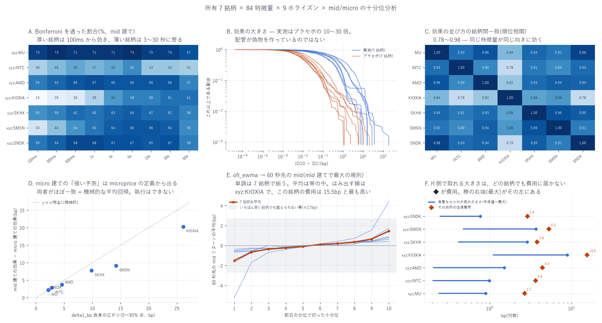

# 所有 7 銘柄 × 特徴量 84 本 × 9 ホライズンの十分位分析

[← Hyperliquid の分析](README.md) / [ホーム](../../README.md)

**何を測ったか** — Hyperliquid で板と約定がそろっている **7 銘柄すべて**
(`xyz:MU` / `xyz:INTC` / `xyz:AMD` / `xyz:KIOXIA` / `xyz:SKHX` / `xyz:SMSN` / `xyz:SNDK`)
について、**最良気配と約定だけから作れる特徴量 84 本**を十分位に切り、
**100ms / 300ms / 500ms / 1s / 3s / 5s / 10s / 30s / 60s** の 9 ホライズン ×
**mid 建て / microprice 建て**の将来リターンとの関係を出した。
[2 銘柄・229 本の版](decile_report.md)を全銘柄へ広げたもの。

**時間契約** — 説明変数は格子点 $`T`$ までの情報だけで確定する。
**十分位の境目は前日の分布**から作る(全標本の分位を使うと $`T`$ より後の情報で
順位づけることになる)。目的変数は $`(T,\,T+h]`$。`shift(-k)` は目的変数にしか使っていない。

---

## 先に結論

| 問い | 答え |
|---|---|
| 統計的に有意な組み合わせはあるか | **どの銘柄にも大量にある。** Bonferroni を通るのは **40.0〜61.9%**。プラセボ(特徴量を 1 営業日ずらす)は **7 銘柄すべてで 0.0%**、8,712 検定中 **0 本** |
| どのホライズンが効くか | **板の厚さで変わる。** 厚い銘柄(`xyz:MU`・`xyz:SNDK`)は **100ms からすでに 59〜70%** が有意。薄い銘柄(`xyz:KIOXIA`・`xyz:SMSN`)は 100ms で 24〜33% しかなく、**3〜30 秒に山が寄る** |
| どの特徴量が効くか | **OFI が圧倒的。** 銘柄をまたいで再現した mid 建て 344 通りのうち **122 通りが OFI ファミリー**で、上位 12 位は全部 OFI。次いでマイクロプライス・板の偏り |
| 銘柄をまたいで再現するか | **する。** 効果の並び方の順位相関は **0.78〜0.98**(21 ペア全部)。5 銘柄以上で有意かつ 7 銘柄で符号が一致する組み合わせが **527 通り** |
| micro 建ての巨大な効果は本物か | **いいえ、定義から出る機械的な平均回帰。** `delta1_bp → micro_60s` は `xyz:KIOXIA` で −17.5bp もあるが、これは **`delta1_bp` 自身の広がり 26.1bp** がそのまま戻るだけ。microprice では約定できない |
| **費用を引いて残るか** | **1 セルも残らない。** 片側で取れる大きさの最大は、`xyz:MU` 0.89bp(費用 2.66bp)〜`xyz:KIOXIA` 8.87bp(費用 15.49bp)。**7 銘柄 × 8,712 検定のうち、片側が自分の往復費用を越えたものはゼロ** |



---

## 1. 作り方

### 1.1 なぜ 229 本ではなく 84 本なのか

[2 銘柄版](decile_report.md)の 229 本は **L1(板の全階層の再構成)** を入力にしている。
L1 が手元にあるのは `xyz:MU` と `xyz:INTC` だけで、残り 5 銘柄ぶんを S3 から引くと
**約 99GB・$2.6** の課金が要る(CLAUDE.md の費用ゲート対象・**未承認のため実行していない**)。

そこで **bbo(最良気配)と fills(約定)だけで作れる 84 本**に絞り、7 銘柄を同じ土俵に載せた
(`build_featbbo.py`)。落ちるのは第 2 階層以深に依存するファミリーである。

| ファミリー | 84 本版 / 229 本版 |
|---|---:|
| 1 価格と最良気配 | 17 / 17 |
| 12 攻撃的な約定フロー | 15 / 15 |
| 8 OFI | 23 / 27 |
| 2 板の偏り OBI | 11 / 19 |
| 4 マイクロプライス | 10 / 25 |
| 3 板の厚み | 8 / 32 |
| 5 板の形 / 6 板の隙間 / 7 板の弾力性 / 9 指値フロー / 10 取消 / 11 指値の到着 | 0 / 108 |

### 1.2 ★ `xyz:MU` では bbo 由来のほうが正確だった

MU は L1 も bbo も持っているので、共通する 21 日で 84 列を突き合わせた
(`data/featbbo_vs_featlib_MU.csv`)。**28 列で相関が 0.999 を下回り、その全部が
最良気配の「数量」由来**だった。

| 列 | 相関 |
|---|---:|
| `depth_ratio` | 0.460 |
| `delta1_bp` / `obi_x_spread` | 0.524 |
| `micro_minus_ask` | 0.771 |
| `qa1` / `cum_a1` | 0.911 |
| `obi1` | 0.966 |
| `qb1` / `cum_b1` | 0.981 |

原因は入力の違いである。featlib の第 1 階層数量は **L1 のイベント列から組み直した梯子**、
featbbo は **取引所が `bbo` として配信する `bid_sz` / `ask_sz` そのもの**。
後者が真値なので、**全銘柄を featbbo でそろえた**。価格由来の列(`mid`・`spread_bp` 等)と
OFI・約定フローは 56 列すべてが r ≥ 0.999 で一致している。

### 1.3 ★標本が 5 倍に増えた(MU)

副産物として、MU の標本が大きく伸びた。L1 を引いてあるのは 21 日ぶんだけで、
**229 本版の MU の結論は実質 20 日で出ていた**。bbo は 98 日ぶんある。

| | 229 本版(L1 由来) | 84 本版(bbo 由来) |
|---|---:|---:|
| `xyz:MU` の日数 | 20 | **97** |
| Bonferroni の \|t\| 閾値 | 5.27 | 4.29 |
| 同じ 84 本での有意割合 | 40.1% | **61.9%** |
| `ofi_ewma → mid_60s` の D10−D1 | +2.657bp(\|t\| 7.7) | +1.706bp(\|t\| 9.4) |
| `obi1 → mid_60s` の D10−D1 | +1.535bp(\|t\| 7.8) | +1.431bp(\|t\| 17.4) |

符号と桁は一致しており、**違いは主に標本の長さ**である
(`xyz:INTC` は両方とも 98 日で、229 本版 35.9% / 84 本版 40.0% と近い)。

### 1.4 十分位・標準誤差・帰無対照

* **境目は前日の分位**。初日は基準が無いので落とす。
* **標準誤差は日でクラスタ**する。5 秒格子の点どうしは強く相関しており、
  独立とみなすと最大 15.8 倍過小になることを実測済み
  ([burstiness のレポート](MU/mu_burstiness_report.md))。
  D10 − D1 の差を日ごとに作り、日を単位に標準誤差を出す。
* **Bonferroni の閾値**は自由度 = 日数 − 1 の t 分布から取る(正規近似は甘い)。
* **帰無対照**は特徴量だけ 1 営業日ずらした系列。
* **`polars` の `NaN > 数値` は true**。十分位が潰れた特徴量の `t` は NaN なので、
  `.is_finite()` を付けないと偽の有意が大量に出る([実際に一度踏んだ](decile_report.md#13-配管そのものを検算した))。

### 1.5 標本

| 銘柄 | 日数 | 切れた特徴量 | 検定 | \|t\| 閾値 | 有意 | 実測 | プラセボ | 中央スプレッド | 往復費用 | 片側の最大 |
|---|---:|---:|---:|---:|---:|---:|---:|---:|---:|---:|
| `xyz:MU` | 97 | 66 / 84 | 1,188 | 4.29 | 735 | 61.9% | 0.0% | 1.08bp | 2.66bp | 0.89bp |
| `xyz:INTC` | 98 | 70 / 84 | 1,260 | 4.31 | 504 | 40.0% | 0.0% | 2.05bp | 3.63bp | 0.99bp |
| `xyz:AMD` | 98 | 70 / 84 | 1,260 | 4.31 | 703 | 55.8% | 0.0% | 2.84bp | 4.42bp | 1.50bp |
| `xyz:KIOXIA` | 46 | 66 / 84 | 1,188 | 4.54 | 608 | 51.2% | 0.0% | 13.91bp | 15.49bp | 8.87bp |
| `xyz:SKHX` | 98 | 73 / 84 | 1,314 | 4.32 | 689 | 52.4% | 0.0% | 2.22bp | 3.80bp | 2.87bp |
| `xyz:SMSN` | 97 | 70 / 84 | 1,260 | 4.31 | 604 | 47.9% | 0.0% | 3.71bp | 5.29bp | 3.66bp |
| `xyz:SNDK` | 98 | 69 / 84 | 1,242 | 4.30 | 687 | 55.3% | 0.0% | 1.31bp | 2.89bp | 0.77bp |

`xyz:KIOXIA` だけ 46 日なのは、**2026-06-25 より前は板が存在しない**ため
(上場が遅い)。日数が少ないぶん閾値が 4.54 と高く、判定は他より厳しい。

「切れた特徴量」が 84 本に満たないのは、離散・疎な特徴量(`obi_sign`・
`*_shock` 等)で**前日の分位が潰れて十分位に切れない**ものがあるため。
これらは検定から除いている(NaN のまま数えると偽の有意になる)。

---

## 2. 効くホライズンは板の厚さで変わる

Bonferroni を通った割合(%、mid 建て)。

| ホライズン | `xyz:MU` | `xyz:INTC` | `xyz:AMD` | `xyz:KIOXIA` | `xyz:SKHX` | `xyz:SMSN` | `xyz:SNDK` |
|---|---:|---:|---:|---:|---:|---:|---:|
| 100ms | **70** | 40 | 59 | 24 | 55 | 33 | 59 |
| 300ms | **73** | 46 | 63 | 29 | 58 | 44 | 64 |
| 500ms | 71 | 50 | 66 | 30 | 62 | 54 | **68** |
| 1s | 71 | 47 | 67 | 39 | 60 | 60 | **68** |
| 3s | 71 | 50 | 66 | 53 | 63 | 64 | 67 |
| 5s | **73** | 56 | 66 | 58 | 64 | 66 | 67 |
| 10s | 70 | 43 | 66 | 58 | 62 | 66 | 65 |
| 30s | 70 | 43 | 66 | 61 | 62 | 64 | 67 |
| 60s | 67 | 41 | 57 | **61** | 58 | 56 | 58 |

中央スプレッドが 1.1〜1.3bp の `xyz:MU` / `xyz:SNDK` は **100ms の時点で既に 59〜70%** が
有意で、そこから先はほぼ横ばい。一方、13.9bp の `xyz:KIOXIA` は 100ms で 24% しかなく、
**30〜60 秒でようやく 61% に達する**。3.7bp の `xyz:SMSN` も同じ形(33% → 66%)。

**情報が価格に入るまでの時間が、板の薄さに比例して延びている。**
これは[7 銘柄の横並び](cross_coin_report.md)で見た「予測力の山のホライズンは
流動性が薄いほど遅くへずれる」と同じ現象を、229 本ではなく 84 本・9 ホライズンで
裏づけたことになる。

---

## 3. 効くのは OFI

銘柄をまたいで再現した組み合わせ(**5 銘柄以上で Bonferroni を通り、かつ 7 銘柄で
符号が一致**)は **527 通り**(全 1,314 通り中)。ファミリー別の内訳は次のとおり。

| ファミリー | 該当数 | うち mid 建て | \|中央値\| の中央 |
|---|---:|---:|---:|
| 8 OFI | 126 | 122 | 0.759bp |
| 12 攻撃的な約定フロー | 118 | 61 | 0.352bp |
| 4 マイクロプライス | 112 | 56 | 0.726bp |
| 2 板の偏り OBI | 95 | 58 | 0.505bp |
| 3 板の厚み | 54 | 36 | 0.466bp |
| 1 価格と最良気配 | 22 | 11 | 0.744bp |

**OFI は 126 通り中 122 通りが mid 建て**で、micro 建てに頼っていない。
マイクロプライスは 112 通り中 56 通りしか mid 建てでなく、残り半分は §4 の機械的な効果である。

mid 建てで大きい順に並べると、上位 12 位はすべて OFI だった。

| 特徴量 | ファミリー | ホライズン | 通った銘柄数 | 中央値 | 最小 | 最大 | 単調性 ρ |
|---|---|---|---:|---:|---:|---:|---:|
| `ofi_per_time` | 8 OFI | 60s | 7/7 | +1.773 | +0.884 | +5.381 | +0.976 |
| `ofi_1s` | 8 OFI | 60s | 7/7 | +1.773 | +0.884 | +5.381 | +0.976 |
| `ofi_dollar` | 8 OFI | 60s | 7/7 | +1.770 | +0.878 | +5.349 | +0.976 |
| `ofi_ewma` | 8 OFI | 30s | 7/7 | +1.759 | +0.863 | +6.793 | +1.000 |
| `ofi_pct` | 8 OFI | 30s | 6/7 | +1.737 | +0.809 | +4.832 | +0.964 |
| `ofi_ewma` | 8 OFI | 60s | 6/7 | +1.706 | +1.068 | +9.401 | +1.000 |
| `ofi_pct` | 8 OFI | 60s | 6/7 | +1.703 | +0.887 | +6.320 | +0.952 |
| `ofi_pct` | 8 OFI | 10s | 7/7 | +1.595 | +0.756 | +2.750 | +0.976 |
| `ofi_10s` | 8 OFI | 60s | 5/7 | +1.572 | +0.680 | +8.933 | +1.000 |
| `ofi_1s` | 8 OFI | 30s | 7/7 | +1.552 | +0.763 | +4.156 | +0.988 |
| `ofi_per_time` | 8 OFI | 30s | 7/7 | +1.552 | +0.763 | +4.156 | +0.988 |
| `ofi_dollar` | 8 OFI | 30s | 7/7 | +1.536 | +0.762 | +4.151 | +0.988 |

単調性はほぼ完璧(ρ が +0.95〜+1.00)で、**十分位 1 から 10 へきれいに右上がり**になる。
銘柄ごとに mid 建てで最大だった規則は次のとおりで、7 銘柄中 5 銘柄が `ofi_ewma` だった。

| 銘柄 | 特徴量 | ホライズン | D1 | D10 | D10−D1 | \|t\| | 単調性 ρ | 片側 / 費用 |
|---|---|---|---:|---:|---:|---:|---:|---:|
| `xyz:MU` | `ofi_ewma` | 60s | −0.571 | +0.889 | +1.706 | 9.4 | +1.000 | 0.89 / 2.66 |
| `xyz:INTC` | `depth_diff` | 60s | −0.503 | +0.512 | +1.325 | 10.1 | +0.988 | 0.51 / 3.63 |
| `xyz:AMD` | `ofi_ewma` | 60s | −0.505 | +0.629 | +1.299 | 9.6 | +1.000 | 0.63 / 4.42 |
| `xyz:KIOXIA` | `ofi_ewma` | 60s | −5.225 | +4.387 | +9.401 | 10.0 | +1.000 | 5.22 / 15.49 |
| `xyz:SKHX` | `ofi_ewma` | 60s | −1.668 | +1.715 | +4.138 | 8.7 | +1.000 | 1.71 / 3.80 |
| `xyz:SMSN` | `obi1` | 60s | −1.581 | +1.558 | +4.205 | 6.4 | +1.000 | 1.58 / 5.29 |
| `xyz:SNDK` | `ofi_1s` | 60s | −0.636 | +0.564 | +1.773 | 7.5 | +0.988 | 0.64 / 2.89 |

---

## 4. ★ micro 建ての巨大な効果は定義から出る

生の数字だけ見ると `xyz:KIOXIA` の `delta1_bp → micro_60s` は **−17.5bp** もある。
これを「予測力」と読むのは誤りである。

microprice の定義は

```math
\mathrm{micro} = \mathrm{mid} + \underbrace{\frac{p_a-p_b}{2}\cdot\frac{q_b-q_a}{q_b+q_a}}_{\textstyle \mathrm{delta1}}
```

なので、`delta1` が大きい格子点では `micro` が `mid` から離れている。
`delta1` は平均回帰するから、`micro` 建てのリターンには **`delta1` が戻るぶんが自動で入る**。

7 銘柄で「mid 建ての効果 − micro 建ての効果」と「`delta1_bp` 自身の広がり(5〜95% 点)」を
並べると、ほぼ 1 対 1 に乗る(図 D)。

| 銘柄 | mid 60s | micro 60s | 差(mid − micro) | `delta1_bp` の広がり |
|---|---:|---:|---:|---:|
| `xyz:MU` | +0.769 | −1.402 | 2.171 | 2.195 |
| `xyz:INTC` | +0.873 | −1.951 | 2.824 | 2.787 |
| `xyz:AMD` | +0.672 | −3.100 | 3.772 | 4.583 |
| `xyz:KIOXIA` | +2.826 | −17.475 | 20.301 | 26.115 |
| `xyz:SKHX` | +1.482 | −6.259 | 7.741 | 9.853 |
| `xyz:SMSN` | +1.291 | −7.841 | 9.133 | 14.216 |
| `xyz:SNDK` | +0.890 | −1.355 | 2.244 | 2.189 |

**microprice では約定できない。**執行できるのは最良気配であって、
`micro` が戻る動きを取るには板の内側に指して埋まるのを待つしかなく、
それは別物(メイカーの逆選択の問題)である。
以降、費用の判定は **mid 建てだけ**で行う。

[229 本版](decile_report.md#3-mid-建てと-micro-建てで符号が逆になる)で
「`delta1_bp` は mid で正・micro で負」と書いたのは同じ現象で、
**今回 7 銘柄で定量的に機械的だと確認できた**。

---

## 5. ★費用を引くと 1 セルも残らない

### 5.1 費用は銘柄ごとに違う

229 本版は 2 銘柄とも **2.83bp** という単一の費用を使ったが、これは `xyz:MU` の
半スプレッドから作った値で、他の銘柄には当てはまらない。銘柄ごとに測り直す。

```
往復費用 = 2 × ( 中央スプレッド / 2 + テイカー手数料 0.79bp )
```

| 銘柄 | 中央スプレッド | 半スプレッド | 往復費用 |
|---|---:|---:|---:|
| `xyz:MU` | 1.085bp | 0.542 | **2.66bp** |
| `xyz:SNDK` | 1.306bp | 0.653 | **2.89bp** |
| `xyz:INTC` | 2.046bp | 1.023 | **3.63bp** |
| `xyz:SKHX` | 2.221bp | 1.110 | **3.80bp** |
| `xyz:AMD` | 2.838bp | 1.419 | **4.42bp** |
| `xyz:SMSN` | 3.707bp | 1.854 | **5.29bp** |
| `xyz:KIOXIA` | 13.905bp | 6.953 | **15.49bp** |

`xyz:KIOXIA` の費用は `xyz:MU` の **5.8 倍**である。薄い銘柄ほど大きな効果が出るのは
当たり前で、**効果と費用が同じ理由で同時に大きくなっている**。

### 5.2 判定は「片側」で行う

`|D10 − D1|` を往復費用と比べるのは**甘い**。D10 に買い・D1 に売りを建てるなら
**建玉は 2 つ**なので、費用も 2 往復ぶんかかる。実際に建てられるのは片側なので、
正しい比較は

```
max( |D1|, |D10| )  >  その銘柄の往復費用
```

である。3 段階で数えると:

| 銘柄 | 有意 | (2) \|D10−D1\| > 費用 | (3) 片側 > 費用(mid) | (3) 片側 > 費用(micro) |
|---|---:|---:|---:|---:|
| `xyz:MU` | 735 | 0 | **0** | 0 |
| `xyz:INTC` | 504 | 0 | **0** | 0 |
| `xyz:AMD` | 703 | 0 | **0** | 0 |
| `xyz:KIOXIA` | 608 | 6 | **0** | 0 |
| `xyz:SKHX` | 689 | 16 | **0** | 0 |
| `xyz:SMSN` | 604 | 9 | **0** | 0 |
| `xyz:SNDK` | 687 | 0 | **0** | 0 |
| **合計** | **4,530** | **31** | **0** | **0** |

甘い基準 (2) で残った 31 セルのうち **30 セルは micro 建ての `delta1` 系**、
つまり §4 の機械的な平均回帰である。**残る 1 セルは `xyz:SKHX` の
`ofi_ewma → mid_60s`**(D1 −1.668 / D10 +1.715 / D10−D1 +4.138bp、費用 3.80bp)で、
これが基準 (2) と (3) の違いを見るのにちょうどよい。
D10−D1 の 4.138bp は費用 3.80bp を越えているが、**実際に建てられるのは
D10 側の +1.715bp か D1 側の −1.668bp のどちらか一方**で、どちらも 3.80bp の
半分にも満たない。正しい基準 (3) では **mid 建て・micro 建てとも 1 セルも残らない**。

mid 建てだけで、銘柄ごとに片側が最大だった規則を並べると次のとおり。
**いちばん惜しい `xyz:SKHX` でも費用の 45%** にとどまる。

| 銘柄 | 規則 | 片側の最大 | 往復費用 | 費用に対する割合 |
|---|---|---:|---:|---:|
| `xyz:SKHX` | `ofi_ewma → mid_60s` | 1.71bp | 3.80bp | **45%** |
| `xyz:SMSN` | `qb1 → mid_60s` | 1.94bp | 5.29bp | 37% |
| `xyz:KIOXIA` | `ofi_ewma → mid_60s` | 5.22bp | 15.49bp | 34% |
| `xyz:MU` | `ofi_ewma → mid_60s` | 0.89bp | 2.66bp | 33% |
| `xyz:SNDK` | `obi1 → mid_60s` | 0.77bp | 2.89bp | 27% |
| `xyz:INTC` | `obi1 → mid_60s` | 0.65bp | 3.63bp | 18% |
| `xyz:AMD` | `ofi_ewma → mid_60s` | 0.63bp | 4.42bp | 14% |

micro 建ても含めた片側の最大は `xyz:SMSN` 3.66bp(費用の 69%)と
`xyz:SKHX` 2.87bp(同 76%)だが、これらは §4 の機械的な効果なので執行できない。

### 5.3 帰無対照

特徴量だけ 1 営業日ずらした系列では、**7 銘柄 8,712 検定のうち Bonferroni を
通ったものは 0 本**だった(実測は 4,530 本)。\|D10 − D1\| の分布も実測の 1/10〜1/30 に
縮む(図 B)。**配管が偽陽性を作っているのではない。効果は本物で、小さいだけである。**

---

## 6. 銘柄をまたいだ一致

効果の並び方(mid 建て・全ホライズンまとめ)の順位相関は 21 ペアすべてで正、
**0.78〜0.98**。符号一致率は 78〜96%。

| ペア | 順位相関 | 符号一致 | | ペア | 順位相関 | 符号一致 |
|---|---:|---:|---|---|---:|---:|
| MU–SNDK | 0.977 | 95.7% | | SMSN–SNDK | 0.911 | 92.5% |
| SKHX–SMSN | 0.961 | 91.0% | | INTC–AMD | 0.900 | 91.3% |
| MU–AMD | 0.959 | 92.2% | | INTC–SMSN | 0.895 | 88.9% |
| SKHX–SNDK | 0.948 | 92.9% | | KIOXIA–SMSN | 0.879 | 80.6% |
| AMD–SMSN | 0.945 | 90.6% | | KIOXIA–SKHX | 0.864 | 79.3% |
| AMD–SNDK | 0.941 | 91.7% | | MU–KIOXIA | 0.835 | 83.4% |
| MU–SKHX | 0.936 | 91.9% | | AMD–KIOXIA | 0.817 | 78.1% |
| AMD–SKHX | 0.932 | 89.8% | | KIOXIA–SNDK | 0.777 | 81.1% |
| INTC–SNDK | 0.931 | 89.4% | | INTC–KIOXIA | 0.776 | 79.1% |
| MU–INTC | 0.928 | 88.4% | | | | |
| MU–SMSN | 0.920 | 90.8% | | | | |
| INTC–SKHX | 0.915 | 89.0% | | | | |

**最も低いのは全部 `xyz:KIOXIA` を含むペア**(0.776〜0.879)で、これは 46 日しか
標本が無いことと、スプレッドが桁違いに広いことの両方が効いている。
逆に最も高いのは MU–SNDK の 0.977 で、この 2 銘柄は中央スプレッドが 1.1 / 1.3bp と近い。

229 本版の 2 銘柄の一致(順位相関 0.59〜0.77)より高いのは、
**MU の標本が 20 日から 97 日に増えて推定が安定した**ためと考えられる。

---

## 7. 限界 — 何を言っていないか

1. **「効かない」とは言っていない。** 効果は統計的に確実に存在し(\|t\| が 25 に達する
   セルもある)、単調性も完璧である。言っているのは
   **「テイカーで往復すると費用が効果を上回る」**という一点だけ。
2. **メイカーは検証していない。** メイカー手数料は 0.088bp/約定と桁違いに安い
   ([backtester_v3](../../scripts/backtester_v3.py))。ただしメイカーは
   「埋まるかどうか」と逆選択が付くので、この分析の外側にある。
   本リポジトリの[メイカー側の検証](MU/README.md)を参照。
3. **単変量である。** 84 本を組み合わせたモデルは試していない。単独で費用に
   届かない信号でも、合成すれば届く可能性は残る。
4. **229 本のうち 145 本は見ていない**(第 2 階層以深の板・指値フロー・取消)。
   `xyz:MU` と `xyz:INTC` では[229 本版](decile_report.md)で検証済みで、そちらでも
   費用を越えるセルは無かった。残り 5 銘柄については未検証で、L1 の取得($2.6)が要る。
5. **`xyz:KIOXIA` は 46 日**しかない。他の 6 銘柄(97〜98 日)より結論が弱い。
6. **サイズを考えていない。** D10 の平均が費用を越えても、そこに置ける金額が小さければ
   意味が無い(`Economic Significance = Signal × ExecutableSize − Fees − …`)。
   今回はそもそも Signal が費用に届かないので、その先へ進んでいない。

---

## 8. 過去のレポートとの食い違い

[229 本版](decile_report.md)は **2 銘柄とも往復費用 2.83bp** を当て、
判定を **\|D10 − D1\| > 費用**で行っていた。今回の測定で 2 点を訂正する。

* **費用は銘柄ごとに違う。** `xyz:MU` は 2.66bp とほぼ同じだが、
  `xyz:INTC` は **3.63bp** で、2.83bp は 0.8bp 甘かった。
* **\|D10 − D1\| との比較は甘い。** 片側で比べるべきで、
  そうすると残るセルはさらに減る。

どちらも **「費用を越えるセルは無い」という結論を強める向き**の訂正であり、
229 本版の結論は変わらない(2 銘柄の最大 \|D10 − D1\| は 2.785 / 1.630bp で、
より厳しい片側基準でも当然届かない)。

---

## 9. 再現手順

```bash
# 1. 最良気配と約定から 84 本の特徴量を作る(5 秒格子)
for c in MU INTC AMD KIOXIA SKHX SMSN SNDK; do
  uv run python scripts/build_featbbo.py --coin xyz:$c
done

# 2. 9 ホライズン × mid/micro の前向きリターン
for c in MU INTC AMD KIOXIA SKHX SMSN SNDK; do
  uv run python scripts/build_fwd.py --coin xyz:$c --src featbbo --suffix _bbo
done

# 3. 十分位分析(前日の分位・日クラスタ・プラセボ同時)
for c in MU INTC AMD KIOXIA SKHX SMSN SNDK; do
  uv run python scripts/build_decile.py --coin xyz:$c --src featbbo --suffix _bbo
done

# 4. 集計と図
uv run python scripts/analyze_decile_all.py
uv run python scripts/plot_decile_all.py
```

生成物:

| ファイル | 内容 |
|---|---|
| `data/decile_sum_xyz_<coin>_bbo.csv` | 特徴量 × 目的変数の要約(D1・D10・差・\|t\|・単調性) |
| `data/decile_null_xyz_<coin>_bbo.csv` | プラセボ(1 営業日ずらし)の同じ表 |
| `data/decile_xyz_<coin>_bbo.parquet` | 十分位ごとの平均リターン |
| `data/decile_all_report.csv` | 銘柄 × ホライズン × 価格建ての集計 |
| `data/decile_all_robust.csv` | 銘柄をまたいで再現した 527 通り |
| `data/decile_all_xcoin.csv` | 銘柄ペアの順位相関 |
| `data/decile_all_cost.csv` | 銘柄ごとの費用と 3 段階の判定 |
| `data/featbbo_vs_featlib_MU.csv` | §1.2 の突き合わせ |
