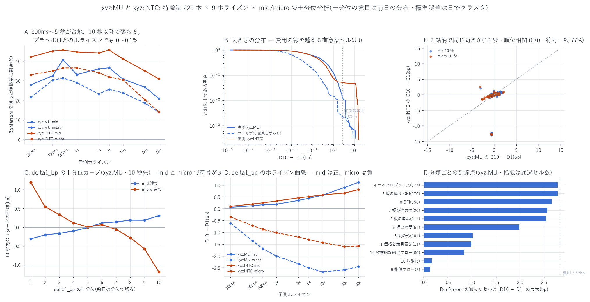

# 特徴量 229 本 × 9 ホライズンの十分位分析(xyz:MU と xyz:INTC)

[← Hyperliquid の分析](README.md) / [ホーム](../../README.md)

**何を測ったか** — `xyz:MU` と `xyz:INTC` で作った**特徴量ライブラリ 229 本すべて**を
十分位に切り、**100ms / 300ms / 500ms / 1s / 3s / 5s / 10s / 30s / 60s** の
9 ホライズンの将来リターンとの関係を出した。目的変数は **mid 建て**と
**microprice 建て**の両方。組み合わせは 1 銘柄あたり最大 4,122 通り。

**時間契約** — 説明変数は格子点 $`T`$ までの情報だけで確定する(featlib が保証)。
**十分位の境目は前日の分布**から作る(全標本の分位を使うと $`T`$ より後の情報で順位づけることになる)。
目的変数は $`(T,\,T+h]`$。`shift(-k)` は目的変数にしか使っていない。

---

## 先に結論

| 問い | 答え |
|---|---|
| 統計的に有意な組み合わせはあるか | **たくさんある。** `xyz:MU` で 865 / 3,096(27.9%)、`xyz:INTC` で 1,274 / 3,546(35.9%)が Bonferroni を通る。プラセボは **0.0% / 0.1%** |
| どのホライズンが一番効くか | **300ms〜5 秒が台地**。`xyz:INTC` は 300ms〜5s で 44〜46% がほぼ横ばい、10 秒以降で落ちて 60 秒では 31.0%。`xyz:MU` は 500ms が最大(40.7%)で 60 秒では 20.9% |
| mid と micro で違うか | **どのホライズンでも mid のほうが通過本数が多い。** 代表例 `delta1_bp` は **mid で正、micro で負**(10 秒で +0.575bp 対 −2.672bp)。板の偏りの「予測力」の大半は **mid が既知の microprice へ追いつく動き** |
| 2 銘柄で一致するか | **する。** 順位相関 0.59〜0.77、符号一致 66〜84%。**10 秒と 60 秒では、両銘柄で有意になったセルの符号は 100% 一致**(41/41、30/30 ほか) |
| **費用を引いて残るか** | **1 セルも残らない。** 有意なセルの \|D10 − D1\| は最大 **2.785bp**(MU)/ **1.630bp**(INTC)で、往復費用 **2.83bp** に届かない。2.83bp を超えるセルは MU 36 本 / INTC 180 本あるが、**そのどれも有意ではない**(\|t\| の中央値 1.63 / 1.03) |



---

## 1. 作り方

### 1.1 目的変数を作り直した

`featlib_<coin>` は 1 秒格子で作って 5 秒おきに間引いてあり、前向きリターンは
**1s / 10s / 60s の 3 本しか無い**。100ms・300ms・500ms は 1 秒格子では作れないので、
**featlib が読んでいるのと同じ板の生データ**(`bbo_<coin>.parquet` に `clean_bbo` をかけたもの)
から格子点ごとに作り直した(`build_fwd.py`)。

```math
\mathrm{mid}=\frac{p_b+p_a}{2},\qquad
\mathrm{micro}=\mathrm{mid}+\frac{p_a-p_b}{2}\cdot\frac{q_b-q_a}{q_b+q_a},\qquad
\mathrm{fwd}_h=\log\frac{x(T+h)}{x(T)}\times 10^4
```

$`x(T)`$ は **$`T`$ 以前の最後の気配**(backward)。既存の featlib の前向きリターンと突き合わせると:

| | 相関 | \|差\| の中央値 | 最大 |
|---|---:|---:|---:|
| `fwd_mid_1s / 10s / 60s` | **1.000000** | 0.0000bp | **0.00bp** |
| `fwd_micro_1s / 10s / 60s` | 0.969〜0.998 | 0.0000〜0.012bp | 80〜97bp |

**mid は完全一致**。micro がわずかにずれるのは、featlib の `micro1` が
**組み直したラダーの最良段の数量**を使うのに対し、こちらは bbo の `bid_sz / ask_sz` を
使うためである。中央値の差は 0.0001bp 未満で、1% 点で 1〜2bp。

### 1.2 十分位・標準誤差・帰無対照

* **十分位の境目は前日の分位**。初日は基準が無いので落とす(MU は 20 日、INTC は 98 日が残る)。
* **標準誤差は日でクラスタ**する。5 秒格子の点どうしは強く相関しており、
  独立とみなした標準誤差は最大 15.8 倍過小になることが実測済み
  ([burstiness のレポート](MU/mu_burstiness_report.md))。
  $`D_{10}-D_1`$ は**日ごとに作ってから**日を単位に標準誤差を出す。
* **Bonferroni の閾値**は自由度 = 日数 − 1 の $`t`$ 分布から取る。
  MU は 3,096 通りで $`|t|>5.73`$、INTC は 3,546 通りで $`|t|>4.57`$(正規近似の 4.06 は甘い)。
* **帰無対照**は特徴量だけを 1 営業日ずらした系列。

### 1.3 ★配管そのものを検算した

帰無対照が 25% も通ったので、**合成データを同じ配管に通して機械を検算**した。

| 合成特徴量 80 本 × 18 目的 = 1,440 通り | \|t\|>1.96 | \|t\|>5.77 | 最大 \|t\| |
|---|---:|---:|---:|
| 白色雑音(構造なし) | 5.8%(名目 5%) | **0 本** | 3.5 |
| 日内パターンだけ持つ雑音 | 7.4% | **0 本** | 3.6 |

配管は正しかった。真犯人は **polars の `NaN > 数値` が true になる**仕様で、
十分位が潰れた特徴量(MU 57 本 / INTC 32 本、`tick` や `ofi_shock` など)の
`t = NaN` が全部「有意」に数えられていた。`.is_finite()` を足したら
**プラセボの通過は 0.0%** になった。

### 1.4 標本

| | 銘柄 | 日数 | 格子点 | 十分位が切れた特徴量 |
|---|---|---:|---:|---:|
| `xyz:MU` | 2026-05-04 〜 05-24 | 21(うち使える 20) | 362,880 | **172 / 229** |
| `xyz:INTC` | 2026-05-04 〜 08-10 | 99(うち使える 98) | 1,710,720 | **197 / 229** |

★**短いホライズンでは目的変数がほとんど動かない**。`xyz:MU` の mid 建てで
**100ms は 83.9% がちょうど 0**、300ms で 64.6%、1 秒で 42.2%、60 秒でようやく 2.6%。
micro 建てはそれぞれ 74.1% / 52.2% / 31.4% / 0.7%。
十分位の平均は「たまに動く少数の点」で決まっている。

---

## 2. どれだけ有意か

| | 検定 | \|t\|>1.96 | Bonferroni 通過 | かつ \|差\|>2.83bp |
|---|---:|---:|---:|---:|
| `xyz:MU` 実測 | 3,096 | 1,697(54.8%) | **865(27.9%)** | **0** |
| `xyz:MU` プラセボ | 3,096 | 223(7.2%) | **0(0.0%)** | 0 |
| `xyz:INTC` 実測 | 3,546 | 1,900(53.6%) | **1,274(35.9%)** | **0** |
| `xyz:INTC` プラセボ | 3,546 | 218(6.1%) | **2(0.1%)** | 0 |

プラセボの \|t\|>1.96 が 6〜7% と名目の 5% に近いので、標準誤差の水準は妥当である。

### ホライズン別(Bonferroni を通った本数 / 十分位が切れた本数)

| ホライズン | MU mid | MU micro | INTC mid | INTC micro |
|---|---:|---:|---:|---:|
| 100ms | 48(27.9%) | 37 | 83(42.1%) | 65 |
| 300ms | 56(32.6%) | 52 | 89(45.2%) | 69 |
| **500ms** | **70(40.7%)** | 54 | **90(45.7%)** | 72 |
| 1s | 57(33.1%) | 50 | 88(44.7%) | 72 |
| 3s | 62(36.0%) | 40 | 87(44.2%) | 67 |
| 5s | 63(36.6%) | 44 | **90(45.7%)** | 63 |
| 10s | 53(30.8%) | 41 | 81(41.1%) | 60 |
| 30s | 46(26.7%) | 32 | 69(35.0%) | 40 |
| 60s | 36(20.9%) | 24 | 61(31.0%) | 28 |

`xyz:INTC` は **300ms〜5 秒で 44〜46% の台地**、10 秒以降で落ちる。
`xyz:MU` は 500ms が最大だが 3〜5 秒もほぼ同じで、山というより台地である。
**どのホライズンでも mid のほうが micro より通過本数が多い。**

---

## 3. mid 建てと micro 建てで符号が逆になる

代表として $`\delta_1 = (\text{スプレッド}/2)\times \mathrm{OBI}_1`$(`delta1_bp`)を見る。
D10 − D1(bp):

| | 100ms | 1s | 10s | 60s |
|---|---:|---:|---:|---:|
| `xyz:MU` mid | +0.057 | +0.191 | **+0.575** | +1.119 |
| `xyz:MU` micro | −0.611 | −2.006 | **−2.672** | −2.448 |
| `xyz:INTC` mid | +0.099 | +0.326 | **+0.586** | +0.806 |
| `xyz:INTC` micro | −0.345 | −1.015 | **−1.431** | −1.575 |

十分位カーブ(図 C)を見ると、mid 建ては単調増加、micro 建ては単調減少で、
**同じ特徴量が正反対の結論を与える**。これは
[OBI・OFI・攻撃的注文の五分位と予測ホライズン](MU/mu_prediction_report.md)で
既に出ている結論の再現である — 板の偏りの「予測力」の大半は、
**mid が既に判っている microprice の位置へ追いつく動き**であって、
microprice 自体を動かす力ではない。

|D10 − D1| の上位も、**micro 建てで負**の側に集中している。

| 銘柄 | 特徴量 | 分類 | 目的変数 | D1 | D10 | 差 | t |
|---|---|---|---|---:|---:|---:|---:|
| MU | `obi_near_deep` | 2 板の偏り | micro 60s | +1.360 | −1.402 | **−2.785** | −8.06 |
| MU | `micro_slope` | 4 マイクロプライス | micro 60s | −1.402 | +1.360 | +2.785 | +8.06 |
| MU | `delta1_bp` / `obi_x_spread` | 4 | micro 10s | +1.198 | −1.190 | −2.672 | −11.16 |
| MU | `ofi_ewma` | 8 OFI | **mid 60s** | −0.993 | +1.565 | **+2.657** | +7.65 |
| INTC | `delta_disagree` | 4 | micro 60s | +0.794 | −0.804 | −1.630 | −16.52 |
| INTC | `delta1` | 4 | micro 30s | +0.770 | −0.764 | −1.606 | −19.34 |

`obi_near_deep`($`\mathrm{OBI}_1-\mathrm{OBI}_{10}`$)と `micro_slope`($`(\mathrm{OBI}_{10}-\mathrm{OBI}_1)/9`$)が
符号だけ逆の同じ値、`delta1_bp` と `obi_x_spread` が完全に同じ値になるのは
**単調変換どうしで十分位が一致する**ためで、計算の検算になっている。

---

## 4. 2 銘柄で一致するか

| ホライズン | 順位相関 mid | 順位相関 micro | 符号一致 mid | 符号一致 micro |
|---|---:|---:|---:|---:|
| 100ms | 0.681 | 0.687 | 71.2% | 79.4% |
| 500ms | 0.668 | 0.612 | 74.7% | 70.6% |
| 1s | 0.676 | 0.588 | 75.9% | 65.9% |
| 10s | 0.697 | 0.723 | 77.1% | 73.5% |
| 30s | **0.745** | **0.765** | **83.5%** | 81.2% |
| 60s | 0.724 | 0.730 | 82.4% | 80.0% |

さらに強く、**両銘柄で Bonferroni を通ったセルに限ると符号はほぼ完全に一致する**。

| | 共通 | 両方で有意 | うち符号も一致 |
|---|---:|---:|---:|
| 100ms mid | 170 | 39 | 36 |
| 500ms mid | 170 | 57 | 53 |
| 1s micro | 170 | 40 | **40** |
| 10s mid | 170 | 41 | **41** |
| 10s micro | 170 | 26 | **26** |
| 60s mid | 170 | 30 | **30** |
| 60s micro | 170 | 10 | **10** |

板の姿がまったく違う 2 銘柄で、**効き方の向きは共通**である
([7 銘柄の横並び](cross_coin_report.md)の結論と整合)。

---

## 5. ★費用を引くと 1 セルも残らない

往復の費用は **2.83bp**(半スプレッド 0.62bp + テイカー手数料 0.79bp、× 2)。

| | Bonferroni 通過セルの \|D10 − D1\| 最大 | \|差\|>2.83bp のセル | そのうち有意 |
|---|---:|---:|---:|
| `xyz:MU` | **2.785bp** | 36 | **0**(\|t\| の中央 1.63) |
| `xyz:INTC` | **1.630bp** | 180 | **0**(\|t\| の中央 1.03) |

`xyz:MU` の最大 2.785bp は費用 2.83bp の **98.4%** で、ほとんど費用線そのものである。
そして「大きいセル」は全部ノイズ側にある — **大きさと確からしさが両立しない**。

分類ごとの到達点(図 F)でも、最も強い **2 板の偏り OBI** と
**4 マイクロプライス** が 2.7〜2.8bp で頭打ちになり、費用線を越えない。
**10 取消**は 3 セル、**9 指値フロー**は 2 セルしか通過しない。

---

## 6. 限界 — 何を言っていないか

1. **`xyz:MU` の標本が 21 日しかない。** featlib を作った日数の違い(MU 21 / INTC 99)が、
   Bonferroni 閾値(5.73 / 4.57)と通過率(27.9% / 35.9%)の差の一部を作っている。
   同じ日数にそろえた比較はしていない。
2. **十分位に切れない特徴量がある**(MU 57 本 / INTC 32 本)。離散・疎な量
   (`tick`、`*_shock`、`empty_lv_*` など)は前日の分位が潰れる。除外であって
   「効かない」ではない。
3. **100ms は目的変数の 84% がちょうど 0**。十分位の平均は少数の動いた点で決まる。
   この水準の結論は「動いたときの向き」に関するものと読むべきである。
4. **micro 建ての目的変数は bbo 由来**で、featlib の `obi` は組み直したラダー由来。
   相関 0.969〜0.998、中央値の差は 0.0001bp 未満だが、完全に同じ量ではない。
5. **十分位の差は「買い持ちと売り持ちの粗い差」**であって、戦略の損益ではない。
   約定可能性・板を叩く影響・遅延は一切入っていない
   (ただし差の大きさが費用に届かないことは第 5 節で示した)。
6. **229 本のうち多くは互いの単調変換**である(`delta1_bp` と `obi_x_spread` は同一結果)。
   「229 本」は独立な検定の数ではない。Bonferroni は保守側に寄る。
7. **時間帯を分けていない。** 立会時間と時間外で板の性質は大きく違う
   ([夜の価格発見](MU/mu_night_discovery_report.md))が、本レポートは一括である。

---

## 7. 再現手順

```bash
uv run python scripts/build_fwd.py     --coin xyz:MU     # 9 ホライズンの目的変数
uv run python scripts/build_fwd.py     --coin xyz:INTC
uv run python scripts/check_decile_null.py --coin xyz:MU # ★配管の検算(合成データ)
uv run python scripts/build_decile.py  --coin xyz:MU     # 十分位と帰無対照
uv run python scripts/build_decile.py  --coin xyz:INTC
uv run python scripts/analyze_decile.py                  # 2 銘柄の集計
uv run python scripts/plot_decile.py
```

出力: `data/decile_<coin>.parquet`(十分位の表)/ `data/decile_sum_<coin>.csv` /
`data/decile_null_<coin>.csv` / `data/decile_report.csv` / `data/decile_top_<coin>.csv` /
`data/decile_xcoin.csv`

---

リポジトリ全体の目次は [../../README.md](../../README.md) にあります。
