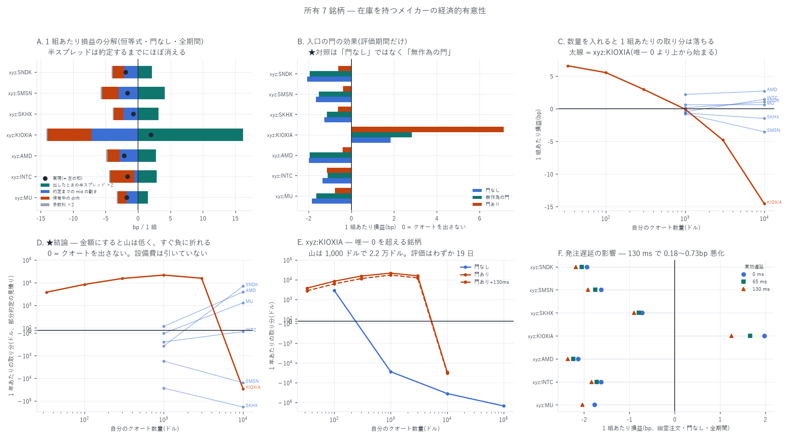

# 所有 7 銘柄 — 在庫を持つメイカーに経済的な有意性はあるか

[← Hyperliquid の分析](README.md) / [ホーム](../../README.md)

**何を測ったか** — [`xyz:MU` で組み上げた在庫つきメイカーの検証](MU/mu_inventory_mm_report.md)を、
**設定もスクリプトも変えずに**板と約定がそろっている 7 銘柄
(`xyz:MU` / `xyz:INTC` / `xyz:AMD` / `xyz:KIOXIA` / `xyz:SKHX` / `xyz:SMSN` / `xyz:SNDK`)
へ当てた。両側に指値を出し続け、在庫 $`|q|\le 1`$ を FIFO で相殺し、
自分側の最良気配が動いたら出し直す。1 組の損益は

```math
\mathrm{PnL}_{\text{pair}}=\frac{p_{\text{sell}}-p_{\text{buy}}}{\mathrm{mid}_{\text{open}}}\times 10^4-2\,\mathrm{Fee}_{\text{maker}}
```

で、メイカー手数料 0.088 bp/約定、日の終わりに残った在庫はテイカー(0.846 bp)で強制決済する。

**再現の確認** — `xyz:MU` の評価期間 39 日で **1 組あたり −1.847 bp** と、
[既報](MU/mu_inventory_mm_report.md)の値を小数第 3 位まで再現した。移植は忠実である。

---

## 先に結論

| 問い | 答え |
|---|---|
| メイカーの機構は他銘柄でも動くか | **動く。** maker–maker の自然相殺は 7 銘柄すべてで働き、強制決済は約定の **0.005〜0.036%** しかない |
| 幽霊注文(数量 0)で黒字の銘柄はあるか | **`xyz:KIOXIA` だけ**(+1.976 bp/組、t=3.35)。他の 6 銘柄は −0.72〜−2.13 bp |
| なぜ負けるのか | **半スプレッドは約定するまでに消える。** 出したときの半スプレッド ×2 は 1.53〜16.18 bp あるが、約定するまでの mid の動きがその **21〜113%** を持っていき、残りを保有中の drift が食う |
| 入口の門で救えるか | **評価期間では救えない。** 門を入れると `xyz:MU` −1.847 → −0.761 bp まで戻るが、**0 には届かない**。届くのは `xyz:KIOXIA`(+7.128 bp)だけ |
| 門の効果は本物か | **本物。ただし半分は「発注を減らしただけ」。** 同じ本数を無作為に通す門でも `xyz:KIOXIA` は +1.84 → +2.84 bp に上がる。門の中身の価値は **実の門 − 無作為の門** |
| 発注遅延 130 ms に耐えるか | **`xyz:KIOXIA` だけ耐える**(+7.128 → +6.672 bp)。他は元から負で、さらに 0.18〜0.29 bp 悪化する |
| **執行できる数量を入れて残るか** | **どの銘柄も残らない。** `xyz:KIOXIA` の +1.976 bp は **\$100 のクオートで −1.13 bp へ反転**する(BBO の待ち行列が中央 \$66 しかない)。門つきで最も良い組み合わせでも **年 \$2.2 万**、しかも **t=2.36 / 符号検定 p=0.36 で有意ではない** |



**一言でいうと、7 銘柄のどれにも「出す価値のあるメイカー」は見つからなかった。**
`xyz:KIOXIA` だけが板が薄いぶん半スプレッドが広く、**無限小の数量でなら**黒字になるが、
実際に出せる数量まで上げると消える。

---

## 1. 標本と、機構が動いていることの確認

幽霊注文(数量 0)・門なし・全期間。1 組あたりは建玉重み、標準誤差は
**日でクラスタした Newey-West(ラグ 14)**。

| 銘柄 | 日数 | 組/日 | **1 組 bp** | NW se | t | 日次 bp | 黒字日 | 最悪日 bp | 60s 相殺(日平均) | 強制決済率 |
|---|---:|---:|---:|---:|---:|---:|---:|---:|---:|---:|
| `xyz:KIOXIA` | 47 | 1,043 | **+1.976** | 0.520 | +3.35 | +2,044 | 66% | −8,110 | 68.2% | 0.036% |
| `xyz:SKHX` | 99 | 6,867 | −0.719 | 0.645 | −1.03 | −4,946 | 30% | −54,795 | 90.3% | 0.005% |
| `xyz:INTC` | 99 | 1,088 | −1.626 | 0.091 | −16.36 | −1,773 | 8% | −6,588 | 68.8% | 0.034% |
| `xyz:SMSN` | 98 | 2,669 | −1.627 | 1.130 | −2.58 | −4,352 | 10% | −27,217 | 79.4% | 0.013% |
| `xyz:MU` | 98 | 4,558 | −1.766 | 0.104 | −14.82 | −8,052 | 1% | −30,699 | 91.4% | 0.008% |
| `xyz:SNDK` | 99 | 3,058 | −1.937 | 0.106 | −16.41 | −5,927 | 1% | −32,985 | 84.7% | 0.012% |
| `xyz:AMD` | 99 | 1,030 | −2.134 | 0.149 | −13.04 | −2,201 | 5% | −7,224 | 66.8% | 0.035% |

`xyz:KIOXIA` は板が **2026-06-25 から**しか存在しないので 47 日しかない。

**maker–maker の自然相殺は全銘柄で働いている。** 60 秒以内の相殺率は 66.8〜91.4% で、
日の終わりに残って強制決済されるのは約定の **0.036% 以下**。
`xyz:MU` で確かめた「在庫を持って自然に相殺する」機構そのものは移植できている。

---

## 2. なぜ負けるのか — 1 組あたり損益の厳密な分解

損益は残差ではなく**恒等式**で 4 つに分かれる(検算の残差は全銘柄 0.0000)。

```math
\mathrm{PnL}_{\text{pair}}
=\underbrace{\mathrm{edge}_{\text{in}}}_{\text{建てた瞬間}}
+\underbrace{\mathrm{edge}_{\text{out}}}_{\text{畳んだ瞬間}}
+\underbrace{\mathrm{drift}}_{\text{保有中の mid}}
-2\,\mathrm{Fee}
```

$`\mathrm{edge}_{\text{in}}=\mathrm{side}\times(\mathrm{mid}-p)/\mathrm{mid}\times 10^4`$ は
**約定した ns の mid** で測る。板を消し切る約定が同じブロックで気配を動かすので、
これは実質「約定直後」の mid である。比較のため**発注時**の半スプレッド(quoted)も測った。

| 銘柄 | 出したときの<br>半スプレッド ×2 | **約定までの<br>mid の動き** | 約定時の<br>edge ×2 | 保有中の<br>drift | 手数料 ×2 | **実現** | 劣化 /<br>半スプレッド |
|---|---:|---:|---:|---:|---:|---:|---:|
| `xyz:KIOXIA` | 16.182 | −7.256 | +8.926 | −6.792 | −0.177 | **+1.958** | 45% |
| `xyz:SKHX` | 3.147 | −2.235 | +0.912 | −1.456 | −0.176 | **−0.720** | 71% |
| `xyz:INTC` | 2.863 | −0.597 | +2.266 | −3.717 | −0.177 | **−1.628** | 21% |
| `xyz:SMSN` | 4.119 | −3.002 | +1.117 | −2.571 | −0.176 | **−1.630** | 73% |
| `xyz:MU` | 1.534 | −1.734 | −0.200 | −1.391 | −0.176 | **−1.766** | **113%** |
| `xyz:SNDK` | 2.143 | −2.121 | +0.022 | −1.783 | −0.176 | **−1.938** | 99% |
| `xyz:AMD` | 2.751 | −2.805 | −0.054 | −1.905 | −0.177 | **−2.136** | **102%** |

「実現」は**建玉 1 本ずつの単純平均**で、強制決済ぶんも含む
(§1 の表は相殺できた組だけの建玉重みなので、`xyz:KIOXIA` の +1.976 と
小数第 2 位で食い違う)。各行は左から順に足すとちょうど「実現」になる。

読み方は 3 段である。

1. **半スプレッドは約定するまでに消える。** `xyz:MU` は 1.534 bp で出しているのに、
   約定するまでに mid が 1.734 bp 動く(半スプレッドの **113%**)。**約定した瞬間にもう 0.2 bp の負け**である。
   `xyz:AMD`(2.751 対 2.805 = 102%)も同じで、`xyz:SNDK` は 99% とちょうど相殺し 0.022 bp しか残らない。
   これは「指値が埋まるのは板が消し切られたときで、それ自体が mid を動かす」ことの直接の帰結で、
   スプレッドが狭い銘柄ほど致命的になる。
2. **残ったぶんを保有中の drift が食う。** drift は 7 銘柄すべてで負(−1.39〜−6.79 bp)。
   在庫を持っている間、mid は在庫と逆へ動く。これがメイカーの逆選択そのものである。
3. **手数料は小さい。** メイカー 0.088 bp ×2 = 0.176 bp で、上の 2 つに比べれば誤差である。

**`xyz:KIOXIA` だけが黒字なのは、出したときの半スプレッドが 16.18 bp と桁違いに大きいから**で、
劣化 7.26(半スプレッドの 45%)と drift 6.79 を引いてもまだ 1.96 残る。**能力の差ではなく、板の薄さの差**である。

---

## 3. 入口の門 — と、その帰無対照

### 3.1 門の作り方(`xyz:MU` の 45 列版は他銘柄で作れない)

`xyz:MU` を損益分岐まで持ち上げたのは、**往復損益で学習した入口の門**だった。
ところがその門(`build_entrygate.py`)は 45 列の候補テーブルを入力にしており、
そのテーブルを作る `build_quotes.py` は **L1(板の全階層のイベント列)** を要求する。
L1 が手元にあるのは `xyz:MU` と `xyz:INTC` だけなので、**7 銘柄を同じ土俵に載せられない**。

そこで **bbo と fills だけで作れる 20 本の説明変数**で同じ形の門を作った(`build_mmgate.py`)。

```math
\mathrm{EV}(X_t)=P(\text{約定}\mid X_t)\times \mathbb{E}[\mathrm{PnL}_{\text{roundtrip}}\mid \text{約定},X_t]
```

$`P`$ はロジット、$`\mathbb{E}[\cdot]`$ は最小二乗。**在庫を増やす側だけ** EV>0 で通す
(在庫を減らす側は常に出す)。学習は**前 60% の日**、評価は後 40% の日で、
標準化も係数も学習期間だけから作る。説明変数はすべて発注時刻 $`t`$ で確定する
(発注時刻は bbo が動いた時刻そのものなので、後ろ向き添字は $`t`$ の気配を正確に指す)。

**この門は `xyz:MU` の 45 列版より弱い。** 評価期間で通すのは発注の 0.3% だけで、
1 発注あたり −0.0506 → −0.0385 bp にしか動かない(45 列版は 1 組 −1.847 → +0.036 bp)。
劣る原因は説明変数の少なさで、**第 2 階層以深の板・取消・指値フローが入っていない**。

### 3.2 ★帰無対照 — 「発注を減らしただけ」を切り分ける

門を入れると 1 組あたり損益は必ず上がる。だがその原因は 2 つありうる。

1. 門が**良い場面を選んでいる**(本物)
2. 門が**発注を減らしただけ**(偽)

そこで、**同じ日・同じ側で、同じ本数だけ無作為に通す門**を作った(`build_mmgate_null.py`)。
これが効くなら、門の中身に価値は無い。

| 銘柄 | 門なし | **無作為の門** | 門あり | 門あり+130ms | 差(門あり−無作為) | t | 符号検定 p |
|---|---:|---:|---:|---:|---:|---:|---:|
| `xyz:KIOXIA` | +1.837 | **+2.835** | **+7.128** | **+6.672** | +4.102 | +7.87 | 3.8e-06 |
| `xyz:SMSN` | −1.659 | −1.518 | −0.396 | −1.032 | +1.195 | +5.23 | 0.0064 |
| `xyz:AMD` | −1.986 | −1.953 | −0.398 | −1.502 | +1.421 | +2.40 | 0.0064 |
| `xyz:SNDK` | −2.068 | −1.952 | −0.604 | −1.767 | +0.940 | +1.98 | 1.9e-07 |
| `xyz:SKHX` | −1.262 | −1.149 | −0.620 | −0.956 | +0.528 | +7.17 | 0.00018 |
| `xyz:MU` | −1.847 | −1.634 | −0.761 | −1.555 | +1.527 | +2.95 | 0.00029 |
| `xyz:INTC` | −1.346 | −1.103 | −1.145 | −2.214 | +0.057 | +0.08 | 0.43 |

**評価期間だけの値**。Bonferroni の \|t\| 閾値は 33 通りに対し 3.17。

3 つ読み取れる。

- **無作為の門だけで数字は上がる。** `xyz:KIOXIA` は +1.837 → +2.835 bp、
  `xyz:MU` は −1.847 → −1.634 bp。**「門あり − 門なし」で効果を測ると 1.5〜2 倍に誇張する。**
- **門の中身には価値がある。** 無作為の門との差は 6 銘柄で正、うち 4 銘柄で Bonferroni を通る。
- **しかし 0 には届かない。** 門を入れても黒字になるのは `xyz:KIOXIA` だけ。
  `xyz:INTC` にいたっては門の中身の価値がゼロ(+0.057 bp、t=0.08)である。

`xyz:KIOXIA` の門ありは **19 日すべて黒字**(符号検定 p=3.8e-06)で、最悪日でも +126 bp。
発注遅延 130 ms を入れても +6.672 bp(t=13.56)と落ちない。

---

## 4. ★執行できる数量 — ここで全部消える

### 4.1 幽霊注文は上界でしかない

これまでの bp は**自分の注文が板に影響せず、前の待ち行列がはけた瞬間に無限小だけ
約定する**という仮定の値である。つまり**約定するのは必ず「前の行列を食い尽くすほど
大きな流れが来たとき」**で、数量を入れればその流れはさらに自分のぶんだけ
大きくなければならない。**残る約定はより攻撃的な(= 逆選択の強い)ものに偏る。**

`build_inventory.py` に `--size S` を足した(`--size 0` で従来と**完全に一致**することを確認済み)。
`--size S` は「前の行列 + S が流れて初めて S 全量が約定した」とみなす保守側の
all-or-nothing で、部分約定を捨てている。上側の見積りとして、
**部分約定**(自分の $`j`$ 番目の単位は「前の行列 + $`j`$」が流れれば埋まる)も積んだ。

```math
\mathrm{PnL}(S)=\int_0^{S} g(j)\,dj,\qquad
g(j)=\sum_{\text{要求 }Q_0+j\text{ で埋まった組}}\frac{\mathrm{pnl}_{bp}}{10^4}\,\mathrm{mid}
```

数量は銘柄ごとの価格差を吸収するため **金額(\$100 / \$1k / \$10k / \$100k)でそろえた**。
板の厚みは銘柄で 20 倍違うので、枚数をそろえると比較にならない。

### 4.2 BBO の待ち行列はどれだけあるか

| 銘柄 | 中央スプレッド | BBO 待ち行列(中央) | 金額に直すと | 日次テイカー額 |
|---|---:|---:|---:|---:|
| `xyz:MU` | 1.24 bp | 2.93 枚 | \$2,705 | \$220M |
| `xyz:INTC` | 2.17 bp | 40.80 枚 | \$4,415 | \$49M |
| `xyz:AMD` | 2.71 bp | 3.19 枚 | \$1,590 | \$23M |
| `xyz:KIOXIA` | 13.61 bp | **0.197 枚** | **\$66** | \$6.2M |
| `xyz:SKHX` | 1.70 bp | 2.76 枚 | \$3,552 | \$306M |
| `xyz:SMSN` | 3.03 bp | 4.82 枚 | \$878 | \$39M |
| `xyz:SNDK` | 1.44 bp | 2.79 枚 | \$4,333 | \$181M |

**`xyz:KIOXIA` の最良気配には \$66 しか並んでいない。**
スプレッドが広いのは「誰も並んでいないから」であって、そこに大きく出せるわけではない。

### 4.3 `xyz:KIOXIA` — 唯一の候補を数量で潰す

門あり・評価期間 19 日。

| クオート数量 | 組/日 | 1 組 bp | 全量約定 \$/日 | **部分約定 \$/日** | **部分約定 \$/年** |
|---|---:|---:|---:|---:|---:|
| 幽霊(0) | 882 | +7.13 | — | 0 | 0 |
| \$33 | 570 | +6.57 | +11.2 | +14.9 | +3,758 |
| \$100 | 404 | +5.53 | +20.6 | +33.2 | +8,371 |
| \$300 | 233 | +2.95 | +20.7 | +60.7 | +15,295 |
| **\$1,000** | 116 | **−0.08** | +2.3 | **+85.6** | **+21,578** |
| \$3,000 | 60 | −4.81 | −77.8 | +62.0 | +15,626 |
| \$10,000 | 19 | −14.58 | −247.2 | −115.3 | −29,043 |

**1 組あたりで見ると \$1,000 でもう 0 を割る。** 金額で見ても \$1,000 が山で、
そこを越えると急速に負へ折れる。130 ms の遅延を入れると山は **\$17,175/年** に下がる。

門なしだと \$100 で早くも 1 組 −1.13 bp、\$1,000 で −10.12 bp、
\$10,000 で −26.79 bp(年 −\$36 万)である。

### 4.4 7 銘柄の総括

各設定で「部分約定の見積りが最大になる数量」と、そのときの年間の取り分。
0 は「クオートを出さない」。

| 銘柄 | 設定 | 最良の数量 | **部分約定 \$/年** | 全量約定 \$/年 | t | 符号検定 p | 日数 |
|---|---|---:|---:|---:|---:|---:|---:|
| `xyz:KIOXIA` | 門あり | \$1,000 | **+21,578** | +5,211 | 2.36 | 0.36 | 19 |
| `xyz:KIOXIA` | 門あり+130ms | \$1,000 | **+17,175** | +4,241 | 2.32 | 0.17 | 19 |
| `xyz:SNDK` | 門あり | \$10,000 | **+6,990** | +11,064 | 2.17 | 0.64 | 40 |
| `xyz:AMD` | 門あり | \$10,000 | **+3,898** | +2,488 | 0.78 | 0.27 | 40 |
| `xyz:KIOXIA` | 門なし | \$100 | **+2,806** | −(全数量で負) | — | — | 19 |
| `xyz:INTC` | 門あり+130ms | \$10,000 | **+1,621** | +6,661 | 1.26 | 0.64 | 40 |
| `xyz:MU` | 門あり | \$10,000 | **+1,280** | +903 | 0.44 | 0.34 | 39 |
| `xyz:MU` | 門あり+130ms | \$10,000 | **+174** | +1,078 | 0.61 | 0.11 | 39 |
| **残り 19 通り**(門なしの全 14 通り / `xyz:SKHX` と `xyz:SMSN` の全 4 通り / `xyz:INTC` 門あり / `xyz:AMD` 門あり+130ms / `xyz:SNDK` 門あり+130ms) | | **\$0** | **0** | | | | |

**正の値はどれも有意ではない。** t は 0.44〜2.36、符号検定は p=0.11〜0.64 で
どれも 0.05 を下回らない。設定は 7 銘柄 × 4 通り = 28 通り試しているので、
Bonferroni なら \|t\| > 3.0 が要る。**1 つも通らない。**
t と符号検定は「全量約定でいちばん良かった数量」の日次系列に対するもので、
その最良が数量 0(= 出さない)になる設定では定義できないので「—」とした。

そして**費用は一切引いていない**。設備・回線・ノード運用・証拠金の機会費用を
考えれば、年 \$2 万は成立しない。

### 4.5 ★大きな数量では「メイカー」ですらなくなる

数量を上げると約定が減り、在庫が 1 日居座って**日の終わりに強制決済**される。
この成分はメイカーの取り分ではなく**値動きの賭け**である。実測で、
`xyz:AMD` の \$100,000 では 21 件の強制決済(1 件 +110 bp)が
161 組の相殺(1 組 −0.81 bp)を打ち消し、**符号を反転させていた**。
本レポートの金額はすべて**強制決済を除いた相殺ぶんだけ**で、強制決済は別列に出してある。

---

## 5. 発注遅延

幽霊注文・門なし・全期間の 1 組あたり損益(bp)。

| 銘柄 | 0 ms | 65 ms | 130 ms | 130−0 |
|---|---:|---:|---:|---:|
| `xyz:KIOXIA` | +1.976 | +1.664 | +1.247 | **−0.730** |
| `xyz:SMSN` | −1.627 | −1.750 | −1.916 | −0.289 |
| `xyz:MU` | −1.766 | — | −2.037 | −0.271 |
| `xyz:SNDK` | −1.937 | −2.049 | −2.178 | −0.241 |
| `xyz:AMD` | −2.134 | −2.242 | −2.360 | −0.226 |
| `xyz:INTC` | −1.626 | −1.721 | −1.838 | −0.212 |
| `xyz:SKHX` | −0.719 | −0.796 | −0.897 | −0.177 |

**遅延が最も痛いのは唯一黒字の `xyz:KIOXIA`** である(−0.730 bp)。
取れる幅が大きい銘柄ほど、その幅を遅延で失う量も大きい。

---

## 6. 限界 — 何を言っていないか

1. **幽霊注文の仮定は完全には外せていない。** `--size` は「自分の数量ぶん余分に
   流れないと埋まらない」ことだけを入れた。**自分の注文が他人の行動を変える効果**
   (スプレッドが縮む、他のメイカーが前に出る、テイカーが寄ってくる)は入っていない。
   `xyz:KIOXIA` のように最良気配に \$66 しか無い板では、この仮定がいちばん苦しい。
2. **門は 20 本の説明変数しか使っていない。** `xyz:MU` の 45 列版(L1 由来)には及ばない。
   他 5 銘柄で 45 列版を試すには L1 の取得(約 99GB・\$2.6)と候補テーブルの構築
   (1 銘柄 6.1GB)が要る。**未実行**(CLAUDE.md の費用ゲート対象)。
3. **`xyz:KIOXIA` の評価期間は 19 日**しかない。他の 6 銘柄(36〜40 日)より結論が弱く、
   Newey-West(ラグ 14)は 19 日に対して仮定が苦しいので、ラグ 0 の t と符号検定も併記した。
4. **費用を引いていない。** 設備・回線・ノード運用・証拠金の機会費用は一切入っていない。
   入れれば §4.4 の正の値はすべて消える。
5. **出し直しの規則は 1 つしか試していない**(自分側の気配が動いたら必ず並び直す)。
   `xyz:MU` では条件つきの出し直し(`--requote cond`)も試してあるが、本レポートでは
   7 銘柄を同じ設定でそろえることを優先した。
6. **funding を入れていない。** perp なので在庫に funding が付くが、
   中央 5〜26 秒で相殺しているため影響は小さいと見ている(未検証)。
7. **銘柄の選び方に生存バイアスは無い。** 7 銘柄は「板と約定がそろっている集合」で、
   結果を見てから選んでいない。

---

## 7. この検証の途中で自分が誤ったこと

**① 門ありの成績を、学習期間を含む全期間で読んでいた。**
途中経過として「門を入れると 7 銘柄すべてで 1 組あたり損益が正になる
(`xyz:MU` +1.19 / `xyz:INTC` +0.88 / `xyz:AMD` +0.90 / `xyz:SKHX` +0.99 bp)」と報告したが、
これは**門を学習した前 60% の日を含む全期間**の値だった。
**評価期間だけで見ると `xyz:KIOXIA` 以外はすべて負**(−0.40〜−1.15 bp)である。
門は前 60% の日で当てはめてあるのだから、その期間を混ぜて成績を語ってはいけない。
本レポートの門つきの数字はすべて評価期間だけである。

**② 帰無対照を置かずに門の効果を測りかけた。**
「門あり − 門なし」で効果を測ると 1.5〜2 倍に誇張する。同じ本数を無作為に通す門で
`xyz:KIOXIA` は +1.84 → +2.84 bp、`xyz:MU` は −1.85 → −1.63 bp へ動く。
対照を置くまで気づかなかった。

**③ 分解で逆選択を二重に数えかけた。**
最初は $`\mathrm{edge}_{\text{in}}`$ を「稼いだ半スプレッド」と呼び、
残差を逆選択としていた。しかし $`\mathrm{edge}_{\text{in}}`$ の mid は
**約定した ns の mid** で、板を消し切る約定が同じブロックで気配を動かすため、
**すでに約定直後の値**である。発注時の半スプレッドを別に測って
「約定までの mid の動き」を独立の項として出し直した(§2)。

**④ 強制決済を相殺の損益と混ぜていた。**
`xyz:AMD` の \$100,000 で「年 +\$11.8 万」という値が出たが、中身は
21 件の強制決済(1 件 +110 bp)で、メイカーの取り分ではなかった(§4.5)。

---

## 8. 再現手順

```bash
# 1. 在庫つきメイカー(幽霊注文・遅延 0/65/130 ms)+ 発注 1 件ずつの記録
uv run python scripts/run_mm_all.py --stage base

# 2. 入口の門(前 60% の日で学習)と、その帰無対照
for c in MU INTC AMD KIOXIA SKHX SMSN SNDK; do
  uv run python scripts/build_mmgate.py      --coin xyz:$c
  uv run python scripts/build_mmgate_null.py --coin xyz:$c
  uv run python scripts/build_inventory.py --coin xyz:$c --qmax 1 \
      --gate data/entrygate_xyz_${c}_mmg.parquet
  uv run python scripts/build_inventory.py --coin xyz:$c --qmax 1 \
      --gate data/entrygate_xyz_${c}_mmgrnd.parquet
done

# 3. 数量の掃引(門なし / 門あり × 遅延 0 / 130 ms)
uv run python scripts/run_mm_all.py --stage size
uv run python scripts/run_mm_all.py --stage gate

# 4. 集計と図
uv run python scripts/analyze_mm_all.py    # 分解・遅延・帰無対照
uv run python scripts/analyze_mmgate.py    # 門(評価期間だけ)
uv run python scripts/analyze_mm_size.py   # 執行できる数量と金額
uv run python scripts/plot_mm_all.py
```

生成物:

| ファイル | 内容 |
|---|---|
| `data/inv_days_xyz_<coin>_q1*.csv` | 設定ごとの日次(組数・損益・相殺率・強制決済) |
| `data/inv_lots_xyz_<coin>_q1*.parquet` | 建玉 1 本ずつ(`p_in`/`m_in`/`p_out`/`m_out`。分解に使う) |
| `data/inv_posts_xyz_<coin>_q1.parquet` | 発注 1 件ずつ(門の学習に使う) |
| `data/entrygate_xyz_<coin>_mmg.parquet` | 入口の門(EV と通過フラグ) |
| `data/entrygate_xyz_<coin>_mmgrnd.parquet` | 同・帰無対照(同じ本数を無作為に通す) |
| `data/mm_all_summary.csv` | 銘柄 × 設定の要約 |
| `data/mm_all_decomp.csv` | §2 の分解 |
| `data/mmgate_all.csv` | §3 の門(評価期間だけ) |
| `data/mm_size_curve.csv` / `mm_size_peak.csv` | §4 の数量と金額 |
