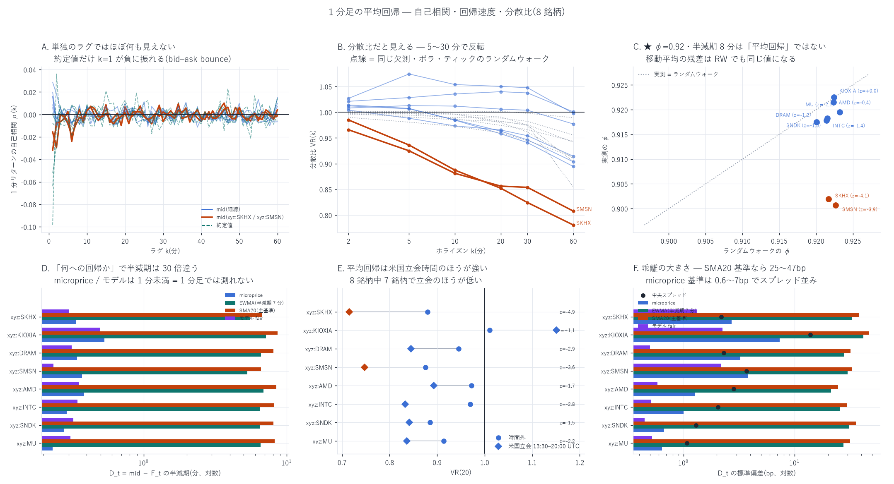

# 1 分足の平均回帰 — 20 分 SMA を基準に(8 銘柄)

[← Hyperliquid の分析](README.md) / [ホーム](../../README.md)

**何を測ったか** — 1 分足の mid が **直近 20 分の単純移動平均(SMA20)** へ
どれだけ戻るかを、指示された 4 段構えで測った。

1. **何への平均回帰かを定義する** — $`D_t=P_t-F_t`$ の $`F_t`$ を 4 通り作る
2. **リターンの自己相関** $`\rho(k)=\mathrm{Corr}(r_t,r_{t+k})`$ を **mid / microprice** で測る
   (約定値では測らない)
3. **回帰速度** $`D_{t+\Delta}=\phi D_t+\epsilon`$ から $`\mathrm{HL}=-\ln 2/\ln\phi`$
4. **分散比** $`\mathrm{VR}(k)=\mathrm{Var}(r^{(k)})/(k\,\mathrm{Var}(r))`$

**標本** — 2026-05-04〜08-10 の 99 日(`xyz:MU` 98 日、`xyz:KIOXIA` 47 日)、
1 日 1,440 分。終値は「その分の最後に観測された気配」で、
気配が 1 件も無い分は**持ち越さず欠測**にする(持ち越すと人工的な自己相関が入る)。

---

## 先に結論

| 問い | 答え |
|---|---|
| 1 分リターンに自己相関はあるか | **ほぼ無い。** mid の $`\rho(k)`$ は全銘柄・全ラグで \|ρ\| ≤ 0.03。**約定値だけ** $`\rho(1)`$ が −0.008〜−0.098 と負に出るが、これは bid–ask bounce であって平均回帰ではない |
| $`\phi=0.92`$・半減期 8 分は平均回帰か | **★ほぼ全部が移動平均の副産物。** $`D_t=P_t-\mathrm{SMA}_{20}`$ は**純粋なランダムウォークでも** $`\phi_{RW}=0.920\text{〜}0.923`$・半減期 8.3〜8.7 分になる。実測との差が有意なのは **`xyz:SKHX`(z=−4.09)と `xyz:SMSN`(z=−3.95)の 2 銘柄だけ** |
| 分散比では見えるか | **見える。** `xyz:SKHX` は VR(20)=0.852(RW 0.980、z=−5.2)、`xyz:SMSN` は 0.856(RW 0.983、z=−3.5)。**反転は 1 つのラグに集中せず、19 ラグに薄く広がっている**ので単独のラグでは見えない |
| 逆に momentum の銘柄はあるか | **ある。** `xyz:AMD` と `xyz:DRAM` は k=2 分で VR>1(z=+3.5 / +3.8)。`xyz:KIOXIA` は立会時間だけ VR(20)=1.151 |
| 何を基準にするかで変わるか | **半減期が 30 倍変わる。** microprice 基準 0.23〜0.53 分 / モデル fair 0.23〜0.49 分 / EWMA 5.3〜7.2 分 / SMA20 6.6〜8.6 分。**microprice とモデルは 1 分足では測れない**(サンプリング間隔より速い) |
| 時間帯で違うか | **米国立会時間のほうが平均回帰が強い。** 8 銘柄中 7 銘柄で VR(20) が立会のほうが低い。有意は `xyz:SKHX`(z=−4.93)と `xyz:SMSN`(z=−3.57)。`xyz:KIOXIA` だけ逆向き |
| **費用を引いて残るか** | **残らない。** 1 標準偏差ぶん乖離したときに 20 分で取れる**片道の粗利は 0.56〜2.88 bp**、往復費用は 2.65〜15.51 bp。最良の `xyz:SKHX` でも 2.88 対 3.76 で **−0.88 bp** |



**この分析でいちばん重要なのは C のパネル**である。$`\phi=0.92`$・半減期 8 分・
$`R^2=0.85`$ という数字だけを見れば「強い平均回帰」に見えるが、
**同じ欠測・同じボラ・同じティック幅のランダムウォークが同じ値を出す**。
移動平均からの乖離は、定義上、移動平均の窓の長さで決まる自己相関を持つ。

---

## 1. 何への平均回帰か(4 つの基準価格)

$`P_t`$ は常に **mid**。$`F_t`$ を 4 通り置いた。

| 記号 | $`F_t`$ | 意味 |
|---|---|---|
| `micro` | microprice $`=\mathrm{mid}+\frac{p_a-p_b}{2}\cdot\frac{q_b-q_a}{q_b+q_a}`$ | 板の偏りで調整した LOB 上の短期均衡 |
| `ewma` | mid の指数移動平均(半減期 7 分) | 時系列的均衡 |
| **`sma20`** | **直近 20 分の mid の単純移動平均** | **本レポートの主基準** |
| `model` | OBI・符号つき出来高・直近 1 分リターンから予測した次の分の mid | 実用的な fair value |

`ewma` の半減期 7 分は、SMA20 の平均ラグ $`(20-1)/2=9.5`$ 分に
EWMA の平均ラグを合わせて選んだ。窓の長さを揃え、
**「単純平均か指数平均か」だけを比べる**ためである。
`model` の係数は**前 60% の日だけ**から推定した。

| 銘柄 | `micro` | `ewma` | **`sma20`** | `model` |
|---|---|---|---|---|
| `xyz:MU` | 0.23 分(0.6bp) | 6.58 分(27.5bp) | **8.26 分(31.5bp)** | 0.31 分(0.5bp) |
| `xyz:SNDK` | 0.28(0.7) | 6.49(31.2) | **8.08(35.7)** | 0.32(0.4) |
| `xyz:INTC` | 0.29(1.0) | 6.52(25.6) | **8.12(29.6)** | 0.35(0.5) |
| `xyz:AMD` | 0.39(1.3) | 6.88(21.4) | **8.48(24.6)** | 0.36(0.6) |
| `xyz:SMSN` | 0.37(3.8) | 5.29(30.1) | **6.63(33.2)** | 0.23(2.2) |
| `xyz:DRAM` | 0.34(3.3) | 6.60(28.0) | **8.05(32.0)** | 0.32(0.5) |
| `xyz:KIOXIA` | 0.53(7.3) | 7.18(41.6) | **8.60(47.0)** | 0.49(2.3) |
| `xyz:SKHX` | 0.34(2.7) | 5.51(32.8) | **6.72(37.8)** | 0.30(1.3) |

括弧内は $`D_t`$ の標準偏差(bp)。読み取れることは 2 つ。

* **microprice とモデル fair の半減期は 1 分未満**である。1 分足で測ると
  「次のバーではもう戻っている」としか言えない。**これらを見るなら
  1 分足ではなくイベント時間か 1 秒格子で測る必要がある**
  ([特徴量 84 本の十分位分析](decile_all_report.md)がその水準の話である)。
* **乖離の大きさが桁違いに違う。** microprice 基準は 0.6〜7.3bp で
  中央スプレッド(1.07〜13.93bp)と同じ桁。SMA20 基準は 24.6〜47.0bp で
  スプレッドの 3〜20 倍ある。「平均回帰が大きい」ように見えるのは
  **窓が長いぶん乖離が大きいだけ**である。

---

## 2. リターンの自己相関 — 単独のラグでは何も見えない

1 分リターン $`r_t=\ln P_{t+1}-\ln P_t`$ の $`\rho(k)`$。
**日ごとに計算して日を単位に平均**し、日クラスタの標準誤差を付けた。
日を跨ぐリターンは使わない。

| 銘柄 | mid k=1 | k=2 | k=5 | k=20 | **約定値 k=1** | RW の k=1 |
|---|---:|---:|---:|---:|---:|---:|
| `xyz:MU` | +0.006 | −0.011 | +0.001 | +0.003 | **−0.008** | +0.001 |
| `xyz:SNDK` | +0.016 | −0.008 | −0.008 | +0.006 | **+0.002** | −0.000 |
| `xyz:INTC` | +0.009 | −0.004 | −0.007 | +0.002 | **−0.000** | −0.002 |
| `xyz:AMD` | +0.020 | −0.004 | +0.005 | +0.010 | **−0.026** | −0.004 |
| `xyz:SMSN` | −0.032 | −0.008 | +0.003 | +0.007 | **−0.064** | −0.001 |
| `xyz:DRAM` | +0.016 | −0.010 | +0.000 | +0.003 | — | −0.010 |
| `xyz:KIOXIA` | +0.029 | +0.018 | −0.010 | +0.007 | **−0.098** | −0.000 |
| `xyz:SKHX` | −0.016 | −0.030 | −0.008 | +0.002 | **−0.052** | −0.000 |

**約定値は使ってはいけない。** 買いと売りが交互に来るだけで
$`\rho(1)`$ が負に出る。`xyz:KIOXIA`(−0.098)・`xyz:SMSN`(−0.064)・
`xyz:SKHX`(−0.052)と、**スプレッドが広い銘柄ほど強い**のが典型的な
bid–ask bounce の姿である。mid で測ると `xyz:KIOXIA` は逆に **+0.029** になる。

**ティック丸めの寄与は小さい。** 同じ欠測・同じボラ・**ティックに丸めた**
ランダムウォークの $`\rho(1)`$ は −0.010〜+0.001 で、
1 分足では離散性が作る偽の負の自己相関はほぼ無い。

---

## 3. 回帰速度 $`\phi`$ と半減期 — ★ランダムウォーク対照が必須

$`D_{t+1}=\phi D_t+\epsilon_t`$ を**日ごとに原点回帰**し、日を単位にまとめた。

**$`D_t=P_t-\mathrm{SMA}_{20}(P)_t`$ は、$`P`$ が純粋なランダムウォークでも
自己相関を持つ。** 移動平均の残差だからである。したがって $`\phi`$ を
0 や 1 と比べるのは無意味で、**同じ欠測パターン・同じ 1 分ボラ・
同じティック幅のランダムウォーク**と比べなければならない。

| 銘柄 | 日数 | 中央スプレッド | 1 分 sd | **φ 実測** | φ ランダムウォーク | 半減期 | RW の半減期 | **z** |
|---|---:|---:|---:|---:|---:|---:|---:|---:|
| `xyz:SKHX` | 99 | 2.18bp | 18.5bp | 0.9020 | 0.9217 | 6.72 分 | 8.50 分 | **−4.09** ★ |
| `xyz:SMSN` | 99 | 3.69bp | 17.2bp | 0.9007 | 0.9226 | 6.63 分 | 8.61 分 | **−3.95** ★ |
| `xyz:MU` | 98 | 1.07bp | 14.1bp | 0.9195 | 0.9232 | 8.26 分 | 8.68 分 | −2.12 |
| `xyz:SNDK` | 99 | 1.30bp | 16.2bp | 0.9178 | 0.9214 | 8.08 分 | 8.47 分 | −1.54 |
| `xyz:INTC` | 99 | 2.04bp | 13.0bp | 0.9182 | 0.9216 | 8.12 分 | 8.48 分 | −1.44 |
| `xyz:DRAM` | 99 | 2.31bp | 14.2bp | 0.9175 | 0.9201 | 8.05 分 | 8.32 分 | −1.19 |
| `xyz:AMD` | 99 | 2.83bp | 10.9bp | 0.9215 | 0.9224 | 8.48 分 | 8.58 分 | −0.42 |
| `xyz:KIOXIA` | 47 | 13.93bp | 21.3bp | 0.9225 | 0.9224 | 8.60 分 | 8.59 分 | +0.03 |

検定は 56 通り(φ の RW 比較 8 + VR の RW 比較 48)なので
Bonferroni の \|z\| 閾値は **3.32**。★を付けた 2 銘柄だけが通る。

**`xyz:KIOXIA` の φ はランダムウォークと小数第 4 位まで一致する**(0.9225 対 0.9224)。
半減期 8.6 分という数字に意味は無い。

---

## 4. 分散比 — 反転はここで初めて見える

$`\mathrm{VR}(k)=\mathrm{Var}(r^{(k)})/(k\,\mathrm{Var}(r))`$ を日ごとに
重なり合う窓で作り、日を単位にまとめた。窓の中が全部そろっている場合だけ使う。

| 銘柄 | k=2 | k=5 | k=10 | k=20 | k=30 | k=60 |
|---|---:|---:|---:|---:|---:|---:|
| `xyz:SKHX` | 0.985 | **0.936**★ | **0.887**★ | **0.852**★ | **0.824**★ | **0.781**★ |
| `xyz:SMSN` | 0.966 | 0.925 | **0.881**★ | **0.856**★ | 0.854 | 0.808 |
| `xyz:SNDK` | 1.012 | 1.007 | 0.985 | 0.963 | 0.946 | 0.904 |
| `xyz:MU` | 1.004 | 0.988 | 0.973 | 0.965 | 0.954 | 0.915 |
| `xyz:DRAM` | **1.014**★ | 1.007 | 0.985 | 0.958 | 0.941 | 0.895 |
| `xyz:INTC` | 1.008 | 1.013 | 1.012 | 1.006 | 1.004 | 0.977 |
| `xyz:AMD` | **1.021**★ | 1.029 | 1.035 | 1.040 | 1.038 | 1.001 |
| `xyz:KIOXIA` | 1.027 | 1.074 | 1.054 | 1.050 | 1.048 | 0.998 |

★は**ランダムウォーク対照との差**が Bonferroni(\|z\|>3.32)を通ったもの。
RW 対照自体も 1 から離れる(欠測と重なり窓のせいで k=60 では 0.855〜0.989)ので、
**1 と比べるのではなく対照と比べる**必要がある。

* **`xyz:SKHX`**: k=5 から k=60 までずっと有意に低い(z=−4.2〜−5.5)。
  **5 分〜1 時間の全域で反転する**。
* **`xyz:SMSN`**: k=10〜20 で有意(z=−4.0 / −3.5)。**10〜20 分に山がある**。
* **`xyz:AMD` と `xyz:DRAM`**: k=2 で VR>1(z=+3.5 / +3.8)。
  **2 分の momentum** で、その先は消える。
* 残り 4 銘柄はランダムウォークと区別が付かない。

### 検算 — $`\rho(k)`$ から VR を再構成する

$`\mathrm{VR}(k)\approx 1+2\sum_{j<k}(1-j/k)\rho(j)`$ が成り立つはずである。
ラグ 1〜19 をすべて測ってあるので補間なしで検算できる。

| 銘柄 | VR(20) 実測 | ρ から再構成 | 差 |
|---|---:|---:|---:|
| `xyz:MU` | 0.965 | 0.977 | −0.012 |
| `xyz:SNDK` | 0.963 | 0.976 | −0.012 |
| `xyz:INTC` | 1.006 | 0.991 | +0.015 |
| `xyz:AMD` | 1.040 | 1.037 | +0.003 |
| `xyz:SMSN` | 0.856 | 0.874 | −0.018 |
| `xyz:DRAM` | 0.958 | 0.977 | −0.018 |
| `xyz:KIOXIA` | 1.050 | 1.074 | −0.024 |
| `xyz:SKHX` | 0.852 | 0.862 | −0.010 |

独立に作った 2 つの統計量が 2% 以内で一致する。

**ここが §2 と §4 をつなぐ鍵である。** `xyz:SKHX` の VR(20)=0.852 を作るには
$`\sum_{j<20}(1-j/20)\rho(j)\approx-0.074`$ が要る。19 個のラグが
平均 −0.008 ずつ負であれば足りる。**どの単独ラグも雑音に埋もれているのに、
足し合わせると効く**。「$`\rho(1)`$ を見て平均回帰を判定する」のは
検出力の点で誤りである。

---

## 5. ★費用を引くと残らない

$`D_t`$(SMA20 基準、bp)から $`(t,\,t+h]`$ の mid リターン(bp)を回帰した。
$`\beta<0`$ なら乖離が戻る。1 標準偏差ぶん乖離したときに取れる bp を、
その銘柄の**往復費用**(= 中央スプレッド + テイカー手数料 0.79bp × 2)と比べる。

| 銘柄 | β(5 分) | β(20 分) | β(60 分) | t(20 分) | sd(D) | **1sd の粗利** | 往復費用 | **粗利 − 費用** |
|---|---:|---:|---:|---:|---:|---:|---:|---:|
| `xyz:SKHX` | −0.0577 | −0.0762 | −0.0892 | **−3.21** | 37.8 | **2.88bp** | 3.76bp | **−0.88** |
| `xyz:SNDK` | −0.0316 | −0.0592 | −0.1185 | −2.23 | 35.7 | 2.11 | 2.88 | −0.77 |
| `xyz:SMSN` | −0.0541 | −0.0653 | −0.1156 | −2.14 | 33.2 | 2.17 | 5.27 | −3.11 |
| `xyz:DRAM` | −0.0306 | −0.0541 | −0.0893 | −2.20 | 32.0 | 1.73 | 3.89 | −2.16 |
| `xyz:INTC` | −0.0225 | −0.0438 | −0.0789 | −1.99 | 29.6 | 1.29 | 3.62 | −2.33 |
| `xyz:MU` | −0.0151 | −0.0346 | −0.0849 | −1.45 | 31.5 | 1.09 | 2.65 | −1.56 |
| `xyz:AMD` | −0.0096 | −0.0226 | −0.0686 | −1.00 | 24.6 | 0.56 | 4.41 | −3.85 |
| `xyz:KIOXIA` | −0.0065 | **+0.0144** | −0.0011 | +0.45 | 47.0 | 0.68 | 15.51 | −14.83 |

**粗利が費用を越える銘柄は 1 つも無い。** いちばん惜しい `xyz:SKHX` でも
2.88bp 対 3.76bp。しかもこの 2.88bp は**片道の粗利**で、
逆張りの入口と出口の両方に費用がかかる前の値である。

**$`\beta`$ はホライズンとともに大きくなる**(5 分 → 60 分で 1.5〜3 倍)が、
それは乖離が戻るのに時間がかかるからで、1 回あたりの回転が遅くなる。
60 分で取るなら 1 日に 6〜7 回しか回せない。

---

## 6. 時間帯 — 立会時間のほうが平均回帰が強い

米国立会 13:30–20:00 UTC とそれ以外で分けた。同じ日で引き算して
差の系列に日クラスタの t を当てる。

| 銘柄 | φ 立会 | φ 時間外 | VR(20) 立会 | VR(20) 時間外 | 差の z |
|---|---:|---:|---:|---:|---:|
| `xyz:SKHX` | 0.8924 | 0.9040 | **0.715** | 0.879 | **−4.93** ★ |
| `xyz:SMSN` | 0.8965 | 0.8960 | **0.747** | 0.875 | **−3.57** ★ |
| `xyz:DRAM` | 0.9112 | 0.9172 | 0.845 | 0.945 | −2.85 |
| `xyz:INTC` | 0.9088 | 0.9194 | 0.833 | 0.970 | −2.77 |
| `xyz:MU` | 0.9122 | 0.9200 | 0.836 | 0.914 | −2.21 |
| `xyz:AMD` | 0.9141 | 0.9215 | 0.893 | 0.972 | −1.73 |
| `xyz:SNDK` | 0.9126 | 0.9185 | 0.841 | 0.885 | −1.46 |
| `xyz:KIOXIA` | 0.9078 | 0.9214 | **1.151** | 1.011 | +1.08 |

**8 銘柄中 7 銘柄で立会のほうが VR(20) が低い。** 原市場が動いている間は
裁定が効いて価格が引き戻される、という読み方と整合する
([夜間の価格発見](MU/mu_night_discovery_report.md)で、夜間の価格発見は
指数先物が 77% を担っていると測った)。

**`xyz:KIOXIA` だけ逆で、立会時間は VR(20)=1.151 と momentum 側**である。
上場が 2026-06-25 と遅く標本が 47 日しかないので、この 1 件は弱い。

---

## 7. 限界 — 何を言っていないか

1. **10 銘柄のうち 7 銘柄しか出していない。** `xyz:GOLD` / `xyz:GOOGL` /
   `xyz:AAPL` は L2 が WORK_BUCKET の **DEEP_ARCHIVE** にあり、直接読めない。
   復元要求は出した(297 オブジェクト・0.60GB・**概算 \$0.10**、Standard で約 12 時間)。
   読めるようになり次第、同じ分析を足す。`xyz:SKHX` は指示に無いが
   同じ集合にあり追加費用ゼロなので**足した**。
2. **1 分足の話しかしていない。** microprice 基準の半減期は 0.23〜0.53 分で、
   **1 分足では原理的に測れない**。その水準は
   [特徴量 84 本の十分位分析](decile_all_report.md)(100ms〜60 秒)が扱っている。
3. **イベント時間で測っていない。** 指示にあった event-time return は
   1 分足の分析ではないので本レポートの外にある。
4. **AR(1)/OU は要約統計量として使っただけ**である。$`D_t`$ が OU 過程に
   従うと主張してはいない。半減期は「局所的な回帰速度の目安」であり、
   §3 のとおりランダムウォーク対照と比べて初めて意味を持つ。
5. **`xyz:KIOXIA` は 47 日**しかない。他の 7 銘柄(98〜99 日)より結論が弱い。
6. **執行の詳細は入っていない。** §5 の粗利は mid 建てで、
   約定可能性・板を叩く影響・遅延・在庫は考えていない
   ([メイカー検証](mm_all_report.md)がそちらを扱っている)。
7. **銘柄の選び方に生存バイアスは無い。** 指示された銘柄集合をそのまま使い、
   結果を見てから外していない。

---

## 8. 再現手順

```bash
# 1. 1 分足(mid / microprice / 約定終値)を作る
for c in MU SNDK INTC AMD SMSN DRAM KIOXIA SKHX; do
  uv run python scripts/build_mrev.py --coin xyz:$c
done

# 2. 自己相関・回帰速度・分散比・費用比較(ランダムウォーク対照つき)
uv run python scripts/analyze_mrev.py

# 3. 図
uv run python scripts/plot_mrev.py

# (参考)DEEP_ARCHIVE の l2/bbo を復元要求する。--go を付けるまで何もしない
uv run python scripts/restore_bbo_s3.py --coins GOLD GOOGL AAPL
```

生成物:

| ファイル | 内容 |
|---|---|
| `data/mrev_bars_xyz_<coin>.parquet` | 1 分足(mid / micro / 約定 / スプレッド / OBI / 出来高) |
| `data/mrev_acf.csv` | 銘柄 × 価格定義 × ラグ 1〜60 の自己相関 |
| `data/mrev_speed.csv` | 銘柄 × 基準価格 4 通りの φ・半減期・RW 対照 |
| `data/mrev_vr.csv` | 銘柄 × ホライズンの分散比と RW 対照 |
| `data/mrev_summary.csv` | 銘柄ごとの要約(時間帯の分割・費用比較を含む) |
