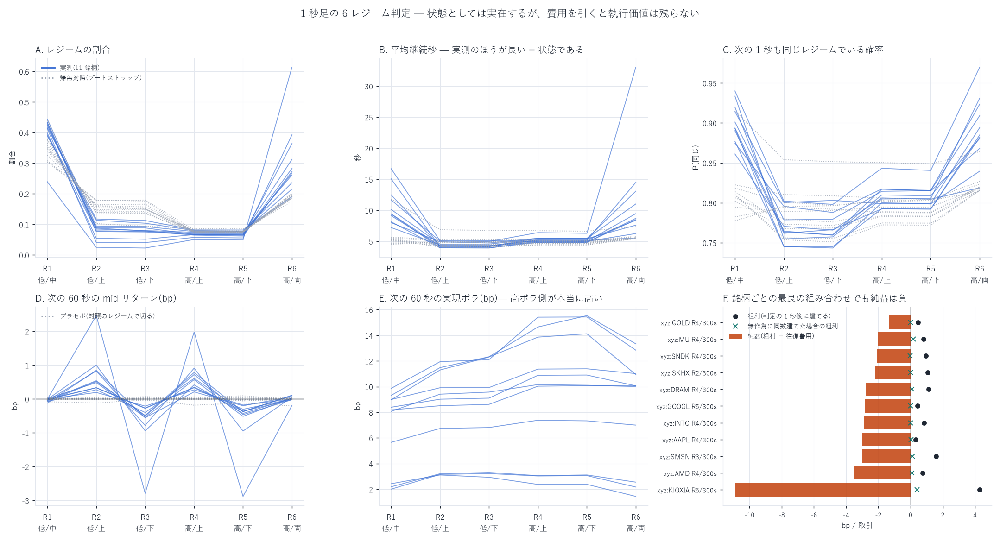

# 1 秒足の 6 レジーム判定 — 状態は実在するが、執行価値は残らない(11 銘柄)

[← Hyperliquid の分析](README.md) / [ホーム](../../README.md)

**何を測ったか** — 1 秒ごとの mid から **ボラ 2 × 方向 3 = 6 つのレジーム**を判定し、
指示された定義をそのまま実装したうえで、次の 3 つを順に確かめた。

1. **その 6 つは実在する状態か、雑音を 6 つの名前で呼び分けているだけか**
2. **次に何が起きるかを予測するか**(方向・ボラ)
3. **費用を引いて執行価値が残るか**(§24 Economic Significance)

**標本** — 2026-05-04〜08-10 の 99 日(`xyz:MU` 98 日、`xyz:KIOXIA` 47 日)、
**11 銘柄 × 各 855 万秒**。1 秒格子の値は**その秒までに観測された最後の気配**(後ろ向き)で、
気配が動かなかった秒は $`r_t=0`$ になる。24 時間動く市場なので日の境目で切らない。
判定できた秒は全銘柄 99.95% 以上(先頭 1,800 秒のウォームアップだけが欠測)。

---

## 先に結論

| 問い | 答え |
|---|---|
| この 6 つは実在する状態か | **実在する。** 分布はそのまま・**時間構造だけ壊したブートストラップ対照**と比べると、R1 の平均継続は 7.2〜16.7 秒 対 4.5〜11.8 秒、自己遷移確率は **11 銘柄すべてで対照を上回る**(例 `xyz:KIOXIA` 0.914 対 0.778) |
| 方向レジームは次の動きを当てるか | **当てる。** 198 通りのうち Bonferroni(\|t\|>3.66)を通るのは **87 通り**で、**その全部が R2〜R5**(方向つきレジーム)。方向のない R1 と R6 は **0/33 と 0/33** で、設計どおり何も出ない。符号は 132 通り中 **129 通り**が期待どおり |
| それはルックアヘッドや偶然か | **違う。** プラセボ(**対照のレジーム**で実データの将来リターンを切る)は中央 0.014bp・最大 0.71bp で、実測の 0.2〜2.9bp とは桁が違う |
| 高ボラのレジームは本当に高ボラか | **メモリ 6 銘柄と AMD/INTC では本当。** 次の 60 秒の実現ボラは高ボラ側が **1.12〜1.31 倍**。**ただし気配が疎な銘柄では壊れる** — `xyz:GOLD` は **0.73 倍(逆転)**、`xyz:GOOGL`/`xyz:AAPL` は 1.00/0.99 |
| **費用を引いて残るか** | **残らない。88 通り全部が負。** 最良でも `xyz:GOLD` の R4/300 秒で **−1.35bp/取引**(t=−13.1)、最悪は `xyz:KIOXIA` の −10.90bp |
| 総額ではどうか | **−279 万 USD(99 日・11 銘柄)。「何もしない」= 0 USD が最善手。** 無作為に同数建てた対照は −325 万 USD なので、**シグナルの価値は +46 万 USD ぶん実在するが、費用を覆えない** |
| なぜ届かないのか | **粗利が費用と同じ方向に動くから。** 粗利/費用の比は 0.10〜0.34(中央 **0.28**)で、費用の安い銘柄では粗利も小さい。スプレッドが 0.24bp の `xyz:GOLD` も 13.6bp の `xyz:KIOXIA` も、比では同じところにいる |
| 判定の 1 秒後に建てると | **粗利の 16.8%(中央値)が消える。** 平均 0.72 → 0.65bp。判定した秒の mid で建てられる前提は上界であって実現値ではない |



**この図でいちばん重要なのは F のパネル**である。A〜E は「レジームは実在し、方向もボラも
予測する」と言っている。それでも F では **11 銘柄すべてで棒が 0 の左にある**。
黒丸(粗利)と × 印(無作為に同数建てた場合の粗利)の差が**シグナルの実体**で、
それは確かに正だが、往復費用のほうが 3〜4 倍大きい。

---

## 1. 定義と時間契約

**ボラ判定(ヒステリシスつき)** — 固定閾値ではなく**直近 30 分の分布**と比べる。

```math
RV_{10,t}=\sqrt{\textstyle\sum_{i=0}^{9}r_{t-i}^{2}},\qquad
Q_{55,t}=\mathrm{pct}_{55}(RV_{10,\,t-1800:t}),\qquad
Q_{70,t}=\mathrm{pct}_{70}(RV_{10,\,t-1800:t})
```

$`RV_{10,t}>Q_{70,t}`$ で High へ、$`RV_{10,t}<Q_{55,t}`$ で Low へ移り、その間は**前秒を維持**する。
1 秒ごとのチャタリングを防ぐため。

**方向判定** — 10 秒リターンだけでは 100→101→102→103 と 100→104→98→103 を区別できない。
効率と符号つき標準化の 2 つを **AND** で使う。

```math
ER_t=\frac{p_t-p_{t-10}}{\sum_{i=0}^{9}|r_{t-i}|+\epsilon},\qquad
DS_t=\frac{p_t-p_{t-10}}{\sqrt{\sum_{i=0}^{9}r_{t-i}^{2}}+\epsilon}
```

Up は $`ER_t\ge0.35`$ かつ $`DS_t\ge1.0`$、Down はその符号違い、それ以外は Neutral。

| | Neutral | Up | Down |
|---|---|---|---|
| **Low vol** | R1 | R2 | R3 |
| **High vol** | R6 | R4 | R5 |

**時間契約** — レジームは時刻 $`t`$ までの情報だけで決まる。将来リターンは $`(t,\,t+h]`$ で、
`shift(-k)` は目的変数にしか使っていない。分位は後ろ向き 1,800 秒のローリングで、
全標本から作っていない。

---

## 2. 実在する状態か — 帰無対照との突き合わせ

閾値が**相対的**(直近 30 分の分位)なので、**どんな系列を入れても必ず 6 つに分かれる**。
「R4 が 8% あった」だけでは何も言えない。そこで実データの 1 秒リターンを
**ブートストラップ(復元抽出)で並べ替え**、同じ分類器に通した。
こうすると分布(裾の厚さ・ゼロの多さ)は実データと同じで、**時間方向の構造だけが壊れる**。

| 銘柄 | 日 | 気配が動いた秒 | R6 実測/対照 | R1 継続秒 実測/対照 | 自己遷移 R1 実測/対照 | 将来ボラ 高/低 |
|---|---:|---:|---:|---:|---:|---:|
| `xyz:MU` | 98 | 61.8% | 19.0% / 20.2% | 7.2 / 5.3 | 0.861 / 0.810 | 1.19 |
| `xyz:SNDK` | 99 | 51.2% | 21.5% / 20.0% | 8.1 / 5.3 | 0.877 / 0.810 | 1.17 |
| `xyz:INTC` | 99 | 38.7% | 28.3% / 19.8% | 9.4 / 5.4 | 0.893 / 0.814 | 1.12 |
| `xyz:AMD` | 99 | 43.0% | 26.2% / 19.2% | 9.4 / 5.2 | 0.894 / 0.806 | 1.13 |
| `xyz:SMSN` | 99 | 39.2% | 31.2% / 18.7% | 10.1 / 4.9 | 0.901 / 0.794 | 1.19 |
| `xyz:DRAM` | 99 | 53.3% | 23.6% / 18.8% | 8.0 / 4.6 | 0.875 / 0.782 | 1.20 |
| `xyz:KIOXIA` | 47 | 41.0% | 27.3% / 17.6% | 11.7 / 4.5 | 0.914 / 0.778 | 1.31 |
| `xyz:SKHX` | 99 | 47.3% | 26.8% / 19.4% | 9.1 / 5.1 | 0.890 / 0.802 | 1.29 |
| `xyz:GOLD` | 99 | 10.3% | 61.3% / 19.1% | 16.7 / 11.8 | 0.940 / 0.915 | **0.73** |
| `xyz:GOOGL` | 99 | 28.5% | 36.4% / 18.6% | 12.5 / 5.5 | 0.920 / 0.818 | **1.00** |
| `xyz:AAPL` | 99 | 24.9% | 39.3% / 18.6% | 15.1 / 5.6 | 0.934 / 0.822 | **0.99** |

読み方は 3 つある。

1. **持続性は実データのほうが明確に高い。** R1 の平均継続は対照の 1.4〜2.6 倍で、
   自己遷移確率も 11 銘柄すべてで上回る。**レジームは「状態」として実在する**
2. **R6(高ボラ/両建て)の過剰は流動性の薄さと対応している。** 気配が動いた秒が
   61.8% の `xyz:MU` では R6 は対照とほぼ同じ(19.0% 対 20.2%)なのに、
   10.3% しかない `xyz:GOLD` では 61.3% 対 19.1% になる。
   **気配が止まっている市場では「方向が定まらない高ボラ」が既定状態になる**
3. **そのぶん分類の意味は薄れる。** 表の右端(次の 60 秒の実現ボラの高/低比)を見ると、
   気配が疎な 3 銘柄では 1.00 前後、`xyz:GOLD` に至っては **0.73 と逆転**している。
   **これらの銘柄では「高ボラ」というラベルが将来のボラを当てていない**

---

## 3. 何を予測するか

各レジームの**次の 10 / 60 / 300 秒の mid リターン**を、日でクラスタした標準誤差で出した。
1 秒の点どうしは強く相関しているので、点をそのまま標本数に数えない。
198 通りの検定なので Bonferroni の \|t\| 閾値は **3.66**。

| 銘柄 | R2 低/上 | R3 低/下 | R4 高/上 | R5 高/下 | R1 低/中立 | R6 高/両建て | プラセボの最大 |
|---|---:|---:|---:|---:|---:|---:|---:|
| `xyz:MU` | +0.52 (t=+8.2)★ | −0.49 (t=−8.5)★ | +0.78 (t=+6.5)★ | −0.37 (t=−3.9)★ | −0.08 (t=−1.8) | +0.11 (t=+1.5) | 0.070 |
| `xyz:SNDK` | +0.54 (t=+7.1)★ | −0.50 (t=−7.8)★ | +0.72 (t=+5.9)★ | −0.46 (t=−4.0)★ | −0.05 (t=−1.0) | −0.02 (t=−0.2) | 0.062 |
| `xyz:INTC` | +0.27 (t=+4.1)★ | −0.40 (t=−6.8)★ | +0.61 (t=+6.2)★ | −0.37 (t=−4.3)★ | −0.08 (t=−2.4) | +0.10 (t=+1.4) | 0.047 |
| `xyz:AMD` | +0.48 (t=+8.8)★ | −0.54 (t=−9.8)★ | +0.57 (t=+5.1)★ | −0.51 (t=−6.4)★ | +0.01 (t=+0.3) | +0.03 (t=+0.5) | 0.061 |
| `xyz:SMSN` | +0.85 (t=+6.2)★ | −0.55 (t=−1.3) | +0.21 (t=+0.8) | −0.20 (t=−0.8) | −0.12 (t=−1.2) | +0.07 (t=+1.1) | 0.061 |
| `xyz:DRAM` | +0.83 (t=+7.5)★ | −0.78 (t=−5.9)★ | +0.91 (t=+7.8)★ | −0.95 (t=−6.6)★ | −0.05 (t=−1.0) | +0.05 (t=+0.8) | 0.037 |
| `xyz:KIOXIA` | +2.46 (t=+8.0)★ | −2.79 (t=−7.8)★ | +1.98 (t=+5.1)★ | −2.88 (t=−7.3)★ | −0.01 (t=−0.1) | −0.19 (t=−1.4) | 0.206 |
| `xyz:SKHX` | +1.00 (t=+6.9)★ | −0.94 (t=−6.4)★ | +0.42 (t=+2.4) | −0.43 (t=−2.2) | −0.01 (t=−0.2) | +0.03 (t=+0.3) | 0.094 |
| `xyz:GOLD` | +0.33 (t=+5.9)★ | −0.27 (t=−3.5) | +0.35 (t=+10.7)★ | −0.30 (t=−9.7)★ | −0.02 (t=−1.0) | −0.00 (t=−0.2) | 0.017 |
| `xyz:GOOGL` | +0.33 (t=+8.9)★ | −0.28 (t=−7.3)★ | +0.33 (t=+9.6)★ | −0.36 (t=−9.1)★ | −0.01 (t=−0.4) | −0.02 (t=−0.9) | 0.021 |
| `xyz:AAPL` | +0.19 (t=+5.5)★ | −0.21 (t=−4.4)★ | +0.27 (t=+7.2)★ | −0.18 (t=−4.8)★ | −0.01 (t=−0.6) | −0.00 (t=−0.1) | 0.013 |

単位は bp、次の 60 秒。★ は Bonferroni を通ったもの。

* **通ったセル 87 のうち、R1 と R6 は 1 つも無い(0/33・0/33)。** 方向を判定していない
  レジームからは何も出ない、という設計どおりの結果である。**分類器が意味のある軸で
  切れている証拠**として、有意なセルの数そのものより重い
* **プラセボは中央 0.014bp・最大 0.71bp。** 実測は 0.2〜2.9bp なので桁が違う。
  対照のレジーム(= 時間構造を壊した系列から作ったラベル)で同じ将来リターンを切ると
  何も出ない、ということ
* **ホライズンが延びるほど有意は減る**(10 秒 40/66 → 60 秒 38/66 → 300 秒 9/66)。
  シグナルは短い

**momentum である。** R2/R4(上)の次のリターンは正、R3/R5(下)は負で、
これは平均回帰ではない。[1 分足の平均回帰の検証](mrev_report.md)で
「1 分足に自己相関はほぼ無い」と書いたのと矛盾しない — あちらは**無条件**の自己相関、
ここは**方向が立っている場面だけを選んだ条件つき**の話である。

---

## 4. 費用を引くと何が残るか

`analyze_regime.py` の ④ は「レジームに入っている**全秒**の平均リターン」と費用を比べたが、
それは**取引の単価ではない**。実際には

* レジームに**入った瞬間に 1 回だけ**建てる(毎秒建て直さない)
* 建てるには**テイカーで板を叩く**(片道 中央スプレッド/2 + 手数料 0.79bp)
* **判定した次の秒**に発注が届く(実装可能性 — 判定した秒の mid では建てられない)
* **執行できる数量**は最良気配の数量までしかない

として、**1 取引あたりの純益(bp)と総額(USD)**を出した。

| 銘柄 | 最良 | 回数 | 粗利(遅延なし) | 粗利(1 秒後) | 往復費用 | 純益 | t | 無作為対照 | 数量 | 総額 |
|---|---|---:|---:|---:|---:|---:|---:|---:|---:|---:|
| `xyz:GOLD` | R4 / 300s | 67,779 | +0.54 | +0.47 | 1.82 | **−1.35** | −13.1 | −0.01 | $4,467 | $−40,863 |
| `xyz:MU` | R4 / 300s | 134,656 | +1.00 | +0.80 | 2.82 | **−2.02** | −6.7 | +0.17 | $1,000 | $−27,189 |
| `xyz:SNDK` | R4 / 300s | 131,056 | +1.18 | +0.94 | 3.02 | **−2.08** | −5.1 | −0.04 | $1,455 | $−39,655 |
| `xyz:SKHX` | R2 / 300s | 180,220 | +1.17 | +1.07 | 3.28 | **−2.21** | −6.1 | +0.00 | $980 | $−39,056 |
| `xyz:DRAM` | R4 / 300s | 123,462 | +1.22 | +1.13 | 3.89 | **−2.77** | −8.7 | +0.08 | $198 | $−6,764 |
| `xyz:GOOGL` | R5 / 300s | 101,797 | +0.49 | +0.42 | 3.23 | **−2.81** | −23.0 | +0.01 | $565 | $−16,146 |
| `xyz:INTC` | R4 / 300s | 118,861 | +0.84 | +0.83 | 3.75 | **−2.92** | −9.2 | +0.01 | $1,469 | $−50,949 |
| `xyz:AAPL` | R4 / 300s | 95,964 | +0.36 | +0.32 | 3.30 | **−2.98** | −24.6 | +0.04 | $500 | $−14,295 |
| `xyz:SMSN` | R3 / 300s | 145,588 | +1.63 | +1.58 | 4.61 | **−3.03** | −3.7 | +0.10 | $266 | $−11,759 |
| `xyz:AMD` | R4 / 300s | 120,544 | +0.85 | +0.74 | 4.29 | **−3.55** | −11.5 | +0.10 | $751 | $−32,120 |
| `xyz:KIOXIA` | R5 / 300s | 50,494 | +4.09 | +4.29 | 15.19 | **−10.90** | −13.0 | +0.41 | $30 | $−1,652 |

単位は bp/取引。**銘柄ごとに 88 通りのうち最も良い組み合わせ**を載せている
(事後選択だが、**全 88 通りが負**なので結論は保守側に動かない)。

### 対照を 3 つ置く

| 対照 | 総額(99 日・11 銘柄・88 通りの合計) |
|---|---:|
| **何もしない** | **0 USD** |
| この判定で建てる | **−2,789,644 USD** |
| 無作為に同じ回数・同じ保有時間で建てる | −3,246,094 USD |

**主判定は「施策 vs 何もしない」である**(「施策後 > 0」では元が黒字の層で自動的に通る)。
その判定では **−279 万 USD で、最善手は不参加**。
一方「施策 vs 無作為」は **+46 万 USD** で、**シグナルそのものは実在する**。
この 2 つは矛盾しない ── レジーム判定には確かに情報があるが、
**その情報量は板を叩く費用の 1/4〜1/3 しかない**。

### なぜ届かないのか

粗利/費用の比は **0.10〜0.34(中央 0.28)** で、銘柄が変わってもこの比はあまり動かない。
スプレッドが 0.24bp しかない `xyz:GOLD` では粗利も 0.47bp、13.6bp の `xyz:KIOXIA` では
粗利も 4.29bp になる。費用と粗利の順位相関は +0.57 だが **n=11 では有意でない**(p=0.066)ので、
「比例する」と言い切るには標本が足りない。
**言えるのは「費用の安い銘柄に逃げても比は改善しなかった」**までである。

### 判定してから建てるまでの 1 秒

判定した秒の mid で建てられる前提(遅延なし)と、次の秒で建てる前提を両方出した。
**粗利の中央 16.8% が 1 秒で消える**(平均 0.72 → 0.65bp)。
`xyz:KIOXIA` だけ遅延ありのほうが大きい(+4.09 → +4.29)が、これは板が薄く
1 秒の差が雑音に埋もれているためで、有利になったと読むべきではない。

---

## 5. この数字を上界として読む理由

1. **数量は上界。** 最良気配の中央 notional(30〜4,467 USD)までしか叩けないとしたが、
   実際にはレジームに入った瞬間の板はこれより薄い可能性が高い。これを超えれば次の板を食う
2. **費用も下界寄り。** 往復費用は**中央スプレッド**で代表させた。ボラが立った瞬間の
   スプレッドは中央値より広いので、**実際の費用はこれより大きい**
3. **取引は重なっている。** h=300 秒で数秒おきに入るので、全部を独立に建てる資金は無い。
   総額は**規模の目安**であって到達可能な損益ではない(符号と桁を読むための数字)
4. **メイカーなら費用は 0.176bp まで下がる**が、それは幽霊注文の上界である。
   [7 銘柄のメイカー検証](mm_all_report.md)のとおり**半スプレッドは約定するまでに消え**、
   方向が立っている場面で出した指値はとりわけ逆選択される。
   「メイカーにすれば黒字」は**この標本では確かめていない主張**であって、結論に含めない
5. **`xyz:KIOXIA` は 47 日**しかなく、スプレッドも 13.6bp と桁違いに広い
6. **`xyz:GOLD`/`xyz:GOOGL`/`xyz:AAPL` はボラ判定が機能していない**(§2)。
   方向判定だけは効いている(t=+5.5〜+10.7)ので、
   これらの銘柄で R4/R5 を「高ボラ」と読むのは誤りである

---

## 6. 確かめたこと / 確かめていないこと

| 確かめた | 方法 |
|---|---|
| 分類が雑音の呼び分けでないこと | ブートストラップ対照(分布は同じ・時間構造だけ破壊)と割合・継続秒・自己遷移を比較 |
| 予測がルックアヘッドでないこと | 特徴量は $`t`$ まで、目的変数は $`(t,t+h]`$。分位は後ろ向き 1,800 秒。プラセボ(対照ラベルで切る)は中央 0.014bp |
| 多重比較 | 198 通り全件を出し、Bonferroni \|t\|>3.66 を併記 |
| 統計の独立性 | 標準誤差は日でクラスタ(1 秒の点を標本数に数えない) |
| 実装可能性 | 判定の 1 秒後に建てる列を併記。数量は最良気配まで |
| 対照の設計 | 「何もしない」「無作為に同数建てる」「施策」の 3 本立てで、主判定は施策 vs 何もしない |
| 総額 | 単価(bp)だけでなく回数 × 数量を掛けた USD も提示 |

| 確かめていない | なぜ |
|---|---|
| メイカーで建てた場合 | 約定の逆選択を測る必要があり、それは[別のレポート](mm_all_report.md)の主題。ここでは上界だけ述べた |
| 閾値(0.35 / 1.0 / 55 / 70 / 10 秒)の感度 | 指示された定義をそのまま実装した。格子探索をすると多重比較の規模が跳ね上がるので、やるなら訓練と検証を時間で分ける |
| 標本外評価 | 全期間を 1 つの標本として扱っている。純益が全 88 通りで負なので分割は不要と判断した |
| `xyz:NVDA` / `xyz:TSLA` / `AAVE` | 1 秒格子の BBO をまだ作っていない(L1 からの再構成が要る) |

---

## 7. 再現手順

```bash
# 1. レジーム系列(銘柄ごと、1 銘柄 3 分ほど)
uv run python scripts/build_regime.py --coin xyz:MU
# 2. 銘柄横断の集計と帰無対照(11 銘柄で 25 分ほど)
uv run python scripts/analyze_regime.py
# 3. 執行価値
uv run python scripts/analyze_regime_econ.py
# 4. 図
uv run python scripts/plot_regime.py
```

出力は `data/regime_<coin>.parquet`(1 秒ごとのレジーム)、
`data/regime_{share,trans,fwd,summary,econ}.csv`、`charts/allcoins_regime.png`。
この 4 手順は**ローカル完結で AWS の費用は発生しない**(入力はすべて手元の BBO)。
`xyz:GOLD` / `xyz:GOOGL` / `xyz:AAPL` の BBO だけは DEEP_ARCHIVE からの復元で
用意されたもので、その取得費用は本レポートの作業より前に発生している
(`scripts/restore_bbo_s3.py`、3 銘柄 340MB で概算 $0.05 未満)。
