# Lighter 分析索引

[← ホーム](../../README.md)

| 項目 | 内容 |
|---|---|
| 取引所 | [Lighter](https://lighter.xyz/)(zk ロールアップ上の PerpDEX。板は 50ms バッチの L2 差分で公開) |
| 対象銘柄 | **13 銘柄**: メモリ半導体 5(DRAM / MU / SNDK / SKHYNIXUSD / SAMSUNGUSD)+ 米国株 5(AAPL / AMZN / MSFT / NVDA / TSLA)+ 金属 2(XAU / XAG)+ H100 |
| データの出所 | `E:\Lighter　データ` の常駐 WS 記録(order_book / trade / ticker)。**過去データは公式に存在せず、記録開始 2026-08-18 以前は永久に無い** |
| 標本期間 | 2026-08-18 〜 09-05(19 日。追加 8 銘柄は 08-22 〜の 15 日) |
| 規模 | 1 秒グリッド 16,852,314 行 / ticker BBO 115,816,537 行 / 特徴量 222 個 |
| 比較相手 | Binance USD-M 先物の同名 12 銘柄(`E:\Binance-perp-data` のライブ bookTicker) |

このフォルダは**銘柄横断**の分析を置く(Hyperliquid の `xyz:MU` のような
銘柄単位の索引と違い、13 銘柄をまとめて扱う)。
レポートは下で**大きい話から細かい話へ** A→D の順に並べています。

各レポートは冒頭に「何を測ったか」と「時間契約」(説明変数が確定する時刻と
目的変数の期間)を置いています。用語は [用語辞書](../../GLOSSARY.md)、
「予測できた」の定義は [予測の定義](../predicting_definition.md) にあります。

---

## 何が判ったか(要約)

1. **Lighter の板は桁違いにタイト** — 主要銘柄の spread 中央値は約 1bp
   (XAU 0.67bp)。Hyperliquid xyz:MU の ~5bp、Boros の 13.8bp より 1 桁狭い
2. **OFI(直近 1 秒)が 222 特徴量の 1 位**(ρ=+0.030、12/13 銘柄)。
   Boros・Hyperliquid では効かなかった量が、この取引所では最強クラス —
   同じ定義でも取引所で立場が逆転する
3. **価格は近傍の流動性が薄い側へ動く** — ask 側の隙間(gap_12_a、13/13 一致)が
   上昇を、bid 側の隙間が下落を先行。形状・隙間系の非対称は全てこの軸の言い換え
4. **★Binance とのリードラグは銘柄で割れる** — 米国メガキャップは Binance 先行
   (MSFT のシェア 0.89)、**メモリ半導体と銀は Lighter 先行**(米国立会の外で
   顕著)。偏相関は 12 銘柄 × 全日で両方向とも正 = 相互に情報が流れている
5. **Binance のジャンプは本物扱い、Lighter のジャンプは部分的にノイズ扱い** —
   Binance 側イベント後に Lighter は +1.6〜3.9bp 追随、逆方向は +0.6bp 以下で
   薄い銘柄は Lighter 自身が逆戻りする(SAMSUNG −5.2bp)
6. δ = microprice − mid は Lighter でも **(spread/2)×OBI の恒等式**(Boros と同じ)

---

## レポート

### A. この市場はどういうものか

| レポート | 内容 |
|---|---|
| [記録データと 13 銘柄の素性](lighter_data_report.md) | 生記録の構造、板再生の検証(ticker と 98.9% 一致)、品質台帳(nonce 切れ 0・被覆 99%・H100 だけ 14.7%)、出来高・spread・板の厚みの銘柄横断表。 |

### B. 板の状態は将来の値動きを教えてくれるか

| レポート | 内容 |
|---|---|
| [特徴量 222 個の一括構築と予測力](lighter_features_report.md) | 12 系統 222 特徴量の構築と、h=10/60/300s の Spearman ρ・十分位応答の総覧。帰無帯の外 119/221、13/13 全会一致 26 個。OFI が 1 位、隙間・形状の非対称が「薄い側へ動く」軸として下位を占める。n=13 の符号検定は Bonferroni に構造的に届かないことの明示。 |
| [回帰 — 全部入れて標本外](lighter_regression_report.md) | リッジ(時間分割・訓練内標準化・λ も訓練内選択・窓の重なりなし)。OOS ρ 中央値 +0.019 対 帰無 +0.004。R² は全銘柄負。最薄の MSFT だけ +0.107。 |

### C. 取引所間の情報の流れ

| レポート | 内容 |
|---|---|
| [★Binance とのリードラグ徹底測定](lighter_leadlag_report.md) | 12 ペア × 408 銘柄日。時計診断(両取引所のサーバ時計差 ±2ms 以内、マシン時計が −62ms)→ CCF(±30s・±3s)→ 偏相関(自分の過去を統制、両方向とも全日正)→ 米国立会の層別(Lighter 先行は立会外)→ ホライズン→ イベントスタディ(追随の非対称)。帰無 = 日ずらし。 |

### D. 特徴量どうしはどう結びついているか

| レポート | 内容 |
|---|---|
| [全 24,531 ペアの相関行列と重複](lighter_corr_report.md) | 全通りの Spearman 行列(銘柄中央値)。\|ρ\|>0.9 は 117 ペア。同じものの別名 5 種(δ=(spread/2)×OBI の恒等式を含む)。予測に効く独立軸は OFI / OBI(隙間・形状)/ 約定フローの 3 本。 |

---

## 図

レポートに載せている図をすべてここに並べます。区分はレポートと同じ A〜D です。

### A. この市場はどういうものか

**13 銘柄の概観** — 出来高・spread・板の厚み・約定数・被覆率。解説: [記録データと 13 銘柄の素性](lighter_data_report.md)


### B. 板の状態と将来の値動き

**特徴量 221 個の予測力総覧** — 帰無帯つきの全ランキングと系統別分布。解説: [特徴量報告](lighter_features_report.md)

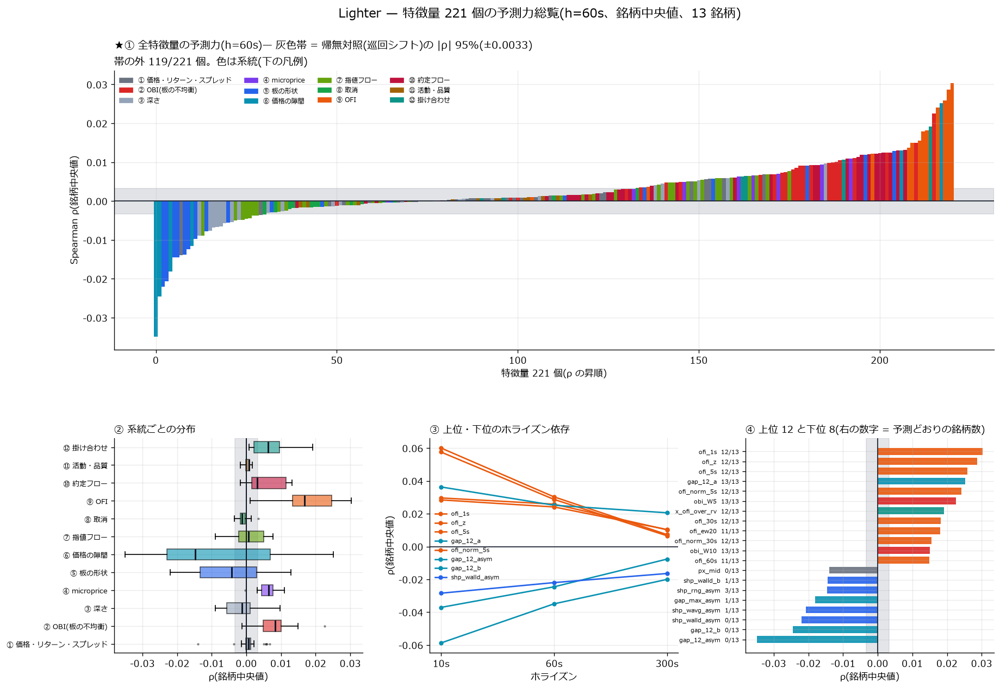

**十分位応答(系統別・12 枚)** — 各系統の全特徴量の十分位 → 60 秒後リターン。解説: [特徴量報告](lighter_features_report.md)

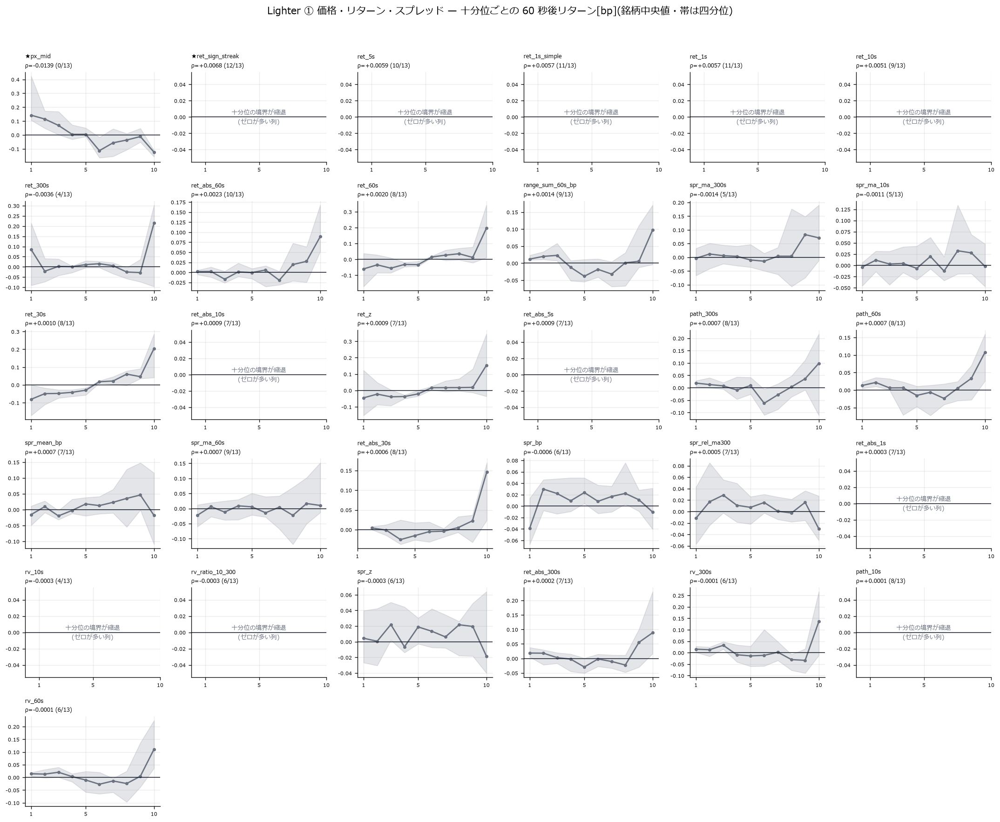
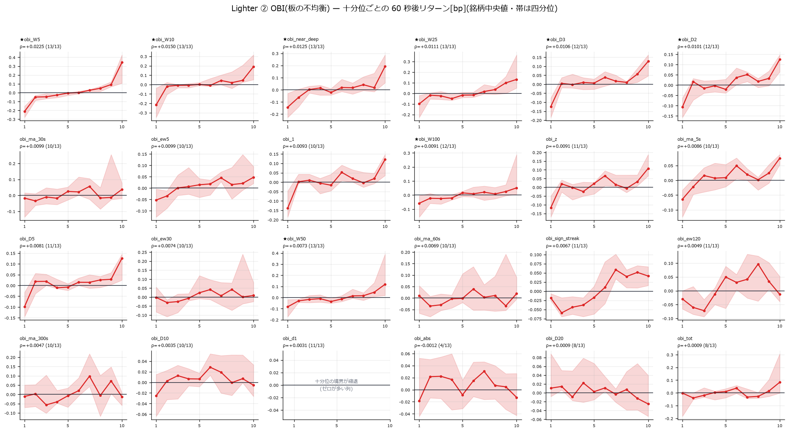
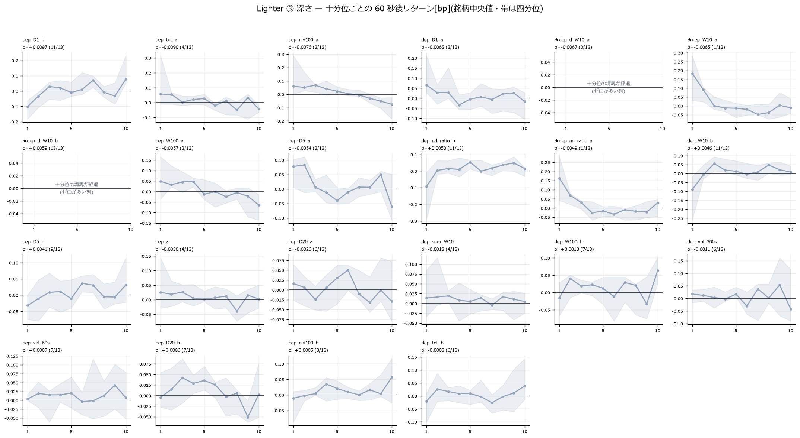
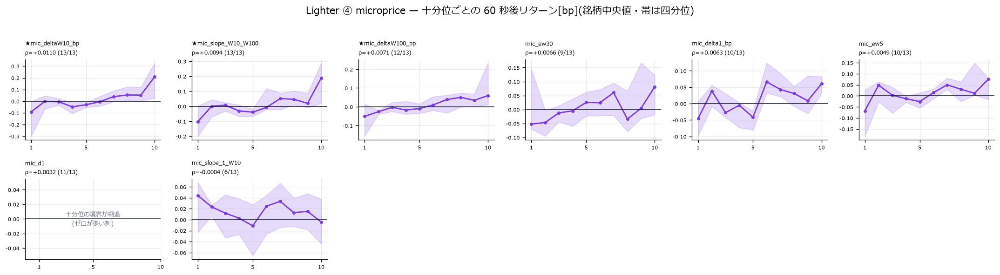
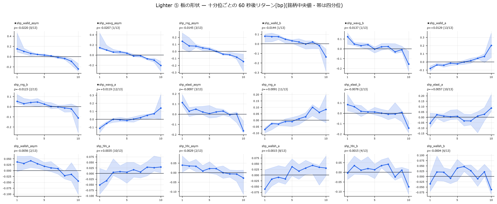
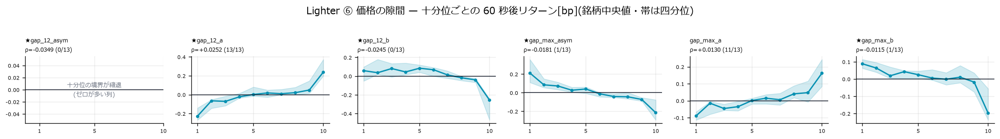
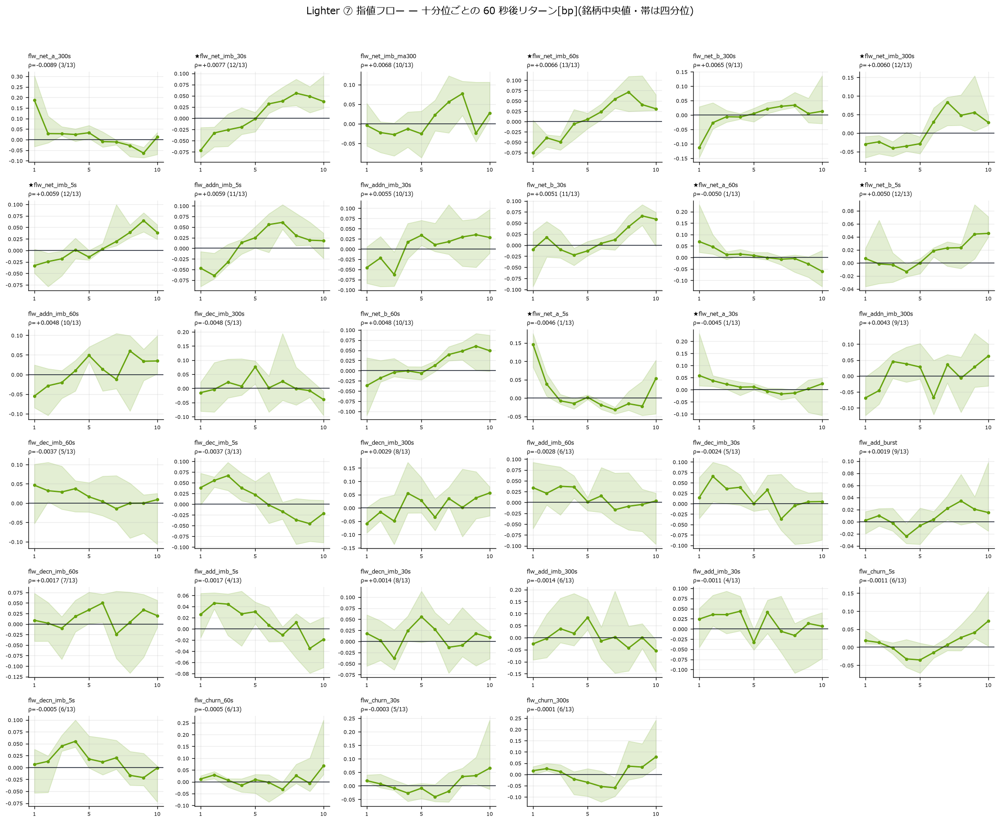
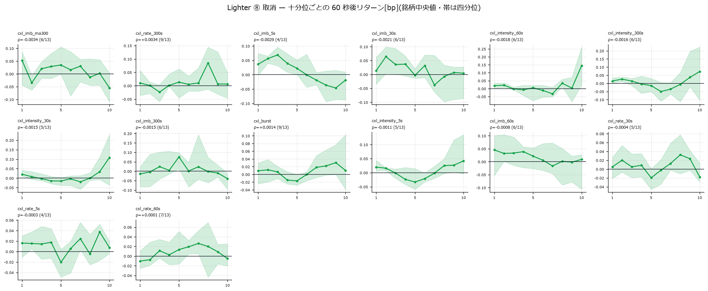
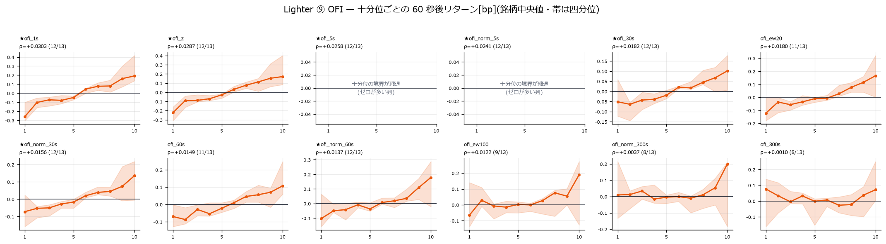
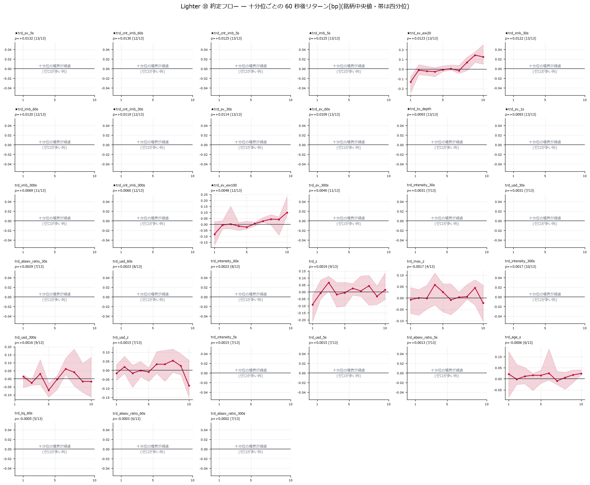
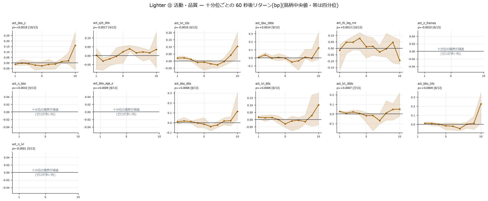
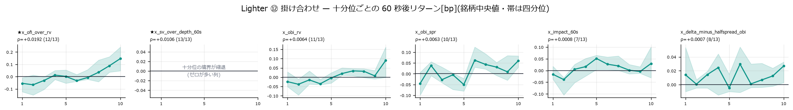

**散布図(上位 12・下位 12)** — 銘柄内順位 × 標準化リターンと 20 ビン平均。解説: [特徴量報告](lighter_features_report.md)

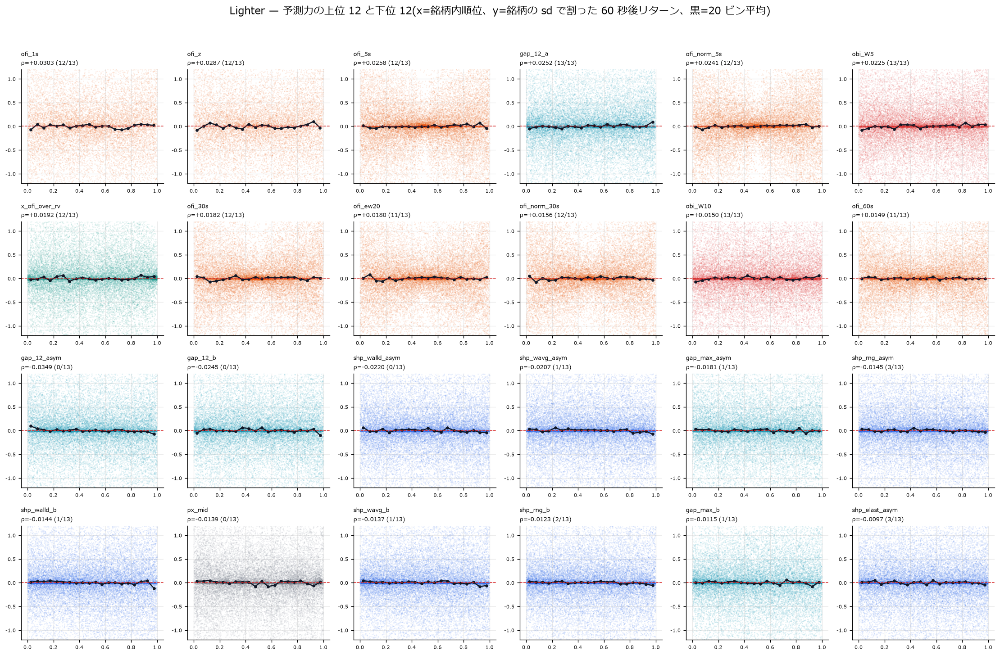

### C. 取引所間の情報の流れ

**CCF(±30 秒)** — 12 ペアのクロス相関と日ずらし帰無。解説: [リードラグ報告](lighter_leadlag_report.md)

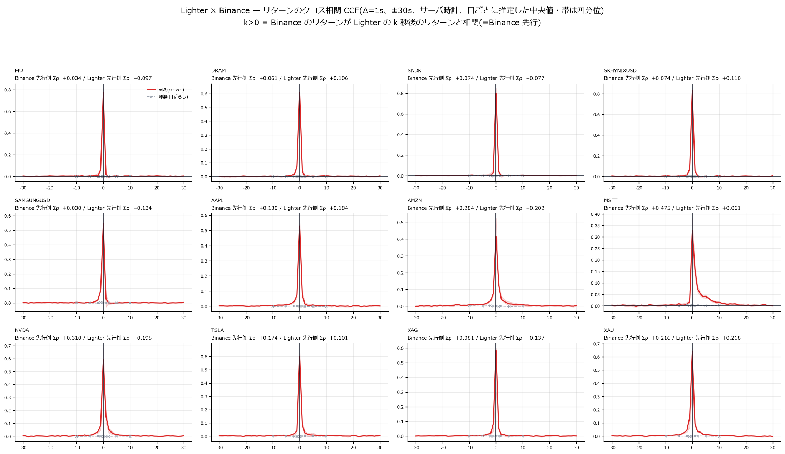

**細部 CCF(±3 秒・時計 2 通り)** — ピークは 11/12 で k=0、非対称は裾。解説: [リードラグ報告](lighter_leadlag_report.md)

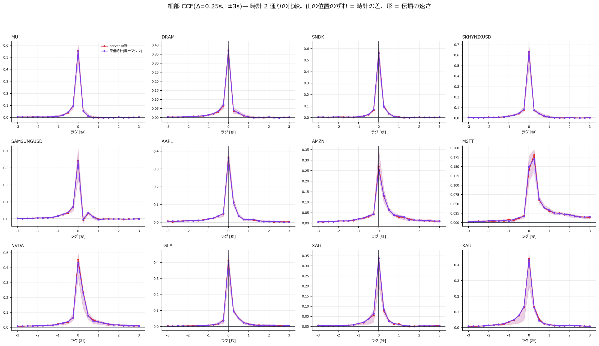

**方向の判定** — 偏相関・層別・ホライズン・時計診断・リーダーシェア。解説: [リードラグ報告](lighter_leadlag_report.md)

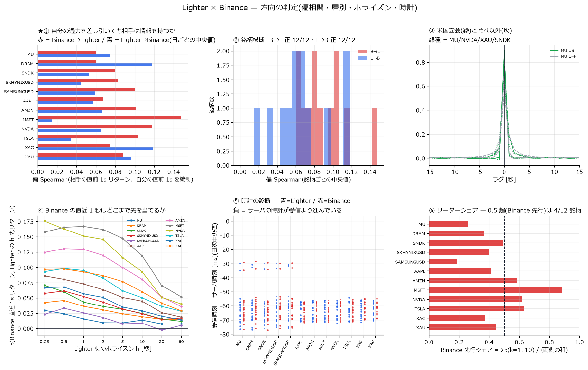

**イベントスタディ** — 片側ジャンプ後の両取引所の平均経路。解説: [リードラグ報告](lighter_leadlag_report.md)

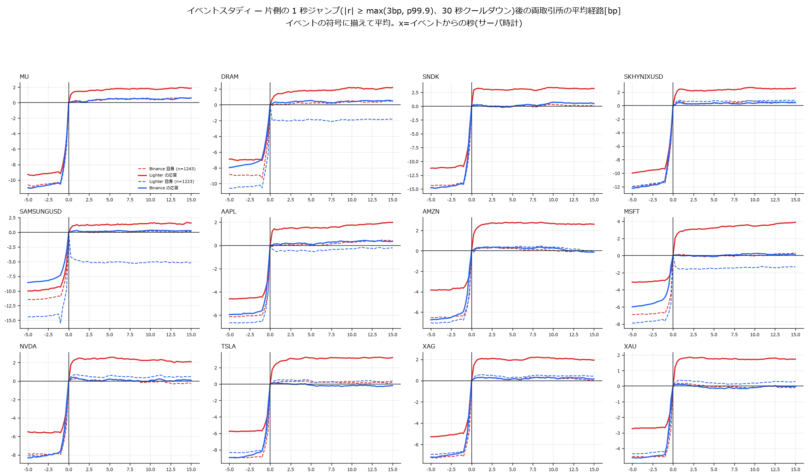

### D. 特徴量どうしの関係

**全ペア相関行列** — 222 列 × 13 銘柄中央値と \|ρ\| 分布。解説: [相関の報告](lighter_corr_report.md)

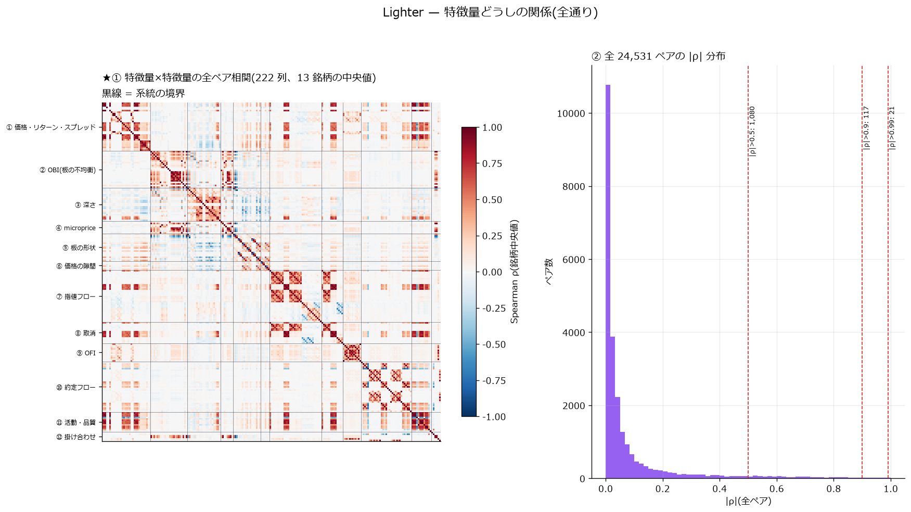

---

## 数値データ

中間生成物は容量のため版管理外(`E:/Memory-lighter/`)。
下表の生成スクリプトで作り直せます。

| ファイル | 内容 | 生成スクリプト |
|---|---|---|
| `grid_{SYM}.parquet` | 1 秒グリッド 76 列 × 13 銘柄(計 1,685 万行) | `lighter_parse.py` |
| `bbo_{SYM}.parquet` | Lighter ticker の BBO 変化列(1.16 億行) | `lighter_parse.py` |
| `bnb_{SYM}.parquet` | Binance bookTicker の BBO(12 銘柄) | `lighter_binance_bbo.py` |
| `ana/desc・rho・dec・corr・dup・samp_{SYM}` | 分布・ρ・十分位・相関行列・重複・抽出 | `lighter_analyze.py` |
| `ana/summary60.parquet` | 特徴量 221 個の銘柄横断集計 | `lighter_plots.py` |
| `ana/reg_perf_*.parquet` | リッジの標本外性能(実測・帰無) | `lighter_reg.py` |
| `ll/ccf・partial・hcurve・clock.parquet` | リードラグ一式 | `lighter_leadlag.py` |
| `ll/events_{SYM}.npz` | イベントスタディの経路 | `lighter_leadlag.py` |

## 再現手順

上から順に実行すると、このページの図と数値がすべて再現できます。
(解析は**銘柄ごとに直列**で。並列 4 本で RAM が尽きた実績あり)

```bash
uv run python scripts/lighter_parse.py                 # 生記録 → グリッド+BBO(全 13 銘柄)
uv run python scripts/lighter_binance_bbo.py           # Binance bookTicker → BBO
uv run python scripts/lighter_analyze.py --symbols MU  # 銘柄ごとに(×13)
uv run python scripts/lighter_reg.py --symbols ...     # リッジ(2 分割)
uv run python scripts/lighter_leadlag.py               # リードラグ一式
uv run python scripts/lighter_plots.py                 # 概観・総覧・相関・十分位・散布図
uv run python scripts/lighter_leadlag_plots.py         # リードラグの図 4 枚
# 一括(切り離し実行用): scripts/lighter_runall.py
```
