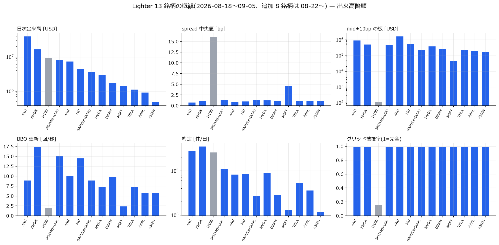

# Lighter の記録データと 13 銘柄の素性

[← Lighter の分析索引](README.md)

## 何を測ったか

`E:\Lighter　データ` に常駐記録している PerpDEX **Lighter** の生 WS 記録
(order_book 50ms 差分 / trade / ticker)から、**13 銘柄 × 2026-08-18〜09-05**
(追加 8 銘柄は 08-22〜)の板を線形再生し、1 秒グリッド 76 列の基礎表を作った。
本レポートはその**データの品質台帳**と、銘柄ごとの**市場としての素性**をまとめる。
以後の全レポート(特徴量・回帰・リードラグ・相関)の土台である。

## 時間契約

本レポートは記述統計のみで予測を主張しない。時刻はすべて Lighter エンジンの
`last_updated_at`(µs)。受信時刻(このマシンの時計)との差は
[リードラグ報告](lighter_leadlag_report.md) §時計診断で扱う。

---

## 1. 記録の構造と再生規則

| 生系列 | 粒度 | 使い方 |
|---|---|---|
| `ws/order_book` | **50ms バッチ**の L2 差分(size は絶対値、0=消滅) | snapshot(`subscribed/`)から差分を積んで板を再生 |
| `ws/ticker` | BBO 変化ごと | 再生板の照合・OFI・リードラグ用 BBO 系列 |
| `ws/trade` | 約定ごと(`is_maker_ask` でテイカー方向確定) | 約定フロー |

- **鎖の検証**: 各フレームの `begin_nonce` = 直前フレームの `nonce`。
  切れたら suspect を立て、snapshot か ticker BBO と 10 秒連続一致で解除
- **切れた gz**(EOFError / zlib.error)は読めたところまで使い次のファイルへ
- 60 秒を超える無フレーム区間は行を出さない(切断とみなす)

**再生の検証**: 再生板の mid と ticker の mid は **98.9% の秒で厳密一致**、
不一致の p99 も 0.053bp(MU 2026-08-30 の全数照合)。クロス板は 0。

## 2. 品質台帳(全 13 銘柄)

| 銘柄 | グリッド行 | ticker 行 | snapshot | ★nonce 切れ | 切れ gz | 60s+ 沈黙 | 被覆率 |
|---|---:|---:|---:|---:|---:|---:|---:|
| MU | 1,597,812 | 19,147,548 | 93 | **0** | 38 | 40 | 0.992 |
| SNDK | 1,597,469 | 24,797,453 | 92 | **0** | 38 | 40 | 0.991 |
| SKHYNIXUSD | 1,597,800 | 19,146,872 | 96 | **0** | 37 | 39 | 0.992 |
| SAMSUNGUSD | 1,598,205 | 11,451,625 | 87 | **0** | 36 | 35 | 0.992 |
| DRAM | 1,598,017 | 11,653,738 | 93 | **0** | 35 | 38 | 0.992 |
| XAU | 1,239,686 | 6,997,849 | 73 | **0** | 31 | 35 | 0.990 |
| XAG | 1,239,872 | 9,118,801 | 83 | **0** | 31 | 34 | 0.990 |
| NVDA | 1,239,825 | 4,269,353 | 80 | **0** | 31 | 34 | 0.990 |
| TSLA | 1,239,598 | 3,909,875 | 79 | **0** | 30 | 32 | 0.990 |
| AAPL | 1,239,808 | 2,531,249 | 72 | **0** | 29 | 33 | 0.990 |
| AMZN | 1,239,829 | 2,148,269 | 79 | **0** | 29 | 33 | 0.990 |
| MSFT | 1,240,767 | 618,266 | 79 | **0** | 30 | 30 | 0.991 |
| **H100** | **183,626** | **25,639** | **7,750** | 0 | 30 | **1,869** | **0.147** |
| 合計 | 16,852,314 | 115,816,537 | | | | | |

- **nonce の鎖は全銘柄で一度も切れていない**(接続中の取りこぼしゼロ。
  再接続は snapshot で健全に再開)
- **★H100 は別物**: 被覆 14.7%、snapshot 7,750 回(= 再購読の嵐)、
  ticker 2.6 万行しかない。板がほぼ空(±10bp の板 107 USD)で WS が繋がっては切れる
  状態。**以後の集計に含めるが、単独の数字は信用しないこと**

## 3. 市場としての素性



| 銘柄 | 出来高/日 [USD] | spread 中央値 | mid±10bp の板 [USD] | 約定/日 |
|---|---:|---:|---:|---:|
| XAU | 39,335,910 | **0.67bp** | 909,199 | 28,495 |
| SNDK | 16,450,205 | 1.02bp | 490,970 | 35,296 |
| H100 | 9,478,683 | 16.10bp | **107** | 25,920 |
| SKHYNIXUSD | 7,991,432 | 1.24bp | 436,254 | 10,949 |
| XAG | 7,264,284 | 0.85bp | **1,614,582** | 8,221 |
| MU | 4,330,601 | 0.93bp | 532,884 | 8,432 |
| SAMSUNGUSD | 3,620,931 | 1.31bp | 233,629 | 2,656 |
| NVDA | 3,014,835 | 1.19bp | 381,637 | 9,113 |
| DRAM | 1,709,225 | 1.07bp | 264,053 | 2,867 |
| MSFT | 1,386,754 | **4.52bp** | 42,713 | 1,306 |
| TSLA | 1,096,869 | 1.10bp | 234,121 | 5,404 |
| AAPL | 906,044 | 1.12bp | 193,056 | 3,591 |
| AMZN | 473,692 | 1.00bp | 170,275 | 1,143 |

読みどころ:

1. **spread が桁違いに狭い。**Hyperliquid の `xyz:MU` は中央 5bp 前後、
   Boros は 13.8bp だったのに対し、Lighter の主要銘柄は **1bp 前後**、XAU は 0.67bp。
   板は常時タイトに張られている(ゼロ手数料の PerpDEX という設計の帰結と整合)
2. **メモリ半導体 5 銘柄は Lighter の看板**であり、Binance の同名 perp より
   活発に MM されている(リードラグ報告 §で効いてくる)
3. **MSFT は例外**(spread 4.5bp・板 43k USD・ticker 62 万行)。Lighter 内で放置気味の
   銘柄で、この「薄さ」が後のリードラグで最も大きな Binance 先行を生む
4. H100 は市場として成立していない(§2)

## 4. 既知の欠陥(記録側)

- **2026-08-22〜23 は WS 再接続嵐で劣化**(記録案件の実測: DRAM −77%/−73% 等)。
  本分析の窓に含まれるが、被覆率の欠けとして現れる(上表の沈黙・切れ gz の多く)
- 50ms バッチのため**バッチ内の複数イベントは分離できない**(粒度の天井)。
  1 秒グリッドの「フロー」はフレーム差分の合計であり、真のイベント数ではない
- 追加 8 銘柄は 08-22 開始なので標本が 4 日短い

## 自己精査

- 分母: 被覆率 = グリッド行 ÷ (記録窓の秒数)。窓は銘柄ごとに実測の min/max ts
- 「nonce 切れ 0」は**接続中**の話。切断そのものは snapshot 数と沈黙数に出ている
- 出来高/日は記録が生きていた時間だけの合計を日数で割った値 —
  切断中の約定は数えられないため**過小**(被覆率 99% なので歪みは ~1%)
- H100 の出来高/日 9.5M USD は板 107 USD と整合しない見かけだが、trade チャンネルは
  板と独立に届くため約定は記録されている。**板の記録が薄いだけで市場に約定はある**
  (それでも板由来の特徴量は信用できない)

## 再現手順

```bash
uv run python scripts/lighter_parse.py            # 全 13 銘柄(E:/Memory-lighter へ)
uv run python scripts/lighter_plots.py --only mkt # 概観図
```
