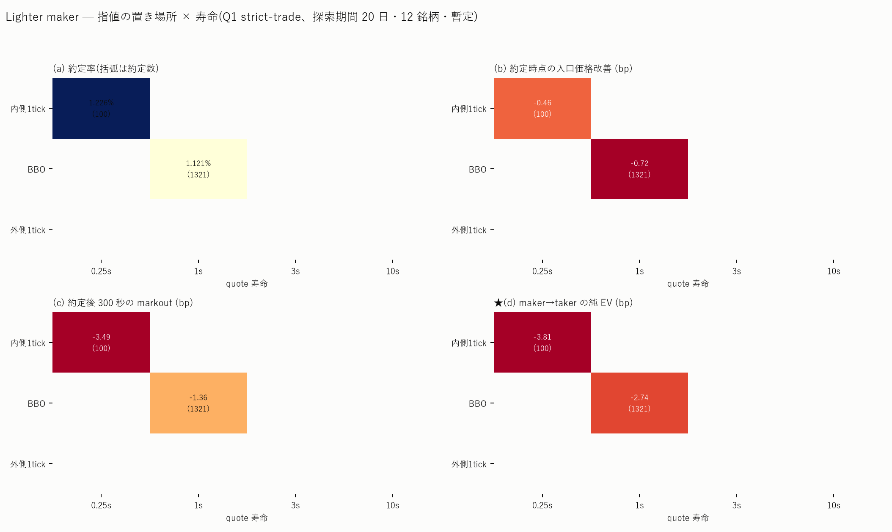
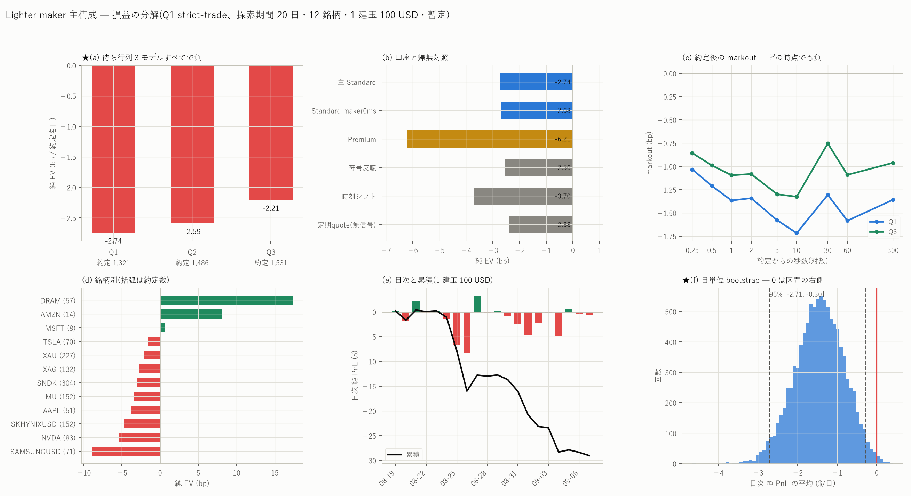

# ★Lighter の maker 戦略 — 経済的有意性の検証

[← Lighter の分析索引](README.md)

## 結論(先に 4 点)

1. **経済的有意性は確認されなかった。**主構成の純 EV は
   **−2.743 bp / 約定名目**、**−$1.45 / 日**(1 建玉 100 USD)。
   日単位 95% 区間は **[−2.708, −0.295]** で**上限も 0 を下回る**。
   楽観側の待ち行列モデル(Q3・取消は全部自分の前で起きると仮定)でも
   **−2.209 bp** で負。**Q1〜Q3 のどの仮定でも符号は変わらない**ので、
   「識別不能」ではなく **経済的有意性なし** と判定する。
2. **最も有望だった構成は、主構成そのもの(BBO・寿命 1 秒・Standard 口座)である。**
   Hybrid 決済も Premium 口座も内側/外側の指値も、すべてこれより悪かった。
3. その純 EV は **−2.743 bp**、**−$1.45/日**、約定率 **1.12%**、
   容量は**そもそも黒字領域が無いので意味を持たない**。
4. **結論を制約する最大の不確実性は「自分の注文が板に無い」という仮定である。**
   約定した買いの **92% で、約定時点の最良買い気配が自分の指値より下**にあった。
   現実には自分が最良気配を作っていたはずで、その状態は観測データに存在しない。
   ただしこの偏りは**約定を早める方向**(= 有利側)なので、負の結論は覆らない。

> **★暫定である。**この主構成を凍結したのは 2026-09-08 13:20 UTC で、
> **それより後に完結した UTC 日はまだ 1 日も無い**(データは 09-08 00:00 UTC まで)。
> したがって以下はすべて**探索期間(08-18〜09-07)の暫定値**であり、
> 確認期間の確定的検定は 09-08 以降が完結してから 1 回だけ実行する。
> なお 09-06・09-07 は[テイカー版の検定](lighter_walkforward_report.md)で
> 1 度だけ見た日なので、**完全未見ではない**。別枠で報告する。

図:





---

## 1. データと期間

| | |
|---|---|
| 生記録 | `E:\Lighter　データ/data/raw/ws/{order_book, trade, ticker}` |
| 期間 | 2026-08-18 〜 2026-09-07(20 日。追加 8 銘柄は 08-22〜) |
| 銘柄 | 12(H100 は板の被覆 14.7% のため**結果を見る前に**除外) |
| 約定 | 12 銘柄で 2,131,407 行(重複 46,557 行を `trade_id` で除去) |
| BBO | ticker 1.22 億行 |
| 受信順の逆転 | **12 銘柄すべてで 0 件**(サーバ刻印の単調性を監査) |
| データ切断で出さなかった quote | 0 |

市場メタは実行時に公式 API から取得した
(`https://mainnet.zklighter.elliot.ai/api/v1/orderBookDetails`、2026-09-08)。
**最小注文金額は全銘柄 10 USD** なので 100 USD の主構成は成立する。
価格刻みは銘柄ごと(MU 0.01 = 0.097bp、XAU 0.01 = 0.023bp、DRAM 0.001 = 0.162bp)。

---

## 2. 時間契約

**すべての時刻を受信時計(`recv_ns`)で組んだ。**取引所の `last_updated_at` は
「その秒が終わったか」の判定と監査にしか使っていない。

| 時刻 | 定義 |
|---|---|
| `t_decide` | 秒 s の特徴量が使えると**観測できた**時刻 = `ts_us > (s+1)e6` を持つ最初の ticker 行の受信時刻 |
| `t_live` | `t_decide + eff_maker` |
| `t_cxreq` | `t_live + 寿命(1 秒)` |
| `t_cxeff` | `t_cxreq + eff_cancel` |
| `t_fill` | 行列を約定が食い切った時刻(`t_live < t_fill <= t_cxeff`) |
| `t_xreq` | `t_fill + 300 秒`(**signal 時刻ではなく約定時刻から測る**) |
| `t_xexec` | `t_xreq + eff_taker` |

    eff_X = 処理 5ms + 通信往復 90ms + 制度上の遅延_X

**★往復(片道でなく)を入れた理由。**受信時計の上では、受信 r の約定は取引所時刻
r − oneway に起きている。自分の注文が取引所時刻 t + oneway + inst に載るなら、
それに当たり得る約定の受信時刻は r ≥ t + 2·oneway + inst = t + rtt + inst である。
片道で済ませると**自分の注文が実際より早く板に載る**ことになる。

**通信遅延は実測した。**このマシンから Lighter API への HTTPS 往復は
単発接続で中央 115.6ms(最小 87.0ms)、持続接続で中央 178.2ms。主仮定は 90ms。
**片道遅延と時計ずれは一方向の観測だけでは分離できない**
(BBO の受信 − 取引所時刻が全銘柄 −65ms で、既報の時計オフセット −62.3ms を足すと
約 0 になる)ので、片道は実測往復の半分として扱った。

閾値・信号の符号は**テスト日の直前 7 完全日だけ**で引き直している(当日は見ない)。
到着時に post-only が marketable なら**約定扱いにせず reject** として計上した
(121,667 提出中 **3,849 件 = 3.2%**)。

---

## 3. 注文と待ち行列のモデル

### 3-1. ★板の監査 — 行列はほぼ取消で消える

板を snapshot から再生し、最良気配の**数量減少のうち約定で説明できる割合**を測った
(2026-09-05)。

| 銘柄 | フレーム | nonce 切れ | 約定で説明できた減少(買 / 売) |
|---|---:|---:|---:|
| MU | 274,869 | 0 | **0.3% / 0.3%** |
| SNDK | 538,279 | 0 | **0.4% / 0.4%** |
| XAU | 253,697 | 0 | 9.2% / 9.9% |
| MSFT | 78,722 | 0 | 8.4% / 75.4% |

**自分の前の行列は 90〜99% が取消で消える。**これは待ち行列モデルの選択が
結果を大きく動かし得ることを意味するので、3 通り全部を出した。

### 3-2. 3 つのモデル

| | 規則 |
|---|---|
| **Q1 strict-trade**(主) | live 時点の同価格表示数量を全て前方数量とする。**約定だけ**が前方を削る。取消・原因不明の減少は削らない。価格が触れただけでは約定にしない |
| **Q2 proportional** | 説明できない減少を、**減少前**の表示数量に占める前方比率だけ前方から削る。同一 50ms バッチでは約定を先に割り当てる |
| **Q3 front-cancel** | 説明できない減少を可能な限り前方から削る(**楽観・上界**) |

### 3-3. 結果 — どのモデルでも負

| モデル | quote | 約定 | 約定率 | 入口改善 | mk300 | **純 bp** | 純$/日 | 95% 区間 | 正の日 |
|---|---:|---:|---:|---:|---:|---:|---:|---|---:|
| **Q1** | 117,818 | 1,321 | 1.12% | −0.724 | −1.359 | **−2.743** | −1.452 | [−2.708, −0.295] | 6/20 |
| Q2 | 115,775 | 1,486 | 1.28% | −0.619 | −1.390 | −2.587 | −1.553 | [−3.024, −0.279] | 6/20 |
| **Q3**(楽観) | 115,331 | 1,531 | 1.33% | −0.557 | −0.962 | **−2.209** | −1.357 | [−2.816, −0.150] | 7/20 |

初期行列を表示数量の 1.5 倍 / 2.0 倍にした感応度も同方向である(§10)。

---

## 4. 戦略の定義(凍結済み)

`config/lighter_maker_frozen_v1.json`(SHA256 `66144a37…`、git `d20a656`、
**maker の結果を一切見ていない時点で凍結**)。

| 自由度 | 値 |
|---|---|
| 信号 | `gap_12_asym`(テイカー版と同一) |
| 符号 | 直前 7 完全日の corr(signal, 60 秒先リターン)の符号 |
| 閾値 | 直前 7 完全日の \|signal\| の 0.99 分位 |
| 指値 | BBO へ post-only(片側のみ) |
| 寿命 | live 確認後 1 秒 |
| 数量 | 名目 100 USD(最小刻みに丸め) |
| 決済 | 約定から 300 秒後に taker |
| 口座 | Standard(手数料 0/0、maker 200ms・cancel 300ms・taker 300ms) |
| 在庫 | 1 銘柄 1 ポジション(**待ち行列モデルごとに**事後で適用) |

---

## 5. ★markout — 入口の edge はどこで消えるか

約定した 1,321 件の分解(Q1):

| 段階 | bp |
|---|---:|
| live 時点のスプレッド(中央) | 1.283 |
| **live 時点の半スプレッド(取れたつもりの edge)** | **+0.586** |
| 発注から約定までの mid の移動 | **−1.310** |
| **= 約定時点の入口価格改善** | **−0.724** |
| 約定 300 秒後の markout | **−1.359** |
| **= 決済まで含めた純 EV** | **−2.743** |

**入口の半スプレッドは、約定が成立する頃には既に mid の移動で消えている。**
これは偶然ではなく機構である — **約定した買いの 92% で、
約定時点の最良買い気配が自分の指値より下にあった**。
つまり**価格が自分の指値を突き抜けて下がる瞬間にだけ約定している**。
約定直前のスプレッドも 1.74bp と平常時 1.28bp より広い。

### markout のホライズン(Q1)

| h | 0.25s | 0.5s | 1s | 2s | 5s | 10s | 30s | 60s | 300s |
|---|---:|---:|---:|---:|---:|---:|---:|---:|---:|
| bp | −1.03 | −1.11 | −1.37 | −1.53 | −1.68 | −1.72 | −1.71 | −1.58 | −1.36 |

**どのホライズンでも正にならない。**0.25 秒の時点で既に −1.03 bp で、
逆選択は約定の瞬間に確定している。

### 執行の実測

| 量 | 値 |
|---|---|
| 提出した quote | 117,818(発火 135,222 − 在庫制約 − reject) |
| post-only reject | 3,849(3.2%) |
| データ切断で出さなかった | 0 |
| 約定 | 1,321(1.12%) |
| 完全約定 / 部分約定 | 953 / 368 |
| 取消要求後〜有効前の約定 | 307(約定の 23.2%) |
| 約定までの時間 | 中央 0.559s / p90 1.222s |
| quote あたり約定数量 | 0.00306 単位 |
| 資金調達の時間境界をまたいだ建玉 | 96 件 |

---

## 6. 往復 EV — 決済方式の比較

名目合計 $105,832、約定 1,321 件(Q1)。

| 決済 | maker で出られた | 純 $ | **純 bp** |
|---|---:|---:|---:|
| **E1 maker → 300 秒後 taker**(主) | — | −29.03 | **−2.743** |
| E2 Hybrid timeout 1s | 56(4.2%) | −28.30 | −2.674 |
| E2 Hybrid timeout 5s | 151(11.4%) | −33.92 | −3.205 |
| E2 Hybrid timeout 30s | 373(28.2%) | −39.36 | −3.719 |
| E2 Hybrid timeout 300s | 786(59.5%) | −78.44 | **−7.412** |

**Hybrid は E1 より悪く、timeout を伸ばすほど単調に悪化する。**
maker で出られるのは「価格が戻ってこなかった」ときであり、
**出口の脚でも逆選択が働く**。maker exit に成功した取引だけを見ると良く見えるが、
timeout 清算・部分決済・残存在庫を全部入れると上表になる。

---

## 7. 取消遅延と逆選択

Standard は取消要求から有効まで 300ms + 通信 90ms + 処理 5ms = 395ms かかる。

| 区分 | 件数 | 純 bp | mk300 |
|---|---:|---:|---:|
| 通常 live 中の約定 | 1,014 | **−3.348** | −2.172 |
| **取消要求後〜有効前の約定** | 307 | **−0.681** | **+1.321** |

**★取消が遅いことは損失の原因ではない。**むしろ取消待ち中に付いた約定のほうが
**損失が小さく、markout は正**である。理由は明快で、有害な約定は
**live 直後の速い約定**として既に起きているから(約定までの中央値 0.559 秒 <
寿命 1 秒)。したがって

    ΔPnL(取消を速くする) = 回避した損失 − 失った利益 − 再発注による行列喪失

の第 1 項は小さく、第 2 項が正なので、**取消の高速化は改善にならない**。
Premium の 0ms 取消でも同じ結論になる(§8)。

---

## 8. 口座の比較

公式仕様(`https://docs.lighter.xyz/trading/trading-fees.md`、2026-09-08 取得):

| 口座 | maker | taker | maker 遅延 | cancel 遅延 | taker 遅延 |
|---|---:|---:|---:|---:|---:|
| **Standard** | **0** | **0** | 200ms | 300ms | 300ms |
| Premium(ステークなし) | 0.40bp | 2.80bp | **0** | **0** | 140ms |
| Premium(50 万 LIT) | 0.28bp | 1.96bp | 0 | 0 | 140ms |
| Plus | 0.5bp | 0.5bp | 200ms | 200ms | 300ms |

Premium は「all order cancelations & Post Only order placements not subject to
any additional latency」と明記されている。
**Standard の maker 遅延を 0ms とする記述は公式資料に見つからなかった**が、
指示に従い 0ms の場合も計算した。

| 構成 | quote | 約定率 | **純 bp** | 純$/日 | 正の日 |
|---|---:|---:|---:|---:|---:|
| **Standard(主)** | 117,818 | 1.12% | **−2.743** | −1.452 | 6/20 |
| Standard(maker 0ms 仮定) | 120,489 | 1.08% | **−2.677** | −1.447 | 5/20 |
| **Premium(ステークなし)** | 123,086 | 0.93% | **−6.212** | −2.916 | 2/20 |

**★Premium の低遅延は手数料を回収できない。**maker 0.40bp + taker 2.80bp =
往復 3.20bp の追加費用に対し、遅延短縮で得られるものは無かった
(むしろ約定率は 1.12% → 0.93% と下がる)。50 万 LIT ステークでも
往復 2.24bp なので、Standard の 0bp を超えられない。

**★Standard の maker 遅延を 0ms にしても −2.677bp で変わらない。**
制度上の発注遅延は損失の原因ではない。

**Standard/Premium の rate limit は公式資料に明記が無い。**
数値のある唯一の限度は Plus の **8,000 sendTx/分**である。主構成の action rate は
12 銘柄合計で **約 5.9 件/分**(quote 117,818 + cancel 相当)なので、
Plus の限度の 0.1% 未満であり、**rate limit は制約にならない**。

---

## 9. 帰無対照(placebo)

| 対照 | quote | 約定率 | 純 bp | 純$/日 | 正の日 |
|---|---:|---:|---:|---:|---:|
| **主構成** | 117,818 | 1.12% | **−2.743** | −1.452 | 6/20 |
| 信号の符号を反転 | 94,506 | **3.64%** | −2.556 | −2.384 | 3/20 |
| 発火時刻を銘柄×日の内側で循環シフト | 125,122 | 0.89% | −3.702 | −1.476 | 4/20 |
| **定期 quote(無信号・60 秒ごと)** | 291,369 | 0.91% | **−2.382** | −2.299 | 3/21 |

**★帰無対照がすべて同じ帯(−2.4〜−3.7bp)に落ちる。**しかも**無信号の定期
quote(−2.382)が主構成(−2.743)より僅かに良い**。したがって

    損失は「方向シグナルの良し悪し」ではなく「maker の約定選択」から来ている。

信号が何もしていないわけではない。**符号を反転すると約定率が 1.12% → 3.64% と
3 倍に跳ね上がる**(MU では 1.42% → 5.83%)。信号は「価格が向かってくる側に
置かない」= **約定を避ける**方向に効いている。ただしその選択で減るのは
損失の量であって、符号ではない。

### 分解 — 利益(損失)はどこから来るか

| 源 | 寄与 |
|---|---|
| 方向シグナル | 約定率を 3.64% → 1.12% に下げる。純 bp はほぼ変えない(−2.56 → −2.74) |
| maker の価格改善 | live 時点で +0.586bp。**約定時点では −0.724bp**(mid の移動で消える) |
| **約定の選別(fill selection)** | **これが支配的**。無信号でも −2.38bp になる |

---

## 10. 数量と容量

| 1 建玉 | 純 bp | 純$/日 |
|---|---:|---:|
| 100 USD(主) | −2.743 | −1.452 |

**黒字領域が無いので、容量を増やすことは損失を増やすだけである。**
参考として、MSFT では 100 USD が到着時の最良気配表示数量の **41%** に相当する。

---

## 11. 未見期間の検定

**確認期間はまだ存在しない。**凍結(2026-09-08 13:20 UTC)より後に完結した
UTC 日が 0 日だからである。以下は代替である。

| 期間 | 日数 | 平均 $/日 | 正の日 |
|---|---:|---:|---:|
| 探索 08-18〜09-05(**全部見ている**) | 18 | −1.548 | 6 |
| 1 度だけ見た 09-06・09-07 | 2 | **−0.582** | **0** |

主帰無仮説 **H0: E[日次純 PnL] ≤ 0** は棄却されない。
日単位 cluster bootstrap(同じ日の全銘柄をまとめて復元抽出、10,000 回)の
95% 区間は **[−2.708, −0.295]** で、**上限も 0 を下回る**。
日単位の符号検定は 6/20(p = 0.979)。

**独立性の分母は約定数ではなく日**にしている。集中の検査:

- 最大の 1 銘柄が総額に占める割合 **16.6%**
- 最大の 1 日が総額に占める割合 **19.7%**

特定の日・銘柄に依存した負けではない。

---

## 12. 限界

1. **★自分の注文が板に無いという仮定(幽霊注文)。**約定した買いの 92% で
   約定時点の最良買い気配が自分の指値より下にあった。現実には自分が最良を
   作っていたはずで、その状態は観測データに存在しない。
   **この偏りは約定を早める方向(有利側)なので負の結論は覆らない**が、
   約定率と markout の水準そのものは信用しすぎないこと
2. **L2 では真の待ち行列順位が観測できない。**Q1〜Q3 で挟んだが、
   実際の順位はライブの注文ログでしか較正できない(§14)
3. **片道遅延が識別できていない。**往復の実測は取れたが、片道と時計ずれの
   分解はできない。遅延感応度で 0〜400ms を振っている
4. **確認期間が 0 日。**主判定は暫定である
5. **資金調達を 0 とした。**300 秒保有のうち 96 件が時間境界をまたいでいる。
   料率は記録した WS ストリームに含まれない
6. **`trade` の `maker_fee` は手数料でもレートでもなくコード**(28/32/36)である。
   手数料は公式ドキュメントの値を使った

---

## 13. 判定

    経済的有意性なし

理由(§17 の規則に照らして):

- **楽観的な Q3 でも全費用控除後の EV が 0 以下**(−2.209 bp)
- **fill 条件付き markout が価格改善を恒常的に上回って悪化**している
  (入口 +0.586 → 約定時点 −0.724 → 300 秒後 −1.359)
- **取消の高速化(Premium 0ms)でも maker exit(Hybrid)でも黒字領域が無い**
- rate limit は制約になっていないが、**そもそも黒字でない**

「識別不能」ではない。Q1〜Q3 で**符号が変わらない**からである。

---

## 14. ライブ注文ログで較正すべき項目

L2 だけでは真の待ち行列順位が判らない。実注文で以下を記録すれば較正できる。

| 項目 | 用途 |
|---|---|
| 送信時刻 / ack 時刻 / live 通知時刻 | `eff_maker` の実測(いまは往復の実測 + 公式値の合成) |
| cancel 要求時刻 / cancel ack 時刻 | `eff_cancel` の実測 |
| 自分の注文 id と約定 id の対応 | 前方数量の実測(Q1〜Q3 の較正) |
| 約定時点の自分の残数量 | 部分約定の実測 |
| post-only reject の実際の発生率 | いまは 3.2%(シミュレーション値) |
| 板に載った瞬間の同価格表示数量 | Q0 の実測 |

---

## 15. 再現手順

```bash
uv run python scripts/lighter_maker_parse.py                       # 約定の取り込み
uv run python scripts/lighter_maker_parse.py --audit MU,SNDK,XAU,MSFT --day 2026-09-05
uv run python scripts/lighter_maker_sim.py                         # 主構成
uv run python scripts/lighter_maker_sim.py --acc Premium --tag main_Premium
uv run python scripts/lighter_maker_sim.py --arm placebo_flip  --tag pl_flip
uv run python scripts/lighter_maker_sim.py --arm placebo_shift --tag pl_shift
uv run python scripts/lighter_maker_sim.py --arm cadence --tag pl_cadence
# 探索(置き場所 × 寿命 / 容量 / 遅延 / 行列倍率)
uv run python scripts/lighter_maker_sim.py --pos -1 --life 3 --tag g_p-1_l3   # 等
uv run python scripts/lighter_maker_report.py
uv run python scripts/lighter_maker_plots.py
```

生成物(版管理下): `data/lighter_maker_summary.csv`(構成 × 待ち行列モデル)/
`lighter_maker_by_symbol.csv` / `lighter_maker_daily.csv` /
`config/lighter_maker_frozen_v1.json`。
中間台帳(`E:/Memory-lighter/mk/mk_*.parquet`)は容量のため版管理外。
