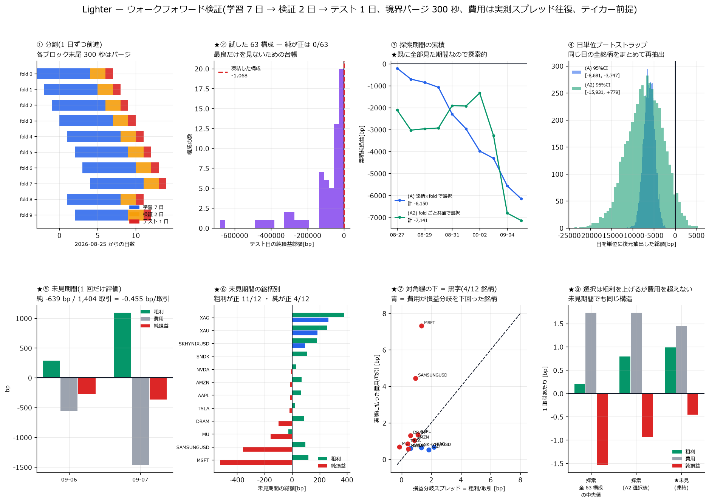

# ★ウォークフォワード検証 — 凍結して未見期間で検定する

[← Lighter の分析索引](README.md)

## 何を測ったか

[特徴量報告](lighter_features_report.md) と [回帰報告](lighter_regression_report.md) は
**私が既に全部見た期間**(2026-08-18〜09-05)の内側で書いた。順位表も相関行列も
リードラグも、その期間を見た上で選んでいる。したがって**その期間のどんな検証も
探索的にしかならない**。

本報告は、オペレータ指示(2026-09-08)の 5 要求に沿って、

1. 学習 7 日 → 検証 2 日 → テスト 1 日 を**日単位で前進**させ、
2. 閾値・モデル・数量・決済方法を**凍結**し、
3. 分割境界をまたぐ保有・ラベルを**最大決済期間まで含めて除外**し、
4. **日を単位に**(同じ日の全銘柄をまとめて)ブートストラップし、
5. **試した戦略数を記録**した上で、**一度も見ていない期間で最終検定**する

という手続きを実施したもの。未見期間は **2026-09-06・09-07 の完全 2 日**である
(記録は継続中で、この 2 日は本報告の作成時点まで一度も分析に使っていない)。

---

## 1. 分割の設計と時間契約(要求 1・3)



図①が分割。学習 7 日 → 検証 2 日 → テスト 1 日を 1 日ずつ前進させ、
探索期間で **10 個のテスト日**(追加 8 銘柄は 15 日しか無いので 6 日)を得る。

**時間契約**

- 特徴量は t(その秒の終わり)までの情報のみ。窓は (t−W, t] の閉じた過去、
  z 値・分位は拡大窓。`shift(-k)` は目的変数だけ
- **標準化・リッジ係数・信号の向き(符号)・閾値はすべて学習期間だけで推定**する。
  向きを訓練内で決めるのは重要で、これを全期間の相関で決めると符号のルックアヘッドになる
- 検証期間は構成の選択にのみ使い、**テスト期間は一度も見ない**

**境界のパージ(要求 3)**

最大決済期間 **H_MAX = 300 秒**を基準に、各ブロックの**末尾 300 秒に入るエントリを
落とす**。保有が次のブロックへ食い込む標本は、学習・検証・テストのどこからも使わない。
決済が 10 秒や 60 秒の構成でも 300 秒でパージしているので**過剰に安全側**である。

特徴量のルックバック(最大 300 秒)はブロック頭で前ブロックのデータを見るが、
これは過去を見るだけで**ラベルの漏洩ではない**。

## 2. 戦略の定義(4 つの自由度)と費用

| 自由度 | 値 |
|---|---|
| **モデル** | 単一特徴量 6 種(`ofi_1s` `ofi_z` `obi_W5` `gap_12_asym` `trd_sv_5s` `mic_delta1_bp`)+ リッジ(222 特徴量)= **7 種** |
| **閾値** | 学習期間の \|signal\| の分位 q ∈ {0.90, 0.95, 0.99} = **3 種** |
| **数量** | 固定 1 単位(全取引で同じ。単価と総額の両方が読める) |
| **決済** | 時間決済 h ∈ {10s, 60s, 300s} = **3 種**。1 銘柄 1 ポジション |

**構成は 7 × 3 × 3 = 63 通り。**

損益[bp] = sign × (mid(t+h) − mid(t))/mid(t) × 10⁴ − (spread(t) + spread(t+h))/2

**費用について**

- テイカーで入って出るので、入口で半スプレッド・出口で半スプレッドを払う。
  往復コストは**入口と出口の実測スプレッドの平均**(片方だけで代用していない)
- **Lighter の手数料率はデータから確定できない。** `trade` の `maker_fee` は
  $1,431 の約定でも $15,404 の約定でも同じ 28 という定数で、
  **手数料額でもレートでもなくコード**である(28/32/36 の 3 種)。
  よって手数料 0 で計算した。**手数料が正ならこの評価より悪くなる**
- 1 単位が最良気配で必ず約定すると仮定(板の食い込み・数量制限・待ち行列なし)

★**この 3 点はすべて楽観側に倒れている。**それでも下の結果になる。

**「何もしない」対照**は損益 0。判定は「総額 > 0 か」であって
「上位分位 − 下位分位 > 0 か」ではない。

## 3. 探索期間の結果(要求 4・5)— 全 63 構成が負

**★以下はすべて探索的**(私が既に見た 08-18〜09-05 の内側)。

台帳 19,638 行 / 12 銘柄 / テスト 10 日 / 63 構成。

| 判定 | 数 |
|---|---:|
| 純損益の総額が正の構成 | **0 / 63** |
| ★費用を引く前(粗利)が正の構成 | **62 / 63** |
| 日ブートストラップで 97.5% 以上が正 | 0 / 63 |

| 量(63 構成の中央値) | 値 |
|---|---:|
| 粗利 / 取引 | **+0.2019 bp** |
| 費用 / 取引 | **+1.7268 bp** |
| **損益分岐スプレッド**(往復で払える上限) | **0.2019 bp** |
| 費用は粗利の | **約 9 倍** |

図②が 63 構成の分布(要求 5 の台帳そのもの)。最良だけを見ないために全件を出している。

### 2 つの推定量(要求 4 の日単位ブートストラップつき)

| 推定量 | 純/取引 | 粗利/取引 | 費用/取引 | 正の日 | 日ブートストラップ P(総額>0) |
|---|---:|---:|---:|---:|---:|
| (A) 銘柄 × fold ごとに検証で選択 | −0.454 | +0.846 | 1.300 | 0/10 | **0.000** |
| (A2) fold ごとに全銘柄共通で選択 | −0.940 | +0.793 | 1.733 | 4/10 | 0.042 |

ブートストラップは**同じ日の全銘柄をまとめて**復元抽出しており、
市場共通ショックによる銘柄間の依存を壊していない(図④)。

★**選択には意味がある。**全 63 構成の粗利中央値 +0.202 に対し、
検証で選ぶと粗利は **+0.79〜0.85 bp/取引** に上がる。信号は効いている。
それでも費用を超えられない。

### ★ρ の順位と損益の順位は一致しない

[特徴量報告](lighter_features_report.md) で ρ 1 位だった `ofi_1s` の 9 構成:

| q | h | 取引数 | 純損益[bp] | 粗利/取引 | 費用/取引 |
|---:|---:|---:|---:|---:|---:|
| 0.90 | 10s | 311,793 | −434,414 | +0.162 | 1.555 |
| 0.95 | 300s | 20,289 | −26,197 | +0.252 | 1.543 |
| 0.99 | 300s | 12,613 | **−19,648** | +0.141 | 1.699 |

**同じ信号でも構成次第で純損益が 22 倍違う。**効いているのは信号の良し悪しより
「**どれだけ取引しないか**」である。実際、決済を長くし閾値を厳しくすると
取引数が減り、1 取引あたりの粗利が上がる:

| 決済 h | 粗利/取引 中央値 | 取引数 中央値 |
|---:|---:|---:|
| 10s | +0.163 | 119,334 |
| 60s | +0.202 | 44,321 |
| 300s | **+0.252** | 14,663 |

## 4. 凍結(要求 2)

**検証期間の成績だけで**構成を選び、`config/lighter_frozen.json` に固定した。
テスト期間は見ていない。

| 項目 | 凍結した値 |
|---|---|
| モデル | `gap_12_asym`(bid 側の隙間 − ask 側の隙間) |
| 閾値 | **規則**として凍結: 直前 7 日の \|signal\| の 99 分位で毎回引き直す |
| 向き | 直前 7 日の相関の符号(実測では全銘柄 −1) |
| 数量 | 固定 1 単位 |
| 決済 | 時間決済 300 秒 |
| 対象 | H100 を除く 12 銘柄(板の被覆 14.7% のため**結果を見る前に**除外) |

★**凍結したのは数値ではなく規則である。**閾値は実運用の再較正と同じく
テスト日の直前 7 日で引き直す(較正窓はテスト日より厳密に前)。

★★**これは「最も利益が大きい」構成ではなく「最も損失が小さい」構成である。**
検証期間でも 63 構成すべてが負だったので、選択は損失の小ささで行われた。
利益を期待して凍結したのではない。

## 5. ★未見期間の確定的検定(1 回のみ)

**2026-09-06・09-07。この 2 日は本検定まで一度も分析に使っていない。
評価は 1 回だけで、結果が悪くても構成を変えて再試行しない。**

### 主判定 — 「何もしない」に負ける

| 量 | 値 |
|---|---:|
| 取引 | 1,404 |
| **純損益** | **−638.6 bp = −0.4548 bp/取引** |
| 粗利 | +1,382.8 bp = +0.9849 bp/取引 |
| 費用 | 2,021.3 bp = 1.4397 bp/取引 |
| **「何もしない」(=0)との比較** | **負け** |

### 副次 — 信号そのものは未見期間でも生きている

| 検定(銘柄単位、n=12) | 結果 | p |
|---|---:|---:|
| **粗利 > 0 の銘柄** | **11 / 12** | **0.0063** |
| 純損益 > 0 の銘柄 | 4 / 12 | 0.388 |

日ごとに見ると 09-06 が 9/12(p=0.146)、09-07 が 11/12(p=0.0063)で、
**向きは 2 日とも一致**している。

★**過学習の兆候が無い。**探索期間の (A2) の粗利 +0.793 bp/取引 に対し、
未見期間の粗利は **+0.985 bp/取引** と**むしろ大きい**(図⑧)。
選択が探索期間に過適合していたなら未見期間で粗利が落ちるはずだが、落ちていない。

### 結論 — 信号は本物、テイカーでは成立しない

**損益分岐スプレッドは往復 0.985 bp。実際に払ったのは 1.440 bp。約 1.5 倍足りない。**

探索期間(全 63 構成の中央値)では損益分岐が 0.202 bp しかなく約 9 倍足りなかったが、
検証で選ぶと 0.985 bp まで上がる。**それでも届かない。**

## 6. 銘柄別 — 費用が損益分岐を下回る銘柄は黒字

| 銘柄 | 損益分岐(粗利/取引) | 実際の費用/取引 | 純損益[bp] | 判定 |
|---|---:|---:|---:|---|
| XAG | **+2.187** | 0.658 | **+263.0** | 黒字 |
| XAU | **+1.839** | 0.510 | **+184.6** | 黒字 |
| SKHYNIXUSD | **+1.341** | 0.628 | **+94.8** | 黒字 |
| SNDK | +0.615 | 0.591 | **+4.3** | 黒字 |
| NVDA | +0.464 | 0.558 | −6.4 | 赤字 |
| AMZN | +0.877 | 1.030 | −12.2 | 赤字 |
| AAPL | +1.108 | 1.340 | −13.5 | 赤字 |
| TSLA | +0.421 | 0.840 | −18.5 | 赤字 |
| DRAM | +0.610 | 1.293 | −98.3 | 赤字 |
| MU | **−0.135** | 0.669 | −156.8 | 赤字(粗利も負) |
| SAMSUNGUSD | +0.945 | **4.431** | −355.6 | 赤字 |
| MSFT | +1.350 | **7.306** | −524.1 | 赤字 |

図⑦が対角線の図。**対角線の下(費用 < 損益分岐)の 4 銘柄が黒字**である。
全体が負になっているのは、スプレッドの広い **MSFT(−524)と SAMSUNGUSD(−356)**
の 2 銘柄が損失の 69% を占めるため。

**取引が広いスプレッドを選んで起きているわけではない。**
取引時の費用と、その 2 日の無条件スプレッド中央値の比は**中央 0.98**で、
ほぼ平均的な場面で取引している。例外は SAMSUNGUSD だけで、比 **3.71**
(広いときに集中して建てている)。MSFT は比 0.64 だが、この 2 日の無条件中央値が
**11.44 bp** まで悪化していた(探索期間は 4.52 bp)。

## 7. 後知恵の観察と、次に検定すべき仮説

★**以下は未見期間を見た後の観察であり、結論ではない。**

「スプレッドが狭い銘柄・時点でのみ取引する」というフィルタを入れれば黒字になりうる。
スプレッドは**発注時点で観測できる量**なので、これは時間契約に反しない
実装可能な規則である。だが**未見期間を見てから思いついた**以上、
この期間で検定してはならない(それは探索であって検定ではない)。

次の手続き:

1. 「エントリ時のスプレッド < X bp」を加えた構成を **v2 として凍結**する
2. **2026-09-08 以降**の、まだ一度も見ていない期間で 1 回だけ検定する

記録は継続しているので、期間は毎日伸びる。凍結ファイルを残してあるのは
そのためである。

## 8. 自己精査

1. **費用を全部引いたか。** スプレッドは往復で引いた(入口と出口の平均)。
   **手数料は引いていない** — データから料率が確定できないため。
   引けば結果は悪化する方向にしか動かない
2. **分母を明示した。** 探索期間: 12 銘柄 × テスト 10 日 × 63 構成 = 台帳 19,638 行。
   未見期間: 12 銘柄 × 2 日 = 1,404 取引
3. **「有意でない」を「効果がない」と書いていない。** 純損益の銘柄符号検定
   p=0.388 は「純損益が正だとは言えない」であって「必ず負」ではない
4. **多重比較の規模を書いた。** 63 構成、Bonferroni の両側 5% は z=3.35。
   ★ただし**63 は実効的な探索空間より小さい**。信号 6 種は探索期間の ρ 順位表
   (222 特徴量)を見た後で選んでいるので、上限は 222 × 3 × 3 = 1,998 に近い。
   **この選択過程は Bonferroni では補正できない**。だから最終判定を
   未見期間に置いた(要求 5 の「未見期間での最終検定」)
5. **中央値だけで報告していない。** 銘柄別の全件、日別、粗利と費用の分解、
   ブートストラップの区間を出した
6. **帰無対照・「何もしない」対照**: 損益 0 との比較を主判定にした
7. **★各時点で計算できるか。** 閾値・向き・リッジ係数はすべて直前 7 日から作り、
   スプレッドは発注時に観測できる。決済は時間だけで、将来の情報を使わない
8. **他の報告との食い違い。**[特徴量報告](lighter_features_report.md) は
   `ofi_1s` を ρ 1 位としたが、損益では `gap_12_asym` が選ばれた。
   **矛盾ではない** — ρ は取引回数と費用を含まない指標で、費用を入れると
   「どれだけ取引しないか」が支配的になる(§3)。
   `gap_12_asym` の符号(訓練内で −1)は特徴量報告の ρ = −0.0349(0/13 銘柄で負)
   と一致している

### この検証が答えていないこと

- **メイカー戦略を否定していない。** テイカー往復を仮定しており、
  指値で置いて待つ戦略は待ち行列と約定確率の模擬が要る(別作業)
- **未見期間は 2 日しかない。** 銘柄横断の p=0.0063 は 12 銘柄の符号検定だが、
  **日をまたぐ独立性は 2 点でしか担保されない**。同じ 2 日の市場環境に
  依存している可能性を排除できない。日単位ブートストラップは 2 点の再抽出なので
  検出力が無く、本報告では区間を出していない
- **建玉サイズの効果を測っていない。** 1 単位固定で、板の食い込みは無視している

## 再現手順

```bash
uv run python scripts/lighter_wfparse.py       # 08-18〜09-07 を wf/ へパース(既存を壊さない)
uv run python scripts/lighter_wf_runall.py     # 12 銘柄を直列でウォークフォワード
uv run python scripts/lighter_wf_report.py     # 集計・日ブートストラップ・凍結
uv run python scripts/lighter_oos_runall.py    # 凍結構成を未見期間で 1 回だけ評価
uv run python scripts/lighter_wf_plot.py       # 図
```

★解析は**銘柄ごとに直列**で。1 銘柄が特徴量行列に 5〜7GB 使うため、
RAM 15.3GB のマシンでは並列にすると落ちる(実際に落ちた)。
