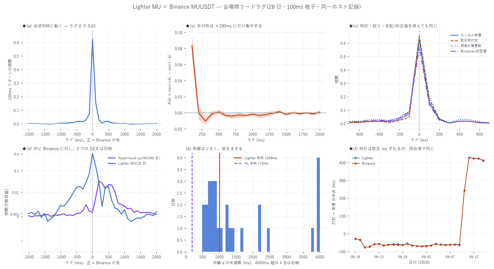

# 会場間リードラグ — Lighter `MU` と Binance `MUUSDT`

[← Lighter の分析索引](README.md)

同じ原資産(Micron)を扱う **Lighter** と **Binance** を、同じ時計の上に並べた。

> ★**この報告は既存の [12 ペアの徹底測定](lighter_leadlag_report.md) の
> 続きである。**あちらは Δ=1 秒(±30 秒)と Δ=0.25 秒(±3 秒)で 12 銘柄を
> 測り、**伝播の大半は 250ms 以内に終わる**ところまで示していた。
> ここでは **Δ=0.1 秒**へ落として**その 250ms の中**を見る。
> 併せて `xyz:MU`(Hyperliquid)の
> [会場間リードラグ](../hyperliquid/MU/mu_xv_leadlag_report.md)と同じ物差しで
> 並べる。**先にあちらを読むこと。**

| | |
|---|---|
| 標本 | 2026-08-18 〜 09-14 の **28 日** |
| Lighter | `MU`(market_id 164)の `ws/ticker` の最良気配。82〜150 万件/日 |
| Binance | `MUUSDT` の `bookTicker`。610〜1,320 万件/日 |
| 格子 | 100ms。ラグ ±2 秒 |
| 絞り | 両側の鮮度 2 秒以内(使えるセル 79.1%) |



---

## 1. 結論

**Lighter と Binance はほぼ同時に動く。**先行はあるが **±100ms の中に収まる**。

| | 値 |
|---|---|
| **ラグ 0 の相関** | **0.6266** |
| ラグ +100ms(Binance が先) | 0.1557 |
| ラグ −100ms(Lighter が先) | 0.0721 |
| 非対称 A(100ms) | **+0.0836** [+0.0702, +0.0971] |
| 非対称 A(200ms) | **−0.0001** [−0.0081, +0.0085] |
| 95% 区間が 0 を跨がないラグ | **1/20 本**(100ms だけ) |
| 乖離 \|d\| | 中央 **0.35bp** / 90% 点 0.94bp |
| 基差(Binance − Lighter) | **+1.29bp** |
| 乖離の半減期 | 中央 **1009ms** |
| 片道伝送(時計補正後・両会場) | Lighter **47.9ms** / Binance **48.4ms** |

**200ms 以遠には何も無い。**300ms では A = −0.0102 でわずかに Lighter 側が先である
(区間は 0 を跨がないが、大きさは 100ms の 8 分の 1)。

---

## 2. ★この解析は Hyperliquid 版より強い — 時計が 1 つで済む

`xyz:MU` × Binance では**両会場のクロック差が観測できず**、ピーク位置の点推定を
主張できなかった。ここではその制約が無い。

  - Lighter の `recv_ns` … このホストが受信した時刻
  - Binance の `local_ns` … このホストが受信した時刻

**両方とも同じマシンの同じ時計**である(記録プロセスは PID 21808 / 42844 で
2026-09-13 13:17:02 に同時起動し、同じディスクへ書いている)。
したがってこの時計の上で測った先行は、**そのホストに居るトレーダーが実際に
見る先行**であり、補正を要しない。

### 2-1. ★この PC の時計は実際に壊れている。ただし結論には効かない

既存報告は 08-18〜09-05 で **Lighter −62.3ms / Binance −62.5ms**(受信 − サーバ)と
出し、「このマシンの時計が真の UTC から約 62ms 遅れている」と書いていた。
窓を **09-14 まで**延ばすと、その値が**日をまたいで 490ms 動く**:

| 日 | 打刻 → 受信(生) | 記録側 probe の offset | **補正後 = 真の伝送** |
|---|---:|---:|---:|
| 08-18 | −29.2 ms | +76.9 | **48.4 ms** |
| 09-08 | −60.9 ms | +110.1 | **48.5 ms** |
| **09-10** | **+241.4 ms** | −192.5 | **48.8 ms** |
| 09-14 | +411.9 ms | −361.6 | **50.9 ms** |
| 28 日 | **−77 〜 +429**(振れ **490ms**) | +109 → −372 | **中央 48.4 / sd 1.0 ms** |

**生の値は 490ms 振れるが、補正すると 4.6ms しか動かない。**
振れは全部この PC の時計であって、伝送ではなかった。

#### 原因

| 証拠 | 値 |
|---|---|
| `w32tm /stripchart`(独立測定) | **−0.394 〜 −0.401 秒**(= 時計が 400ms 進んでいる) |
| 記録側 probe の直近中央 | −372 ms(同じ向き・同じ大きさ) |
| `LastBootUpTime` | **2026-09-09 15:36:31** |
| 09-09 の offset の振れ | **1,649 ms**(その日の probe は 77 回しかない) |
| w32tm のポーリング間隔 | **32,768 秒 = 9.1 時間** |
| w32tm のルート分散(OS 自身の誤差申告) | **0.4047 秒** |
| 時刻同期イベント | 09-14 に「有効な時間データを受信」と出ている |

**09-09 の再起動で時計が約 480ms 飛び、w32tm が直せていない。**
同期は「成功」しているのにずれたままなのは、9.1 時間に 1 回のポーリングで
緩やかに引き込む設定だからである。OS 自身がルート分散 405ms と申告している。

#### それでも結論が動かない理由

1. **ずれは両会場に共通に効く。**Lighter も Binance も同じホストの同じ時計で
   受信しているので、**差を取れば厳密に相殺する**。日ごとの
   \|Lighter − Binance\| は中央 **1.00ms**・最大 **3.29ms**
2. **補正後の片道伝送が両会場でほぼ同じ。**
   Lighter **47.9ms**(45.7〜50.3、sd 1.2)/ Binance **48.4ms**(46.3〜50.9、sd 1.0)。
   **差は 0.5ms** で、どちらかの会場だけが遠いという偏りが無い
3. **日内のドリフトが遅すぎて効かない。**中央 **0.00 ppm**、最悪の日で −4.73 ppm
   (= 17ms/時)。100ms のセル 1 つあたりでは 10⁻⁶ ms の桁である
4. **取引所打刻で測った版が同じ答えを出す**(§2-2)。こちらはローカル時計を
   一切使わない

★**壊れているのは絶対時刻であって、相対の先行関係ではない。**
  ただし「打刻 → 受信 = −62ms」のような**絶対の遅延の数字は、補正しない限り
  引用してはいけない**。正しくは **48 ms** である。

#### 対処

記録側は既に `clock` ストリームで offset を 5 分ごとに測っているので、
**後段で引けば直る**(上の表がその実演)。OS 側を直すなら
`SpecialPollInterval` を 9.1 時間から数分へ縮める必要があるが、
**これはシステム設定の変更なので勝手には行わない。**
`offset_ms` の符号の規約は、上の突き合わせから
**(真の時刻 − ローカル時計)** と確定した(補正が伝送 48ms に収束するのはこの向きのときだけ)。

### 2-2. 時計を替えても、絞っても、気配を約定値に替えても同じ

| 版 | −100ms | ラグ 0 | +100ms | 非対称 |
|---|---:|---:|---:|---:|
| ローカル受信(本体) | 0.0721 | **0.6266** | 0.1557 | +0.0836 |
| 取引所打刻 | 0.0487 | 0.6488 | 0.1770 | +0.1284 |
| 両側がセル内で実更新 | 0.0927 | 0.6632 | 0.1952 | +0.1025 |
| Binance を**約定値**に | 0.0839 | **0.5708** | 0.1408 | +0.0569 |

どれも同じ形である。

---

## 3. ★既存報告との突き合わせ — 矛盾ではなく、時間尺度が違う

既存報告の表 1(Δ=1 秒)は MU について **Binance 先行シェア 0.26**、
つまり **Lighter 先行**と読める。本報告は 100ms で **Binance 先行**である。
**食い違って見えるので、はっきりさせておく。**

| 時間尺度 | 出どころ | MU の向き | 値 |
|---|---|---|---|
| **0〜100ms** | **本報告** | **Binance 先行** | A(100ms) = **+0.0836** [+0.0702, +0.0971] |
| 100〜200ms | 本報告 | どちらでもない | A(200ms) = −0.0001 [−0.0081, +0.0085] |
| 200〜300ms | 本報告 | わずかに Lighter | A(300ms) = −0.0102 [−0.0146, −0.0056] |
| 1 秒(偏相関) | 既存報告 | **Lighter 先行** | B→L +0.060 対 L→B +0.075 |
| 1〜10 秒(CCF の裾) | 既存報告 | **Lighter 先行** | Σρ(+) +0.034 対 Σρ(−) +0.097 |

**両立する。**既存報告の最細格子は 0.25 秒で、**その 1 セルの中**に本報告の
±100ms がまるごと入る。つまり:

- **100ms の中では Binance が先に動く**(本報告が新しく見た部分)
- **1 秒以上のスケールでは Lighter が先**(既存報告。しかも
  [立会時間外に集中](lighter_leadlag_report.md#3-層別--lighter-先行は米国立会の外で起きる)
  する — MU で OFF +0.093 対 US +0.005)

★**「どちらがリーダーか」という単一のラベルは MU には付かない。**
既存報告が SAMSUNGUSD について書いた
「単一の『リーダー』ラベルには集約できない」がそのまま MU にも当てはまり、
本報告はその境目が **100〜200ms にある**ことを足した。

★同時点の相関が既存 +0.776 に対し本報告 0.6266 なのは**格子の粗さの違い**である
(Δ=1 秒だと共動が同じセルに入るぶん高く出る)。矛盾ではない。

---

## 4. ★★Hyperliquid とは別物だった

**同じ Binance に対して測っているのに、2 つの DEX で桁が違う。**

| | Hyperliquid `xyz:MU` | Lighter `MU` |
|---|---:|---:|
| 標本 | 99 日(05-04〜08-10) | 28 日(08-18〜09-14) |
| **ラグ 0 の相関** | **0.0017** | **0.6266** |
| 相関のピーク | ラグ **+200ms**(0.0329) | ラグ **0** |
| 非対称のピーク | +0.0281(200ms) | +0.0836(100ms) |
| 0 を跨がないラグ | **19/20 本**(100〜1900ms) | **1/20 本**(100ms のみ) |
| \|d\| 中央 | 1.60 bp | **0.35 bp** |
| 乖離の半減期 | 179 ms | 1009 ms |

**Hyperliquid の `xyz:MU` は Binance に 200ms 遅れて追随する。
Lighter の `MU` は Binance と同時に動く。**

### 4-1. これは測り方の違いではない

条件が完全に揃っていないのは事実である:

- HL では Binance の **aggTrades(約定値・取引所打刻)**を使った。
  `bookTicker` は Binance Vision に存在せず(404)、ローカル記録は
  **2026-08-18 以降**しか無いので、HL の窓(〜08-10)と**重なりがゼロ日**である
- Lighter では **bookTicker(気配・ローカル打刻)**を使えた

そこで **Lighter 側を約定値に替えた対照**を同じ 28 日で回した。
ラグ 0 の相関は **0.6266 → 0.5708(−9%)**にしか落ちない。

★**測り方で説明できるのは 9% で、370 倍の差は説明できない。**
これは市場構造の違いである。

### 4-2. 期間が違うことは残る限界

HL は 05-04〜08-10、Lighter は 08-18〜09-14 で、**重なっていない**。
市場全体の状態が変わった可能性は排除できない。
HL 側を 08-18 以降へ延ばすには Artemis S3(有料)からの取得が要る。

---

## 5. 戦略としてどう読むか

Hyperliquid では「Binance が 200ms 先行し、その乖離が 179ms で半減する」
という形だったので、**間に合えば取れる**という筋があった
(実際には 10 段すべて負で「何もしない」に負けたが)。

Lighter は形が違う:

- **先行が ±100ms に収まる。**100ms 格子では中身を分解できない。
  取りにいくなら **10ms 級の解像度**で測り直す必要がある
- **乖離が小さい。**\|d\| 中央 0.35bp は Hyperliquid の 1.60bp の 4.6 分の 1 である。
  Lighter `MU` 自身のスプレッドを実測すると**中央 1.265bp(片道 0.633bp)**なので、
  **乖離は片道の費用の 55% しかない**。参考までに Binance `MUUSDT` のスプレッドは
  **0.107bp** で、Lighter の 12 分の 1 である
- **ただし半減期は 1009ms と長い。**小さい乖離がゆっくり戻る。
  「大きくずれて素早く戻る」HL とは逆の性格である

**この 3 つを合わせると、Lighter で会場間乖離を利益源にするのは
Hyperliquid より条件が悪い。**乖離そのものが費用に対して小さすぎる。

★ただし**まだ往復損益では検定していない。**
Hyperliquid では「価格を当てる情報が約定という条件を通ると残らない」ことが
繰り返し出ているので、**ここで止めて「使えない」と断定はしない。**
Lighter 側の発注シミュレータ(`lighter_maker_sim.py`)に d を門として
入れるのが次の手である。

---

## 6. 途中で踏んだ問題

1. **gzip の切断トラップ(既知・再発)。**記録プロセスが kill された gz に
   追記されると標準リーダは切断点で止まる。実測(MU の 1 日)で
   標準 537,766 行に対し耐性リーダは **572,110 行**(+6.0%)。
   メンバー単位で走査して読む実装に替えた。28 日で壊れたメンバーは 179 個
2. **自分の耐性リーダにも穴があった。**例外が出ずにデータが尽きる切断を
   検出できていなかった。`d.eof` に達したかで判定するよう直した
3. **記録プロセスが動いているので、0 バイトの parquet が混じる。**
   除かないと polars が「footer が無い」で落ちる(実際に落ちた)。
   書きかけの 1 本で 1 日を落とさないよう、ファイル単位で握り潰す
4. **キャッシュの書き込みを原子的にしていなかった。**途中で落ちた 0 バイトを
   次回読んで落ちる。tmp へ書いて rename に替えた
5. **★「打刻 → 受信 = −62ms」をそのまま書きかけた。**受信が送信より前になる
   のは物理的にあり得ないので、その時点で時計を疑うべきだった。
   記録側の `clock` probe で補正すると **48ms** に収束する(§2-1)
6. **★既存報告を先に読まずに着手した。**`lighter_leadlag_report.md` が
   同じ対象を 12 ペアで既に測っており、時計の診断も済んでいた。
   結果は矛盾しなかった(§3)が、**やる前に索引を読めば重複を避けられた。**
   時計の節(§2-1)は既存の診断を引く形に書き直してある

---

## 7. 限界

1. **28 日しかない。**Hyperliquid の 99 日に対して短い
2. **期間が重ならない**(§4-2)
3. **100ms 格子では ±100ms の中を分解できない。**Lighter の先行はそこに
   収まっているので、**この解析では「100ms 未満」としか言えない**
4. **`ws/ticker` は最良気配のみ。**板の厚みは使っていない
5. **MU のみ。**Lighter は DRAM / SNDK / SKHYNIX / SAMSUNG など 21 銘柄を
   記録しており、Binance 側にも対応する perp がある(`markets.json`)。
   同じ検定を横に広げられる

---

## 8. 再現手順

```bash
uv run python scripts/xv_lighter.py --sym MU --clock local
uv run python scripts/xv_lighter.py --sym MU --clock local --strict
uv run python scripts/xv_lighter.py --sym MU --clock exch
uv run python scripts/xv_lighter.py --sym MU --clock local --bsrc trade
uv run python scripts/xv_lighter_report.py --sym MU
```

入力は `E:/Lighter　データ/data/raw/ws/ticker/MU/` と
`E:/Binance-perp-data/data/raw/dt=*/symbol=MUUSDT/stream={bookTicker,trade}/`。
解析した断面は `data/cache/` に貯める(版管理外)。
