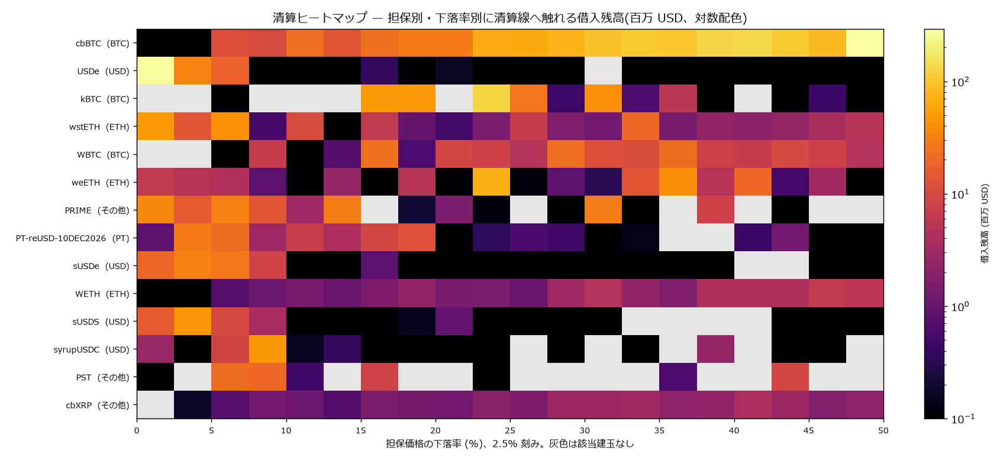
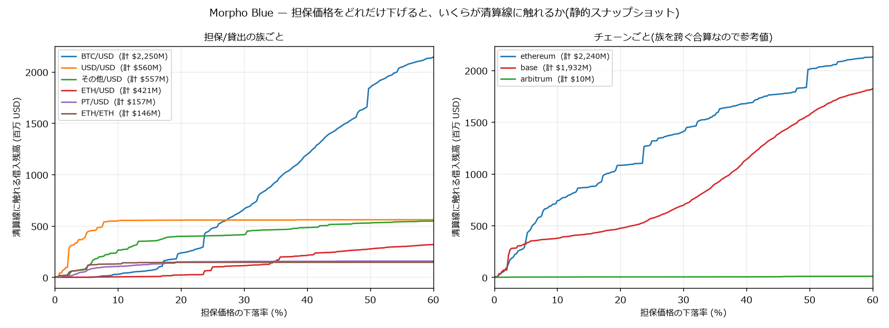

# Morpho 分析索引

[← ホーム](../../README.md)

<p>
  <a href="https://morpho.org/"></a>
</p>

| 項目 | 内容 |
|---|---|
| プロトコル | [Morpho](https://morpho.org/) Blue。担保 × 借入 × オラクル × LLTV ごとの独立市場 |
| 対象 | Ethereum / Base / Arbitrum One |
| データの出所 | 公式 GraphQL API(**キー不要**)+ オンチェーン照合 |
| 規模 | 金利履歴 **249 市場 × 81,418 行**(2024-01 〜)、建玉 **78,523 件**(借入 $4.18B / 担保 $7.57B) |
| 状態 | 金利構造の分析と清算ヒートマップまで完了 |
| 作業場所 | `C:\Users\ii562\defi-rates` |

---

## この対象を他と分けて扱う理由

Aave のような単一プールではなく、**担保資産 × 借入資産 × オラクル × LLTV の
組み合わせごとに独立した市場**になっている。結果として

- **「USDC の borrow APY」という単一の値が存在しない。** Ethereum の USDC 建て
  だけで 120 市場ある
- 隔離市場なので**建玉ごとに清算価格が一意に決まる**。Aave と違って解く必要がない
- 金利が**利用率だけでは決まらない**(後述)

---

## 1. 清算ヒートマップ

隔離市場という性質のおかげで、清算距離が API から直接取れる
(`priceVariationToLiquidationPrice`)。78,523 建玉を全部引いて積み上げた。





### 下落率ごとの累積(百万 USD)

| 担保/貸出の族 | 建玉合計 | −2.5% | −5% | −10% | −20% | −30% | −50% |
|---|---|---|---|---|---|---|---|
| BTC/USD | 2,250 | 0 | 0 | 29 | 236 | 663 | 1,847 |
| **USD/USD** | 560 | **306** | **426** | **550** | 556 | 557 | 559 |
| その他/USD | 557 | 49 | 94 | 265 | 398 | 414 | 528 |
| ETH/USD | 421 | 0 | 0 | 4 | 22 | 113 | 276 |
| PT/USD | 157 | 16 | 60 | 105 | 150 | 154 | 157 |
| ETH/ETH | 146 | 57 | 77 | 130 | 145 | 145 | 145 |

**金額の大きさと脆さは一致しない。** BTC/USD が $2,250M と最大だが −10% で効くのは
$29M にすぎず、本格的に効くのは −25% 以降。対して **ステーブル担保でステーブルを
借りる USD/USD は $560M のうち $306M が 2.5% の相対変動で清算線に触れる**。
LLTV 91.5% のループなのでデペッグ耐性がほぼない。

### 5% 以内に清算線がある建玉

**1,651 件 / 借入 $672.1M(全体の 16.07%)**。上位は Base の USDe/USDC に集中し、
単独で $108.9M(HF 1.0222、必要下落率 2.17%)の建玉がある。

### ★ この図が言っていないこと

1. **静的スナップショットである。** 実際には価格が動く途中で返済・担保追加・
   部分清算が起きる。上限でも期待値でもない。
2. **「価格」は担保/貸出資産のレート**であって USD 価格ではない。cbBTC/USDC なら
   実質 BTC の USD 価格だが、**wstETH/WETH なら stETH-ETH 比**である。
   ETH/ETH の $146M が −10% でほぼ全部消えるのは、ETH が 10% 下がる話ではなく
   stETH が ETH に対して 10% ディスカウントする話である。族の組を跨いで
   同じ軸で読んではいけない。
3. **金額は「清算線に触れる建玉の借入残高」**で、実際に売られる担保額ではない。
4. PT トークン担保($157M)はオラクルが満期までの割引スケジュールなので、
   「価格変化率」が市場価格の変化ではない。別の族にしてある。
5. 距離が出ない 1,553 件を除外したが、**その借入残高の合計は $0**(担保のみ・塵)。
   取りこぼしはない。

---

## 2. 金利は利用率だけでは決まらない


Aave の IRM は利用率の決定的な関数だが、Morpho の **AdaptiveCurve IRM は目標
利用率からの乖離の履歴で水準そのものが漂う**。同じ利用率でも過去の経路で金利が違う。

市場ごとに `ln r_b ~ 1 + U + max(U−0.9, 0)` を当てたときの説明力は、Aave が実質
R² = 1 になるのに対し Morpho は散る。**同じ「利用率と金利の関係」でも IRM の設計で
決定性がまるで違う。**

---

## 3. 恒等式 `r_s = r_b · U · (1 − fee)` の独立検証

Aave 側では利用率を 2 本のレートから復元しているので、この恒等式を検証しても
**循環**になる。Morpho は supplyApy / borrowApy / utilization が API から別々に
来るので、こちらが本物の検証になる。

APY は複利後なので `ln(1+APY_s) / ln(1+APY_b) = U(1−fee)` の形で比べる:

```
n = 54,293
OLS obs ~ 1 + pred:  切片 −0.00001 (SE 0.00000)
                     傾き  1.00000 (SE 0.00000)   R² 1.000000
```

**傾き 1・切片 0。恒等式は成立している。**

---

## 4. 現在の水準


残高加重平均(2026-09):

| chain | 貸出資産 | 市場数 | borrow 残高 | borrow APY | supply APY | util |
|---|---|---|---|---|---|---|
| base | USDC | 31 | $1,905M | 4.71% | 4.23% | 90.0% |
| ethereum | USDC | 120 | $856M | 5.71% | 5.08% | 89.4% |
| ethereum | USDT | 36 | $300M | 3.42% | 2.86% | 83.9% |
| ethereum | WETH | 19 | $133M | 1.94% | 1.71% | 88.3% |
| base | WETH | 16 | $17.7M | 1.75% | 1.55% | 88.5% |
| arbitrum | USDC | 11 | $6.6M | 5.15% | 4.61% | 89.8% |
| arbitrum | USDT0 | 10 | $3.3M | 5.12% | 4.66% | 91.2% |

**Base の USDC が $1,905M で Ethereum($856M)の 2.2 倍**ある。

Aave との borrow APY スプレッド(Morpho 加重平均 − Aave、重なる 366 日):

| chain | group | 中央値 | Morpho が高い日 |
|---|---|---|---|
| base | USDC | +0.39pp | 77.3% |
| ethereum | USDC | +0.26pp | 64.2% |
| arbitrum | USDC | +0.34pp | 64.7% |
| ethereum | USDT | −0.64pp | 23.0% |
| base | WETH | −0.24pp | 27.1% |
| ethereum | WETH | −0.17pp | 23.8% |

**この数字は「同じリスクの裁定余地」ではない。** Morpho 側は担保も LLTV も
オラクルも違う数十本を借入残高で束ねた合成量である。

---

## 5. ★ API の罠

### 5-1. `first` を必ず明示する

complexity は**データ量ではなくクエリの形**から静的に決まる。省略時の既定 100 が
全系列に掛かり、上限 1,000,000 を超えて `403 FORBIDDEN`。**窓幅を狭めても
complexity は 1 バイトも変わらない。** 3 系列 × `first:30` で約 903,000 が実用上限。

### 5-2. `listed:true` で絞る

フィールド名は `whitelisted` ではなく `listed`。外すと `orderBy:SupplyAssetsUsd` の
上位がゴミになる。実測で PAXG/USDC が supply **$7,718M**・APY **297,995%**・
util 100% で 1 位に出た(Morpho Blue 全体の TVL が $8.4B なので値自体があり得ない)。

### 5-3. 時系列は新しい順に返る

昇順を仮定すると符号が反転する。

### 5-4. `marketId` はチェーンを跨いで一致しうる

同一パラメータなら同じ uniqueKey になる。`(chain_id, market_id)` の組で引くこと。

### 5-5. `skip` は 10,000 が上限

建玉を全部取るには使えない。`borrowShares` を鍵にしたキーセット方式
(降順に並べ、毎回「前ページの最小値以下」を次の窓にする)で回し、
最後に `(chain, market, user)` で重複を落とす。

### 5-6. `listed:true` でも塵市場は残る

3 チェーン 249 市場のうち **78 市場(31%)は supply が $10,000 未満**。満期切れの
PT 担保などが利用率 100% に張りついたまま AdaptiveCurve IRM が暴走し、
**supply $9.28 の市場が borrow APY 91,497%** を出している。落とさず `is_dust` で
印を付けてあるが、**単純平均・最大値・分位を取るなら必ず除くこと。**

### 5-7. シンボルで資産を選んではいけない

`assets` には同じシンボルを名乗る別トークンが並んでいる。実測:

- **Base だけで 7 個が "USDC"**(うち 2 個は 18 decimals)
- **Base に `symbol="USDT"` / `name()="Tether USD"` が 2 個**(totalSupply 25.8M と 1.0M)
- Ethereum にも "USDC" が 5 個、"USDT" が 2 個

全てアドレス固定にすること。Aave の `getAllReservesTokens()` に実在することと、
トークンの `name()` / `symbol()` / `totalSupply()` をオンチェーンで確認した。

### 5-8. 過去ほど市場が薄い

1 年前にデータがあるのは 19/176 市場で、現在の借入残高ベースで 56.5% しか
被覆しない。加重平均の系列には被覆率を併記すること。

---

## レポート

| レポート | 内容 |
|---|---|
| 本ページ | 清算ヒートマップ、金利構造、API の罠 |

Vault(MetaMorpho)の資本配分は未着手。`vaults` ルートにある。
