# 時間帯ごとの注文年齢

メモリ半導体まわりの HIP-3 perp 8 銘柄について、**板に置かれた指値注文が消えるまでの
時間**(注文年齢)を 5 つの時間帯ごとに分布にした。

- 集計: `scripts/build_order_age.py`(→ `data/order_age_stats_<coin>.csv` /
  `data/order_age_hist_<coin>.csv`)
- 日ごとの頑健性: `scripts/build_order_age_daily.py`(→ `data/order_age_daily_<coin>.csv`)
- 作図: `scripts/plot_order_age.py`(→ `charts/<coin>_order_age_dist.png`,
  `charts/<coin>_order_age_blocks.png`, `charts/order_age_by_coin.png`)

---

## 1. 何を測ったか

L2 の `lifecycle` 表の **`lifetime_ns` = `ts_close − ts_open`**。1 注文 1 行で、
板に載った瞬間から終端イベント(約定完了・取消)までの経過時間そのものである。
約定記録から推定した代理変数ではない。

各注文は **発注時刻 `ts_open` が入る時間帯**に割り当てた。したがってこの表が答えるのは

> その時間帯に**置かれた**注文は、どれだけ生きたか

であって、「その時間帯に板に**載っていた**注文の滞在時間」ではない。後者は別の量で、
同じデータから作れるが本稿では扱っていない。

### 除外したもの

| 除外 | 理由 |
|---|---|
| `is_rejected` | 板に載らずに拒否された。年齢の概念がない |
| `is_orphan` | `open` を観測していないので `ts_open` が無い |
| `is_censored` | 標本期間の終端でまだ生きている。年齢は下限値でしかない |
| `tif` ∈ {Ioc, FrontendMarket, LiquidationMarket} | 板に滞留しない種別。年齢は定義上ほぼ 0 |

残るのは `tif` ∈ {Alo, Gtc} の板に置かれた指値注文で、**8 銘柄あわせて 6.86 億本**。
除外した各群の件数は stats CSV の `n_rejected` / `n_orphan` / `n_censored` /
`n_nonresting` / `n_other_tif` にある。

### 時間帯

「開場」「閉場」はニューヨーク証券取引所の 9:30 / 16:00。標本期間 2026-05-04〜08-10 は
全日が米国東部夏時間(EDT = UTC−4)なので 13:30 / 20:00 UTC にあたる。

| 呼び名 | UTC | 米国東部時間 |
|---|---|---|
| 開場前 1 時間 | 12:30–13:30 | 8:30–9:30 |
| 開場後 1 時間 | 13:30–14:30 | 9:30–10:30 |
| 昼 12 時から 1 時間 | 16:00–17:00 | 12:00–13:00 |
| 閉場前 1 時間 | 19:00–20:00 | 15:00–16:00 |
| 夜 12 時から 1 時間 | 04:00–05:00 | 0:00–1:00 |

**「昼 12 時」「夜 12 時」は米国東部時間として読んだ。** UTC の 12 時と読むと
「昼 12 時の 1 時間」(12:00–13:00 UTC)が「開場前 1 時間」(12:30–13:30 UTC)と
30 分重なり、5 つの窓が独立しない。東部時間で読むと 1 日を過不足なく 5 点で刻める。
UTC 読みの 2 窓も参考値として stats CSV に入れてある(`(参考)昼 12 時 UTC` 等)。

立会日は `exchange_calendars` の XNYS で判定した。標本期間に半日立会は無い。

---

## 2. 結果

数字は `data/order_age_stats_<coin>.csv` から。中央値・四分位・95% 点は
1 桁 200 分割の対数階級から内挿しており、階級由来の誤差は値の 0.6% 未満。
「1 秒未満」「寿命 0」は階級を経ずに厳密に数えている。

| 銘柄 | 立会日 | 窓 | 注文数 | 中央値 | 四分位範囲 | 95%点 | 1秒未満 | 寿命0 |
|---|---:|---|---:|---:|---|---:|---:|---:|
| xyz:MU | 67 | 開場前 1 時間 | 22,078,762 | **569ms** | 201ms–2.33s | 20.33s | 60.9% | 10.3% |
|  |  | 開場後 1 時間 | 58,594,007 | **384ms** | 116ms–1.08s | 7.83s | 73.5% | 15.3% |
|  |  | 昼 12 時から 1 時間 | 30,574,316 | **493ms** | 195ms–1.89s | 15.42s | 64.1% | 11.3% |
|  |  | 閉場前 1 時間 | 30,949,650 | **474ms** | 184ms–1.79s | 15.03s | 65.0% | 11.6% |
|  |  | 夜 12 時から 1 時間 | 14,176,849 | **706ms** | 214ms–3.05s | 28.05s | 56.4% | 8.7% |
| xyz:SNDK | 68 | 開場前 1 時間 | 21,100,094 | **598ms** | 200ms–2.49s | 21.40s | 60.1% | 11.0% |
|  |  | 開場後 1 時間 | 59,183,305 | **378ms** | 116ms–1.14s | 8.55s | 72.6% | 15.1% |
|  |  | 昼 12 時から 1 時間 | 29,863,795 | **522ms** | 195ms–2.05s | 17.33s | 62.9% | 11.4% |
|  |  | 閉場前 1 時間 | 30,313,743 | **494ms** | 191ms–1.99s | 16.71s | 63.5% | 11.7% |
|  |  | 夜 12 時から 1 時間 | 13,660,680 | **722ms** | 204ms–3.07s | 29.59s | 56.0% | 9.6% |
| xyz:SKHX | 68 | 開場前 1 時間 | 11,359,007 | **810ms** | 268ms–3.50s | 32.94s | 53.7% | 8.3% |
|  |  | 開場後 1 時間 | 27,283,305 | **440ms** | 136ms–1.44s | 13.64s | 68.6% | 12.1% |
|  |  | 昼 12 時から 1 時間 | 13,169,923 | **743ms** | 263ms–2.90s | 28.16s | 56.0% | 8.4% |
|  |  | 閉場前 1 時間 | 11,215,257 | **810ms** | 269ms–3.29s | 30.17s | 53.9% | 8.1% |
|  |  | 夜 12 時から 1 時間 | 20,122,946 | **678ms** | 255ms–2.09s | 17.69s | 59.7% | 8.6% |
| xyz:SMSN | 68 | 開場前 1 時間 | 4,880,774 | **1.12s** | 328ms–5.28s | 48.83s | 47.7% | 7.7% |
|  |  | 開場後 1 時間 | 12,737,784 | **538ms** | 196ms–1.96s | 18.45s | 63.2% | 10.0% |
|  |  | 昼 12 時から 1 時間 | 5,984,969 | **943ms** | 279ms–4.14s | 39.76s | 50.8% | 7.6% |
|  |  | 閉場前 1 時間 | 5,279,648 | **938ms** | 272ms–4.28s | 41.31s | 51.0% | 8.0% |
|  |  | 夜 12 時から 1 時間 | 8,813,302 | **800ms** | 207ms–3.02s | 28.21s | 54.9% | 8.5% |
| xyz:KIOXIA | 32 | 開場前 1 時間 | 775,275 | **1.17s** | 334ms–5.83s | 1.0m | 46.6% | 9.5% |
|  |  | 開場後 1 時間 | 1,080,760 | **1.36s** | 390ms–6.15s | 51.00s | 44.5% | 8.2% |
|  |  | 昼 12 時から 1 時間 | 686,621 | **1.86s** | 404ms–9.34s | 1.4m | 39.9% | 8.4% |
|  |  | 閉場前 1 時間 | 630,187 | **2.02s** | 457ms–9.47s | 1.3m | 37.9% | 7.1% |
|  |  | 夜 12 時から 1 時間 | 1,460,757 | **1.06s** | 333ms–4.17s | 35.99s | 47.9% | 9.7% |
| xyz:INTC | 68 | 開場前 1 時間 | 11,162,375 | **798ms** | 260ms–4.19s | 32.27s | 53.5% | 9.3% |
|  |  | 開場後 1 時間 | 38,916,631 | **407ms** | 135ms–1.27s | 8.33s | 70.5% | 12.9% |
|  |  | 昼 12 時から 1 時間 | 18,609,763 | **566ms** | 201ms–2.36s | 19.15s | 60.4% | 10.2% |
|  |  | 閉場前 1 時間 | 18,000,012 | **552ms** | 200ms–2.33s | 19.32s | 60.8% | 10.4% |
|  |  | 夜 12 時から 1 時間 | 5,920,329 | **1.09s** | 281ms–6.96s | 58.01s | 48.4% | 7.6% |
| xyz:AMD | 68 | 開場前 1 時間 | 8,465,823 | **615ms** | 203ms–3.83s | 34.58s | 56.8% | 9.9% |
|  |  | 開場後 1 時間 | 26,560,553 | **470ms** | 141ms–1.68s | 11.08s | 65.8% | 12.3% |
|  |  | 昼 12 時から 1 時間 | 12,656,805 | **599ms** | 201ms–3.01s | 25.49s | 58.7% | 10.1% |
|  |  | 閉場前 1 時間 | 12,493,410 | **606ms** | 201ms–2.90s | 25.10s | 58.5% | 10.1% |
|  |  | 夜 12 時から 1 時間 | 4,075,942 | **675ms** | 224ms–5.78s | 1.0m | 54.9% | 8.2% |
| xyz:DRAM | 68 | 開場前 1 時間 | 12,450,588 | **669ms** | 228ms–2.84s | 27.44s | 57.8% | 8.6% |
|  |  | 開場後 1 時間 | 35,100,634 | **399ms** | 128ms–1.14s | 10.03s | 72.7% | 14.0% |
|  |  | 昼 12 時から 1 時間 | 17,928,292 | **541ms** | 202ms–2.08s | 19.10s | 62.3% | 9.1% |
|  |  | 閉場前 1 時間 | 16,869,976 | **544ms** | 203ms–2.16s | 19.77s | 61.9% | 9.3% |
|  |  | 夜 12 時から 1 時間 | 10,688,440 | **736ms** | 267ms–3.13s | 32.27s | 56.0% | 7.0% |

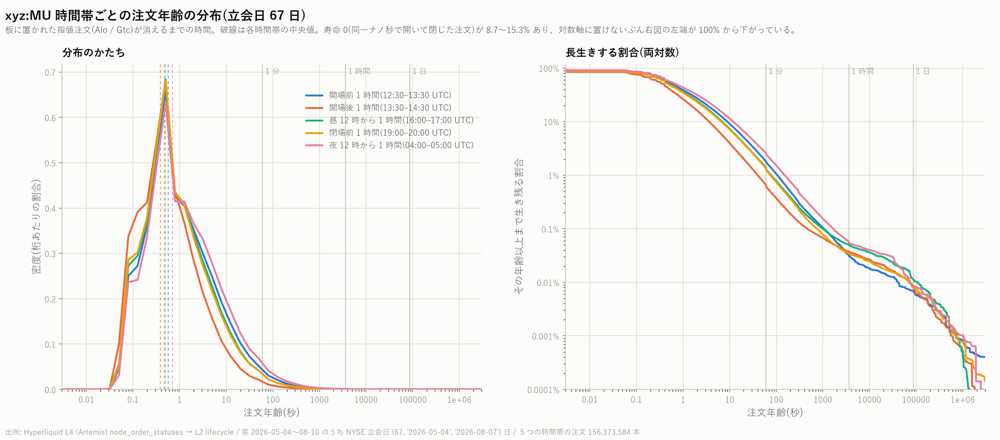

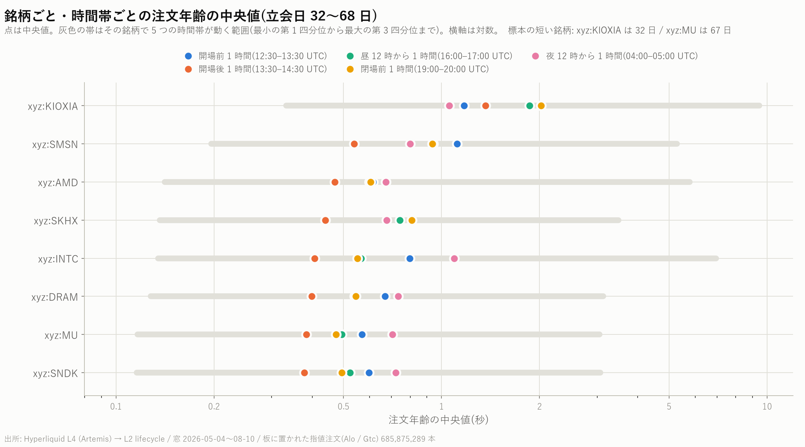

### 銘柄ごとの分布

上の 2 枚は xyz:MU のものです。残りの 7 銘柄も同じ作りで並べます。
左が密度(対数階級)、右が「その年齢以上まで生き残る割合」(両対数)。

**xyz:AMD** — AMD(米国上場)

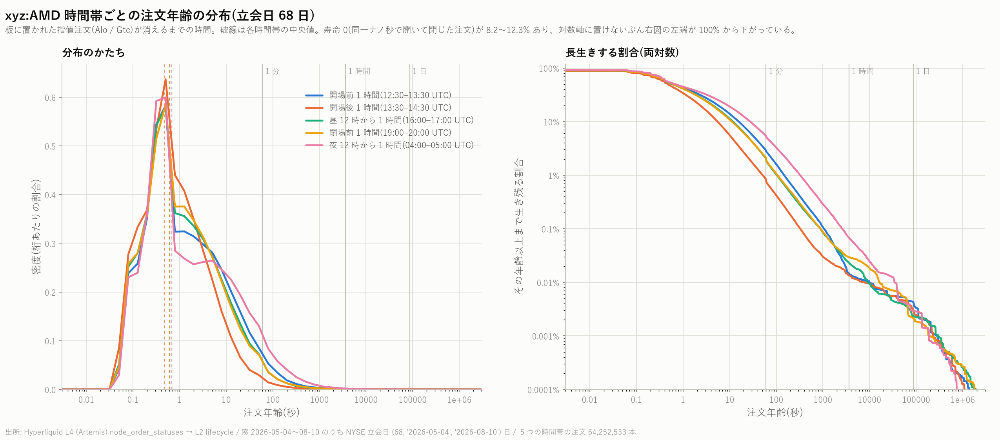

**xyz:INTC** — インテル(米国上場)

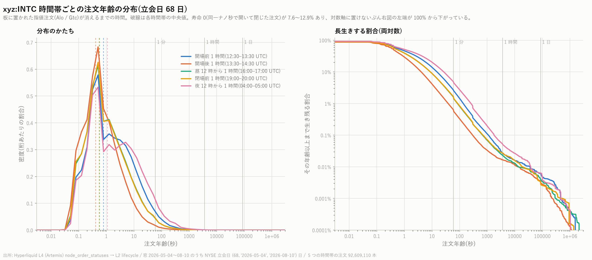

**xyz:SNDK** — サンディスク(米国上場)

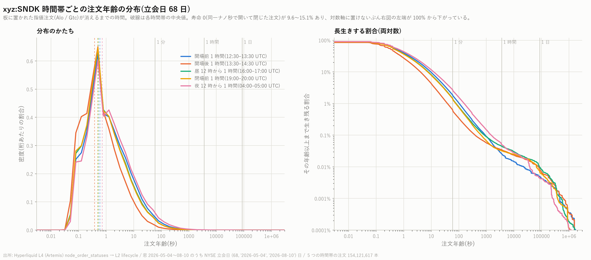

**xyz:KIOXIA** — キオクシア(東京上場)

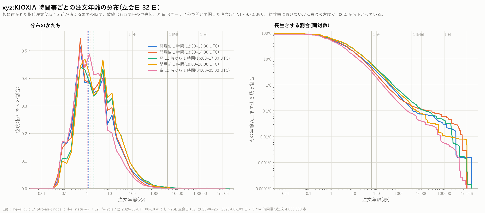

**xyz:SKHX** — SK ハイニックス(ソウル上場)

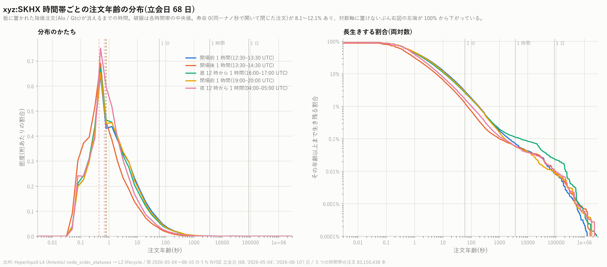

**xyz:SMSN** — サムスン電子(ソウル上場)

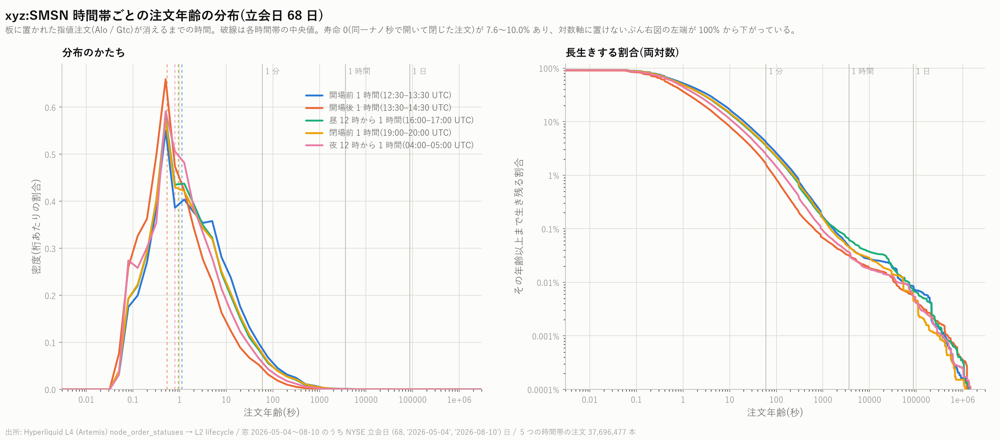

**xyz:DRAM** — DRAM 価格指数

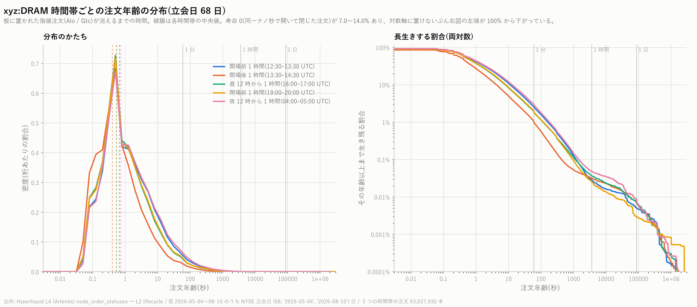

---

## 3. 読み取れること

### (1) 開場後 1 時間が最も短命で、最も本数が多い

原資産が米国時間で動く 5 銘柄では、開場後 1 時間の中央値が 5 窓中いちばん短く、
同時に**注文本数も 5 窓中いちばん多い**(他窓の 2〜4 倍)。
うち MU / SNDK / INTC / AMD はニューヨーク上場株、DRAM は DRAM 現物価格の指数で
株ではないが、板の時間帯パターンは米国株 4 つと同型である。

| | 開場後の中央値 | 最長の窓 | 比 |
|---|---:|---|---:|
| xyz:MU | 384ms | 夜 12 時 706ms | 1.84 倍 |
| xyz:SNDK | 378ms | 夜 12 時 722ms | 1.91 倍 |
| xyz:INTC | 407ms | 夜 12 時 1.09s | 2.68 倍 |
| xyz:DRAM | 399ms | 夜 12 時 736ms | 1.84 倍 |
| xyz:AMD | 470ms | 夜 12 時 675ms | 1.44 倍 |

出来高が集まる時間帯ほど注文が速く入れ替わる、という素直な絵になっている。
**寿命 0 の割合も開場後がいちばん高い**(MU で 15.3% 対 夜 8.7%)。

### (2) アジア上場銘柄は「夜 12 時」が別の顔を持つ

04:00–05:00 UTC は東部時間の深夜だが、**ソウルと東京では昼の立会中**である
(13:00–14:00 KST / JST)。実際、原市場がアジアにある 3 銘柄ではこの窓の注文本数が
米国銘柄と逆の位置に来る。

| 銘柄 | 原市場 | 夜 12 時窓の本数 | 開場前 1 時間の本数 | 比 |
|---|---|---:|---:|---:|
| xyz:SKHX | ソウル | 20,122,946 | 11,359,007 | **1.77 倍** |
| xyz:SMSN | ソウル | 8,813,302 | 4,880,774 | **1.81 倍** |
| xyz:KIOXIA | 東京 | 1,460,757 | 775,275 | **1.88 倍** |
| xyz:MU | 米国 | 14,176,849 | 22,078,762 | 0.64 倍 |
| xyz:INTC | 米国 | 5,920,329 | 11,162,375 | 0.53 倍 |
| xyz:AMD | 米国 | 4,075,942 | 8,465,823 | 0.48 倍 |

米国銘柄では夜 12 時窓が最も閑散なのに対し、アジア 3 銘柄では開場前の 1.8 倍前後の
注文が飛んでいる。**perp は 24 時間動くが、板の中身は原市場の時計に従っている。**

### (3) xyz:KIOXIA だけ順序が違う — ただし標本が短い

KIOXIA は 5 窓の中で開場後がいちばん短くなく(1.36s で短い方から 3 番目)、
最長は閉場前(2.02s)である。他の 7 銘柄と順序が違う。

**ただし KIOXIA の上場は 2026-06-25 で、立会日は 32 日しかない**(他は 67〜68 日)。
それ以前の日次区画は 0 行のまま置いてある。期間も水準も他銘柄と揃っていないので、
KIOXIA を他と同列に並べた比較はしない方がよい。

### (4) 注文年齢は 67.25 ms の刻みに乗る

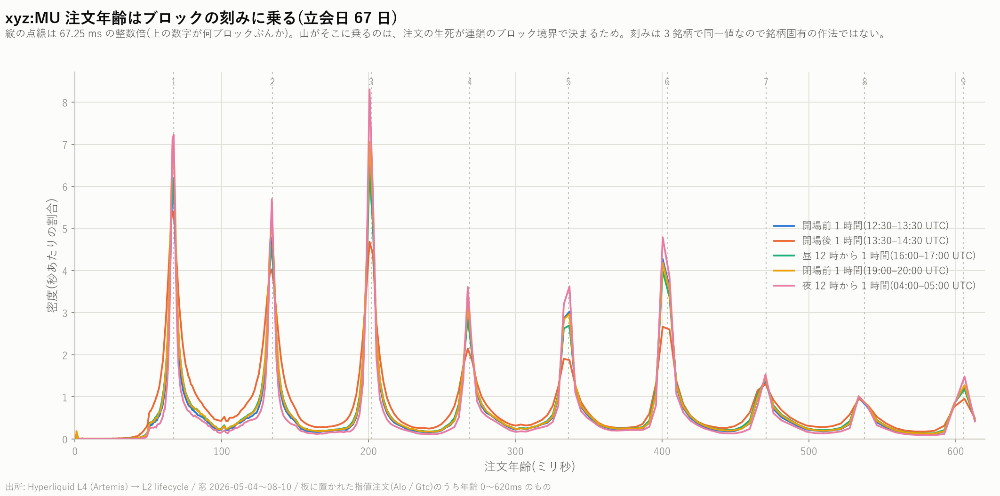

年齢の分布を線形のミリ秒軸で見ると、**67.25 ms の整数倍に鋭い山が並ぶ**。
くし型の当てはめ(位相の Rayleigh 統計)で周期を推定すると、
2026-07-15 の MU / SMSN / DRAM の 3 銘柄すべてで **67.25 ms**、
集中度 R = 0.643 / 0.665 / 0.648(無作為なら R ≈ 0.0022)。**銘柄によらず同一値**
なので、板の作法ではなく**連鎖側のブロック生成間隔**である。

この日この銘柄で観測された最短の非ゼロ寿命は 8.3 ms(1 ブロック未満は存在する)、
山の頂点は 3 ブロック目(3 × 67.25 = 202 ms)。
「1 ブロックで消える注文」より「3 ブロック生きる注文」の方が多い。

この刻みは分析上の実害がある。**サブ 100 ms の年齢差を連続量として扱ってはいけない。**
年齢を説明変数にするならブロック数に丸めるか、67.25 ms より粗い窓で使うこと。

#### 他の銘柄のブロック刻み

同じ刻みが銘柄によらず現れることを、残り 7 銘柄でも示します。

**xyz:AMD** — AMD(米国上場)

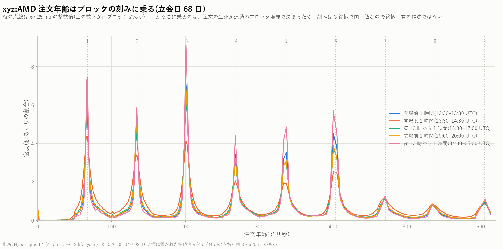

**xyz:INTC** — インテル(米国上場)

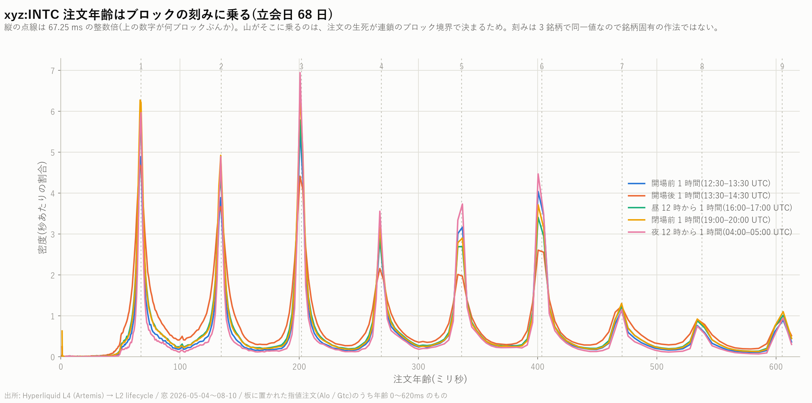

**xyz:SNDK** — サンディスク(米国上場)

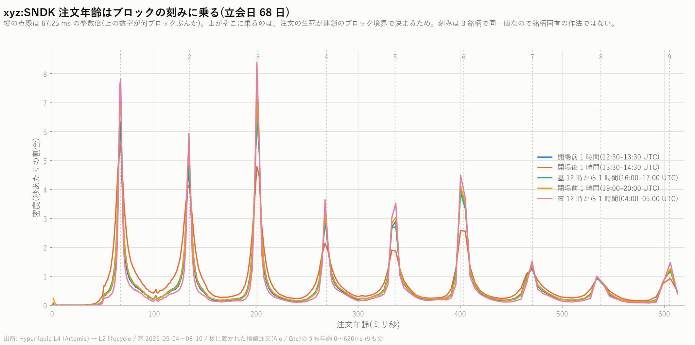

**xyz:KIOXIA** — キオクシア(東京上場)

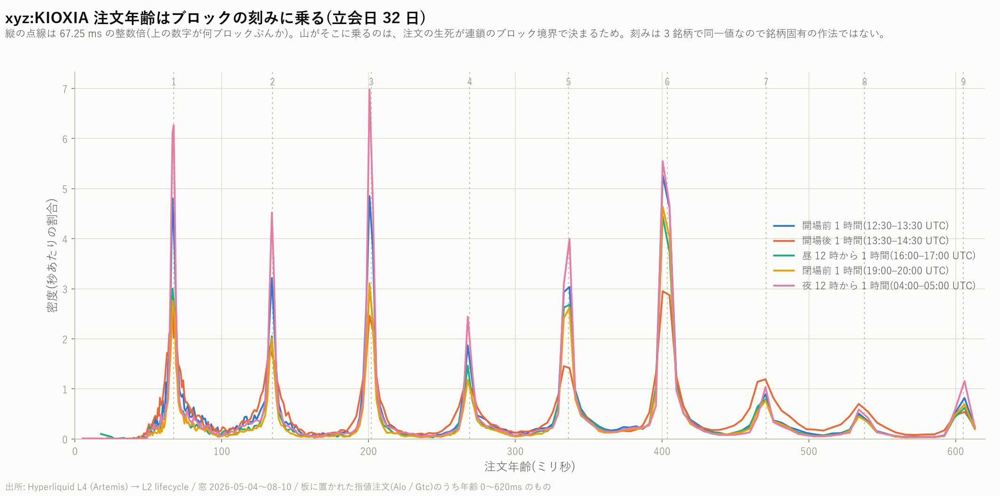

**xyz:SKHX** — SK ハイニックス(ソウル上場)

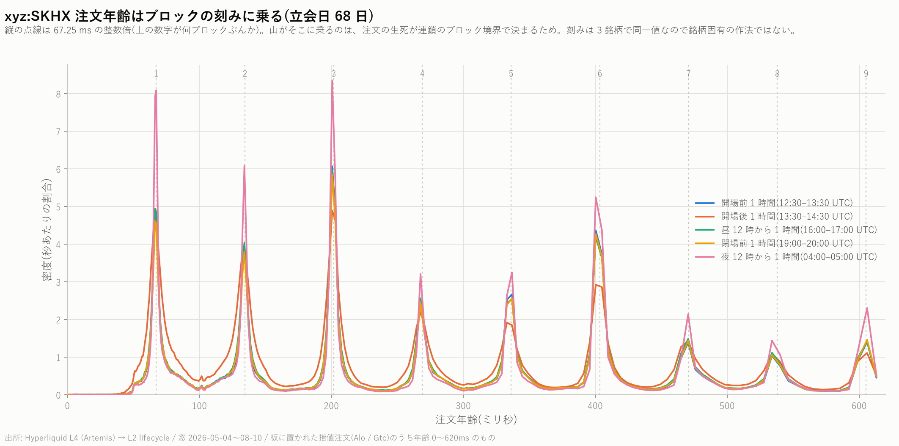

**xyz:SMSN** — サムスン電子(ソウル上場)

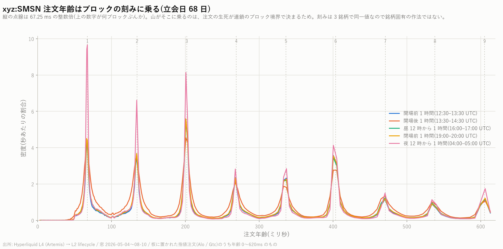

**xyz:DRAM** — DRAM 価格指数

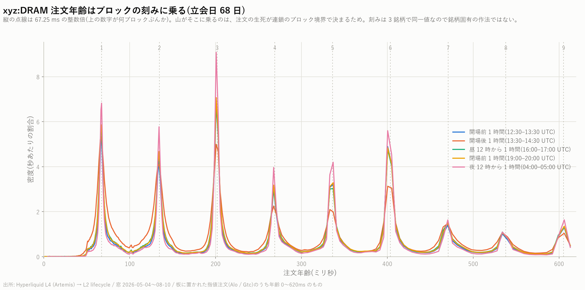

### (5) 寿命 0 の注文が 7〜15% ある

同一ナノ秒で開いて閉じた注文が、どの銘柄・どの窓でも 7〜15% を占める。
`Alo` / `Gtc` に限った数字なので、板に載る意図で出されて即座に消えたものである。
対数軸に置けないため、図では右パネルの左端が 100% ではなく 85〜93% から始まる形で現れる。
この塊の内訳(即時全約定なのか同一ブロック内の取消なのか)は本稿では分解していない。

---

## 4. 日ごとに見ても同じ向きか

まとめた中央値の差は、少数の日が引っ張っているだけでも出る。そこで立会日ごとに
窓ごとの中央値を出し、**対照「開場後 1 時間」より長いか**を数えて符号検定にかけた
(`build_order_age_daily.py`)。日をまたいだ独立性は厳密には成り立たない
(地合いは連日相関する)ので、p 値は目安。**向きがそろっているかを主に見る。**

各欄は「対照より長かった日 / 全立会日 ・ その日ごとの比の中央値」。
立会日は **5 つの窓すべてに注文があった日**を数えているので、§2 の表より 1 日少ない
銘柄がある(DRAM の 2026-05-04 は上場が 15:33 UTC で、それより前の 3 窓が空)。

| 銘柄 | 立会日 | 開場前 1 時間 | 昼 12 時から 1 時間 | 閉場前 1 時間 | 夜 12 時から 1 時間 |
|---|---:|---:|---:|---:|---:|
| xyz:MU | 67 | 65/67・1.59倍 | 60/67・1.45倍 | 61/67・1.28倍 | 63/67・2.29倍 |
| xyz:SNDK | 68 | 64/68・1.65倍 | 64/68・1.45倍 | 61/68・1.37倍 | 64/68・2.50倍 |
| xyz:SKHX | 68 | 54/68・1.37倍 | 51/68・1.38倍 | 56/68・1.35倍 | 44/68・1.23倍 ※ |
| xyz:SMSN | 68 | 51/68・1.64倍 | 51/68・1.36倍 | 50/68・1.42倍 | 37/68・1.05倍 ※ |
| xyz:KIOXIA | 32 | 17/32・1.05倍 ※ | 17/32・1.02倍 ※ | 18/32・1.09倍 ※ | 7/32・0.80倍 ※ |
| xyz:INTC | 68 | 68/68・2.13倍 | 62/68・1.46倍 | 65/68・1.37倍 | 67/68・3.35倍 |
| xyz:AMD | 68 | 62/68・1.60倍 | 56/68・1.44倍 | 54/68・1.27倍 | 54/68・2.15倍 |
| xyz:DRAM | 67 | 60/67・1.68倍 | 62/67・1.43倍 | 59/67・1.46倍 | 62/67・2.42倍 |

多重比較は 8 銘柄 × 4 窓 = **32 検定**。Bonferroni 閾値は p < 1.56e−3。
**26 件がこれを満たし、6 件(※)が満たさなかった。**

| 満たさなかった 6 件 | 日数 | p | 比 |
|---|---:|---:|---:|
| xyz:SKHX 夜 12 時 | 44/68 | 2.05e−02 | 1.23 倍 |
| xyz:SMSN 夜 12 時 | 37/68 | 5.45e−01 | 1.05 倍 |
| xyz:KIOXIA 開場前 | 17/32 | 8.60e−01 | 1.05 倍 |
| xyz:KIOXIA 昼 12 時 | 17/32 | 8.60e−01 | 1.02 倍 |
| xyz:KIOXIA 閉場前 | 18/32 | 5.97e−01 | 1.09 倍 |
| xyz:KIOXIA 夜 12 時 | 7/32 | 2.10e−03 | 0.80 倍 |

### 読み方

**「開場後がいちばん短命」は、まとめた中央値の artefact ではない。** 米国銘柄 5 つでは
どの対照窓でも 79〜100% の日で同じ向きに出ており、INTC の開場前に至っては
**68 日中 68 日**が同じ向きだった。

**そして満たさなかった 6 件は、§3(2) の仮説とぴったり一致する。**
外れたのは *ソウル・東京上場銘柄の「夜 12 時」窓* と *KIOXIA 全部* だけである。

- SKHX / SMSN の 夜 12 時(= 13:00–14:00 KST、**ソウルの立会中**)は、
  開場後と区別がつかない。SMSN は 37/68 日・比 1.05 倍で、向きすらそろわない
- KIOXIA の 夜 12 時(= 13:00–14:00 JST、**東京の立会中**)は逆で、
  **32 日中 25 日で開場後より短い**(比 0.80 倍)。KIOXIA にとっての「開場後」は
  ニューヨークではなく東京である
- KIOXIA の他 3 窓が有意でないのは、標本が 32 日しかなく検出力が足りないため。
  **「差が無い」ではなく「この標本では判定できない」**と読むこと

つまり注文年齢を短くしているのは「ニューヨークの寄り付き」そのものではなく、
**その銘柄の原市場が開いていること**である。

### この検定の限界

- 日をまたいだ独立性は成り立たない(地合いは連日相関する)。p 値は目安
- 対照は「開場後 1 時間」で、これは 5 窓のうち**中央値が最小になりやすい窓**である。
  対照の選び方が結果を作っていないかは、比の中央値(1.02〜3.35 倍)を見て判断する。
  向きだけでなく大きさも見ておくこと
- 有意でなかった 6 件を「効果が無い」と読まないこと(上記 KIOXIA)

---

## 5. 気をつけること

1. **これは「置かれた注文の寿命」であって「板に載っている注文の滞在時間」ではない。**
   後者を見たいなら、各時点で生存中の注文の経過時間を取り直す必要がある
2. **右打ち切りを除いてある。** 標本終端で生きていた注文を落としているので、
   超長寿命側がわずかに欠ける。落とした件数は stats CSV の `n_censored`
3. **`tif` が Ioc 系のものを除いてある。** 「全注文の年齢」ではなく
   「板に置かれた指値注文の年齢」である。板に滞留しない注文まで込みにすると
   分布は 0 の棘に潰れる
4. **67.25 ms の刻みがあるので、年齢を連続量として回帰に入れないこと**(上記 (4))
5. **xyz:MU は 67 日**(2026-08-10 の区画がローカルで `.inprogress` のまま未完成)。
   S3 側には完全な日があるはずなので、必要なら取り直す
6. **xyz:KIOXIA は 32 日**(上場 2026-06-25)。期間が他と揃っていない
7. 銘柄の選別は結果を見る前に決めた(ローカルに L2 がある 8 銘柄すべて)。
   窓の定義も結果を見る前に固定している
