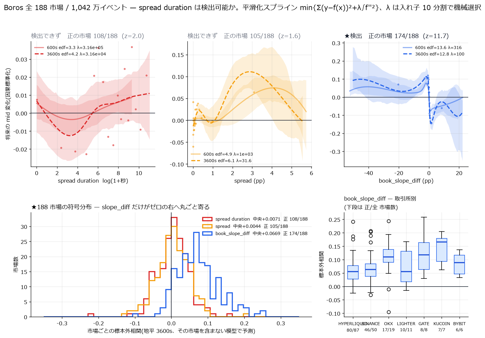
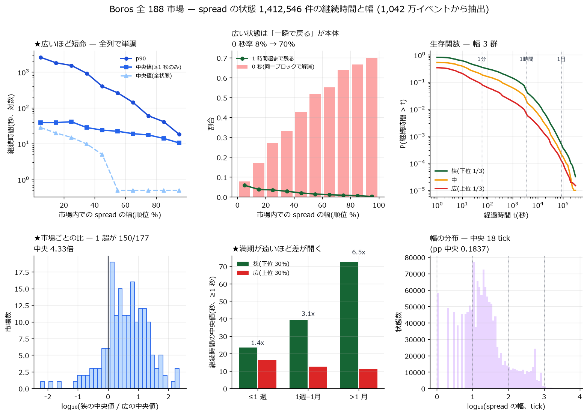
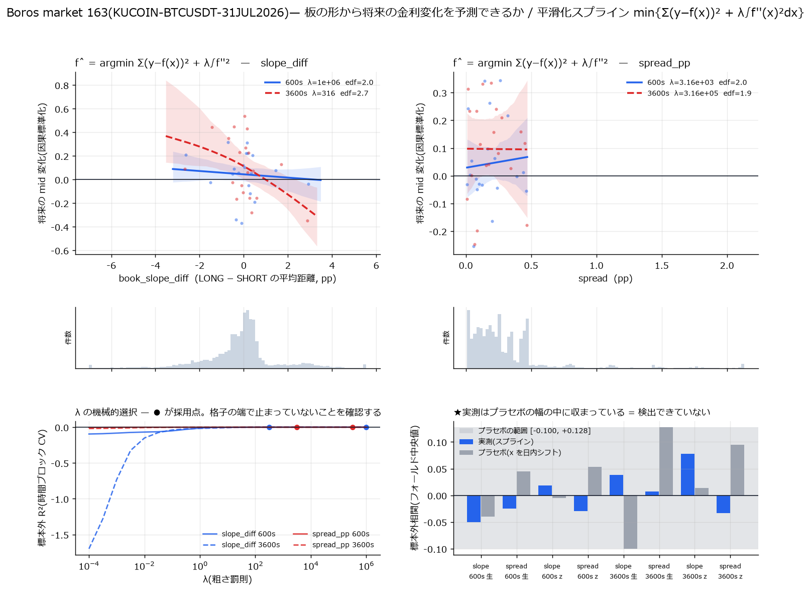
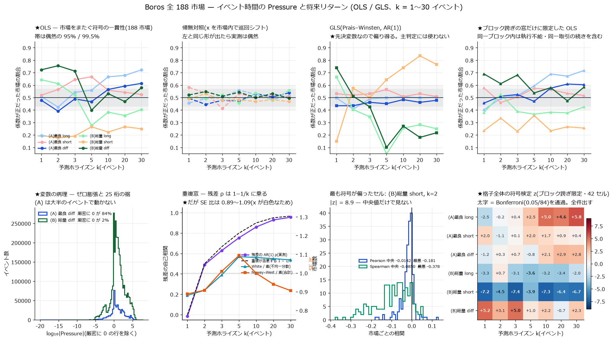
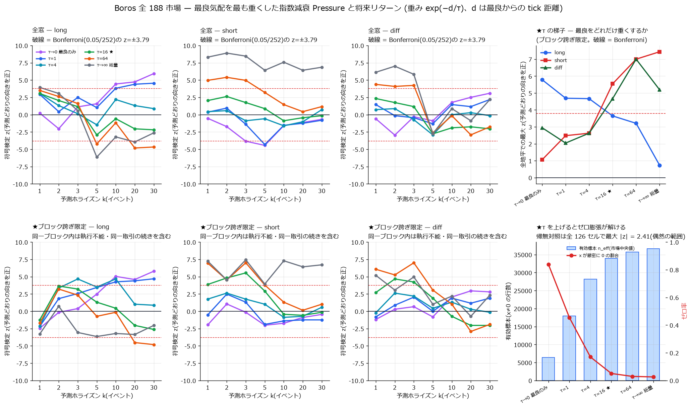
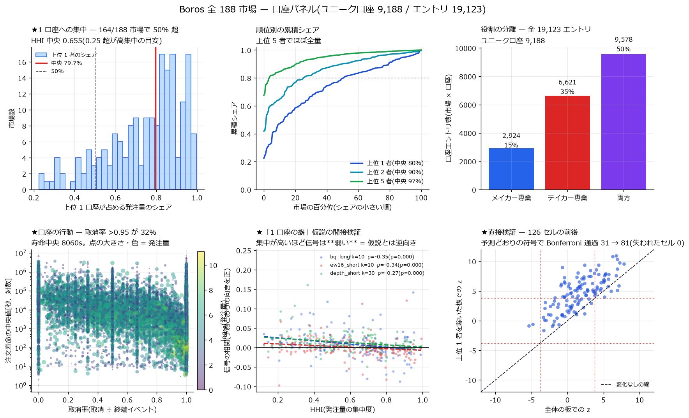
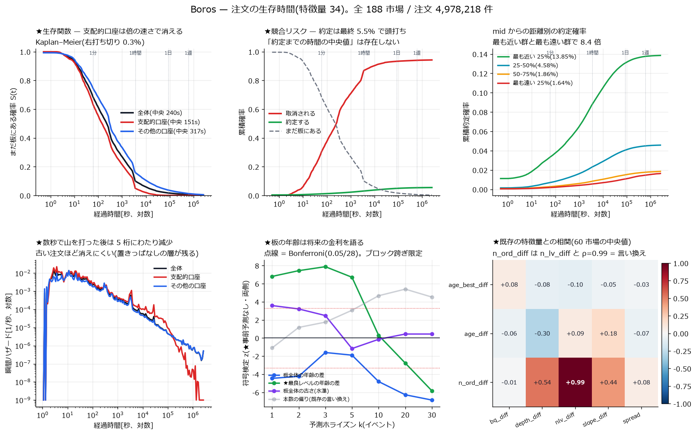
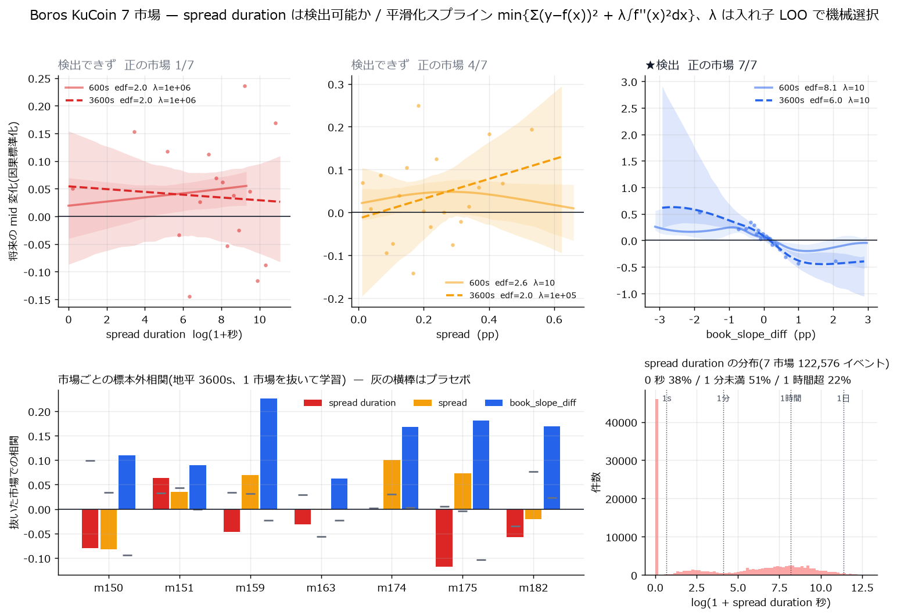

# Pendle Boros の分析

[← ホーム](../../README.md)

<p>
  <a href="https://www.pendle.finance/"></a>
</p>

Pendle(利回りトークン化プロトコル)の市場マイクロストラクチャー分析。

Boros は単一の取引所ではなく、複数の取引所の perp ファンディングレートを
implied APR 建てで束ねた中央指値注文板です。原資産の perp がどこで建っているかに応じて、
以下 **7 つの取引所**それぞれのファンディング市場が Boros 上に存在します
(2026-08-23 時点の在庫は 194 市場。内訳は [boros_data_source.md](boros_data_source.md) §2)。

<p>
  <a href="https://www.binance.com/"></a>
  &nbsp;&nbsp;
  <a href="https://www.bybit.com/"></a>
  &nbsp;&nbsp;
  <a href="https://www.gate.io/"></a>
  &nbsp;&nbsp;
  <a href="https://hyperliquid.xyz/"></a>
  &nbsp;&nbsp;
  <a href="https://www.kucoin.com/"></a>
  &nbsp;&nbsp;
  <a href="https://lighter.xyz/"></a>
  &nbsp;&nbsp;
  <a href="https://www.okx.com/"></a>
</p>

**対象**: **Boros(V3)** — 各取引所の perp ファンディングレートを implied APR 建ての
中央指値注文板で取引する市場。**全 188 市場 / イベント 10,424,762 件**(Arbitrum のオンチェーンログ)。
分析の作法は [METHODOLOGY.md](METHODOLOGY.md) に従う(`DRAM-microprice` で確立したものを引き継ぐ)。

| | 行き先 |
|---|---|
| 結論だけ知りたい | 次節 [主な結果](#主な結果) |
| 数字を読むときの前提 | [ホームの「結果を読むときの前提」](../../README.md#結果を読むときの前提) |
| 用語の意味 | [用語辞書](../../GLOSSARY.md) |

---

## 主な結果

### ① 板の「奥行きの形」には予測力がある — 174/188 市場

板の片側 $s$(long または short)について、流動性がその側の最良気配から
どれだけ離れて置かれているかの数量加重平均を

$$
\mathrm{slope}_s = \frac{\sum_{i \in s} \lvert r_i - r_s^{\mathrm{best}} \rvert q_i}{\sum_{i \in s} q_i}
$$

$$
\mathrm{slope}_{\mathrm{diff}} = \mathrm{slope}_{\mathrm{long}} - \mathrm{slope}_{\mathrm{short}}
$$

と定義する($r_i$ は価格レベル $i$ の implied APR、 $q_i$ はその数量、単位は pp)。
この $\mathrm{slope}_{\mathrm{diff}}$ は将来の金利変化を予測する。

| | 値 |
|---|---|
| 正の市場 | **174 / 188**($z = 11.7$、二項検定 $p \approx 10^{-31}$) |
| 標本外相関(市場ごとの中央値) | **$+0.0669$** |
| **プラセボ**($x$ を市場内で巡回シフト) | 98 / 188(**偶然どおり**) |
| 有効自由度 $\mathrm{edf}$ | **12.8**(= 明確な非線形) |
| 取引所 | **7 / 7 すべてで正**(Hyperliquid 80/87、Binance 46/50、OKX 17/19 …) |

曲線は **0 を境に符号が反転**する。LONG 側の流動性が SHORT 側より遠くに置かれている
(= LONG が薄い)と、金利は下がる。DRAM 案件の `book_slope_diff` と**同じ向き**である。

### ② 「広さ」と「その持続時間」には無い

spread duration は、時刻 $t$ における「現在の spread が続いている秒数」

$$
D(t) = t - \max \lbrace u \le t : \mathrm{spread}(u) \ne \mathrm{spread}(u^-) \rbrace
$$

で定義した($t$ までの情報だけで決まるので時間契約に反しない)。
裾が極端なので $\log(1+D)$ で扱う。

| 説明変数 | 正の市場 | $z$ | 相関 | 判定 |
|---|---:|---:|---:|---|
| **$\mathrm{slope}_{\mathrm{diff}}$** | **174/188** | **11.7** | **+0.0669** | **○ 検出** |
| $\log(1+D)$(spread duration) | 108/188 | 2.0 | +0.0071 | × 検出できず |
| spread(広さ) | 105/188 | 1.6 | +0.0044 | × 検出できず |

duration は標本を 85 倍にしても出てこない。6 セル探索の Bonferroni 閾値 $0.05/6 = 0.0083$
に対し $p = 0.021$ で届かず、取引所別に見ると符号が割れる
(OKX 16/19 が正なのに Gate 2/8・KuCoin 2/7 は負)。

**最良気配の「広さ」ではなく、その裏の「並び方」に情報がある。**



> 下段左のヒストグラムが要点 — `book_slope_diff`(青)だけがゼロの右へ丸ごと寄り、
> duration(赤)と spread(橙)はゼロを跨いだまま。

### ③ 広いスプレッドは短命 — $p_{90}$ で 143 倍

spread が一定である区間を 1 状態として **1,412,546 件**を列挙した。
市場内で幅を順位化すると、**全ての指標が単調**に動く。

| 市場内の幅 | 0 秒率 | 中央値 | $p_{90}$ | 1 時間超 | 中央値($D \ge 1$ 秒) |
|---|---:|---:|---:|---:|---:|
| 最狭 0–10% | **7.9%** | 28.2 s | **2,567 s** | 5.9% | 38.6 s |
| 50–60% | 51.8% | 0.0 s | 263 s | 1.5% | 22.2 s |
| 最広 90–100% | **70.1%** | 0.0 s | **18 s** | **0.2%** | **10.5 s** |

市場ごとの判定でも **150/177 市場で狭いほうが長持ち**
(中央 **4.33 倍**、 $z = 9.2$、 $p = 2.3 \times 10^{-20}$)。
**満期が遠いほど差が開く**(1 週間以内 1.4 倍 → 1 ヶ月超 **6.5 倍**)。



### ④ 単一市場では何も見えない — 標本の問題

同じ手法を市場 163 単独(44.3 日・27,253 イベント)に当てると、
**実測の相関はすべてプラセボの幅の内側**に収まり、何も検出できない。

| | 163 単独 | KuCoin 7 市場 | **全 188 市場** |
|---|---:|---:|---:|
| 標本($h = 3600$ 秒) | 1,069 点 | 4,955 点 | **166,894 点** |
| $\mathrm{slope}_{\mathrm{diff}}$ の相関 | $+0.077$(3/5) | $+0.167$(7/7) | **$+0.067$(174/188)** |
| プラセボ | **$+0.128$**(実測より大きい) | $-0.023$ | $-0.004$ |

**7 市場での $+0.167$ は KuCoin という高信号 venue の値**で、全体の中央値は $+0.067$ だった。
方向は正しかったが、**選んだ venue の性質を全体に外挿していた**(報告 4 で訂正)。



### ⑤ 注文流入の Pressure — 予測できることと執行できることは別

反対側の最良数量で正規化した注文流入の差を、イベント時間で

$$
\mathrm{Pressure}^{s}_{t} = \frac{Q^{s}_{t} - Q^{s}_{t-1}}{Q^{\bar{s},\mathrm{best}}_{t}}
$$

と定義し、 $k = 1 \dots 30$ イベント先の mid 変化に当てた(1,018 万イベント / 42 セル)。

| | 値 |
|---|---|
| 片側総量 short | **全 7 地平で予測どおり負**( $z = -3.9$ 〜 $-7.4$ ) |
| GLS | **OLS と質的に逆の結論**を出す(説明変数が先決変数のため) |
| ★ $k=1$ の窓 | **75.5% が同一ブロック内**(= その時点では執行できない) |



**執行不能な窓を落とすと符号が反転するセルがある。**「有意である」ことは
「取れる」ことを意味しない。

### ⑥ 最良気配を最も重くすると有効標本が 5.1 倍になる

最良からの tick 距離 $d$ に重み $\exp(-d/\tau)$ を掛けて流入量を測り直した。
$\tau$ を入れるとゼロ膨張が解け、使える標本が **5.1 倍**に増える。

| 側 | 最適な $\tau$ | 意味 |
|---|---|---|
| long | $\tau \to 0$ | 最良気配に集中 |
| short | $\tau \to \infty$ | 板全体 |
| **diff** | **$\tau = 64$ に内点最適** | 両端より強い |

3 指標(符号検定・Pearson・Spearman)が揃って一致するのは
$\tau = 64$ の diff の $k = 1 \dots 3$ だけだった。



### ⑦ 板は 1 口座が握っている — そしてその口座が信号を薄めていた

「これは 1 口座の癖ではないのか」という疑いを直接検定した(2,997 ウォレット / 19,123 エントリ)。

| | 値 |
|---|---|
| 上位 1 者の発注量シェア(市場中央) | **79.7%**(164/188 市場で 50% 超、HHI 0.655) |
| その口座の素性 | 取消率 **97.7%** / 約定率 2.3% / 寿命 311 秒の**機械的 MM** |
| venue 全体を握る主体 | **15 ウォレット**(上位 2 つで 76% の市場) |
| **その口座を板から除くと** | 通過セルが **31 → 81**、失われたセルは **0** |



**既存の結論はその口座の癖ではなく、その口座に薄められていた。**
除いても失われるセルが 1 つも無い、というのが直接の反証になっている。

### ⑧ メイカー報酬帯の内側と外側で符号が逆になる

帯の定義は公式 API に明記されている(mid からの片側半幅、帯内の**残量**が対象)。

| | 値 |
|---|---|
| 帯が発注位置を縛る証拠 | **無い**(同一市場内の左右比較で $\rho = -0.020$) |
| short 帯**内** | 全 7 地平で通過 |
| long 帯**外** | 全 7 地平で**逆向き**に有意 |


帯そのものは行動を縛っていないのに、**帯を境に分けると構造が出る**。
総量で見ると両者が打ち消し合って消えていた。

### ⑨ 注文はほとんど約定しない — 生存時間と板の年齢

497.8 万注文を競合リスクで解いた(検算 `S + CIF_fill + CIF_cancel = 1` が 1.33e-15)。

| | 値 |
|---|---|
| 終端の内訳 | **取消 94.2% / 約定 5.52%** / 打ち切り 0.3% |
| 「約定までの時間の中央値」 | **存在しない**(CIF が 0.5 に達しない) |
| 距離 最も近い四分位 対 最も遠い四分位 | 13.85% 対 1.64%(**8.4 倍**) |
| **支配的口座 対 その他** | 寿命 **151s 対 317s** / 約定率 **1.90% 対 9.75%** / 1 日後生存 **0.1% 対 3.8%** |

生存時間そのものは終端が来てから確定するので予測に使えない。時間契約を満たす形として
**板レベルの年齢**(いま板にある注文がいつから置かれているか)を別に作った。

| | 値 |
|---|---|
| `age_best_diff` | $k = 1 \dots 5$ で Bonferroni 通過( $z = +6.8$ 〜 $+7.9$ )、 $k=30$ で反転 |
| 既存特徴量との相関 | 最大 $\lvert \rho \rvert = 0.10$ = **独立の新情報** |
| 順位相関 | **0.06〜0.11** — 既存信号(0.016〜0.029)の **3〜4 倍** |
| 帰無対照(巡回シフト) | 最大 $\lvert z \rvert = 2.77$ = 偶然 |



**板に見えている量の大半は、実際には取りに行けない。**

---

## 方法

目的関数は罰則つき平滑化スプラインそのもの:

$$
\hat{f} = \arg\min_f \left[ \sum_{i=1}^n ( y_i - f(x_i) )^2 + \lambda \int ( f''(x) )^2 dx \right]
$$

3 次 B スプライン基底 $B(x) = (B_1(x), \dots, B_K(x))$ を張ると、罰則項は

$$
\lambda \int ( f'' )^2 dx = \lambda \beta^\top \Omega \beta,
\qquad
\Omega_{jk} = \int B_j''(x) B_k''(x) dx
$$

と書けるので、解は正規方程式

$$
\hat{\beta} = \left( B^\top B + \lambda \Omega \right)^{-1} B^\top y
$$

で閉じ、有効自由度は $\mathrm{edf} = \mathrm{tr}[(B^\top B + \lambda \Omega)^{-1} B^\top B]$ で与えられる。

- **厳密な粗さ罰則**: 3 次 B スプラインの 2 階微分は**区分線形**なので、
  $\Omega_{jk}$ は各ノット区間の **2 点ガウス求積で厳密**に求まる(近似ではない)
- **$\lambda$ は機械的に選ぶ**: フォールドは**市場をまとめた 10 群**(市場は群を跨がない)。
  $\lambda$ は**入れ子**で決める — 外側フォールド $k$ を見ずに、残りの群の内部 CV だけで
  $\lambda_k$ を決めてから $k$ を評価する
- **計算**: $B^\top B$ と $B^\top y$ は**フォールドごとの和に分解できる**。
  群 $k$ について $G_k = B_k^\top B_k$、 $c_k = B_k^\top y_k$ を一度だけ作れば、
  任意の訓練集合 $T$ と任意の $\lambda$ に対して解が下式に落ち、
  **$28 \times 28$ の連立方程式**で済む。入れ子検証が実質無料になる
- **時間契約**: $x$ は時刻 $t$ で確定、 $y$ は区間 $[t, t+h)$。**backward asof のみ**
  ($u$ 以前の直近値 $j(u) = \max \lbrace i : t_i \le u \rbrace$)。
  標準化は過去 20 点だけの移動 sd $\hat{\sigma}_t$ を使い、 $y^z = y / \hat{\sigma}_t$(未来を見ない)
- **標本**: イベントは同一ブロックに固まる(間隔の中央値 0 秒)ので、
  全イベントを使うと $y$ の自己相関が $\rho_1 = 0.98$ 〜 $0.999$ に達する。
  **間隔 $h$ の重ならないグリッド**上で 1 点ずつ取る($\rho_1 = 0.195$ まで低下)

$$
\hat{\beta}_T = \left( \sum_{k \in T} G_k + \lambda \Omega \right)^{-1} \sum_{k \in T} c_k
$$

**検証**: 板の再生をアーカイブ断面と突合 → **188 市場すべてで不一致 0**。

## ★途中で見つけて捨てた誤り

この案件では、数字を出したあとの読み直しで気づいた設計の誤りを都度記録している。

| # | 誤り | どう直したか |
|---|---|---|
| 1 | 窓の重なりで $y$ の自己相関が $\rho_1 = 0.98$ 〜 $0.999$。CV が壊れて全セル負 | 非重複グリッドへ($\rho_1 = 0.195$) |
| 2 | フォールド間で $y$ の sd が 8 倍違う($0.068$ 〜 $0.561$) | 過去だけを使う因果的な標準化 $y / \hat{\sigma}_t$ |
| 3 | 標本外 $R^2$ の基準に**試験フォールド自身の平均**(実装不能な理想値)を使っていた | 訓練期間の平均へ |
| 4 | $\lambda$ を評価と同じ分割で選んでいた(選択バイアス) | 入れ子 CV へ |
| 5 | **効果量を選んだ venue から全体に外挿**していた($+0.167 \to +0.067$) | 全 188 市場で測り直し |
| 6 | **市場をまたいでプールすると関係が消える**($\rho = -0.223 \to -0.009$)。幅の尺度が市場ごとに違うため | 市場内で順位化してから集計 |
| 7 | 満期層別でゼロ除算(広い群の中央値が 0 秒)→ 比が $10^{10}$ | $D \ge 1$ 秒に限った版へ |
| 8 | `font.family` にフォント名の列を直接指定し、軸・凡例が消えた図を出した | generic family + `font.sans-serif` へ |
| 9 | **数式が GitHub で描画できなかった。**原因は推測した書式の問題ではなく、実測すると**独立した 3 つ**だった。(i) bash のヒアドキュメント経由で LaTeX を書きバックスラッシュが潰れて制御文字が混入、(ii) GitHub の Markdown は `\;` `\,` `\{` を**エスケープとして先に食う**(`\left\{` → `\left{`)、(iii) `\operatorname` は**禁止マクロ**、(iv) 開始 `$` の直前が読点 `、` や漢字だと**数式と認識されず生テキストで出る** | ファイル書き込みツールで直接書き、記号の前のバックスラッシュを全廃、`\mathrm` へ置換、開始 `$` の前に半角空白。**GitHub の変換器に実際に投げて全数式が `math-renderer` に入ることを確認**(`scripts/verify_readme_render.py`、帰無対照つき)。のちに (v) 裸の `<` `>` が**二重エスケープ**される件も追加で判明 |

---

## Pendle とは

PendleはDeFiの分野で利回りを売買できるようにする分散型金融プロトコルです。通常のDeFiでは暗号資産を預けることで利回りを受け取りますが、その利回りは市場環境によって変動します。Pendleでは、この将来発生する利回りそのものを取引対象として扱える点が大きな特徴です。

Pendleでは利回りを生み出す資産を元本部分と利回り部分に分離します。元本部分を表すものがPTで、利回り部分を表すものがYTです。PTを保有すると満期時に対応する資産を受け取る権利を得ます。一方でYTを保有すると満期までに対象資産から発生する利回りを受け取る権利を得ます。

例えば利回りが発生する暗号資産を保有している場合、その資産をPendleでPTとYTに分けることができます。安定した収益を重視する利用者はPTを利用することで満期まで保有した場合の収益をある程度固定できます。一方で今後利回りが上昇すると考える利用者はYTを購入することで利回りの変化に対して大きな利益を狙うことができます。ただしYTは満期になると新たな利回りを生み出さなくなり、その価値は満期に向けて低下していく性質があります。

PendleにはPTやYTを取引するための仕組みも用意されています。一般的な分散型取引所とは異なり、利回りの取引に適した仕組みを採用しており、満期までの期間や市場が予想する将来の利回りを考慮しながら取引が行われます。

つまりPendleは、暗号資産そのものの価格を売買するだけではなく、将来得られる利回りを独立した金融商品として扱えるようにするプロトコルです。固定的な収益を狙う運用から将来の利回り上昇を予想した取引まで、従来のDeFiより幅広い運用方法を可能にしています。一方でスマートコントラクトのリスクや対象となる資産のリスク、市場価格の変動なども存在するため、仕組みを理解した上で利用することが重要です。

> **★本案件が扱うのは Boros(V3)** — 上記の PT/YT(V2、AMM)ではなく、
> **perp のファンディングレート**を implied APR 建ての**中央指値注文板**で取引する市場である。
> 194 市場 / 7 取引所が稼働しており、公開 REST API で板・約定・履歴が取れる
> (UI のスクリーンショットと板が全レベル一致することを実測で確認 →
> [boros_data_source.md](boros_data_source.md))。

---

## 1. なぜ DRAM の道具がそのまま使えないか

先行案件(`DRAM-microprice`、Hyperliquid HIP-3 の xyz:DRAM、99 日・L4)は
**中央指値注文板(CLOB)**が前提だった。Boros は構造が違う:

| | Hyperliquid(DRAM) | **Pendle Boros** |
|---|---|---|
| 価格形成 | CLOB のみ | **CLOB が主**(AMM が併存し、`includeAmm` で合成できる) |
| 取引対象 | perp の**価格** | perp の**ファンディングレート**。建値は **implied APR**、数量は **YU** |
| 担保 | USDC | **原資産建て**(BTC 市場なら BTC) |
| 満期 | なし | **あり**(月次)。満期に向けて implied は floating へ収束する |
| 決済 | funding は 1 時間ごと | **8 時間ごと**(`extConfig.paymentPeriod` = 28800) |
| 実行 | 板を叩く | オンチェーン取引(ブロック単位、ガス。1 tx が複数レベルを掃く) |
| **板の性質** | 自然発生 | **★報酬で維持されている**(incentivized range、500%/216% APR 表示) |

- **リターン**: 満期への収束という決定論成分があるので、
  素の対数リターンを目的変数にすると**予測できて当然**になる。
  implied APR を主系列にし、残存期間を統制する
- **時間軸**: ブロック単位。ns 精度の板イベントは存在しない
- **費用**: ガスは**取引サイズに依存しない固定費**なので、bp 建てだけで議論すると
  小口の不成立を見落とす

## 2. スコープ

| # | 論点 | 状態 |
|---|---|---|
| 1 | どの市場を使うか | **全 188 市場**(標本不足のため 2026-08-24 に全市場へ拡大) |
| 2 | データ源 | **解決済**: オンチェーンログ(遡れる)+ 公式アーカイブ。→ [boros_data_source.md](boros_data_source.md) |
| 3 | 観測粒度 | ブロック単位。**録り逃しの概念が無い**(チェーンに永続) |
| 4 | 価格の定義 | implied APR を主系列 |
| 5 | 満期の扱い | 残存期間で正規化・層別 |
| 6 | **報酬の分離** | **未着手**。メイカー報酬が板を維持しているため、incentivized range の内外で注文を分離しないと流動性指標を誤読する |

## 3. レポート索引

| # | 内容 | 規模 | レポート |
|---|---|---|---|
| 0 | **データ源の確認** — Boros Open API(認証不要)。194 市場 / 7 取引所。板が UI と全レベル一致 | live | [boros_data_source.md](boros_data_source.md) |
| 1 | **市場 163 の偵察** — KuCoin BTCUSDT 31JUL2026、満期まで 44.3 日の完全な一生。14 市場中 edge 2 位・逆選択 最下位・正味 13 位。**実現キャリーは $+0.54$ pp/年 しかなく、市場はほぼ正しく価格づけていた** | 27,268 イベント / 決済 136 回 | [market163_scouting.md](market163_scouting.md) |
| 2 | **★book_slope / spread の平滑化スプライン回帰** — 毎イベント 27,253 点。**実測の相関はすべてプラセボの幅の内側**で検出できず。設計の欠陥 3 件を自分で潰した記録つき | 27,253 イベント / 8 セル | [spline_regression_report.md](spline_regression_report.md) |
| 3 | **★spread duration は検出可能か**(KuCoin 7 市場 122,576 イベント、入れ子 LOO) — duration は検出できず。一方 **book_slope_diff は 7/7 市場で検出**でき、報告 2 の結論を訂正 | 7 市場 / 2 地平 | [duration_report.md](duration_report.md) |
| 4 | **★全 188 市場での再検証**(1,042 万イベント、入れ子 10 分割) — spread duration は 85 倍の標本でも検出できず(108/188、 $z = 2.0$)。**book_slope_diff は 174/188 市場・7 取引所すべてで正**($z = 11.7$)。報告 3 の効果量 $+0.167 \to +0.067$ に訂正 | 188 市場 | [pooled_all_report.md](pooled_all_report.md) |
| 5 | **★spread の状態 143 万件 — 継続時間と幅**(全 188 市場) — **広いほど短命**($p_{90}$ で 143 倍、150/177 市場、 $z = 9.2$)。満期が遠いほど差が開く(1.4 倍 → 6.5 倍)。プールすると関係が消える交絡を発見 | 1,412,546 状態 | [spread_states_report.md](spread_states_report.md) |
| 6 | **★イベント時間の Pressure と将来リターン(OLS / GLS、k=1〜30 イベント)** — 反対側の最良数量で正規化した注文流入の差。**片側総量 short が全 7 地平で予測どおり負**( $z = -3.9$ 〜 $-7.4$ )。**GLS は OLS と質的に逆の結論**を出す(先決変数のため)。**k=1 の窓の 75.5% は同一ブロック内で執行不能**で、限定すると符号が反転するセルがある | 10,185,262 イベント / 42 セル | [pressure_report.md](pressure_report.md) |
| 7 | **★最良気配を最も重くした指数減衰 Pressure**(重み exp(−d/τ)、d は最良からの tick 距離) — τ でゼロ膨張が解け有効標本が **5.1 倍**に。**最適 τ は側によって逆向き**: long は τ→0(最良に集中)、short は τ→∞(板全体)、**diff は τ=64 に内点最適**で両端より強い。3 指標(符号検定・Pearson・Spearman)が一致するのは τ=64 の diff の k=1〜3 だけ | 10,185,262 イベント / 126 セル | [pressure_ew_report.md](pressure_ew_report.md) |
| 8 | **★口座パネルと「1 口座の癖」仮説の検証** — 板は**上位 1 者が発注量の中央 79.7%**(164/188 市場で 50% 超、HHI 0.655)。その 1 口座は取消率 97.7%・約定率 2.3%・寿命 311 秒の**機械的 MM** で、**15 ウォレット(上位 2 つで 76% の市場)**が venue 全体を握る。**その口座を板から除くと通過セルが 31 → 81 に増え、失われたセルは 0**。既存の結論はその口座の癖ではなく、**その口座に薄められていた** | 2,997 ウォレット / 19,123 エントリ | [accounts_report.md](accounts_report.md) |
| 9 | **★メイカー報酬帯の内外(特徴量 55)** — 定義は公式 API に明記(mid からの片側半幅、帯内の**残量**が対象)。**帯が発注位置を縛る証拠は無い**(同一市場内の左右比較で ρ=−0.020)。**だが帯を境に分けると、内側は予測どおり・外側は符号が逆**という構造が出る(short 帯内は全 7 地平で通過、long 帯外は全 7 地平で逆向きに有意)。総量では打ち消し合っていた | 194 市場の帯 / 84 セル | [reward_band_report.md](reward_band_report.md) |
| 10 | **★注文の生存時間(特徴量 34)** — 競合リスクで解いた(検算 $S+\mathrm{CIF}_f+\mathrm{CIF}_c=1$ が 1.33e-15)。**94.2% が取消・約定は 5.52%** で「約定までの時間の中央値」は存在しない。**支配的口座は寿命が半分・約定率 1/5・1 日後生存 1/38** で、板に見えている量の大半は取りに行けない。予測には注文単位でなく**板レベルの年齢**を作った(時刻 t で確定)。`age_best_diff` は既存特徴量と \|ρ\|≤0.10 で**独立**、k=1〜5 で Bonferroni 通過。順位相関は **0.06〜0.11 と既存信号の 3〜4 倍** | 4,978,218 注文 / 28 セル | [lifetime_report.md](lifetime_report.md) |
| — | **板データから作れる特徴量の全棚卸し**(89 個、実スキーマから確認。既存で使用済みは 12 個) | 10 系統のデータ源 | [feature_inventory.md](feature_inventory.md) |



*報告 3 の図 — 全市場へ拡大する前の段階。左が spread duration(平坦)、右が book_slope_diff。*

## 4. 未検証の主な項目

| | 内容 |
|---|---|
| **損益への翻訳** | 相関 $0.067$ は**予測であって収益ではない**。手数料・ガス・価格影響を引いていない |
| **報酬帯との交絡** | メイカー報酬は mid 付近への指値に払われる。「広い状態が速く閉じる」のは報酬が閉じさせている可能性がある |
| **AMM 側の流動性** | オンチェーンログは CLOB のみ。AMM が実効的に埋めている幅は見えていない |
| 「薄い venue ほど効く」 | 目視の観察(KuCoin $+0.166$ / Gate $+0.118$ 対 Hyperliquid $+0.055$)。検定していない |
| duration の生存分析の続き | ハザードの形、約定の到来との関係 |

## 5. ディレクトリ

```
scripts/boros_*.py   分析 20 本 + 描画・検証 5 本(リポジトリ直下の scripts/。すべて再現可能)
data/                中間生成物(リポジトリ直下。*.parquet は .gitignore で除外。スクリプトで再生成できる)
charts/boros_*.png   図(リポジトリ直下の charts/)
```

データ本体は `E:\Boros-history`(別セッションが構築、git 管理外)。本リポジトリからは**読み取りのみ**。

---

*先行案件: `DRAM-microprice`(Hyperliquid HIP-3 の L4 マイクロストラクチャー、報告 47 本)*
