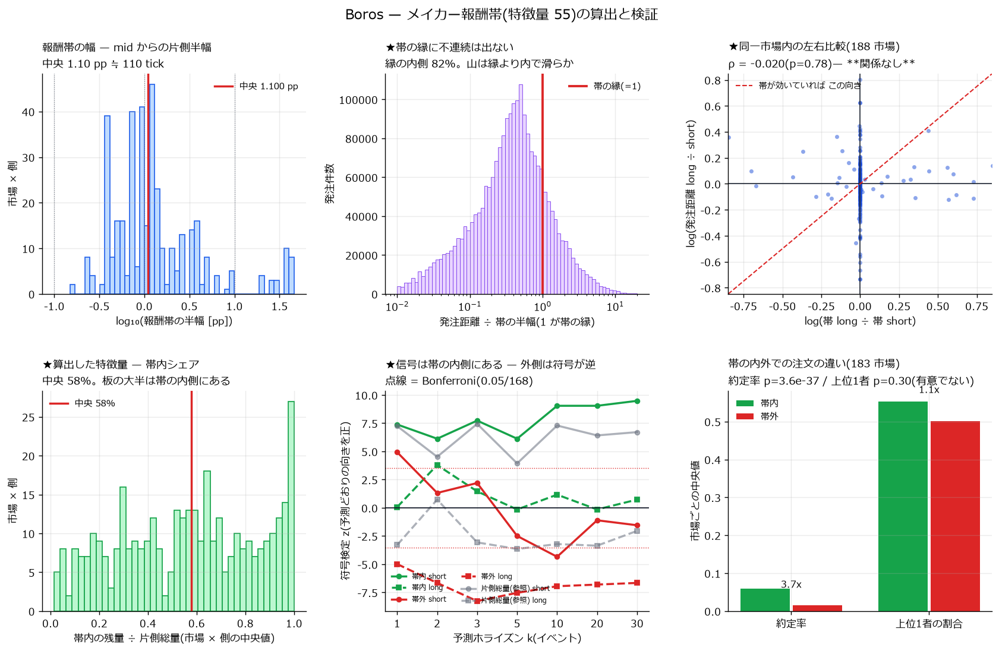

# 特徴量 55 — メイカー報酬帯の内外(全 188 市場)

**作成**: 2026-08-27 / `scripts/boros_fetch_incentive.py` `boros_reward_band.py` `boros_band_merge.py` `boros_band_analysis.py` `boros_band_plot.py`

---

## 0. 答え

| 問い | 答え |
|---|---|
| 帯の定義は分かったか | **分かった。**公式 OpenAPI に明記されている(§1)。**前報で「`iTickThresh` が材料」と書いたのは誤り**で、正しい材料は別エンドポイントにあった |
| 過去の帯は取れるか | **取れない。**API は現在エポックしか返さない。epoch 系のパラメータを 4 通り試して全て無効(§2) |
| 特徴量は算出したか | **した。**188 市場 × 全イベント。板の残量を帯の内外に分解した(§3) |
| **帯は発注位置を縛っているか** | **★証拠は無い。**同一市場内で左右の帯が違っても発注距離は追随しない(ρ=−0.020、p=0.78)。帯の縁に密度の不連続も出ない(§4) |
| **それでも役に立ったか** | **★立った。**帯を境に分けると、**内側は予測どおり・外側は符号が逆**という強い構造が出る。両者が打ち消し合っていたので総量では見えていなかった(§5) |
| README の交絡の懸念は | **支配的口座が帯内に偏る、という形では成立しない**(帯内 55.3% 対 帯外 50.1%、p=0.30)。ただし帯が縛っていない以上、**交絡そのものは未解決のまま**(§8) |

---

## 1. 定義 — 公式 OpenAPI の原文

`GET /v1/incentives/maker-incentives/campaigns/{marketId}` の
`addLiquidityIncentive.{long,short}.incentiveRange`:

> **"Half-width of the incentive band around the mid implied APR for this side,
> expressed as a decimal APR (e.g. `0.005` = ±50bps).
> Resting size within this band qualifies."**

つまり:

- 帯は **mid implied APR からの片側半幅**。単位は **APR 小数**(0.005 = 50bp)
- **long / short で別値**
- 報酬の対象は約定ではなく **resting(板に載っている残量)**
- トラックは毎時("Hourly maker resting-liquidity track")、エポックは**週次**(実測 2026-08-21 00:00Z)

本報では pp に直して使う(`R_pp = incentiveRange × 100`)。
long は mid より下(bid 側)、short は mid より上(ask 側)なので

- long が対象 ⇔ `mid − rate_i ≤ R_long`
- short が対象 ⇔ `rate_i − mid ≤ R_short`

### ★前報の訂正

`feature_inventory.md` #55 で「`iTickThresh` を使えば報酬帯を分離できる」と書いたが、
**`iTickThresh` は証拠金フロア**(`RateFloor = 1.00005^(iTickThresh × tickStep) − 1`)であって
報酬帯ではない。正しい材料は上記エンドポイントだった。棚卸しを訂正する。

---

## 2. 取れたもの / 取れなかったもの

| | |
|---|---|
| **取れた** | 全 **194 市場**の現在エポック(2026-08-21)の `incentiveRange`(long / short)、予算、帯内流動性、手数料還元率 |
| **取れなかった** | **窓(2026-05-04〜08-10)当時の帯。**エンドポイントは `marketId` と `maker` しか受け取らない(OpenAPI で確認)。`epochTimestamp` / `epoch` / `timestamp` / `at` を試したが**すべて現在エポックを返した** |
| 式の逆算 | **できなかった。**片側は丸い値(0.005)でもう片側が計算値(0.005392164773700986)という構造だが、tick 対称・mark 距離・floating 距離のいずれでも説明できない |

帯の幅は**中央 1.100 pp**(≒ 110 tick)、範囲 0.15〜45.8 pp。予算 >0 は **35/194 市場**。

> **したがって §4 以降は「いまの帯が窓当時も同じだった」という仮定の下にある。**
> エポックが週次である以上この仮定は強くないが、除けない。

---

## 3. 算出した特徴量

`data/band_book_{mid}.parquet`(188 市場、`event_book_{mid}` と行が 1 対 1、同じ `ev_i`):

| 列 | 意味 |
|---|---|
| `ib_long` / `ib_short` | **帯内の残量**[YU] |
| `ibn_long` / `ibn_short` | 帯内のレベル数 |
| `ib_share_long` / `_short` | 帯内 ÷ 片側総量 |

`data/event_book_band_{mid}.parquet` では `oob_side = depth_side − ib_side`(帯外の残量)も持つ。
差で作るので負になり得るが、**実測 2,087 万行で発生 0 件**だった。

`data/band_place_{mid}.parquet`(発注ごと):

| 列 | 意味 |
|---|---|
| `dist_pp` | 発注時点の mid からの距離 pp(自分の側から見て正が遠い) |
| `in_band` | 帯の内側か |
| `is_top1` | 発注量 1 位の口座か |
| `lifetime_s` / `terminal` | その注文の顛末(filled / cancelled / censored) |

### 帯内の割合 — 3 つの測り方で違う

| 測り方 | 中央値 |
|---|---:|
| 発注**件数**ベース | **77.1%** |
| 発注**量**ベース | 70.6% |
| 板の**残量**ベース(`ib_share`) | **58%** |

同じ「帯内」でも分母が違えば値が違う。混ぜないこと。

---

## 4. ★検証 — 帯は発注位置を縛っているか(答え: 証拠なし)

### (a) 市場をまたいだ相関は**規模の交絡**だった

| | Spearman ρ | p |
|---|---:|---:|
| 帯の幅 vs 発注距離(素) | **+0.677** | 8e-52 |
| **spread を統制した偏相関** | **+0.155** | 2.6e-03 |
| 参考: spread vs 発注距離 | +0.876 | 1e-120 |
| 参考: **帯の幅 vs spread** | **+0.713** | 1e-59 |

素で見ると強い関係に見えるが、**帯の幅も発注距離も市場の spread に強く連動している**。
spread を統制すると ρ は +0.68 → +0.16 に落ちる。

### (b) ★同一市場内の左右比較(規模を完全に統制)— **null**

同じ市場の long 側と short 側で帯の幅が違うとき、**帯が広い側のほうが発注も遠くに置かれるか**。
市場規模・時期・銘柄がすべて同一なので、規模の交絡が原理的に入らない。

| 標本 | n | log(帯L/帯S) vs log(距離L/距離S) |
|---|---:|---:|
| 全市場 | 188 | **ρ = −0.020** (p=0.78) |
| **予算 >0(帯が実際に有効)** | 29 | **ρ = −0.267** (p=0.16) |
| 予算 = 0 | 159 | +0.139 (p=0.08) |

**関係が無い。**予算が付いている市場に限るとむしろ負である。

### (c) 帯の縁に密度の不連続が無い

報酬が「帯内の残量」に払われるなら、合理的なメイカーは**縁の内側ぎりぎり**に置くはずで、
密度に山と崖が出る。実測すると、発注距離を帯の半幅で割った分布は
**縁(=1)の前後で滑らか**で、山は縁よりかなり内側にある(図の上段中央)。

### 結論

**いまの帯の値を窓に当てるかぎり、帯が発注位置を縛っている証拠は無い。**
説明は 2 つあり、データでは分けられない:

1. 窓当時の帯が現在と違った(検証不能 — §2)
2. 帯が縛っていない。実際、発注の 77% は既に帯の内側にあり、**制約として緩い**

---

## 5. ★それでも役に立った — 信号は帯の内側にある

帯が縛っていなくても、**帯は市場ごとの「mid からの距離」の基準として使える**。
板を帯内(`ib`)と帯外(`oob`)に分けて Pressure を測り直した
(84 セル、ブロック跨ぎ限定、Bonferroni 0.05/168):

**[short]**(予測 −)

| 系列 | k=1 | k=2 | k=3 | k=5 | k=10 | k=20 | k=30 |
|---|---:|---:|---:|---:|---:|---:|---:|
| 最良 1 レベル | −2.0 | +1.1 | −0.1 | −2.0 | −1.7 | −0.9 | −0.4 |
| **★帯内** | **+7.4\*** | **+6.1\*** | **+7.7\*** | **+6.1\*** | **+9.0\*** | **+9.0\*** | **+9.5\*** |
| ★帯外 | +4.9\* | +1.3 | +2.2 | −2.5 | −4.3\* | −1.1 | −1.5 |
| 片側総量(参照) | +7.2\* | +4.5\* | +7.4\* | +3.9\* | +7.3\* | +6.4\* | +6.7\* |

**[long]**(予測 +)

| 系列 | k=1 | k=2 | k=3 | k=5 | k=10 | k=20 | k=30 |
|---|---:|---:|---:|---:|---:|---:|---:|
| 最良 1 レベル | −2.5 | −0.2 | +0.4 | +2.5 | +5.0\* | +4.6\* | +5.8\* |
| ★帯内 | +0.1 | +3.8\* | +1.5 | −0.1 | +1.2 | −0.1 | +0.7 |
| **★帯外** | **−5.0\*** | **−6.7\*** | **−8.3\*** | **−7.5\*** | **−6.9\*** | **−6.8\*** | **−6.7\*** |
| 片側総量(参照) | −3.3 | +0.7 | −3.1 | −3.6 | −3.2 | −3.4 | −2.0 |

### 読み方

- **short 側の予測力は帯の内側にある。**全 7 地平で Bonferroni を通り、
  片側総量(これまでの最良)より一貫して強い
- **long 側の帯外は、全 7 地平で予測と逆向きに有意。**
  つまり mid から遠い流動性は**逆の情報**を持っている
- 総量ではこの 2 つが打ち消し合うので、**分けなければ見えなかった**

これは既存の τ 梯子(1〜64 tick = 0.01〜0.64 pp)より**外側の帯**(中央 1.10 pp ≒ 110 tick)での
分割であり、これまで探索していなかった領域である。

### 人工物でないことの確認

- **帰無対照**(巡回シフト)の最大 |z| は 84 セルで **2.33** = 偶然の範囲
- **効果量の符号が Pearson と Spearman で一致する**:
  `ib_short` k=10 は Pearson **+0.0111** / Spearman **+0.0279**、
  `oob_long` k=10 は Pearson **−0.0093** / Spearman **−0.0195**。
  前報(指数減衰)で食い違っていた点が、ここでは一致している
- 有効標本は帯内 26,235 / 帯外 22,730(市場中央)で、どちらも十分

---

## 6. 帯の内外で注文は違うか

183 市場で対応をとった比較:

| 量 | 帯内(中央) | 帯外(中央) | 帯内>帯外の市場 | 符号検定 p |
|---|---:|---:|---:|---:|
| **約定率** | **5.93%** | 1.59% | 171/183 | **3.6e-37** |
| 寿命の中央値[秒] | 388 | 300 | 122/183 | 7.7e-06 |
| **上位 1 者の割合** | 55.3% | 50.1% | 99/183 | **0.30(有意でない)** |

- 約定率が 3.7 倍なのは**機構的**である(帯内 = mid に近い = 当たりやすい)。
  報酬目的の証拠ではない
- **支配的口座は帯の内側に偏っていない。**
  「報酬狙いの口座が帯内を埋めている」という素朴な懸念は、この形では成立しない

---

## 7. 自己精査

- **★D-16 交絡の分離不能性を明示する**: 「帯内」は定義上「mid に近い」と同じである。
  §5 の分解は **near/far の分解**であって、報酬の効果を分離したものではない。
  帯が情報を足すのは**縁に不連続がある場合だけ**で、§4(c) のとおり不連続は無い
- **★C-12 帰無対照**: 巡回シフトを 84 セル全部に置いた(最大 |z| = 2.33)
- **★規模の交絡を潰した**: §4(a) の素の相関 +0.677 は spread 統制で +0.155 に落ちる。
  §4(b) の同一市場内比較はその交絡が原理的に入らない設計にした
- **★分母を明示した**: 「帯内の割合」は件数 77.1% / 量 70.6% / 残量 58% と測り方で違う。
  図と本文でどれを指しているか注記した
- **★A-1 効果量**: `ib_short` の Pearson は +0.011〜+0.016。**極めて小さい**。
  手数料・ガス・価格影響は引いていない
- **回帰検査**: `band_book` は `event_book` と行数・`ev_i` がビット一致。
  `oob = depth − ib` が負になった件数は 2,087 万行で **0**

---

## 8. 限界

| | |
|---|---|
| **★窓当時の帯が取れない。**現在エポック(2026-08-21)の値を過去に当てている。§4 の null は「当時の帯が違った」でも説明できる | 解消不能(API の制約) |
| **★帯内 = mid に近い、と分離できない。**帯が独自の情報を足す証拠(縁の不連続)が無い以上、§5 は near/far の分解として読むべき | 未解決 |
| **README の交絡は未解決のまま。**支配的口座が帯内に偏る形では成立しない(§6)が、報酬が板の形そのものを歪めている可能性は否定できていない | 未解決 |
| 帯の生成式を逆算できなかった。片側が丸い値でもう片側が計算値という構造の意味が不明 | 未解決 |
| ~~オンチェーンの報酬配布コントラクトを見ていない~~ → **§10 で確認済み。設定履歴は無い** | 解決(否定的に) |
| 効果量は Pearson +0.011〜0.016。予測であって収益ではない | — |

---

## 9. 何が言えたか

**報酬帯そのものは、発注位置を縛っている証拠が無い。**
だが**帯を境にした内外の分解は、これまで見えていなかった構造を出した** —
mid に近い流動性は予測どおりの向き、遠い流動性は逆向きで、総量では打ち消し合っていた。

特徴量 55 は「報酬の効果を分離する道具」としては**目的を果たさなかった**が、
「市場ごとに正規化された near/far の分割点」としては**明確に有用**だった。

---

## 10. ★オンチェーンに設定履歴はあるか — 調べた結果「無い」

§8 で「未着手」としたオンチェーン経路を潰した。**結論: 公開チェーン上に報酬帯の設定履歴は無い。**

### 10-1. 市場コントラクトの全イベントを列挙した

`E:\Boros-history` の生ログ(194 市場・5,522 ファイル)の `topic0` を全部数え、
**24 種類すべてをシグネチャ照合で特定**した(openchain.xyz)。

| 種別 | イベント |
|---|---|
| 板・約定(既知 8) | `placed` `cancelled` `forced_cancelled` `partially_filled` `filled` `oob_purged` `market_orders_filled` `otc_swap` |
| 資金・清算 | `PaymentFromSettlement`(71,872)`FIndexUpdated`(10,414)`Liquidate` |
| **設定変更(10 種)** | `LimitOrderConfigUpdated(int16×4)`(287)/ `RateBoundConfigUpdated(uint16,uint16)`(286)/ `StatusUpdated` / `LiquidationSettingsUpdated` / `OICapUpdated` / `MarginConfigUpdated` / `FeeRatesUpdated` / `MaxOpenOrdersUpdated` / `ImpliedRateObservationWindowUpdated` / `OracleAddressesUpdated` |
| プロキシ | `AdminChanged` `Upgraded` `Initialized` `PersonalExemptCLOCheckUpdated` |

**報酬に関する設定イベントは 1 つも無い。**
最も近い `LimitOrderConfigUpdated` は**指値の価格境界**(mark 対称)で、
稼働中 35 市場で `incentiveRange` と突合したが**一致 0/35** だった。

直近 10 万ブロックを RPC で直接引いても、出るのは既知 10 種類だけで新しいイベントは無い。

### 10-2. 報酬配布コントラクトを特定して中身を見た

支配的メイカーの EOA(`0x19fd1c60…9989`)への PENDLE 送金を Arbitrum の
`eth_getLogs` で探し、送り主 **`0xd0808080803c59dbf8825290bca8979786c2d65b`**
(Pendle の `8080…` 系ヴァニティアドレス、コード長 1,201 byte)を特定した。

このコントラクトが出すイベントは **`Claimed(address,address,address,uint256)` の 1 種類だけ**である。
窓の期間中に約 2,900 件以上(レート制限で 2 区間欠測、実数はもっと多い)。

**受領の記録しか無く、エポックごとの設定は載っていない。**
merkle 方式なのでオンチェーンに載るのは根のハッシュだけで、
帯や予算はその根を計算する**バックエンド側の入力**である。

### 10-3. 残る理論的な可能性(実行しない)

`Claimed` には**誰がいくら受け取ったか**が入っている。報酬の配分規則が
「帯内の残量のシェア」である以上、原理的には
**観測された受領額と観測された板から帯を逆算**できる。

だが (a) エポックごとの予算が不明、(b) 受領額は AMM LP 報酬など他プログラムと
合算されている、(c) 請求は任意のタイミングでまとめて行われる、の 3 点で
**劣決定**である。現実的な精度は出ないと判断し、着手しない。

### 10-4. したがって

**窓当時の報酬帯を知る公開経路は、API にもチェーンにも無い。**
§4 の検証が置いている「いまの帯が当時も同じ」という仮定は、**外せない**。

---

*生成物: `data/incentive_range.parquet`(194 市場)/ `data/band_book_*.parquet`(188)/
`data/band_place_*.parquet`(188)/ `data/event_book_band_*.parquet`(188)/
`data/pressure_band_tradeable.parquet` / `charts/boros_reward_band.png`。
データ源 `E:\Boros-history` は読み取りのみ。*
