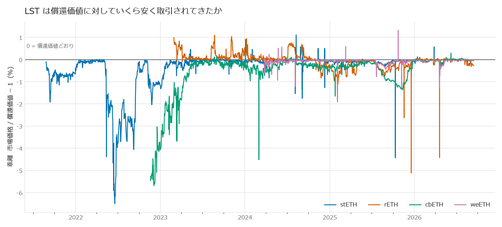
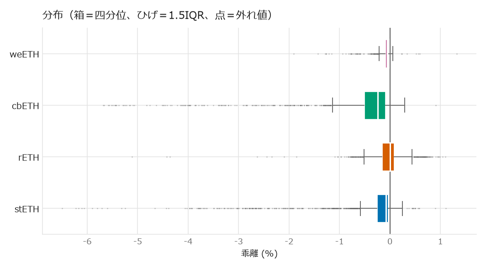

# LST の市場価格と償還価値の乖離

`乖離 = 市場価格 / 償還価値 - 1`。負なら市場が償還価値より安い。

市場価格は Chainlink の `<LST>/ETH` フィード(全 phase)、
償還価値はプロトコルのイベントログから復元した 1 シェアあたり ETH。
結合は `join_asof(strategy="backward")` で、**その時点までに確定している
レートだけ**を使っている。

★ stETH はリベース型なので償還価値は定数 1.0 である
(1.2439 は wstETH 相当のレートで、stETH トークンの対 ETH 価値ではない)。

## 要約

| フィード | 件数 | 期間 | 乖離 中央値 | 5%点 | 最安 | 最安の日 |
|---|---:|---|---:|---:|---:|---|
| cbETH/ETH | 1,454 | 2022-11-18 〜 2026-09-13 | -0.243% | -2.834% | **-5.68%** | 2022-12-04 |
| rETH/ETH | 1,335 | 2023-02-27 〜 2026-09-13 | 0.005% | -0.597% | **-5.11%** | 2025-12-18 |
| stETH/ETH | 1,995 | 2021-08-25 〜 2026-09-14 | -0.079% | -2.485% | **-6.50%** | 2022-06-18 |
| weETH/ETH | 999 | 2024-03-22 〜 2026-09-14 | -0.046% | -0.322% | **-1.91%** | 2025-02-03 |

## -1% を超える割安がどれだけあったか

| フィード | 該当ラウンド | 全体に占める割合 | 該当した日数 |
|---|---:|---:|---:|
| cbETH/ETH | 216 | 14.86% | 197 |
| rETH/ETH | 11 | 0.82% | 6 |
| stETH/ETH | 232 | 11.63% | 198 |
| weETH/ETH | 7 | 0.70% | 4 |

## -1% を下回った局面の持続時間

同じ深さの乖離でも、**数日続いたもの**と**数分で消えたもの**では
取りに行けるかがまるで違う。閾値を下回る点が連続した区間を 1 局面として
まとめ、その長さを出した。

区間の長さは「閾値を下回っていた最初の観測から最後の観測まで」で、
観測はチェーンリンクの更新時点である。更新は不規則(数分〜1 日)なので、
**長さは下限の目安**であって正確な継続時間ではない。

| フィード | 局面数 | うち 1 時間以上 | うち 1 日以上 | 最長 | 最長局面の最安 | 最長局面の開始 |
|---|---:|---:|---:|---:|---:|---|
| cbETH/ETH | 5 | 2 | 2 | 3455.5h | -5.68% | 2022-11-18 |
| rETH/ETH | 4 | 1 | 1 | 48.0h | -1.09% | 2025-02-03 |
| stETH/ETH | 25 | 6 | 6 | 3040.2h | -6.50% | 2022-05-12 |
| weETH/ETH | 6 | 0 | 0 | 0.0h | -1.91% | 2025-02-03 |

### 長かった局面 上位 10

| フィード | 開始(UTC) | 終了(UTC) | 長さ | 観測点 | 最安 |
|---|---|---|---:|---:|---:|
| cbETH/ETH | 2022-11-18 16:25 | 2023-04-11 15:55 | 3455.5h | 158 | -5.68% |
| stETH/ETH | 2022-05-12 17:12 | 2022-09-16 09:26 | 3040.2h | 131 | -6.50% |
| cbETH/ETH | 2025-10-07 20:44 | 2025-11-24 21:00 | 1152.3h | 49 | -1.37% |
| stETH/ETH | 2022-11-18 09:52 | 2022-12-22 14:25 | 820.5h | 36 | -2.04% |
| stETH/ETH | 2022-12-24 14:26 | 2023-01-07 14:31 | 336.1h | 15 | -1.32% |
| stETH/ETH | 2021-09-09 19:09 | 2021-09-15 19:10 | 144.0h | 7 | -1.92% |
| stETH/ETH | 2022-11-12 09:50 | 2022-11-14 09:51 | 48.0h | 3 | -1.31% |
| rETH/ETH | 2025-02-03 09:56 | 2025-02-05 09:56 | 48.0h | 3 | -1.09% |
| stETH/ETH | 2022-11-09 09:49 | 2022-11-10 09:50 | 24.0h | 2 | -1.16% |
| stETH/ETH | 2025-10-10 21:23 | 2025-10-10 21:46 | 0.4h | 14 | -4.43% |

### 深いが短かった局面（最安 上位 10）

深さだけで選ぶとこちらが並ぶ。**長さの列を見ること。**

| フィード | 開始(UTC) | 長さ | 観測点 | 最安 |
|---|---|---:|---:|---:|
| stETH/ETH | 2022-05-12 17:12 | 3040.2h | 131 | -6.50% |
| cbETH/ETH | 2022-11-18 16:25 | 3455.5h | 158 | -5.68% |
| rETH/ETH | 2025-12-18 05:40 | 0.0h | 4 | -5.11% |
| cbETH/ETH | 2024-02-29 22:54 | 0.3h | 7 | -4.52% |
| stETH/ETH | 2025-10-10 21:23 | 0.4h | 14 | -4.43% |
| rETH/ETH | 2026-04-19 16:22 | 0.1h | 3 | -4.42% |
| rETH/ETH | 2025-11-17 22:21 | 0.0h | 1 | -2.63% |
| stETH/ETH | 2025-10-10 21:52 | 0.2h | 5 | -2.40% |
| stETH/ETH | 2022-11-18 09:52 | 820.5h | 36 | -2.04% |
| stETH/ETH | 2021-09-09 19:09 | 144.0h | 7 | -1.92% |

## 最も割安だった日(フィードごとに上位 5 日)

### cbETH/ETH

| 日 | その日の最安乖離 | 市場価格 | 償還価値 |
|---|---:|---:|---:|
| 2022-12-04 | -5.68% | 0.959895 | 1.017741 |
| 2022-12-03 | -5.66% | 0.959996 | 1.017641 |
| 2022-12-07 | -5.58% | 0.961218 | 1.018057 |
| 2022-12-05 | -5.57% | 0.961172 | 1.017844 |
| 2022-12-06 | -5.52% | 0.961786 | 1.017953 |

### rETH/ETH

| 日 | その日の最安乖離 | 市場価格 | 償還価値 |
|---|---:|---:|---:|
| 2025-12-18 | -5.11% | 1.114217 | 1.152909 |
| 2026-04-19 | -4.42% | 1.138723 | 1.161695 |
| 2025-11-17 | -2.63% | 1.137965 | 1.150698 |
| 2025-02-05 | -1.09% | 1.115600 | 1.127918 |
| 2025-02-04 | -1.04% | 1.116138 | 1.127835 |

### stETH/ETH

| 日 | その日の最安乖離 | 市場価格 | 償還価値 |
|---|---:|---:|---:|
| 2022-06-18 | -6.50% | 0.935019 | 1.000000 |
| 2022-06-17 | -6.22% | 0.937752 | 1.000000 |
| 2022-06-20 | -6.17% | 0.938330 | 1.000000 |
| 2022-06-16 | -6.10% | 0.938969 | 1.000000 |
| 2022-06-19 | -6.06% | 0.939387 | 1.000000 |

### weETH/ETH

| 日 | その日の最安乖離 | 市場価格 | 償還価値 |
|---|---:|---:|---:|
| 2025-02-03 | -1.91% | 1.049659 | 1.059147 |
| 2025-11-07 | -1.28% | 1.070091 | 1.080890 |
| 2026-04-19 | -1.27% | 1.084641 | 1.092943 |
| 2024-08-05 | -1.21% | 1.037138 | 1.044622 |
| 2024-05-20 | -0.94% | 1.034756 | 1.038841 |

## 読むときの注意

- **これは執行可能な利益ではない。** 乖離はガス・スワップ手数料・
  スリッページ・償還待ちの期間リスクを引く前の値である。
  `DEFI_RESEARCH_THEMES.md` §24 の `Economic Significance` を出すには、
  その乖離で**実際に約定できた数量**を板から見る必要がある
- Chainlink は更新に閾値と時間の条件があり、**小さな変動は記録されない**。
  よってここの乖離は実際の瞬間値より粗い。日中の一時的な大きい乖離は
  取りこぼしている可能性がある
- 償還価値は「いま償還したら受け取れる ETH」であって、
  **即座に償還できるとは限らない**。Lido の出金待ち行列、Rocket Pool の
  流動性上限などがあり、待ち時間そのものがリスクである
