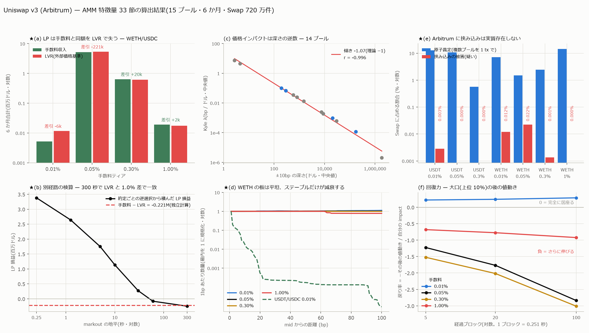

# AMM 特徴量 — 33 節すべての算出

[← 索引](README.md)

Uniswap v3(Arbitrum)15 プール × 6 か月(2026-03-10 〜 2026-09-06)、
Swap 720 万件から、指定された 33 節・80 群の特徴量を算出した。



---

## 1. 何を作ったか

| ファイル | 粒度 | 行 | 列 | 容量 | 主な中身 |
|---|---|---:|---:|---:|---|
| `data/feat/ev_<pair>_<fee>.parquet` | **Swap 1 件** | 7,206,867 | 80 | 3,388 MB | 価格・フロー・インパクト・markout(2/3/8/9/11/21/25 節) |
| `data/feat/bk_<pair>_<fee>.parquet` | 断面(1 時間) | 64,919 | 83 | 15 MB | 深さ・非対称・形・空隙・崖・資本効率(4/5/6/7/22 節) |
| `data/feat/pos_<pair>_<fee>.parquet` | **Mint / Burn 1 件** | 504,969 | 26 | 31 MB | レンジ・在庫・JIT・タイミング(14/15/16/17/18 節) |
| `data/feat/lp_<pair>_<fee>.parquet` | 1 時間 | 40,538 | 34 | 7 MB | 手数料・LVR・IL・裁定乖離・健全性(12/13/19/30 節) |
| `data/feat/mev_<pair>_<fee>.parquet` | **Swap 1 件** | 7,206,867 | 8 | 18 MB | 原子裁定・挟み込み(27 節) |
| `data/feat/panel_<pair>_<fee>.parquet` | 1 時間 | 40,538 | **275** | 55 MB | 全段の結合 + 回復力・Kyle λ・TWAP・交互作用 |
| `data/feat/xpool_<pair>.parquet` | 1 時間 | 16,788 | 13 | 1 MB | ティア間シェアと価格分散(31 節) |

合計 **3.5 GB**。台帳は `data/feat/manifest_final.csv`。

### 台帳(実装前の見立て → 実績)

| | 群数 |
|---|---:|
| **可**(そのまま算出した) | **67** |
| 一部(定義を狭めれば算出できる) | 7 |
| **不可**(このデータでは原理的に出ない) | **5** |
| モデル(仮定を置けば作れる) | 1 |

見立てから変わったのは 3 節:

| 節 | 見立て | 実績 | 理由 |
|---|---|---|---|
| 29 LP 別 | 可 | **不可** | owner の 97.3% が NonfungiblePositionManager。§4 に詳述 |
| 33 オラクル | 不可 | **可** | `observe()` は読めないが `tickCumulative` を等価に再現できた |
| 18 LP タイミング | モデル | **可** | mint 前後 1 時間の実現分散比として直接測れた |

---

## 2. ★主要な結果

### 2-1. LP は手数料と同額を LVR で失う(12/13 節)

WETH/USDC 0.05%・180 日:

| | 金額 |
|---|---:|
| 手数料収入 | **+$5,136,147** |
| LVR(外部価格基準) | **−$5,357,431** |
| **差引** | **−$221,283** |

出来高 $10.27B に対して手数料率は 5.001bp(理論値 5bp と一致)。
**差引は出来高の −0.2155bp**。手数料 5.0011bp を稼いで 5.2166bp を
失っており、差し引きで手数料収入の 4.3% ぶん負けている。

ティア別:

| ティア | 手数料 | LVR | 差引 |
|---|---:|---:|---:|
| 0.01% | $5,218 | $11,671 | **−$6,453** |
| 0.05% | $5,136,147 | $5,357,431 | **−$221,283** |
| 0.30% | $639,384 | $619,248 | **+$20,136** |
| 1.00% | $19,015 | $17,502 | **+$1,513** |

★**中央値と合計が食い違う。**1 時間ごとの差引年率の中央値は 0.05% ティアで
**+0.6%** だが、合計は負である。LVR が少数の高変動時間に集中しているためで、
**中央値だけを見ると「LP は儲かっている」と読み違える**(自己精査 C11)。

### 2-2. ★独立な検算 — 約定ごとの逆選択が LVR に収束する(図 b)

LVR は「外部価格の実現分散 × L√P」から、逆選択は「約定 1 件ごとの markout ×
数量」から出る。**入力も経路も別**である。それが一致した:

| markout の地平 | 逆選択(累計) | LP 損益 |
|---|---:|---:|
| 1 ブロック(0.25 秒) | $1,755,094 | +$3,381,053 |
| 20 ブロック(5 秒) | $3,385,416 | +$1,750,731 |
| 60 秒 | $5,216,370 | −$80,228 |
| **300 秒** | **$5,382,677** | **−$246,575** |
| LVR(独立計算) | **$5,357,431** | −$221,283 |

300 秒時点の逆選択 $5,382,677 と LVR $5,357,431 の差は **0.47%**。
LP 損益で見ても −$246,575 対 −$221,283(差 11%)。
**二つの定義が同じ数字に落ちるので、どちらの実装も通ったと見なせる。**

### 2-3. 価格インパクトは深さの逆数(9 節・図 c)

14 プールの Kyle λ(中央値)と ±10bp 深さ(中央値)を両対数で取ると

    傾き −1.07(理論 −1)、 r = −0.996、 7 桁にわたって直線

λ は $1 の符号つき出来高が何 bp 動かすかで、深さは同じ時刻の板から独立に
測った量である。**理論値 −1 が実測で出た**ので、板の再構成と λ の推定が
互いに整合している。

### 2-4. ★WETH の板は平坦、減衰するのはステーブルだけ(6 節・図 d)

log 数量を距離に回帰した減衰の傾き(bp あたり・中央値):

| プール | 傾き | 意味 |
|---|---:|---|
| WETH/USDC 0.01% | +0.0001 | **平坦** |
| WETH/USDC 0.05% | −0.0001 | **平坦** |
| WETH/USDC 0.30% | +0.0001 | **平坦** |
| USDT/USDC 0.01% | **−0.0696** | 100bp で e^−7 ≒ 1/1,100 |
| USDT/USDC.e 0.01% | **−0.0979** | |

WETH のプールでは **±100bp の範囲で実効流動性 L がほとんど変わらない**。
CLOB の「最良気配から離れるほど薄い」という直感は AMM の主要プールには
当てはまらない。これは既報の
「AMM に板の非対称は存在しない」(`l2_from_amm.md` §3-3)と同じ根から来る —
L(P) が連続関数で、tick 境界が窓の内側に入らない限り形が変わらないためである。

**★研究方針書 §3.1(Tick-Level Liquidity Imbalance)への答えは引き続き否定的。**
AMM で板から取れる情報は**非対称でも形でもなく水準**(深さそのもの)にある。
その水準は λ を通じて価格インパクトを完全に決めている(2-3)。

### 2-5. Arbitrum に挟み込みは実質存在しない(27 節・図 e)

| プール | 原子裁定(件数) | 原子裁定(数量) | 挟み込み被害 |
|---|---:|---:|---:|
| WETH/USDC 0.05% | 1.5% | 1.9% | **0.022%** |
| WETH/USDC 0.30% | 2.4% | 4.9% | 0.001% |
| USDT/USDC 0.01% | 12.9% | 6.8% | 0.003% |

Arbitrum の sequencer は先着順で、攻撃者が被害者の取引の前後に自分の取引を
差し込めない。**Ethereum L1 の数字をそのまま Arbitrum に当てはめてはいけない。**

### 2-6. ★JIT は 0.23% — 素朴な数え方だと 68 倍まちがえる(17 節)

WETH/USDC 0.05%(mint 154,648 件):

| 数え方 | 件数 | mint に占める割合 |
|---|---:|---:|
| 同一 tx に mint と burn が共存 | 24,168 組 | 15.63% |
| └ うち **burn が先**(= 建て直し・手数料回収) | 20,586 | 85.2% |
| └ うち mint が先(JIT の形) | 3,582 | 14.8% |
| **その間に他者の Swap がある(= 真の JIT)** | **356** | **0.230%** |

「同一 tx の mint+burn」を JIT と数えると 15.63%。**実際は 0.230% で 68 倍違う。**
しかも JIT の本体は同一 tx ではなく**同一ブロックの別 tx**である(攻撃者は
被害者の Swap を自分の tx で包めない)。同一ブロック定義でも 0.230% で変わらず、
これも Arbitrum の先着順 sequencer と整合する。

### 2-7. 大口の後、値は戻らず伸びる(10 節・図 f)

インパクト上位 10% の Swap の後、`−(その後の値動き)/(自分のインパクト)`:

| ティア | 5 ブロック | 20 ブロック | 100 ブロック |
|---|---:|---:|---:|
| 0.01% | +0.22 | +0.24 | +0.29 |
| 0.05% | **−1.23** | **−1.77** | **−2.84** |
| 0.30% | −1.52 | −2.02 | −3.01 |
| 1.00% | −0.68 | −0.78 | −0.92 |

主要ティアでは**負**、つまり値は戻らずさらに伸びる。25 秒後(100 ブロック)
には最初のインパクトの約 3 倍まで進む。**AMM の大口は情報を持っている**(あるいは
大口そのものが後続の裁定を呼ぶ)。CLOB で言う「板の回復」は起きない。

### 2-8. その他の実測値

| 節 | 量 | WETH/USDC 0.05% |
|---|---|---|
| 19 裁定 | CEX との \|乖離\| 中央 | **2.59 bp**(無裁定帯 5bp の内側) |
| 19 | 乖離が 5bp を超えている時間 | **9.0%** |
| 31 プール間 | 出来高シェア(中央) | 0.05% が **98.12%**、0.30% が 1.37% |
| 31 | 深さシェア(中央) | 0.05% が 88.98%、0.30% が 10.75% |
| 31 | ティア間価格差(1.00% 除く・中央) | 11.56 bp(※下記の注を読むこと) |
| 33 オラクル | 10 分 TWAP と spot の \|乖離\| 中央 | **3.32 bp** |
| 15 レンジ | mint のレンジ幅(中央) | **1,070 bp**、四分位 400 〜 2,120 |
| 15 | 発注時に価格がレンジ内 | 80.9%(片側のみ 19.1%) |
| 18 タイミング | mint 直後 1h / 直前 1h の実現分散 | **0.929** |

★**ティア間価格差 11.56bp は裁定の失敗ではなく、比べ方の副作用である。**
ここでの価格は「その 1 時間で最後に約定した価格」なので、約定頻度の違う
プール同士では**比べている時刻が数分ずれる**(0.05% は 27 件/時、
0.30% は 2.4 件/時、0.01% は 5 件/時)。ずれた時刻の値動きを
価格差として数えてしまっている。**同じブロックで揃えた正しい測定は
[`leadlag_fee.md`](leadlag_fee.md) にある** — そちらでは 0.01% と 0.30% は
統計的に区別できず(p=0.35)、構造的にずれるのは 1.00% だけだった。

18 節については、**LP は変動が下がる直前に入れている**(比 0.93)。ただし
これは中央値の比で、効果は 7% と小さい。**有意性の検定は行っていないので
「タイミングが上手い」とは言わない**(自己精査 C9)。

---

## 3. ★途中で見つけて直した誤り

**すべて自分の数字を読み直して見つけたものである。順に記録する。**

### 3-1. LVR を AMM 自身の価格経路で積んでいた(7 倍の過小評価)

LVR = (σ²/4)·L·√P の σ は**外部価格**の変動率である。裁定者は外部市場に
対して裁定するので、AMM の価格が手数料帯の中を引きずられる分は LVR に
数えられない。実測:

| 系列 | 実現分散(180 日) | 年率 |
|---|---:|---:|
| AMM 自身・Swap 刻み | 0.02387 | 22.0% |
| AMM 自身・1 時間刻み | 0.14084 | 53.4% |
| **CEX ETHUSDT・1 分刻み** | **0.13840** | **52.9%** |

AMM の swap 刻みが小さいのは、増分の 1 次自己相関が **+0.28**、分散比が
**5.9** だからである(細かく測るほど分散が減るのは、同じ向きに小刻みに
押されている証拠)。1 時間刻みなら AMM と CEX は **0.1% 以内**で一致する。

→ 外部価格に置き直して LVR は $712k から **$5,357k** になった。
これで手数料 $5,136k とほぼ同額になり、2-2 の独立検算とも合った。
**直す前は「LP は $4.45M の黒字」という真逆の結論だった。**

このために Binance Vision から ETHUSDT / AAVEUSDT の 1 秒足
(15,638,400 行・欠損日 0)を取得した。

### 3-2. 手数料を出力側のトークンで計上していた

v3 の手数料は**入力側**のトークンから引かれる。買い(token1 が入る)なら
token1、売り(token0 が入る)なら token0。両方を token1 建てに揃えていなかった。

### 3-3. LP 側 markout で手数料を二重計上していた

`p_exec = amount1/amount0` には手数料が既に入っている(v3 は入力額に手数料を
含めて報告する)。LP 損益は taker の符号違いそのもので、ここに手数料を
足すと二重になる。

### 3-4. 1 時間に断面が 2 つある時間があり、結合で行が増えていた

断面の間隔は 14,354 ブロック ≒ 3,603 秒なので、1 時間に 2 つ落ちる時間が
**16 ある**。畳まずに結合したため手数料合計が **1.6% 水増し**されていた
($5,219,215 → 正 $5,136,147)。
**手数料合計を 2 か所で計算して食い違ったので気づいた**(自己精査 D14)。

### 3-5. polars の `median` が NaN を欠損扱いせず、回復力が全滅していた

回復力は大口以外 NaN なので、そのまま `median` を取ると 1 時間ぶん丸ごと
NaN になる。**「全 NaN」という警告が出ていたのに一度見過ごした。**
集計前に `fill_nan(None)` で null に落とした。

### 3-6. JIT の定義が狭すぎ、かつ素朴な定義は 68 倍ずれる

2-6 のとおり。最初は「同一 tx の mint+burn」で数えており、
(a) 建て直し 85.2% が混ざる (b) 本体である同一ブロック別 tx を取りこぼす、
の両方を踏んでいた。

### 3-7. 段の中点で帯を切ったため 1.00% ティアの断面が丸ごと消えていた

`px_from` は段の**境界**で、1.00%(段幅 200bp)では最寄り境界が中央 100bp
先にある(実測 min 99.5bp)。±100bp で切ると段がゼロになり、
`max_gap_bp` が全 NaN になっていた。段 1 は距離によらず必ず残すよう直した。

### 3-8. `amount1 = 0` の Swap が実在し `log(0)` を出していた

片側 0 の Swap があるため、`p_exec` の判定を `vol0 > 0` だけにしていると
`-inf` が入る。両方で守るよう直した。

---

## 4. ★このデータでは出ないもの(5 群)

### 4-1. LP の身元(29 節)— **不可**

Mint の **97.3%** は owner が `0xc36442b4…fe88` = NonfungiblePositionManager
である。プールのイベントはポジションを `(owner, tick_lower, tick_upper)` で
しか区別しないので、**NFPM 配下の全 LP が同じ鍵に潰れる**。

これは Swap の `sender` が router になる問題と**同型**である。
復元するには NFPM の `IncreaseLiquidity` / `DecreaseLiquidity`(tokenId 付き)と
`Transfer`(tokenId → 保有者)を別途取得する必要がある。取得していない。

→ `pos_*` の集計は「**鍵ごと**」であって「LP ごと」ではない。そう呼ばない。

### 4-2. トレーダーの身元(28 節)— **一部**

同上。`sender` / `recipient` は router なので、「大口ウォレット」「勝ち組
アドレス」の類は**作れない**。27 節の挟み込み判定を身元ではなく
**パターン**(向き・数量の一致・別 tx・間に他者の Swap)で組んだのはこのため。
結果も「挟み込み**疑い**」と呼んでいる。

### 4-3. gas(13 / 19 / 21 節の一部)— **不可**

ログには gas が入っていない。したがって
「gas 控除後の LP 損益」「gas 調整後の裁定利益」「gas 込みの実効スプレッド」
は算出していない。receipt を別途取得すれば可能。

### 4-4. DEX 間(32 節)— **不可**

Arbitrum の他 DEX(Camelot / Curve / Balancer 等)のログを取得していない。
**「存在しない」のではなく「見ていない」**である。

### 4-5. `observe()` の ring buffer そのもの — ただし**中身は再現した**

オラクルが積んでいるのは `tickCumulative = ∫ tick dt` で、これは Swap 全件と
tick から**同値に再現できる**。ring buffer の生の中身(cardinality の履歴・
上書き位置)は読めないが、TWAP の値そのものは出せる。
時刻はブロック時刻の補間(誤差 中央 0.3 秒)なので、600 秒窓に対して 0.05%。

---

## 5. 時間契約(これを外すと全部が無意味になる)

列名で 3 つに分けてある。**混ぜて回帰しない。**

| 接頭辞 | 意味 | 使い方 |
|---|---|---|
| なし | その時点・その窓が**終わった時点**で確定する量 | 同時点の記述にのみ使う |
| `lag1_` | 1 つ前の時間の値 | **説明変数に使えるのはこれ** |
| `fwd_` / `mk_` | 未来を見る量 | **目的変数専用** |

守っていること:

1. 窓 `[T−Δ, T)` の特徴量は `T` 以降のリターンにしか使わない。
   `panel_*` は 1 時間の集計値なので、**同じ 1 時間のリターンを説明させない**
2. asof 結合はすべて backward(`searchsorted(..., "right") − 1`)
3. `shift(-1)` は `fwd_ret_bp` / `fwd_rv_bp2` / `fwd_volume1` だけ
4. 裁定乖離の中心は**過去 24 時間の移動中央値**で取る
   (全標本の中央値を引くと未来が混ざる)
5. 順序の真値は `(block_number, log_index)`。**同一ブロック内の並びはビルダーが
   決める**ので、ブロックより細かい因果は主張しない
6. 壁時計はブロック時刻の補間。**秒より細かい主張はしない**

★**残っている全標本依存が 1 つある。**回復力(10 節)の「大口」の閾値は
全期間の \|impact\| の 90% 分位で決めている。これは記述のための測定であり、
出力列も `fwd_` で目的変数側に置いてあるが、**説明変数として使うなら
訓練期間だけで閾値を引き直すこと。**

---

## 6. 限界

1. **Arbitrum の 15 プールのみ。**他チェーン(ethereum / base / avalanche)は
   生ログを取得済みだが、復号と tick 錨の取得がまだ
2. **断面(板)は 1 時間ごと。**BBO と Swap 由来の量は全件だが、
   板の形の列は 1 時間粒度である
3. **外部参照は WETH と AAVE のみ。**USDT/USDC 系には対応する CEX 1 秒足が
   ないので、**LVR・裁定乖離が出ていない**(表では「—」)
4. **参照は ETHUSDT であって ETHUSDC ではない。**USDT/USDC のベーシス分だけ
   乖離に下駄が乗る。24 時間移動中央値で中心を取って除いているが、
   ベーシスの変動そのものは残る
5. **v4 は対象外**(hook があると板の意味が変わる)
6. 26 節(期待値動き)は**材料だけ**を出した。`pressure` / `kyle_lambda` /
   `depth_*` から組めるが、モデルの形を決めていないので算出していない

---

## 7. 再現手順

```bash
uv run python scripts/fetch_cex_ref.py --symbol ETHUSDT      # 外部参照
uv run python scripts/fetch_cex_ref.py --symbol AAVEUSDT
uv run python scripts/build_l2.py --levels 25 --step-bp 1 --max-bp 100
uv run python scripts/amm_feat_manifest.py                   # 台帳(見立て)
uv run python scripts/amm_feat_events.py                     # 第 1 段
uv run python scripts/amm_feat_book.py                       # 第 2 段
uv run python scripts/amm_feat_lp.py                         # 第 3 段
uv run python scripts/amm_feat_mev.py                        # 第 4 段
uv run python scripts/amm_feat_panel.py                      # 第 5 段
uv run python scripts/amm_feat_finalize.py                   # 台帳(実績)
uv run python scripts/plot_amm_features.py
```

入力は `data/events/{swap,mint,burn,collect}.parquet`、`data/block_ts.parquet`、
`data/l2/*`、`data/cex/*`。`data/` は版管理外(`E:/Uniswap-arb/data/`)。
