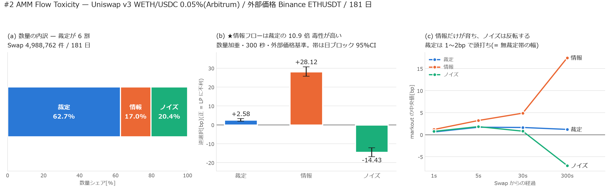

# ★#2 AMM Flow Toxicity — 情報を持つのは裁定ではない

[← 索引](README.md)

Uniswap v3 WETH/USDC 0.05%(Arbitrum、Swap 4,988,762 件・181 日)を、
外部価格 Binance ETHUSDT との関係で **Arbitrage / Informed / Noise** に分け、
種類ごとの逆選択を測った。

---

## 0. 結論

**数量の 6 割は裁定だが、毒性は裁定でない 17% に集中している。**

| 種類 | 件数 | 数量シェア | 逆選択(数量加重・300 秒) | 日ブロック 95%CI |
|---|---:|---:|---:|---|
| **Arbitrage** | 3,091,110 | **62.7%** | **+2.59 bp** | [+2.00, +3.27] |
| **Informed** | 809,381 | **17.0%** | **+28.12 bp** | [+25.69, +30.74] |
| **Noise** | 1,088,271 | **20.4%** | **−14.43 bp** | [−16.79, −12.14] |

正 = LP に不利。**情報フローは裁定の 10.9 倍**の毒性を単位数量あたりで持つ。
ノイズは負、つまり **LP はノイズ取引から利益を得ている**(価格が戻るため)。

---

## 1. 分類の定義

従来のこの種の分析は markout の符号で「毒かどうか」を決めるが、それは
**結果の言い換え**でしかない。ここでは外部価格への距離で裁定を定義どおり同定する。

$$
\text{gap}_{\text{before}} = \text{AMM の直前 mid} - \text{CEX},
\qquad
\text{gap}_{\text{after}} = \text{AMM の直後 mid} - \text{CEX}
$$

| 種類 | 条件 |
|---|---|
| **Arbitrage** | $\lvert \text{gap}_{\text{after}} \rvert < \lvert \text{gap}_{\text{before}} \rvert$(外部価格へ寄せた) |
| **Informed** | 裁定ではなく、300 秒 markout が手数料(5bp)を超えて不利 |
| **Noise** | それ以外 |

★**Arbitrage の判定はその Swap 自身の結果だけを使う**(未来を見ない)。
Informed の判定は markout を使うので**事後分類**であり、予測には使えない。

### ★閾値の取り方で 1,900 倍変わる

最初は「手数料を超えて縮めた」($\text{closed} > 5\,\text{bp}$)を裁定の条件にした。
結果は **500 万件中 1,625 件(0.03%)**。あり得ない少なさである。

原因は、**乖離そのものの中央値が 5.17 bp** で手数料とほぼ同じだったこと。
無裁定帯の幅が手数料で決まっている以上、「手数料ぶん丸ごと縮める」ことを
要求すると裁定の大半が落ちる。方向だけの条件($\text{closed} > 0$)に直すと
**62.0%** になった。

ただしこの条件は緩く、**縮め幅の中央値は 0.18 bp** しかない。

| 分位 | p10 | p25 | p50 | p75 | p90 | p99 |
|---|---:|---:|---:|---:|---:|---:|
| 縮め幅[bp] | 0.03 | 0.08 | 0.18 | 0.33 | 0.52 | 1.31 |

「裁定」に分類された Swap の多くは、乖離をわずかに縮めただけの取引である。
**方向による分類であって、意図の同定ではない。**

---

## 2. 時間の育ち方が種類を分ける

| 種類 | 1 秒 | 5 秒 | 30 秒 | 300 秒 |
|---|---:|---:|---:|---:|
| Arbitrage | 0.619 | 1.64 | 1.643 | 1.205 |
| **Informed** | 1.179 | 3.24 | 4.891 | **17.445** |
| Noise | 0.759 | 1.76 | 0.803 | **−7.003** |

- **裁定は 1〜2 bp で頭打ち**になる。これは無裁定帯の幅そのもので、
  裁定者は帯の縁まで動かして止まる
- **情報だけが育つ**(30 秒 4.9 → 300 秒 17.4 bp)。価格が継続して進む
- **ノイズは反転する**(30 秒 +0.8 → 300 秒 −7.0 bp)

---

## 3. ★踏んだ誤り 2 件(どちらも既に本リポジトリで記録済みだったもの)

### 3-1. markout を AMM 自身の価格経路で積んだ

最初の集計は LP 損益の合計が **+$475k(黒字)** になった。
既存の実測は **−$221k** である(`amm_features.md` §2-1)。

原因は markout を**AMM 自身の mid 経路**で積んだこと。
`amm_features.md` §3-1 に「AMM 経路だと LP が +$4.45M の黒字、
外部価格だと −$221k」と**すでに記録されていた誤り**を再現してしまった。

外部価格で積み直すと、種類ごとの差も変わる。

| 種類 | AMM 自身の経路 | 外部価格 | |
|---|---:|---:|---|
| Arbitrage | +6.06 bp | **+2.59 bp** | AMM 経路は **2.3 倍 過大** |
| Informed | +23.12 bp | **+28.12 bp** | AMM 経路は 過小 |
| Noise | −15.64 bp | **−14.43 bp** | ほぼ同じ |

★**誤差の向きは種類によって逆になる。**裁定は AMM 価格を自分で動かすので
AMM 経路だと毒性が水増しされ、情報フローは逆に薄まる。
「AMM 経路は一律に過小評価」ではない。

### 3-2. 手数料の二重計上

次に約定価格 $\text{exec} = \lvert \text{amount1} \rvert / \lvert \text{amount0} \rvert$ を
基準に損益を積み直したところ、逆選択の合計が **−$179k** まで縮み、
ノイズが **+$5,284k** という非現実的な利益になった。

Uniswap の `amount` は**手数料込み**なので、`exec` に既に手数料が入っている。
そこへ手数料を別途足すと二重計上になる。これも `amm_features.md` §3-3 に
記録済みの誤りだった。

**結論: LP 損益の絶対額は再導出しない。**既存レポートが手数料 $5,136k 対
LVR $5,357k を二経路で検証済みなので、本稿は **bp の水準と構成比だけ**を出す。

---

## 4. 限界

| | |
|---|---|
| 分類は方向のみ | 縮め幅の中央値 0.18 bp。意図の同定ではない |
| Informed は事後分類 | markout を使うので**予測には使えない**。「毒を事前に避ける」という主張には転用できない |
| Liquidation / Rebalancing | 方針書 §2.4 は 5 分類を挙げるが、本稿は 3 分類。清算は Arbitrum の Uniswap ログからは同定できない(貸借プロトコル側のイベントが要る) |
| 外部価格 | Binance spot 1 秒足。#11 で spot と perp が同一(lag0 = 0.965)と確認済みなので、どちらを使っても結論は変わらない |
| 対象 | 1 プールのみ。手数料ティアが違えば無裁定帯の幅も変わる |
