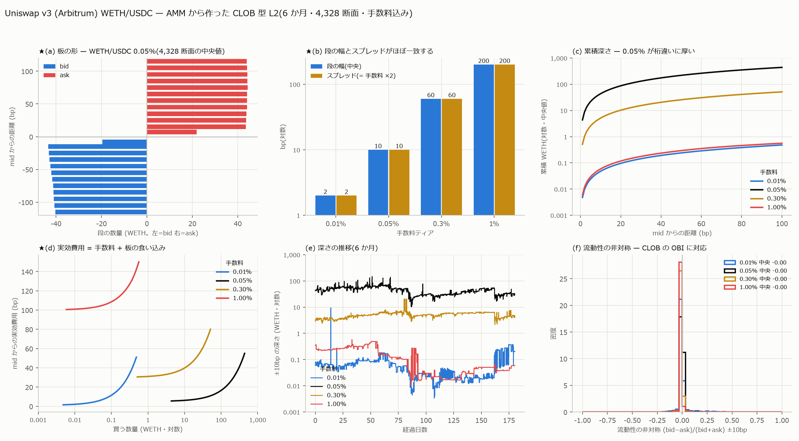

# AMM から CLOB 型 L2 を作る

[← 索引](README.md)

## 何を作ったか

Uniswap v3 の tick 別流動性を、**CLOB の L2 板と同じ形**に変換した。
Arbitrum の 15 プール × 6 か月 × 4,328 断面。

| ファイル | 内容 |
|---|---|
| `data/l2/<pair>_<fee>_tick.parquet` | **初期化 tick 境界ごとの段**(AMM の真の構造)。`px_from` / `px_to` / `px_vwap` / `sz0` / `sz1` / `cum_sz0` / `liquidity` |
| `data/l2/<pair>_<fee>_grid.parquet` | **1bp 刻み × ±100bp の段**(均一格子。CLOB と直接比較できる形) |
| `data/l2/<pair>_<fee>_bbo.parquet` | **Swap ごとの最良気配**(手数料込み)。`mid` / `bid` / `ask` / `bid_sz` / `ask_sz` / `spread_bp` / `liquidity` |



---

## 1. AMM の「板」とは何か — 3 つの決めごと

### 1-1. 価格水準 = 初期化済み tick の境界

そこで実効流動性 L が変わるので、CLOB の「段」に対応する。段と段の間は L が
一定で価格が連続に動く。

### 1-2. 段の数量は閉形式で出る

区間 [P_a, P_b] の実効流動性を L として

    amount0 = L (1/sqrt(P_a) - 1/sqrt(P_b))     … token0 の量
    amount1 = L (sqrt(P_b) - sqrt(P_a))         … token1 の量

**板を 1 段ずつ舐める必要が無く、近似がゼロ**である。CLOB では表示数量しか
見えない(隠れ注文は観測できない)のに対し、AMM は全量が厳密に判る。

### 1-3. ★スプレッドは手数料そのもの

限界価格 P は買いと売りで同じなので、**手数料を入れないと AMM の板は
スプレッド 0 になってしまう**。

    実効 ask = P / (1 - f)      (token0 を買う)
    実効 bid = P * (1 - f)      (token0 を売る)

幾何平均はちょうど P なので **P がそのまま mid** である。段ごとの平均約定価格
(amount1/amount0)にも同じ係数を掛けている。

### 1-4. 「最良気配の数量」は定義であって観測量ではない

CLOB の `bid_sz` は「最良値段にある数量」だが、AMM で厳密に最良値段にある量は
**無限小**である(価格が連続なので)。ここでは

    bid_sz / ask_sz = 最良から 1 bp 動かすのに要る token0 の量

とした(`--sz-bp` で変更可)。**比較するときは必ず同じ定義で揃えること。**

---

## 2. 検算

板の再構成そのものは `build_book.py` が **Swap 720 万件と完全一致(誤差 0)**を
確認済みなので、ここでは変換の検算だけを行った。

既存の検証済み `depth/`(bp 帯ごとの深さ)と突き合わせると:

| 帯 | 相対差(中央) |
|---|---:|
| 0–1bp | 6.3e-4 |
| 5–10bp | 6.3e-4 |
| 10–25bp | 1.6e-3 |
| 25–50bp | 3.6e-3 |
| 50–100bp | 7.3e-3 |

★**これはバグではなく帯の定義の違いである。**本レポートは bp を
**log(tick)空間**で定義し、既存 `depth` は**線形価格空間**で定義している。
同じ L・同じ P で定義だけを変えたときの差を解析的に出すと

| 帯 | 解析的に予測される差 | 実測の差 |
|---|---:|---:|
| 5–10bp | 7.50e-4 | 6.34e-4 |
| 10–25bp | 1.75e-3 | 1.63e-3 |
| 25–50bp | 3.75e-3 | 3.62e-3 |
| 50–100bp | 7.48e-3 | 7.31e-3 |

**予測と実測が一致する**ので、残差は定義差で完全に説明できる。bp の定義としては
log 空間が正しい。

### 途中で踏んだ誤り

**数量を raw 単位(wei)のまま出していた。**既存 `depth` と 10^18 倍ずれて
発覚した。人間単位(`amount0 / 10^dec0`)へ直した。割った後は相対差 1.4e-4 で
一致していたので、計算そのものは最初から正しかった。

---

## 3. ★AMM の板は CLOB と何が違うか

### 3-1. 段の幅とスプレッドがほぼ一致する

| ティア | 段の幅(中央) | スプレッド(= 手数料 ×2) |
|---|---:|---:|
| 0.01% | **2.00 bp** | 2 bp |
| 0.05% | **10.00 bp** | 10 bp |
| 0.30% | **60.00 bp** | 60 bp |
| 1.00% | **199.99 bp** | 200 bp |

偶然ではない。Uniswap は `tickSpacing` を手数料ティアに紐付けて設計しており、
**「1 段動かす費用 ≒ 往復手数料」**になっている。

### 3-2. CLOB との比較

| | Lighter(CLOB) | Uniswap 0.05%(AMM) |
|---|---:|---:|
| 段の幅 | ~0.1 bp | **10 bp**(100 倍粗い) |
| スプレッド | 1.28 bp(**観測量**・変動する) | **10 bp(定数・既知)** |
| 最良の数量 | 観測値(隠れ注文は見えない) | **定義が必要**(1bp 動かす量で中央 3.40 WETH ≒ $6,800) |
| 数量の精度 | 表示分のみ | **閉形式で厳密** |
| 待ち行列 | 存在する | **存在しない** |

### 3-3. ★★AMM に「板の非対称」は存在しない

流動性の非対称 LI = (bid − ask)/(bid + ask) を距離別に測った
(WETH/USDC 0.05%・4,328 断面):

| 距離 | 中央 | 標準偏差 | \|LI\|>0.1 の割合 |
|---|---:|---:|---:|
| ±1bp | −0.0000 | 0.0087 | 0.2% |
| ±5bp | −0.0001 | 0.0189 | 0.6% |
| ±10bp | −0.0005 | 0.0246 | 0.8% |
| ±100bp | −0.0073 | 0.0399 | 2.3% |

**同じ量を CLOB で測ると桁が違う。**

| | AMM ±5bp | **CLOB(Lighter MU)±5bp** |
|---|---:|---:|
| 標準偏差 | 0.0189 | **0.2763(15 倍)** |
| \|LI\|>0.1 | 0.6% | **65.9%** |

機構から当然である。AMM の流動性は現在価格をまたいで**連続な関数 L(P)**なので、
±w bp の買い側と売り側は**同じ L から計算される**。非対称が出るのは tick 境界が
窓の内側に入ったときだけで、しかもその効果は小さい。

★**研究方針書 §3.1「Tick-Level Liquidity Imbalance — CLOB の OBI に対応」への
答えは否定的である。**形式的には定義できるが**縮退している**。
Lighter で 222 特徴量中 1 位だった OBI に相当する情報は、AMM の板には無い。
AMM で板から取れる情報は**非対称ではなく水準**(深さそのもの)にある。

---

## 4. 生成物の規模

| 銘柄 | ティア | 断面 | tick 段 | BBO | 段の幅 |
|---|---|---:|---:|---:|---:|
| WETH/USDC | 0.01% | 4,328 | 214,711 | 881,672 | 2.00bp |
| WETH/USDC | **0.05%** | 4,328 | 215,953 | **4,988,762** | 10.00bp |
| WETH/USDC | 0.30% | 4,328 | 216,305 | 441,851 | 60.00bp |
| WETH/USDC | 1.00% | 4,328 | 216,378 | 27,721 | 199.99bp |
| WETH/USDC.e | 0.05% | 4,328 | 215,978 | 527,516 | 10.00bp |
| AAVE/USDC | 0.30% | 4,328 | 216,320 | 73,209 | 60.00bp |
| USDT/USDC | 0.01% | 4,328 | 212,072 | 177,061 | **1.00bp** |
| ほか 8 プール | | | | | |

合計 **354 MB**。版管理外(`E:/Uniswap-arb/data/l2/`)。

---

## 5. 限界

1. **断面は 1 時間ごと**(14,354 ブロック)。BBO は Swap ごとだが、
   梯子は 1 時間粒度である。細かくすると容量が比例して増える
2. **±20,000 tick の帯の外は再構成していない**(`fetch_ticks.py --band 20000`)。
   ±100bp の範囲では影響しないが、極端な値動きでは板が切れる
3. **最良気配の数量は定義依存**(§1-4)。CLOB と比べるときは定義を揃えること
4. **Arbitrum の 15 プールのみ。**他チェーン(ethereum / base / avalanche)は
   生ログを取得済みだが、復号と tick 錨の取得がまだである
5. **v4 は対象外。**hook があると板の意味が変わる

---

## 6. 再現手順

```bash
uv run python scripts/build_l2.py --levels 25 --step-bp 1 --max-bp 100
uv run python scripts/plot_l2.py
```

入力は `data/ticks_anchor.*`(錨の tick 状態)、`data/events/{swap,mint,burn}.parquet`、
`data/block_ts.parquet`。板の再構成は `build_book.py` と同じ手順
(錨から逆向きに Mint/Burn を打ち消す)を使っている。
