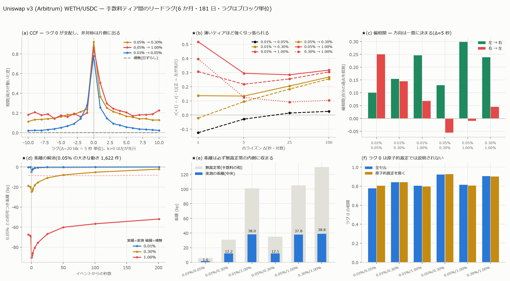

# WETH/USDC — 手数料ティア間のリードラグ

[← 索引](README.md)

## 何を測ったか

Arbitrum の Uniswap v3 に、WETH/USDC は**同じペアで手数料の違う 4 つのプール**がある
(0.01% / 0.05% / 0.30% / 1.00%)。同じ資産の価格を 4 本持っていることになるので、
**どれが先に動くか**を 6 か月・181 日で測った。

## 結論

**リードラグは存在する。方向は手数料ではなく活発さで決まり、
「厚いプールが薄いプールを引っ張る」。**

| 順位 | ティア | Swap 件数 | 値動きブロック |
|---|---|---:|---:|
| 1(先行) | **0.05%** | 4,988,762 | 1,752,011 |
| 2 | 0.01% | 881,672 | 813,852 |
| 2 | 0.30% | 441,851 | 144,167 |
| 4(追随) | **1.00%** | 27,721 | 22,492 |

**0.01% と 0.30% は互いに分離できない**(p=0.35)。それ以外の 5 組はすべて有意。



---

## 1. ★なぜブロック空間で測るのか

4 つのティアは**同じブロック列**の上にある。壁時計はブロック時刻の補間で
誤差 中央 0.3 秒あるが、**ブロック番号は厳密**である。よってラグは秒ではなく
**ブロック単位**で測った。1 ブロック = **0.251 秒**(実測: 62,133,737 ブロック / 180.3 日)。

    Δ = 4 blk ≈ 1.0s / 20 blk ≈ 5.0s / 100 blk ≈ 25.1s / 400 blk ≈ 100.4s

**mid は厳密である。**Uniswap v3 の価格は `Swap` でしか動かない
(`Mint`/`Burn` は流動性を変えるが `sqrtPriceX96` を変えない)。よって
「直前の Swap を持ち越す」のは補間ではなく**真の状態**で、深さスナップショット
4,328 点で相対誤差 0・tick 一致率 100% を確認済み。

**★ラグ 0 は「どちらが先か」を語れない。**同一ブロック内の順序(`log_index`)は
ビルダー(MEV)が決めるからである。ラグ 0 は「同一ブロック内で結びついている量」
として読む。

---

## 2. 帰無対照と、ゼロだらけの罠

**帰無 = 日ずらし**(A は当日、B は前日の同じブロック位置)。日周の共通性を
対照に残すため、巡回シフトではなく日ずらしを使った。

    帰無の相関は全ラグで |r| <= 0.0002(図 a の破線)

**ゼロだらけの罠。**AMM の価格は Swap でしか動かないので、薄いティアでは
大半の窓でリターンが**厳密に 0** になる。この 0 は「情報が無い」ではなく
「取引が無かった」である。そのまま相関を取ると**同時にゼロであること**が
相関を作る。Δ=5 秒での実例:

| ペア | 両方が動いた窓 | 全窓の r(0) | 両方動いた窓の r(0) |
|---|---:|---:|---:|
| 0.01% / 0.05% | 7.9% | +0.597 | +0.778 |
| 0.05% / 0.30% | 1.7% | +0.596 | +0.923 |
| **0.05% / 1.00%** | **0.3%** | +0.318 | **+0.865** |

1.00% ティアは全窓版と両方動いた版で **2.7 倍**違う。以下はすべて
**両方が動いた窓**で、件数を必ず添える。順位相関は同順位(ゼロ)が支配するので使わない。

---

## 3. CCF — 非対称はホライズンとともに開く

非対称 = r(+1) − r(−1)(正なら左のティアが先行)。日中央値と、日単位の符号検定。

| ペア | Δ=1.0s | Δ=5.0s | Δ=25.1s | Δ=100.4s |
|---|---:|---:|---:|---:|
| 0.01% → 0.05% | **−0.125** | −0.029 | +0.014 | +0.026 |
| 0.01% → 0.30% | −0.021 | +0.095 | +0.183 | **+0.255** |
| 0.01% → 1.00% | +0.307 | +0.217 | +0.255 | **+0.304** |
| 0.05% → 0.30% | +0.136 | +0.134 | +0.205 | **+0.268** |
| **0.05% → 1.00%** | **+0.517** | +0.295 | +0.284 | +0.317 |
| 0.30% → 1.00% | +0.395 | +0.124 | +0.091 | +0.104 |

**相手が薄いほど非対称が大きい。**0.05%→1.00% は 1 秒で +0.517 に達する。

★ただし **0.01% と 0.05% は CCF だと符号が反転する**(1 秒で −0.125、
100 秒で +0.026)。CCF は自己相関を統制しないので、これだけでは方向を決められない。

---

## 4. ★偏相関 — 方向はここで一意に決まる

corr(r_A(t), r_B(t+1) | r_B(t)) — 相手の直前の動きは、**自分の直前を超えて**
次を説明するか。Δ=20 blk(5 秒)、日ごとに差を取り符号検定。

| ペア | A→B | B→A | 差 | 差>0 の日 | p | 判定 |
|---|---:|---:|---:|---:|---:|---|
| 0.01% / 0.05% | +0.100 | **+0.250** | −0.157 | 22/181 | **8.3e-27** | **0.05% 先行** |
| 0.01% / 0.30% | +0.154 | +0.145 | +0.011 | 89/165 | 0.35 | **分離できない** |
| 0.01% / 1.00% | **+0.246** | +0.068 | +0.168 | 52/71 | 1.1e-04 | 0.01% 先行 |
| 0.05% / 0.30% | **+0.130** | −0.056 | +0.195 | 150/173 | **4.9e-24** | 0.05% 先行 |
| 0.05% / 1.00% | **+0.299** | −0.009 | +0.319 | 81/91 | **5.9e-15** | 0.05% 先行 |
| 0.30% / 1.00% | **+0.239** | +0.045 | +0.151 | 42/57 | 4.6e-04 | 0.30% 先行 |

**偏相関は CCF の符号反転を解消する。**0.05% は 0.01% を**全ホライズンで**先行する
(1 秒 +0.293 / 5 秒 +0.250 / 25 秒 +0.186、いずれも逆向きより大きい)。
CCF で長いホライズンに出た逆符号は、自己相関を統制しないことによる見かけである。

---

## 5. ★イベントスタディ — と、そこで踏んだ交絡

最も活発な 0.05% で**大きな動き**(直前 7 日の 99.9% 分位超、1,622 件)が
起きたブロックを起点に、各ティアの経路を追った。閾値は**当日を見ない**。

### 素の経路は「追随」として読めない

最初に各ティアの**自分の価格の累積経路**を描いたところ、0.30% と 1.00% が
50 秒で +17bp まで単調に上がり、起点の 0.05%(+2.6bp まで反転)を追い越した。
おかしいので起点の状態を調べた。

| ティア | 起点の符号つき乖離 | 絶対乖離 中央 | 起点価格の古さ |
|---|---:|---:|---|
| 0.01% | −6.72 bp | 5.70 bp | 中央 1 blk / p90 54 |
| 0.05%(起点) | 0 | 0 | 中央 0 |
| 0.30% | −18.32 bp | 24.90 bp | 中央 0 / p90 355 |
| **1.00%** | **−57.49 bp** | 89.30 bp | **中央 191 blk / p90 10,060(42 分)** |

**薄いプールはイベントの向きにあらかじめ遅れている。**「+17bp の追随」の大半は
**元からあった −57bp の乖離が閉じただけ**であって、イベントへの反応ではなかった。
価格が古いほど乖離が大きく、乖離は直前のトレンドの向きに付く — 当然である。

### 乖離そのものの経路で測り直す

0.05% との**符号つき乖離**を追うと交絡が消える(負 = イベントの向きに遅れている)。

| ティア | 帰無 | k=0 | 2s | 10s | 25s | 100s | 201s |
|---|---:|---:|---:|---:|---:|---:|---:|
| 0.01% | −0.2 | **−5.0** | −2.1 | −0.7 | −0.2 | −0.1 | −0.0 |
| 0.30% | −1.1 | **−25.0** | −22.2 | −15.4 | −10.9 | −5.3 | −2.2 |
| 1.00% | −8.6 | **−90.6** | −85.9 | −75.6 | −66.9 | −56.7 | −52.0 |

帰無(同日ランダム起点)は全ラグで平坦。**解消の半減期(帰無を引いた超過分)**:

| ティア | 半減期 | 201 秒後に残る超過 |
|---|---|---:|
| 0.01% | **4〜8 blk ≈ 1〜2 秒** | 0% |
| 0.30% | **約 100 blk ≈ 25 秒** | 5% |
| **1.00%** | **800 blk 超 = 201 秒を超える** | **53%** |

---

## 6. ★機構 — 無裁定帯の内側だから直らない

乖離を直す往復裁定の費用は**両プールの手数料の和**である。実測の乖離と並べる。

| ペア | 無裁定帯 | 実測の乖離(中央・4,000 blk 一様標本) | 両方が動いた分足での乖離 |
|---|---:|---:|---:|
| 0.01% / 0.05% | 6 bp | 1.6 bp | 1.59 bp |
| 0.05% / 0.30% | 35 bp | 12.1 bp | 22.17 bp |
| **0.05% / 1.00%** | **105 bp** | **37.8 bp** | **71.83 bp** |
| 0.01% / 1.00% | 101 bp | 38.0 bp | — |

**すべて帯の内側に収まる。**1.00% プールの乖離が −52bp で止まるのは、
それを直す費用が 105bp だからである。**直しても儲からないので残る。**

★2 つの乖離の数字が違うのは矛盾ではない。「両方が動いた分足」は
**薄いプールが取引した瞬間**であり、それは**乖離が大きくなったから裁定が入った**
瞬間である。条件つきのほうが大きくなるのは筋が通っている。

**この帯の論理が、リードラグの向きと速さの両方を説明する。**
手数料が安いプールほど帯が狭く、小さな乖離でも裁定が入るので速く追随する。

---

## 7. 原子的裁定はラグ 0 を説明しない

同一 tx が 2 ティア以上を触った回数は **51,789 本 / 全 6,211,676 本 = 0.83%**。
これを含むブロックを除いてもラグ 0 の相関はほとんど動かない。

| ペア | ラグ 0(全セル) | 原子的裁定を除く | 差 |
|---|---:|---:|---:|
| 0.01% / 0.05% | +0.778 | +0.804 | +0.025 |
| 0.05% / 0.30% | +0.923 | +0.925 | +0.003 |
| 0.05% / 1.00% | +0.814 | +0.806 | −0.008 |
| 0.30% / 1.00% | +0.905 | +0.901 | −0.004 |

**連動を作っているのは原子的裁定ではなく、独立した裁定者が同じブロック・
同じ窓で別々に動いていること**である。

---

## 8. 限界

1. **ラグ 0 の中身は分解できない。**同一ブロック内の順序はビルダーが決めるので、
   「同一ブロック内でどちらが先か」は原理的に観測できない。ラグ 1 以上だけが
   方向を語れる
2. **1.00% ティアは標本が薄い。**両方が動く窓は Δ=5 秒で 0.3%(日あたり n=50)。
   符号検定に使える日も 91 日 / 181 日しかない
3. **偏相関は線形である。**非線形な結びつき(閾値的な裁定)は捉えていない。
   §6 の帯の議論はまさに閾値的な機構なので、線形統計は効果を過小評価している
   可能性がある
4. **WETH/USDC のみ。**AAVE/USDC・USDT/USDC は活発なティアが 1 本しかないので
   同じ比較ができない
5. **USDC.e 版を混ぜていない。**別トークンなので別の帯になる
6. **壁時計は補間**(誤差 中央 0.3 秒)。本報告のラグはすべてブロック単位なので
   影響を受けないが、秒への換算(×0.251)は平均値である

---

## 9. 再現手順

```bash
uv run python scripts/build_mid.py                     # mid(イベント + グリッド)
uv run python scripts/leadlag_fee.py --deltas 4,20,100,400 --lags 10
uv run python scripts/leadlag_event.py                 # イベントスタディ
uv run python scripts/leadlag_plots.py                 # 図
```

生成物: `data/mid/`(ev_* / g1s_* / g1m_* / mid_summary.csv)、
`data/leadlag/ccf_day.parquet`(91,224 行 = 日 × ペア × Δ × ラグ)、
`data/leadlag/event.parquet`、`charts/leadlag_fee.png`。
