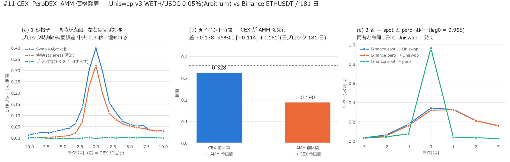

# ★#11 CEX–PerpDEX–AMM 価格発見 — Binance は Uniswap を先行するか

[← 索引](README.md)

Uniswap v3 WETH/USDC 0.05%(Arbitrum、Swap 4,988,762 件)と
Binance ETHUSDT の spot 1 秒足・perp aggTrades を 181 日
(2026-03-10 〜 2026-09-06)で突き合わせた。

| | |
|---|---|
| AMM | Uniswap v3 WETH/USDC 0.05%。Swap ごとの厳密 mid(補間なし) |
| CEX spot | Binance ETHUSDT 1 秒足(Binance Vision、鍵不要) |
| CEX perp | Binance USDT-M ETHUSDT aggTrades 14,885,208 件 → 秒次に集約 |
| 共通格子 | 1 秒 × 15,581,423 点。うち **AMM が更新した秒は 8.0%**(age_s 中央 16.5 秒) |

---

## 0. 結論

**CEX が AMM を先行する。ただし差は 1 秒より細かくは測れない。**

| 判定 | 値 |
|---|---|
| ★イベント時間の非対称(主判定) | **+0.138**、日ブロック 95%CI **[+0.114, +0.161]**(181 日 / 1,194,506 区間) |
| CEX 前区間 → AMM 今区間 | **0.328** |
| AMM 前区間 → CEX 今区間 | **0.190** |
| 同区間 | 0.360 |
| Binance spot と perp | **同一**(lag0 = 0.965、lag±1 ≈ 0.03〜0.07) |
| プラセボ(CEX を 1 日ずらす) | 全ラグで **±0.002** |

`Binance spot ≈ Binance perp → Uniswap` という順序で、
**spot と perp のあいだには先行関係が無い**(どちらも同じ形で Uniswap に効く)。

---

## 1. ★最大の交絡 — AMM の価格は Swap のときしか動かない

AMM の mid は `Swap` でしか変化しない(`Mint` / `Burn` は流動性を変えるが
`sqrtPriceX96` を変えない)。これを素朴に 1 秒格子へ写すと、**Swap の無い秒は
リターンが機械的に 0** になる。すると CEX が動いた直後の秒で AMM だけ 0 が並び、

> どんな市場構造であっても「CEX が AMM を先行」という形が出てしまう

測っているのは価格発見ではなく**更新頻度の差**である。実際この銘柄では
**AMM が更新した秒は全体の 8.0% しかない**(残り 92% は前の値の据え置き)。

対策を 2 つ置いた。

### (A) その秒に Swap があった格子点だけを使う

| 系列 | lag−3 | lag−1 | **lag 0** | lag+1 | lag+3 |
|---|---:|---:|---:|---:|---:|
| 全秒(staleness 汚染あり) | 0.022 | 0.230 | 0.322 | 0.195 | 0.081 |
| **Swap のあった秒だけ** | 0.065 | 0.303 | **0.399** | 0.293 | 0.111 |
| プラセボ(CEX を 1 日ずらす) | −0.002 | 0.001 | −0.002 | 0.001 | −0.001 |

汚染を外すと相関は全体に上がるが、**左右はほぼ対称**(lag−1 0.303 / lag+1 0.293)。
1 秒の分解能では先行関係を分離できていない。

### (B) イベント時間(格子に依存しない)

Swap 区間ごと(中央 3 秒)に、CEX の前区間リターンで AMM の今区間を当てる。

$$
\text{CEX 先行} = \mathrm{corr}\bigl(r^{CEX}_{i-1},\, r^{AMM}_i\bigr) = 0.328
\qquad
\text{AMM 先行} = \mathrm{corr}\bigl(r^{AMM}_{i-1},\, r^{CEX}_i\bigr) = 0.190
$$

差 **+0.138**、日ブロックのブートストラップ 95%CI **[+0.114, +0.161]**。
0 を含まないので、**CEX が先行する**と言える。

### (A) と (B) が食い違う理由

(A) は「連続する 2 つの**時計秒**」を比べており、(B) は「連続する 2 つの
**Swap イベント**」を比べている。前者は 1 秒の分解能を要求するが、

> **ブロック時刻は補間している。5,000 ブロック間隔のアンカーで誤差は中央 0.3 秒**
> (`README.md` §4-9)

つまり **1 秒の先行関係は時刻の補間誤差に埋もれる**。(B) は区間長が中央 3 秒
なので誤差の影響が小さい。**主判定は (B) を採る。**

---

## 2. ★途中で作ってしまった偽像 — 1 秒の貼り付けずれ

perp を追加した最初の集計では、こう出た。

| 系列 | lag−1 | lag 0 | lag+1 |
|---|---:|---:|---:|
| perp → Uniswap | 0.045 | 0.185 | **0.430** |
| spot → perp | **0.445** | 0.571 | 0.018 |

「**perp が Uniswap を 1 秒先行し、かつ spot をも 1 秒先行する**」と読める。
Binance perp が最も流動的なので、もっともらしい結論でもあった。

**これは全部、貼り付けを 1 秒ずらしたことによる偽像だった。**

- kline は `open_time` が足の**開始**時刻なので、その値が判るのは `open_time + 1`。
  そこで spot は `+1` して貼った
- ところが aggTrades 由来の perp は `sec = transact_time // 1000` のまま貼っていた。
  `sec` に入る約定の最終価格が判るのも `sec + 1` なのに、**perp だけ 1 秒早く**なっていた

`sec + 1` に揃えると:

| 系列 | lag−1 | **lag 0** | lag+1 |
|---|---:|---:|---:|
| perp → Uniswap | 0.159 | 0.320 | 0.325 |
| spot → Uniswap | 0.174 | 0.341 | 0.328 |
| **spot → perp** | 0.074 | **0.965** | 0.037 |

perp と spot は**区別がつかない**(0.965)。先行関係は消えた。

この罠は本スクリプトの docstring に自分で書いていた
(「ここを 1 秒ずらすと、それだけで『CEX が 1 秒先行』が出る」)。
**書いておきながら別のレグで踏んだ。**時刻規約は系列ごとに 1 本ずつ確認する。

---

## 3. 帰無対照

プラセボとして CEX 系列を **1 日ずらして**同じ手順を通した。全ラグで **±0.002**。
前処理が形を作っているのではないことが確認できる。

---

## 4. 限界

| | |
|---|---|
| 時間分解能 | ブロック時刻が補間(中央 0.3 秒・最大 69 秒)。**1 秒未満の先行関係は測れない** |
| PerpDEX | Hyperliquid の 1 分足は**直近 3.5 日しか保持されない**(5,000 本上限)。181 日の DEX perp は Artemis S3(requester-pays)からの有料取得になるため、本稿の perp は **Binance の CEX perp** である |
| 対象 | WETH/USDC 0.05% 1 プールのみ。AAVE/USDC は 404 件/日しかなく同じ分解能では測れない |
| 因果 | 相関であって因果ではない。「CEX で動いた価格を裁定者が AMM へ運ぶ」という機構は整合するが、本稿では裁定 tx を同定していない |
