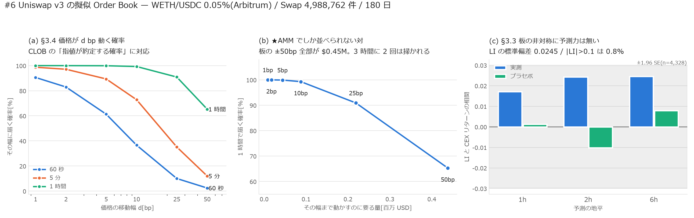

# ★#6 擬似 Order Book の完遂 — 到達確率と、板の非対称

[← 索引](README.md)

`l2_from_amm.md` は「AMM を CLOB の L2 形式へ変換できる」「スプレッド = 手数料」
「板の非対称は縮退している」までを出した。本稿は方針書 §3 で未着手だった
**§3.4 Tick Depletion Hazard** と **§3.3 Virtual Microprice** を埋める。

対象は Uniswap v3 WETH/USDC 0.05%(Arbitrum)、Swap 4,988,762 件・180 日。

---

## 0. 結論

1. **板は薄い。±50bp 全部で $0.45M しかなく、3 時間に 2 回は端まで掃かれる**
2. **板の非対称(LI)に予測力は無い。**相関 +0.017〜+0.025 で、$n=4{,}328$ の
   標準誤差 0.0152 を超えない

---

## 1. §3.4 価格が $d$ bp 動く確率

CLOB の「$d$ ティック先の指値が約定する確率」に対応する量。
前向きの**最大偏差**で測る(終点だけ見ると往復した動きを取りこぼす)。

| $d$[bp] | 60 秒 | 5 分 | 1 時間 |
|---:|---:|---:|---:|
| 1 | 90.56% | 98.71% | 100.00% |
| 2 | 82.95% | 97.10% | 99.99% |
| 5 | 61.30% | 89.38% | 99.91% |
| 10 | 36.59% | 72.83% | 99.29% |
| 25 | 10.02% | 35.14% | 90.90% |
| 50 | **2.43%** | 12.00% | **65.28%** |

---

## 2. ★AMM でしか並べられない対 — 確率と「必要量」

CLOB では「$d$ ティック動かすのに要る量」は隠れ注文や行列のせいで観測できない。
AMM は**閉形式で厳密に出る**。したがって確率と必要量を同じ土俵に置ける。

| $d$[bp] | 上へ動かす量 | 下へ動かす量 | 1 時間で届く確率 |
|---:|---:|---:|---:|
| 1 | $0.01M | $0.01M | 100.00% |
| 5 | $0.04M | $0.04M | 99.91% |
| 10 | **$0.09M** | $0.09M | **99.29%** |
| 25 | $0.22M | $0.22M | 90.90% |
| 50 | **$0.45M** | $0.43M | **65.28%** |

$$
\boxed{\text{10bp 動かすのに }\$90\text{k}。それが毎時 99.3\% の確率で起きている}
$$

板の**両側の厚みがほぼ等しい**(上 $0.45M 対 下 $0.43M)のも AMM 固有で、
流動性が現在価格をまたいで連続に置かれているためである。CLOB のように
片側だけ厚い、という状態が構造的に作れない。

**LP への含意**: ±50bp のレンジは 3 時間に 2 回は端まで走られる。
レンジを狭く切るほど手数料の密度は上がるが、**この頻度で範囲外になる**。

---

## 3. §3.3 Virtual Microprice — 板の非対称に予測力は無い

0〜10bp 帯の流動性から LI(CLOB の OBI に対応)を作り、
**CEX(Binance ETHUSDT)の将来リターン**を当てにいった。

> 目的変数を AMM 自身の将来 mid にしてはいけない。#11 で確認したとおり
> **AMM は CEX に追従している**ので、「板が自分の将来を当てる」という循環になる。

| 地平 | 相関 | プラセボ | $n$ |
|---|---:|---:|---:|
| 1 時間 | +0.0172 | +0.0013 | 4,328 |
| 2 時間 | +0.0243 | −0.0102 | 4,328 |
| 6 時間 | +0.0246 | +0.0079 | 4,328 |

$n = 4{,}328$ なので標準誤差は $1/\sqrt{n} = 0.0152$。
**最大の +0.0246 でも 1.6 SE** に届かない。符号は一貫して正だが、
**この標本では有意でない**(効果が無いことの証明ではなく、検出できないということ)。

背景として、LI そのものが縮退している。

| | AMM(本稿) | CLOB(既存レポート) |
|---|---:|---:|
| LI の標準偏差 | **0.0245** | 15 倍 |
| \|LI\| > 0.1 の割合 | **0.8%** | 65.9% |

流動性が現在価格をまたいで連続で、買い側と売り側が**同じ $L$ から計算される**
以上、非対称はほとんど生じない。CLOB で主要な予測変数である OBI が、
AMM では**原理的に情報を運べない**。

---

## 4. 限界

| | |
|---|---|
| 断面 | 板の梯子は**1 時間ごと** 4,328 断面。LI の検定はこの $n$ に縛られる。より細かい断面を作れば検出力は上がる |
| 到達確率 | 中値の経路から測っており、**自分の注文が約定するか**ではない。AMM に行列は無いので価格が届けば必ず約定するが、ガスと MEV の順序は別途 |
| 必要量 | 梯子の中央値。流動性は時間で動くので、ある瞬間の必要量はこれとずれる |
| 対象 | 1 プールのみ。手数料ティアが違えば tickSpacing も帯の幅も変わる |
